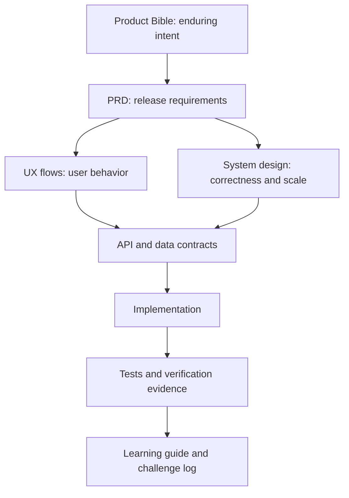

# NearHere Documentation Map

This directory is the living engineering record for NearHere. It is written for a computer-science graduate learning how a production product is designed, built, tested, and scaled. Every important decision should record the requirement, alternatives, tradeoff, implementation status, failure modes, and verification evidence.

## Recommended reading order

1. [`product-bible.md`](product-bible.md) — durable product principles and non-goals.
2. [`prd.md`](prd.md) — testable beta requirements and acceptance criteria.
3. [`ux-flows.md`](ux-flows.md) — user journeys, state transitions, and failure paths.
4. [`design-system.md`](design-system.md) — interaction and visual rules.
5. [`system-design.md`](system-design.md) — end-to-end system, trust boundaries, data flows, failure handling, and scaling.
6. [`technical-architecture.md`](technical-architecture.md) — concrete technology choices and deployment boundaries.
7. [`data-model.md`](data-model.md) — relational and geospatial model, invariants, indexes, and migrations.
8. [`api-spec.md`](api-spec.md) — client/server contract and endpoint behavior.
9. [`engineering-learning-guide.md`](engineering-learning-guide.md) — chronological lessons, challenges, and interview explanations.
10. [`practical-engineering-curriculum.md`](practical-engineering-curriculum.md) — A-to-Z learning syllabus and progress tracker.
11. [`engineering-backlog.md`](engineering-backlog.md) and [`roadmap.md`](roadmap.md) — next work and delivery order.
12. [`ios-simulator-workflow.md`](ios-simulator-workflow.md) — daily native-development workflow.
13. [`competitive-research-plan.md`](competitive-research-plan.md) and [`gtm-plan.md`](gtm-plan.md) — evidence collection and business launch hypotheses.
14. [`glossary.md`](glossary.md) — definitions used across the repository.

## Sources of truth

Different documents answer different questions. If two appear to conflict, use this order and then fix the conflict:

- Product scope belongs in the Product Bible and PRD.
- Technical responsibility belongs in system design and technical architecture.
- Exact request/response behavior belongs in the API specification.
- Exact persistence rules belong in the data model and SQL migrations.
- Work status belongs in the backlog and roadmap.
- What actually happened, including errors and resolutions, belongs in the learning guide.
- Executable code and migrations override speculative examples; documents must then be corrected.

## Current canonical decisions

- NearHere is an installable iOS/Android app built with Expo, React Native, and TypeScript; the old web concept is reference material only.
- Anyone may browse activities without an account. Joining or hosting requires phone OTP authentication.
- The app asks for foreground location permission. Denial leads to searchable manual location and map-pin selection.
- Public activity locations are approximate. An authorized participant-only meeting point can be introduced later.
- The custom avatar experience is important differentiation, but its builder is deferred until the discovery, identity, and activity core is correct.
- Supabase provides hosted phone authentication and PostgreSQL. PostGIS provides geospatial querying.
- A modular monolith is the initial application architecture. Redis, custom WebSockets, payments, direct messages, recurring-event administration, and complex recommendations are deferred until requirements and measurements justify them.

## Documentation conventions for the future LaTeX book

- Use stable headings and descriptive diagram labels.
- Keep Mermaid source in fenced blocks so diagrams can later be rendered to SVG/PDF.
- Define a term on first use and add durable terms to the glossary.
- Mark statements as **implemented**, **planned**, **hypothesis**, or **decision** when ambiguity is possible.
- Never turn an untested hypothesis into a claimed result.
- Add every material engineering challenge using: symptom, investigation, root cause, rejected shortcut, resolution, verification, and lesson.
