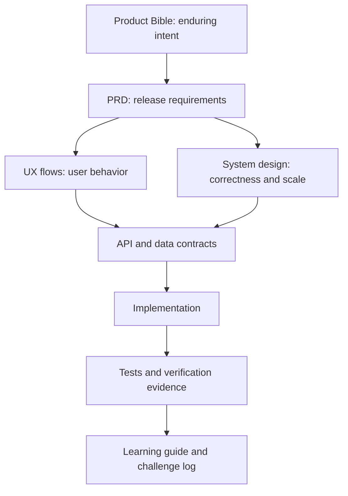

# NearHere Documentation Map

This directory is the living engineering record for NearHere. It is written for a computer-science graduate learning how a production product is designed, built, tested, and scaled. Every important decision should record the requirement, alternatives, tradeoff, implementation status, failure modes, and verification evidence.

## Recommended reading order

1. [`product-bible.md`](product-bible.md) — durable product principles and non-goals.
2. [`prd.md`](prd.md) — testable beta requirements and acceptance criteria.
3. [`ux-flows.md`](ux-flows.md) — user journeys, state transitions, and failure paths.
4. [`design-system.md`](design-system.md) — interaction and visual rules.
5. [`practical-engineering-curriculum.md`](practical-engineering-curriculum.md) — the module-by-module learning path.
6. [`code-tour.md`](code-tour.md) — one feature traced from product rule through TypeScript, SQL, and tests.
7. [`system-design.md`](system-design.md) — end-to-end system, trust boundaries, data flows, failure handling, and scaling.
8. [`technical-architecture.md`](technical-architecture.md) — concrete technology choices and deployment boundaries.
9. [`data-model.md`](data-model.md) — relational and geospatial model, invariants, indexes, and migrations.
10. [`api-spec.md`](api-spec.md) — client/server contract and endpoint behavior.
11. [`engineering-learning-guide.md`](engineering-learning-guide.md) — chronological lessons, challenges, and interview explanations.
12. [`engineering-backlog.md`](engineering-backlog.md) and [`roadmap.md`](roadmap.md) — next work and delivery order.
13. [`ios-simulator-workflow.md`](ios-simulator-workflow.md) and [`visual-evidence.md`](visual-evidence.md) — daily native workflow and screenshot record.
14. [`phase-3-acceptance-runbook.md`](phase-3-acceptance-runbook.md) — exact hosted and Simulator gates for participation evidence.
15. [`startup-launch-and-resume-plan.md`](startup-launch-and-resume-plan.md) — staged startup launch, metric definitions, scale decisions, and honest resume/interview evidence.
16. [`competitive-research-plan.md`](competitive-research-plan.md) and [`gtm-plan.md`](gtm-plan.md) — evidence collection and business launch hypotheses.
17. [`glossary.md`](glossary.md) — definitions used across the repository.
18. [`documentation-audit.md`](documentation-audit.md) — what every document owns and how completeness is judged.

## Sources of truth

Different documents answer different questions. If two appear to conflict, use this order and then fix the conflict:

- Product scope belongs in the Product Bible and PRD.
- Technical responsibility belongs in system design and technical architecture.
- Exact request/response behavior belongs in the API specification.
- Exact persistence rules belong in the data model and SQL migrations.
- Work status belongs in the backlog and roadmap.
- What actually happened, including errors and resolutions, belongs in the learning guide.
- Executable code and migrations override speculative examples; documents must then be corrected.

## Current canonical decisions

- NearHere is an installable iOS/Android app built with Expo, React Native, and TypeScript; the old web concept is reference material only.
- Anyone may browse activities without an account. Joining or hosting requires phone OTP authentication.
- The app asks for foreground location permission. Denial leads to searchable manual location and map-pin selection.
- Public activity locations are approximate. The exact meeting point is released through the caller-scoped Plans read model only for an accepted member while the activity is published and not ended.
- The custom avatar experience is important differentiation, but its builder is deferred until the discovery, identity, and activity core is correct.
- Supabase provides hosted phone authentication and PostgreSQL. PostGIS provides geospatial querying.
- A modular monolith is the initial application architecture. Redis, custom WebSockets, payments, direct messages, recurring-event administration, and complex recommendations are deferred until requirements and measurements justify them.

## Current implementation snapshot

This table prevents an architectural design from being confused with deployed evidence:

| Capability | Current state | Remaining proof/work |
| --- | --- | --- |
| Native map and location | Implemented in the Expo development build | Physical-device and accessibility matrix |
| Phone identity | Hosted fixed development OTP and session restoration verified | Real SMS provider, rate limits, production compliance |
| Profile | Migration, trigger, owner repository, runtime parser, onboarding, and full two-actor hosted RLS matrix verified | Real SMS provider, abuse controls, and production monitoring |
| Activity discovery | PostGIS migration/RPC deployed; anonymous empty result and denial paths verified | Representative rows, query-plan measurement, pagination |
| Activity hosting | Transaction and native form accepted in Simulator; real activity rediscovered | Re-run the hosted participation harness with the new exact/public displacement assertion |
| Activity detail/cancellation | Native detail route, caller-scoped read model, runtime parser, directions, and host cancellation | Migration `202609040001` deployed; hosted privacy/cancellation harness passed; accept in Simulator |
| Participant moderation | Host-safe participant projection, host-only removal, durable removed state, FIFO promotion, typed client controls | Migrations `202609060001`/`002` deployed; hosted A/B/C/D matrix passed; accept removal UI in Simulator |
| Join participation | A/B/C/D hosted matrix verified all server outcomes; Actor C Auth/onboarding/Leave and Host A approval UI accepted in Simulator | Pending/waitlisted participant cards and host Reject UI acceptance |
| My Plans | Hosted caller isolation/exact gating verified; signed-out intent through Actor C OTP/onboarding, accepted exact-point card, and post-Leave empty state accepted in Simulator | Pending/waitlisted and inactive-card rendering plus pagination |
| Leave/approval | Database matrix fully verified; participant Leave and Host A pending-request approval/count refresh accepted in Simulator | Reject UI still needs Simulator acceptance |
| Safety foundation | Private idempotent report/block RPCs plus operator-only report lifecycle; hosted safety harness covers anonymous and non-operator denial | Explicit operator provisioning, operator console, audit events, block-aware consumers, rate limits, and Simulator acceptance |
| Chat | Durable accepted-member chat RPCs, block filtering, hosted harness, and initial native UI implemented/verified | Simulator acceptance, realtime/push, operator moderation |

“Implemented” means source exists and local checks pass. “Deployed” means the hosted development environment accepted it. “Verified” names a specific observed behavior. These words are intentionally not interchangeable.

## Documentation conventions for the future LaTeX book

- Use stable headings and descriptive diagram labels.
- Keep Mermaid source in fenced blocks so diagrams can later be rendered to SVG/PDF.
- Define a term on first use and add durable terms to the glossary.
- Mark statements as **implemented**, **planned**, **hypothesis**, or **decision** when ambiguity is possible.
- Never turn an untested hypothesis into a claimed result.
- Add every material engineering challenge using: symptom, investigation, root cause, rejected shortcut, resolution, verification, and lesson.
- Every feature chapter should include: product rule, domain types, screen state, repository call, SQL/RLS boundary, denial cases, tests, and a screenshot evidence ID.
- Code examples must name their repository path and explain unfamiliar TypeScript immediately below the snippet.
- Screenshots must be privacy-reviewed and must never contain OTPs, tokens, phone numbers, or exact private meeting coordinates.

## Learning contract

When a new slice is implemented, update the relevant product/design/API/data
document, [`code-tour.md`](code-tour.md), the learning guide, backlog status,
and visual evidence matrix. This keeps the repository useful as both a working
product and a software-engineering portfolio.
