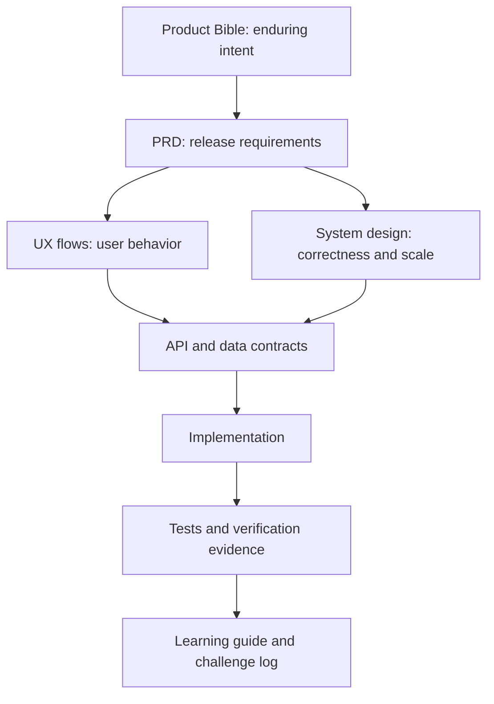

# NearHere Documentation Map

**Next execution plan:** [Sprite integration and remaining implementation — S0–S8](handoffs/sprite-integration-and-completion-20261003.md).
This orders the outstanding avatar, username, theme, authentication and acceptance
work. Start S0 then S1. Kenney use is already authorized; the next deliverable is
an actual app integration with consistent profile and map appearance. The plan
distinguishes existing source, prototypes, database work and runtime acceptance.

**Current Avatar Studio source slice (4 October):** [Avatar Studio: one character across map, profile and activities](avatar-studio.md).
Eight CC0-derived bundled looks, a shared renderer, Studio route, owner-only
revisioned save contract, strict activity projections and username screen now
exist in source. The migration and new Studio have not yet been hosted/device
accepted; the chapter distinguishes that clearly.

**Current email-auth slice (4 October):** [Email magic-link sign-in](email-sign-in.md).
Native email and phone sign-in now coexist in source. The narrow Supabase
callback allow-list and client code are verified; a freshly delivered native
Simulator callback remains open because the provider rate-limited immediate
retries and the build path stalled.

**Latest product handoff (3 October):**
[Day/night maps, custom Avatar Studio, usernames and sign-in options](handoffs/daylight-avatar-identity-20261002.md).
This is the active implementation entry point. It contains source findings,
primary-source research, file/API contracts, ordered tickets, migration
compatibility, tests and provider/artwork gates. Status is mixed: D01 screen
palette migration and D03 reduced-motion camera policy are implemented in
source; a fresh iOS Simulator build launched, but visual/device acceptance is
open. U01 username claim code exists with a safe pre-migration fallback, but its
SQL has not been applied or executed against PostgreSQL. A01 has one measured
transparent style anchor and a CC0 Kenney layered portrait-crop proof; neither
is integrated into the app or accepted as map art. See the
[Kenney crop prototype, source, and license notes](design-concepts/kenney-avatar-prototype/README.md).
Sign-in providers and Avatar Studio UI are not implemented. Use the handoff
ledger for exact status; older dated summaries below are historical.

**Current status and next steps (1 October):** [Completion audit and execution order](handoffs/completion-audit-20261001.md).
Source review and fresh local checks confirm 96 passing tests. Chat reconnect
polling and retry-safe activity publication are implemented; account deletion,
production services and signed device acceptance remain open. This snapshot
supersedes older summary counts.

**App Store release handoff (30 September):** [T-pass audit and execution plan](handoffs/app-store-t-pass-20260930.md)
is the current production-readiness sequence. It distinguishes implemented
features from hosted, Simulator, physical-device, signed-build and App Review
evidence. Use it for release work; the premium roadmap below remains the
longer-term design and feature guide. Its current V1 scope draft is
[here](release/v1-scope.md), with the source-backed
[privacy data inventory](release/privacy-data-inventory.md); owner decisions are
visibly marked there.

**Current implementation roadmap:** [Premium product execution](handoffs/premium-product-execution.md)
is the master guide for the next **continue**. Companion specifications:
[profile, onboarding and wardrobe/3D](handoffs/premium-profile-avatar-spec.md),
[notifications, metrics, DMs, payments and other deferred features](handoffs/premium-community-roadmap.md).
These documents are plans, not new feature-completion claims. The live ticket
ledger is at the top of [the handoff](handoffs/night-arcade-status.md).

**Latest audit:** [Planner versus implementation, every ticket and next steps](handoffs/night-arcade-plan-audit-20260924.md).
The audit records a 67-test baseline and earlier gaps. Its live status is now
superseded by the ticket ledger: 91 unit tests pass; the P01 owner-scoped fixture
seeder is hosted-verified; P02 avatar projections and the block-safe Plans fix
are hosted/Simulator verified; P03 map selection, cluster zoom and deselection
are Simulator verified; P04 auth-keyboard and location/area recovery slices are
partially accepted on iPhone and iPad Simulators. A paired physical iPhone is
blocked at Apple provisioning approval; no real-device acceptance is claimed.
The Host flow now requires an explicit private pin, and
Simulator verifies missing-pin validation plus the custom Date/Time sheet's
visibility; wheel-value changes, Publish success and complete host acceptance
remain open. Performance, physical-device, accessibility and full auth remain
open.

**28 September owner-profile slice:** optional private bio/city/interests,
transactional saves with revision conflicts, account-scoped requests and a larger
profile character are implemented. Hosted and normal-size Simulator evidence is
recorded in [Owner profile editing, step by step](profile-owner-editing.md).
Public biographies, wardrobe and full device acceptance are not complete.

**29 September hosting slice:** [Custom time and safe submission](host-time-selection.md)
explains date/time sequencing, Cancel/Done drafts, double-press protection and
why this is not server idempotency. iOS export: 5.14 MB; native checks remain open.

## Current design direction — 24 September 2026

**Start here for the next implementation:** [Night Arcade handoff status](handoffs/night-arcade-status.md), then the [step-by-step execution playbook](handoffs/night-arcade-execution.md) and [research/visual specification](design-concepts/design-review.md). The NearHere-authored MapLibre style, six-preset editor, attribution, direct avatar selection, cluster expansion and map deselection have Simulator evidence. V24 verifies the Host's unselected private-point state and pre-network validation; V28 verifies a searched landmark returns to the Host form with a compact preview; V29 verifies the quick-start choices; V25–V27 record map/auth/location checks. Next gates: pan and confirm a different point, change custom date/time, Android/physical keyboard, GPS services/no-fix/cache cases, physical-iPhone GPS report, full host end-to-end and accessibility/performance. Do not claim device acceptance from these Simulator checks.

[Map-first design](map-first-design.md) explains the current map-first hierarchy, tile-vs-style-vs-renderer distinction, avatars, clusters, and prototype-provider limitations.

[Google Places search](google-places-search.md) explains the secure provider
adapter that can improve place search while preserving MapLibre’s custom map.

This directory is the living engineering record for NearHere. It is written for a computer-science graduate learning how a production product is designed, built, tested, and scaled. Every important decision should record the requirement, alternatives, tradeoff, implementation status, failure modes, and verification evidence.

## Recommended reading order

1. [`product-bible.md`](product-bible.md) — durable product principles and non-goals.
2. [`prd.md`](prd.md) — testable beta requirements and acceptance criteria.
3. [`ux-flows.md`](ux-flows.md) — user journeys, state transitions, and failure paths.
4. [`design-system.md`](design-system.md) — interaction and visual rules.
5. [`practical-engineering-curriculum.md`](practical-engineering-curriculum.md) — the module-by-module learning path.
6. [`code-tour.md`](code-tour.md) — implementation lessons traced from product rule through TypeScript, renderer behavior, and tests (including map labels and location recovery).
7. [`system-design.md`](system-design.md) — end-to-end system, trust boundaries, data flows, failure handling, and scaling.
8. [`technical-architecture.md`](technical-architecture.md) — concrete technology choices and deployment boundaries.
9. [`data-model.md`](data-model.md) — relational and geospatial model, invariants, indexes, and migrations.
10. [`api-spec.md`](api-spec.md) — client/server contract and endpoint behavior.
11. [`engineering-learning-guide.md`](engineering-learning-guide.md) — chronological lessons, challenges, and interview explanations; the latest P04 copy lesson links to its source-level walkthrough.
12. [`engineering-backlog.md`](engineering-backlog.md) and [`roadmap.md`](roadmap.md) — next work and delivery order.
13. [`ios-simulator-workflow.md`](ios-simulator-workflow.md) and [`visual-evidence.md`](visual-evidence.md) — daily native workflow and screenshot record.
14. [`phase-3-acceptance-runbook.md`](phase-3-acceptance-runbook.md) — exact hosted and Simulator gates for participation evidence.
15. [`startup-launch-and-resume-plan.md`](startup-launch-and-resume-plan.md) — staged startup launch, metric definitions, scale decisions, and honest resume/interview evidence.
16. [`competitive-research-plan.md`](competitive-research-plan.md) and [`gtm-plan.md`](gtm-plan.md) — evidence collection and business launch hypotheses.
17. [`glossary.md`](glossary.md) — definitions used across the repository.
18. [`documentation-audit.md`](documentation-audit.md) — what every document owns and how completeness is judged.

## Sources of truth

Different documents answer different questions. If two appear to conflict, use this order and then fix the conflict:

- Product scope belongs in the Product Bible and PRD.
- Technical responsibility belongs in system design and technical architecture.
- Exact request/response behavior belongs in the API specification.
- Exact persistence rules belong in the data model and SQL migrations.
- Work status belongs in the backlog and roadmap.
- What actually happened, including errors and resolutions, belongs in the learning guide.
- Executable code and migrations override speculative examples; documents must then be corrected.

## Current canonical decisions

- NearHere is an installable iOS/Android app built with Expo, React Native, and TypeScript; the old web concept is reference material only.
- Anyone may browse activities without an account. Joining or hosting requires authentication; development supports phone OTP and email magic links.
- The app asks for foreground location permission. Denial leads to searchable manual location and map-pin selection.
- Public activity locations are approximate. The exact meeting point is released through the caller-scoped Plans read model only for an accepted member while the activity is published and not ended.
- Eight locally bundled Avatar Studio looks are implemented with a versioned,
  owner-only save contract; granular wardrobe parts and 3D rendering remain
  deferred. The character is decorative identity and never implies verification
  or live location.
- Supabase provides hosted phone/email authentication and PostgreSQL. PostGIS provides geospatial querying.
- A modular monolith is the initial application architecture. Redis, custom WebSockets, payments, direct messages, recurring-event administration, and complex recommendations are deferred until requirements and measurements justify them.

## Current implementation snapshot

This table prevents an architectural design from being confused with deployed evidence:

| Capability | Current state | Remaining proof/work |
| --- | --- | --- |
| Native map and location | Custom map style; marker/cluster interactions; permission denial, searched manual area persistence and stale GPS-dot clearing verified in Simulator | Services off, no/cached fix, physical-device GPS report, device matrix, accessibility and performance |
| Phone identity | Hosted fixed development OTP and session restoration verified; keyboard-safe phone/OTP actions verified in Simulator without sending SMS in that test | Real SMS provider, Android/physical keyboard, full role/session flows, rate limits and production compliance |
| Profile | Migration, trigger, owner repository, runtime parser, onboarding and six-preset editor implemented; public-safe host identity now consistent across map/detail/Plans | Save/relaunch and public choice consistency; real SMS provider, abuse controls and production monitoring |
| Activity discovery | PostGIS migration/RPC deployed; anonymous empty result and denial paths verified | Representative rows, query-plan measurement, pagination |
| Activity hosting | Transaction and native form accepted in Simulator; real activity rediscovered | Re-run the hosted participation harness with the new exact/public displacement assertion |
| Activity detail/cancellation | Native detail route, caller-scoped read model, runtime parser, directions, and host cancellation | Migration `202609040001` deployed; hosted privacy/cancellation harness passed; accept in Simulator |
| Participant moderation | Host-safe participant projection, host-only removal, durable removed state, FIFO promotion, typed client controls | Migrations `202609060001`/`002` deployed; hosted A/B/C/D matrix passed; accept removal UI in Simulator |
| Join participation | A/B/C/D hosted matrix verified all server outcomes; Actor C Auth/onboarding/Leave and Host A approval UI accepted in Simulator | Pending/waitlisted participant cards and host Reject UI acceptance |
| My Plans | Hosted caller isolation/exact gating verified; signed-out intent through Actor C OTP/onboarding, accepted exact-point card, and post-Leave empty state accepted in Simulator | Pending/waitlisted and inactive-card rendering plus pagination |
| Leave/approval | Database matrix fully verified; participant Leave and Host A pending-request approval/count refresh accepted in Simulator | Reject UI still needs Simulator acceptance |
| Safety foundation | Private report/block RPCs, operator lifecycle/console, immutable audit events, block-aware consumers, database rate limits, client correlation IDs, and reduced-motion support | Explicit operator provisioning, rate-limit tuning, full accessibility, and physical-device acceptance |
| Chat | Durable accepted-member chat RPCs, block filtering, hosted harness, and initial native UI implemented/verified | Simulator acceptance, realtime/push, operator moderation |

“Implemented” means source exists and local checks pass. “Deployed” means the hosted development environment accepted it. “Verified” names a specific observed behavior. These words are intentionally not interchangeable.

## Documentation conventions for the future LaTeX book

- Use stable headings and descriptive diagram labels.
- Keep Mermaid source in fenced blocks so diagrams can later be rendered to SVG/PDF.
- Define a term on first use and add durable terms to the glossary.
- Mark statements as **implemented**, **planned**, **hypothesis**, or **decision** when ambiguity is possible.
- Never turn an untested hypothesis into a claimed result.
- Add every material engineering challenge using: symptom, investigation, root cause, rejected shortcut, resolution, verification, and lesson.
- Every feature chapter should include: product rule, domain types, screen state, repository call, SQL/RLS boundary, denial cases, tests, and a screenshot evidence ID.
- Code examples must name their repository path and explain unfamiliar TypeScript immediately below the snippet.
- Screenshots must be privacy-reviewed and must never contain OTPs, tokens, phone numbers, or exact private meeting coordinates.

## Learning contract

When a new slice is implemented, update the relevant product/design/API/data
document, [`code-tour.md`](code-tour.md), the learning guide, backlog status,
and visual evidence matrix. This keeps the repository useful as both a working
product and a software-engineering portfolio.
