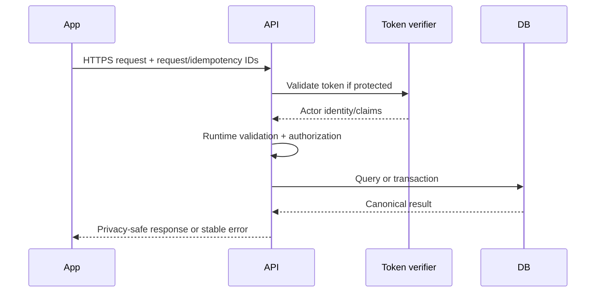

# NearHere API Specification

Status: **design contract** for the modular API. Supabase Auth endpoints are provider-owned and are not reimplemented as `/v1/auth/*` routes.

## 1. Protocol conventions

- Base path: `/v1`
- Transport: HTTPS
- Representation: JSON with UTF-8
- Authentication: `Authorization: Bearer <access-token>` for protected operations
- Request correlation: accept/generate `X-Request-Id`; return it in every response
- Idempotent writes: `Idempotency-Key` required where network retries could duplicate an operation
- Time: ISO 8601 UTC timestamps
- Identifiers: opaque UUID strings; clients must not infer meaning from them
- Unknown JSON fields may be ignored for forward compatibility; invalid required fields are rejected

## 2. Authentication boundary

Phone OTP is performed directly through Supabase Auth SDK:

```text
signInWithOtp({ phone }) -> SMS challenge
verifyOtp({ phone, token, type: 'sms' }) -> session
```

The app sends the resulting access token to NearHere's protected API. The API validates the token and derives the actor ID from it. It never trusts a `userId` supplied by the client as proof of identity.

## 3. Error envelope

```json
{
  "error": {
    "code": "ACTIVITY_FULL",
    "message": "This activity has no available places.",
    "requestId": "req_01J...",
    "details": {
      "waitlistAvailable": true
    }
  }
}
```

`code` is stable for program logic. `message` is readable but may change. `details` is optional and code-specific. Never return stack traces, SQL text, credentials, private coordinates, or provider secrets.

Representative status mapping:

| HTTP | Meaning | Examples |
| --- | --- | --- |
| 200/201 | Success | Read/update or created resource |
| 202 | Accepted for asynchronous processing | Future moderation/export job |
| 400 | Invalid syntax/input | Invalid radius or date |
| 401 | Missing/invalid session | Expired token |
| 403 | Authenticated but unauthorized | Non-host edit, private point access |
| 404 | Resource absent or intentionally concealed | Unknown activity |
| 409 | State/invariant conflict | Already cancelled, idempotency mismatch |
| 422 | Semantically invalid transition | End before start |
| 429 | Rate limited | Too many create/join/message attempts |
| 500 | Unexpected server failure | Logged with request ID |
| 503 | Required dependency unavailable | Database/provider outage |

## 4. Profiles

### `GET /me`

Protected. Returns the caller's public-safe profile and onboarding state.

### `PATCH /me`

Protected. Updates allowed self-managed fields such as display name and interests. Phone identity is not writable here.

Example request:

```json
{
  "displayName": "Anshu",
  "interests": ["walk", "coffee"]
}
```

The server trims/validates values, updates only the authenticated actor's row, and returns the canonical profile.

## 5. Discovery and activities

### `GET /activities/nearby`

Anonymous allowed.

Query parameters:

- `lat`, `lng` — required valid WGS84 coordinate
- `radiusM` — bounded discovery radius
- `kinds` — optional comma-separated activity kinds
- `startsBefore` — optional ISO timestamp
- `availability` — optional filter
- `cursor` and `limit` — bounded cursor pagination

Returns activity summaries with `publicLocation` only. It never returns `privateLocation`.

### `POST /activities`

Protected and idempotent. Creates the activity and host membership in one transaction. The server derives public geometry from the submitted private point.

### `GET /activities/:activityId`

Anonymous for public fields. When the actor is authorized by membership/release policy, the response may include a separate participant detail object. Avoid returning a private field with `null` to anonymous clients if separate response shapes reduce accidental leakage.

### `PATCH /activities/:activityId`

Protected host operation. Uses explicit version/precondition behavior to avoid silently overwriting concurrent edits.

### `POST /activities/:activityId/cancel`

Protected, host/moderator authorized, idempotent. Cancellation is a command with audit behavior, not a generic status patch.

## 6. Participation commands

- `POST /activities/:activityId/join` — open join or approval request
- `POST /activities/:activityId/leave` — withdraw/leave according to current state
- `POST /activities/:activityId/membership-requests/:userId/approve` — host approval
- `POST /activities/:activityId/membership-requests/:userId/reject` — host rejection
- `POST /activities/:activityId/members/:userId/remove` — host/moderator removal
- `GET /activities/:activityId/participants` — privacy-safe participant summaries for authorized/public scope

All writes require an idempotency key and execute state/capacity rules atomically. A success response returns the canonical membership outcome: `pending`, `accepted`, `waitlisted`, etc.

## 7. Chat

- `GET /activities/:activityId/messages?cursor=&limit=` — member-only history
- `POST /activities/:activityId/messages` — member-only idempotent send

Realtime subscriptions deliver freshness hints/events; they do not replace paginated durable history. On reconnect, clients refetch after their last durable cursor.

## 8. Safety

- `POST /reports` — protected, idempotent report submission
- `POST /blocks/:userId` — protected block
- `DELETE /blocks/:userId` — protected unblock

Operator resolution endpoints require a separate administrative authorization boundary and audit logging.

## 9. Request lifecycle



## 10. Compatibility

`/v1` protects major API behavior, but not every change needs a new version. Add optional response fields compatibly. Do not rename/remove fields or change meanings while supported mobile binaries depend on them. Coordinate breaking changes with a new endpoint/version and client adoption window.
