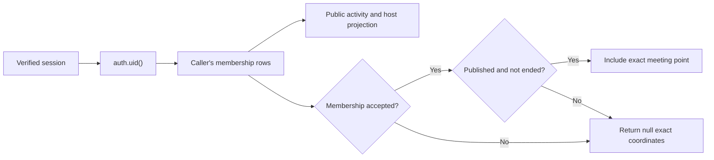
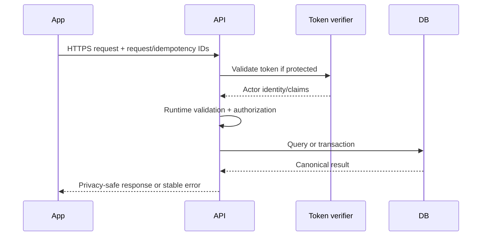

# NearHere API Specification

Status: **design contract** for the modular API. Supabase Auth endpoints are provider-owned and are not reimplemented as `/v1/auth/*` routes.

## 1. Protocol conventions

- Base path: `/v1`
- Transport: HTTPS
- Representation: JSON with UTF-8
- Authentication: `Authorization: Bearer <access-token>` for protected operations
- Request correlation: accept/generate `X-Request-Id`; return it in every response
- Idempotent writes: `Idempotency-Key` required where network retries could duplicate an operation
- Time: ISO 8601 UTC timestamps
- Identifiers: opaque UUID strings; clients must not infer meaning from them
- Unknown JSON fields may be ignored for forward compatibility; invalid required fields are rejected

## 2. Authentication boundary

Phone OTP is performed directly through Supabase Auth SDK:

```text
signInWithOtp({ phone }) -> SMS challenge
verifyOtp({ phone, token, type: 'sms' }) -> session
```

The app sends the resulting access token to NearHere's protected API. The API validates the token and derives the actor ID from it. It never trusts a `userId` supplied by the client as proof of identity.

## 3. Error envelope

```json
{
  "error": {
    "code": "ACTIVITY_FULL",
    "message": "This activity has no available places.",
    "requestId": "req_01J...",
    "details": {
      "waitlistAvailable": true
    }
  }
}
```

`code` is stable for program logic. `message` is readable but may change. `details` is optional and code-specific. Never return stack traces, SQL text, credentials, private coordinates, or provider secrets.

Representative status mapping:

| HTTP | Meaning | Examples |
| --- | --- | --- |
| 200/201 | Success | Read/update or created resource |
| 202 | Accepted for asynchronous processing | Future moderation/export job |
| 400 | Invalid syntax/input | Invalid radius or date |
| 401 | Missing/invalid session | Expired token |
| 403 | Authenticated but unauthorized | Non-host edit, private point access |
| 404 | Resource absent or intentionally concealed | Unknown activity |
| 409 | State/invariant conflict | Already cancelled, idempotency mismatch |
| 422 | Semantically invalid transition | End before start |
| 429 | Rate limited | Too many create/join/message attempts |
| 500 | Unexpected server failure | Logged with request ID |
| 503 | Required dependency unavailable | Database/provider outage |

## 4. Profiles

### Current MVP transport

The mobile client currently performs an explicit-column `SELECT` and an atomic `UPDATE` directly against `public.profiles` through Supabase's Data API. This is intentionally narrow: grants and RLS fully express the rule “the authenticated actor may read and update selected fields only on their own row.” A repository validates the returned JSON and maps database `snake_case` into app `camelCase`.

The `/me` routes below remain the future modular-API contract. They become useful when profile behavior needs server-side orchestration, privacy projections, auditing, or business rules that RLS alone cannot express clearly.

### `GET /me`

Protected. Returns the caller's public-safe profile and onboarding state.

### `PATCH /me`

Protected. Updates allowed self-managed fields such as display name and interests. Phone identity is not writable here.

Example request:

```json
{
  "displayName": "Anshu",
  "interests": ["walk", "coffee"]
}
```

The server trims/validates values, updates only the authenticated actor's row, and returns the canonical profile.

## 5. Discovery and activities

### Current MVP transport

The deployed mobile foundation calls the following PostgreSQL functions through Supabase RPC:

- `nearby_activities` is executable by anonymous and authenticated roles and returns only public-safe columns.
- `create_activity` is executable only by authenticated users with a completed profile. It writes the public activity, exact private meeting point, and accepted host membership in one transaction.
- `join_activity` is executable only by an authenticated user with a completed profile. It locks the activity row, returns an existing durable membership on retry, or creates an `accepted`, `pending`, or `waitlisted` participant membership.
- `my_plans` is executable only by authenticated users. It derives the caller from the session and returns only that caller's hosted/joined/requested/waitlisted activities. Exact meeting coordinates are returned only when that caller's durable membership is `accepted` **and** the activity is still published and not ended; otherwise they are `null`.

Migration `202609040001` is deployed to the hosted development project. Its black-box harness passed on 2026-09-06. It adds:

- `activity_detail(p_activity_id)`, an anonymous-safe public projection enriched only with the current caller's own membership. Exact coordinates require accepted membership, published status, and an unended activity.
- `cancel_activity(p_activity_id)`, an authenticated host-only command that locks the activity row, rejects ended/non-published activities, records one durable cancellation timestamp, and returns that same receipt on retry.

The hosted result also verifies that anonymous and non-member callers never receive membership or exact coordinates, pending members receive no exact point, accepted host/participant callers receive the active exact point, and cancellation is atomic, idempotent, and permanently redacts the exact point from the cancelled activity. The mobile route still needs Simulator acceptance; hosted RPC evidence does not prove visual labels or interaction refresh behavior.

Deployed migration `007` and the matching mobile source add three authenticated RPCs:

- `leave_activity(p_activity_id)` derives the participant, returns `{ membership_status: left, participant_count, waitlist_promoted }`, and promotes at most one FIFO waiter atomically.
- `decide_activity_request(p_activity_id, p_requester_user_id, p_decision)` accepts `approve` or `reject`; only the activity host may decide a pending participant request. Approval returns `accepted` when capacity exists or `waitlisted` when full; rejection returns `rejected`.
- `host_pending_activity_requests(p_activity_id, p_limit)` returns only requester ID, display name, and request timestamp to the host, ordered FIFO and bounded to 1–100 rows.
- `remove_activity_participant(p_activity_id, p_participant_user_id)` is host-only. It records `removed` durably and atomically promotes the oldest waitlisted participant when an active accepted place opens. `host_activity_participants(p_activity_id)` returns only accepted/waitlisted participant identity and membership state to the host; neither function exposes private location fields. The hosted A/B/C/D matrix verified denial, projection scoping, removal, retry safety, and cleanup on 2026-09-07.
- `report_safety_issue(p_reported_user_id, p_activity_id, p_reason, p_details)` accepts one private idempotent report from an authenticated caller; anonymous calls and self-reports are denied.
- `block_user(p_blocked_user_id)` and `unblock_user(p_blocked_user_id)` manage a private idempotent block relationship. They do not yet alter discovery or chat reads; those consumers must adopt the block predicate before chat launches.

The tables have no client-facing grants. These RPCs are the first modular-monolith implementation boundary; the HTTP routes below remain the stable future API contract when an application server takes over orchestration.

### Current MVP `my_plans(limit)` read model

`my_plans` is a **caller-scoped read model**: one query shapes several tables into exactly what the signed-in Plans screen needs. The client does not send a user ID because a modified client could impersonate another user; PostgreSQL obtains `auth.uid()` from the verified access token. The current function rejects a `null` or out-of-range limit and accepts integers from 1 through 100 (the mobile repository requests 50), includes only `pending`, `accepted`, and `waitlisted` memberships, and sorts upcoming plans before ended plans.



This is response-level authorization, not merely UI hiding. `anon` has no execute privilege, client roles have no direct table access, and the private location join is conditional inside the trusted function. The TypeScript client runtime-validates the returned JSON again, but that parser is defense in depth rather than the primary authorization boundary.

### `GET /activities/nearby`

Anonymous allowed.

Query parameters:

- `lat`, `lng` — required valid WGS84 coordinate
- `radiusM` — bounded discovery radius
- `kinds` — optional comma-separated activity kinds
- `startsBefore` — optional ISO timestamp
- `availability` — optional filter
- `cursor` and `limit` — bounded cursor pagination

Returns activity summaries with `publicLocation` only. It never returns `privateLocation`.

### `POST /activities`

Protected and idempotent. Creates the activity and host membership in one transaction. The server derives public geometry from the submitted private point.

### `GET /activities/:activityId`

Anonymous for public fields. When the actor is authorized by membership/release policy, the response may include a separate participant detail object. Avoid returning a private field with `null` to anonymous clients if separate response shapes reduce accidental leakage.

### `PATCH /activities/:activityId`

Protected host operation. Uses explicit version/precondition behavior to avoid silently overwriting concurrent edits.

### `POST /activities/:activityId/cancel`

Protected, host/moderator authorized, idempotent. Cancellation is a command with audit behavior, not a generic status patch.

## 6. Participation commands

### Current MVP Join RPC

`join_activity(activity_id)` is deployed. It derives the actor from the session rather than accepting a user ID. For one activity, `SELECT ... FOR UPDATE` serializes the capacity decision; requests for unrelated activities do not share that row lock.

Outcome rules:

| Situation | Returned membership | Capacity effect |
| --- | --- | --- |
| Existing `accepted`, `pending`, or `waitlisted` membership | Existing status | No duplicate row; accepted count unchanged |
| Approval-mode activity | `pending` | Does not consume accepted capacity yet |
| Open activity with capacity | `accepted` | Accepted count increases by one |
| Open activity at capacity | `waitlisted` | Accepted count does not increase |

This operation is **semantically idempotent by natural key**: the primary key `(activity_id, user_id)` represents one membership, and an early return preserves an existing active outcome. It does not yet implement the general future `Idempotency-Key` record/replay system described below. Anonymous execution is denied, incomplete profiles are rejected, and unavailable/non-published/ended activities cannot be joined.

The mobile repository runtime-validates the returned `{ membership_status, participant_count }` row. The map disables duplicate submission while one request is active, refreshes discovery after success, and shows status-specific copy. These client controls improve UX; the database key, lock, and transaction provide correctness.

### Deployed and hosted-verified: Leave and host decisions

`leave_activity` and `decide_activity_request` lock the same activity row used by Join before changing any capacity-consuming state. This creates one serial order for Join, approval, Leave, and promotion on a given activity. Retrying the same command returns its durable outcome; opposite terminal transitions fail.

The host request projection is deliberately smaller than `my_plans`: it exposes only what a host needs to decide a pending request and never joins private locations. All three functions derive the caller from `auth.uid()`, use `SECURITY DEFINER` with an empty search path and schema-qualified objects, revoke execution from `public`/`anon`, and grant only `authenticated` execution.

On 2026-08-15, the hosted A/B/C/D black-box matrix verified anonymous and non-host denial, caller-scoped Plans, idempotent Join/Leave/approve/reject, pending/waitlisted `null` exact locations, accepted/promoted exact-location release, a true concurrent final-place race yielding exactly one accepted and one waitlisted participant, atomic promotion after Leave, and chronological oldest-waiter FIFO selection. This is RPC/database verification; the corresponding mobile interactions have not yet been accepted in Simulator.

### Future HTTP commands

- `POST /activities/:activityId/join` — open join or approval request
- `POST /activities/:activityId/leave` — withdraw/leave according to current state
- `POST /activities/:activityId/membership-requests/:userId/approve` — host approval
- `POST /activities/:activityId/membership-requests/:userId/reject` — host rejection
- `POST /activities/:activityId/members/:userId/remove` — host/moderator removal
- `GET /activities/:activityId/participants` — privacy-safe participant summaries for authorized/public scope

Future HTTP writes require an idempotency key and execute state/capacity rules atomically. A success response returns the canonical membership outcome: `pending`, `accepted`, `waitlisted`, etc.

## 7. Chat

- `GET /activities/:activityId/messages?cursor=&limit=` — member-only history
- `POST /activities/:activityId/messages` — member-only idempotent send

Realtime subscriptions deliver freshness hints/events; they do not replace paginated durable history. On reconnect, clients refetch after their last durable cursor.

## 8. Safety

- `POST /reports` — protected, idempotent report submission
- `POST /blocks/:userId` — protected block
- `DELETE /blocks/:userId` — protected unblock

Operator resolution endpoints require a separate administrative authorization boundary and audit logging.

## 9. Request lifecycle

### Current Supabase RPC lifecycle

```mermaid
sequenceDiagram
    participant App as Mobile repository
    participant Auth as Supabase Auth
    participant Gateway as Supabase Data API
    participant Fn as PostgreSQL function
    participant DB as Tables and indexes
    Note over App,Auth: Protected calls use a session issued earlier through OTP
    Auth-->>App: Signed access token
    App->>Gateway: RPC name, parameters, optional bearer token
    Gateway->>Gateway: Verify JWT when present; establish role and claims
    Gateway->>Fn: Execute granted function
    Fn->>Fn: Validate input and authorize actor
    Fn->>DB: Query or atomic transaction
    DB-->>Fn: Canonical rows
    Fn-->>Gateway: Explicit public-safe columns
    Gateway-->>App: JSON
    App->>App: Runtime-validate and map to domain types
```

The publishable key identifies the project and selects the public client boundary; it is not proof of a user's identity and is not a secret. A verified session JWT allows Supabase to establish the `authenticated` role and derive `auth.uid()`. Function `EXECUTE` privileges decide whether that role may call the operation, while the function and database constraints enforce its rules.

### Future modular HTTP lifecycle



## 10. Compatibility

`/v1` protects major API behavior, but not every change needs a new version. Add optional response fields compatibly. Do not rename/remove fields or change meanings while supported mobile binaries depend on them. Coordinate breaking changes with a new endpoint/version and client adoption window.
