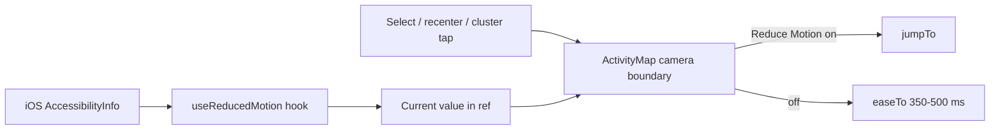
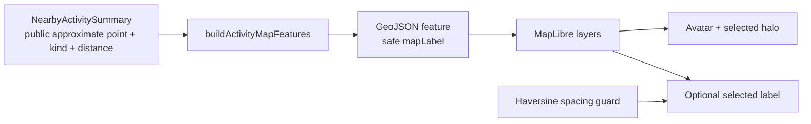
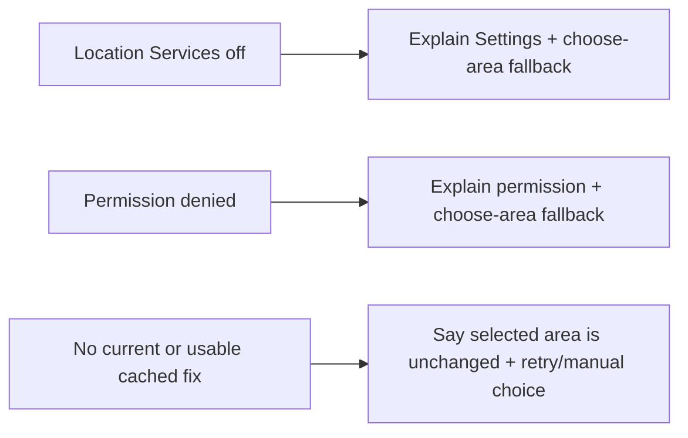
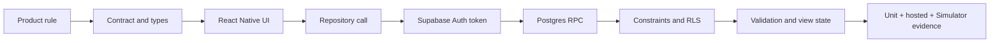
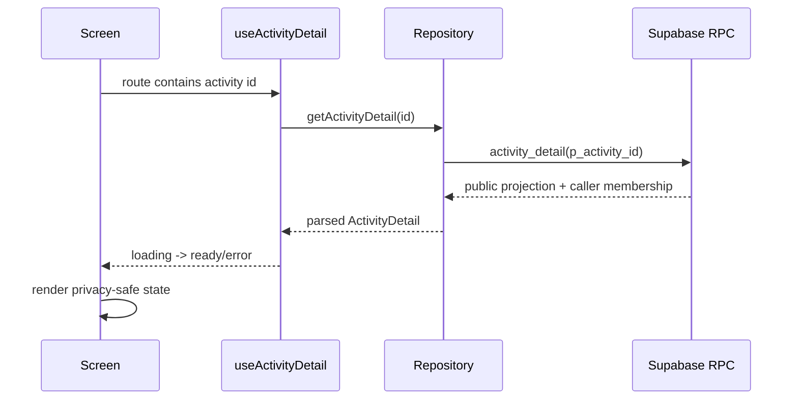
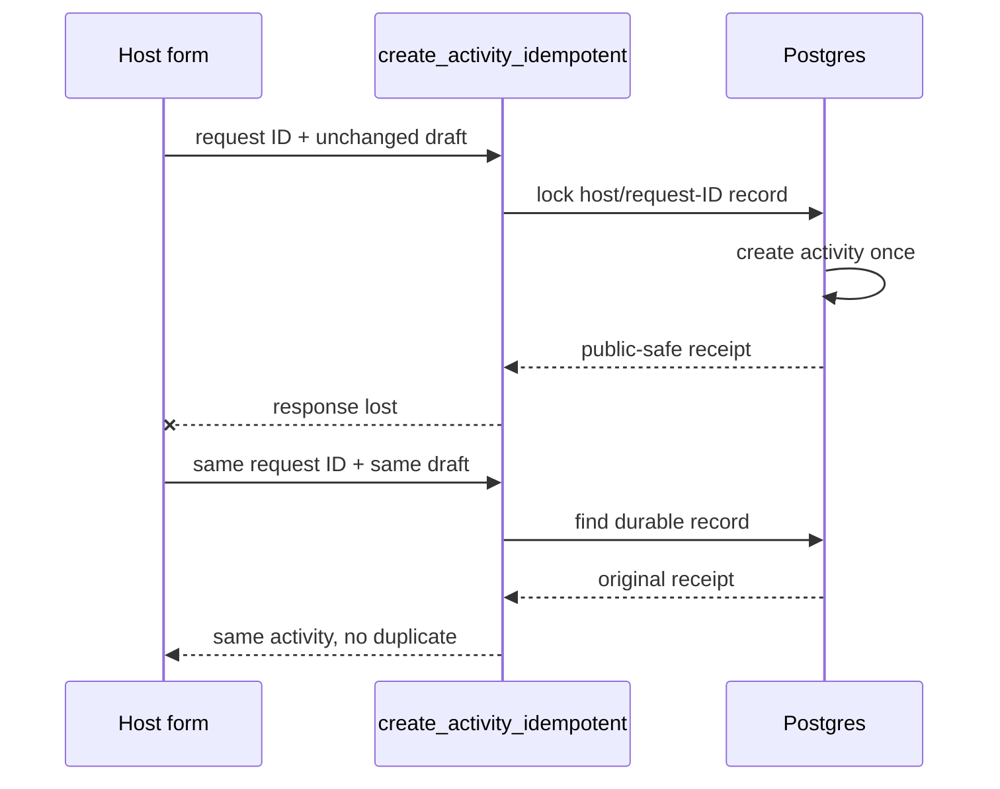

# NearHere Code Tour: Read the Application from First Principles

## Latest code tour — 3 October 2026: themes, Reduce Motion, and username claim

### Reduce Motion camera path

`apps/mobile/hooks/use-reduced-motion.ts` reads iOS accessibility state and
subscribes to changes. The map is the right place to enforce it because every
programmatic camera move must cross `apps/mobile/components/map/activity-map.tsx`:
the parent calls the map's imperative `easeTo` handle; the map applies the pure
`cameraMotionDuration` rule from `apps/mobile/lib/activity-map-features.ts`;
then it chooses MapLibre `jumpTo` when motion should be immediate, otherwise
`easeTo` for the ordinary 350–500 ms transition. Cluster expansion and map
re-centering use that same helper. A `reduceMotionRef` matters here: React's
imperative handle can survive many renders, and the ref lets that retained
callback see a newer accessibility value without stale closure state.



The pure duration policy has unit tests; the hook-to-native-camera preference
path does not yet have Simulator visual acceptance because this Xcode install
has no `Simulator.app` UI. A successful Xcode build and `simctl` app launch prove
only that the binary starts, not that the OS setting is respected.

### Username contract path

`packages/contracts/user.ts` says an owner profile may have a nullable username.
`apps/mobile/lib/profile-validation.ts` canonicalizes a user-entered candidate
for feedback and rejects non-ASCII/reserved names. The repository calls
`claim_my_username` without a caller-supplied owner ID. In
`supabase/migrations/202610030001_username_claim.sql`, the database uses
`auth.uid()`, locks that caller's `profiles` row, checks its revision, and lets
a unique index arbitrate two people racing for the same handle. Direct
`UPDATE(username)` stays revoked. A handle is currently first-claim-only.

The migration has **not** been applied or executed. The existing OTP fixtures
are not safe actors for this test because the first claim cannot be cleared.
Two source-text guards plus validator/parser tests are not a substitute for
running PostgreSQL concurrency and authorization tests. The client can still
read old profile schemas while rollout is pending: it retries the prior select
only for a missing-column error and interprets an omitted legacy result field
as `null`.

### Avatar image evidence boundary

`docs/design-concepts/avatar-modular-style-proof-20261003.png` is an original
ImageGen style anchor, not an app asset. Pixel inspection found a transparent
canvas and a small-size preview was readable. But one flattened PNG has no hair,
skin, clothing, face or shoe slots to recombine. It is not imported by
`lib/avatar-catalog.ts`, has no approved compositing manifest and does not prove
an Avatar Studio. Keep every v1 catalog asset available as fallback while A01
proves coordinate-aligned layers.

**Current local gate:** 107 passing unit tests, TypeScript, Expo lint, diff
whitespace check and Expo iOS export. The Hermes bundle is 5,121,260 bytes.
`username-migration.test.mjs` checks SQL shape only. No hosted database
migration or actor data was changed for this slice.

## Latest tour additions — 30 September 2026

- [Map labels and collision-safe selection](handoffs/app-store-t-pass-20260930.md#t5-visual-comparison-and-selected-marker-label-slice--30-september-2026): public summary → safe label → GeoJSON → MapLibre symbol placement. The spacing gate is tested; positive isolated rendering and map-edge behavior remain open.
- Location failure copy now names generic **Settings**, not “iPhone Settings”, because V1 targets both iPhone and iPad. Unit tests preserve distinct service-disabled, permission-denied, and no-fix outcomes; iPad Simulator also rendered the fresh prompt and denied-permission recovery banner.

### Map-label slice: the data path and the design trade-off



`buildActivityMapFeatures` is a boundary adapter: it converts the app's
latitude/longitude object into GeoJSON's `[longitude, latitude]` order and
copies only fields the public map is allowed to render. The text label is made
from a fixed activity-kind vocabulary plus the already-approximate distance.
That means a host's custom title (which might contain private details) and the
server's private meeting point do not enter the map symbol layer.

The spacing guard uses the Haversine formula to approximate great-circle
distance between two public map points. With latitudes/longitudes in radians,
`a = sin²(Δφ/2) + cos(φ₁) cos(φ₂) sin²(Δλ/2)` and
`d = 2R · asin(√a)`, where Earth radius `R ≈ 6,371,000 m`. If any other marker
is within 250 m, the optional text yields. This threshold is a visual heuristic,
not an exact screen-pixel collision test: zoom level, latitude, image dimensions
and label placement can still affect overlap. The selected halo is independent
of the label decision, so selection remains visible in a dense scene.

The key testing lesson: distance *from the viewer* (for example, an activity
766 m away) says nothing about distance *between two activities*. The Simulator
candidate therefore still had nearby map markers and correctly kept the label
hidden. The unit test proves the spacing function's positive and negative
branches; a real isolated-marker visual capture remains necessary.

### Location failure copy is part of the recovery contract

`apps/mobile/lib/device-location.ts` maps a typed reason (`servicesDisabled`,
`permissionDenied`, `fixUnavailable`) to plain-language recovery guidance. The
hook `apps/mobile/hooks/use-nearby-location.ts` owns the actual permission/GPS
request and state transition; this mapper must not request permission or change
the saved area. A small platform-specific phrase (“iPhone Settings”) was
incorrect for the supported iPad target, so the copy now says simply “Settings”.



Regression tests assert each reason remains understandable and that all three
keep “choose an area” available. The no-fix message additionally promises the
previous selected area is unchanged, matching the hook's state contract. This is
a copy/test correction only: no Expo API, permission level, location retention,
or navigation behavior changed. iPad denial-copy is now visually verified;
real GPS and physical-device acceptance remain separate gates. Verification
after the change: 91/91 unit
tests; TypeScript and Expo lint pass; `git diff --check` passes. Non-failing
Node `MODULE_TYPELESS_PACKAGE_JSON` warnings remain in the test output.

**Interview version:** “I model location failures as distinct typed states and
map each state to an actionable recovery message, rather than treating every
failure as a generic GPS error. The UI copy is platform-neutral because the same
screen ships on iPhone and iPad.”

**Exercise:** Add a test for a new permission status only after first deciding
which existing failure state it means; avoid inventing a fourth state for a
wording variation.

#### Native iPad acceptance: build, bundle, permission, render

The iPad run illustrates why a successful TypeScript check is not the same as
an app that works on a device. A copied development shell initially had no JS
bundle URL. Building for the target simulator with
`npx expo run:ios --device <iPad-Simulator-UDID>` rebuilt/reinstalled the app
with Metro running and loaded the current bundle. The missing script URL did
not establish that native modules were absent from the earlier shell; that
earlier causal claim was corrected during the 1 October audit. The resulting screen showed the operating-system
location prompt. Selecting **Allow Once** exercised iPad's first-run path;
revoking only the Simulator permission and relaunching exercised the app's
denial recovery UI. `xcrun simctl privacy <UDID> reset location com.nearhere.app`
returns the test permission to “not determined” after capture, without clearing
the app's account or activity data.

On initial launch the dark map canvas appeared empty, then the basemap and blue
marker appeared after a delay. Native logs recorded a relevant failure during
the transient blank view: several vector-tile requests failed with
`NSURLErrorDomain -1005` (“network connection was lost”), even though a host
request to the style URL returned HTTP 200. A successful HTTP response on the
Mac does not prove every individual tile request from the simulator succeeded.
The denied-location screen later showed the retained Bengaluru area and the
existing clustered activities. That first denial screenshot did not include a
manual selection; a later follow-up below confirms that flow separately.

This first run verifies iPad build/launch and the displayed fresh-prompt/denial
states, not real GPS accuracy, public-place search, reliable tile networking,
authentication or physical hardware. See
[`visual-evidence.md`](visual-evidence.md#30-september-2026--first-ipad-native-launch-and-location-permission)
and the detailed [P04 handoff](handoffs/night-arcade-status.md#2026-09-30--p04-ipad-launch-and-location-prompt).

Follow-up acceptance used the manual picker's explicit **Use this area** action
and verified the “Selected area” label and existing activity count after
Browse navigation and a native development-app reinstall. This demonstrates
that the local area preference survives the tested Simulator lifecycle while
location permission is not determined; it does not demonstrate physical-iPhone
storage behavior. The first cold launch without Metro again showed “No script
URL provided.” A React Native development client needs a Metro JS bundle at
runtime; for clean cold-start evidence either keep Metro reachable or use a
separately built release bundle. Native compilation and JS bundle delivery are
distinct steps.

#### Physical iPhone build: code signing is a separate gate

The physical iPhone is paired and visible to Xcode, but the current app could
not be installed. The Xcode project sets `CODE_SIGN_STYLE = Automatic`, yet
there is no Development provisioning profile for the bundle ID
`com.nearhere.app`. Xcode stops with error 65 before installation and reports
that `-allowProvisioningUpdates` is needed before it can create/find a profile.

A provisioning profile is Apple's signed authorization tying an app identifier,
developer team/certificate and permitted test devices together. It is distinct
from compiling the app and from the Supabase project's credentials. Allowing
Xcode to create or update it contacts the Apple Developer account and changes
signing state, so this step needs the owner's explicit approval. We did not
enable that flag. The existing iPhone app remains at 1.0.0; physical-device
testing has not started.

**Interview version:** “The simulator build proved the native modules compile,
but a physical-device build also needs a valid code-signing profile. I kept
compilation, provisioning and installation as separate gates and did not mutate
the Apple Developer account without the owner's approval.”

**Interview version:** “I separate build, JavaScript bundle delivery, operating-
system authorization and network tile delivery into different acceptance
gates. That let me diagnose a blank map without mislabeling it as a location
permission bug, and prove the denial UI separately from actual area selection.”

## Latest tour additions — 28–29 September 2026

- [Owner-profile editing](profile-owner-editing.md): draft → account generation →
  repository → validated owner RPC → row lock/revision → saved profile.
- [Hosting time selection](host-time-selection.md): platform dialogs → local
  draft → explicit commit → validation → single in-flight Publish.

These chapters include exact files, failure cases and verification limits.

## Latest tour additions — 24 September 2026

The newest code-level lessons are recorded chronologically in
[`engineering-learning-guide.md`](engineering-learning-guide.md): Lesson B2
traces the block-safe Plans projection; Lesson C follows public summaries into
the MapLibre renderer; Lesson D traces keyboard frame → scroll space → pinned
auth action; Lesson E separates selected region from the live-GPS marker. Their
main source paths are:

| Flow | Start here | Continue to | Proof |
| --- | --- | --- | --- |
| Avatar map rendering | `apps/mobile/app/(tabs)/index.tsx` | `apps/mobile/lib/activity-map-features.ts` → `apps/mobile/components/map/activity-map.tsx` | `activity-map-features.test.mjs`, V25 |
| GPS vs manual area | `apps/mobile/hooks/use-nearby-location.ts` | `apps/mobile/lib/device-location.ts` → `apps/mobile/lib/location-selection.ts` | `location-selection.test.mjs`, V27 |
| Phone/OTP keyboard | `apps/mobile/app/auth/phone.tsx` | `apps/mobile/app/auth/verify.tsx` | V26; no SMS was sent by the layout test |
| Host avatar on detail/Plans | `apps/mobile/lib/activity-repository.ts` | `supabase/migrations/202609240001_activity_host_avatar_projection.sql` and `202609240002_my_plans_respects_blocks.sql` | Hosted harnesses and Simulator top-level evidence |
| Host private meeting-point choice | `apps/mobile/app/host/create.tsx` | `apps/mobile/app/host/meeting-point.tsx` → local draft storage → validation before `createActivity` | V24 and Simulator validation; no activity published |

The live acceptance boundary is explicit: these rows are local implementation
and development Simulator proofs. They do not establish physical-iPhone GPS,
Android keyboard behavior, large-map performance or production launch readiness.

This is the companion textbook for the repository. It explains how to move
from a product sentence to a running screen, a typed client call, a database
function, a security rule, and a verified user outcome.

The goal is not to memorize filenames. The goal is to learn the repeated
engineering loop:



## 1. Start at the repository boundary

| Area | Path | What to learn |
| --- | --- | --- |
| Mobile entry | `apps/mobile/app/` | Expo Router turns files into screens/routes |
| Screen behavior | `apps/mobile/app/**/*.tsx` | Rendering, events, loading/error states |
| Client state | `apps/mobile/providers/`, `apps/mobile/hooks/` | Session/profile/detail state and refresh |
| Backend boundary | `apps/mobile/lib/*-repository.ts` | One place for Supabase calls and error mapping |
| Runtime validation | `apps/mobile/lib/*-validation.ts` | JSON is unknown until checked |
| Shared contracts | `packages/contracts/` | Database-shaped values mapped into domain types |
| Database source of truth | `supabase/migrations/` | Versioned schema, policies, and functions |
| Black-box proof | `supabase/tests/hosted/` | Real hosted authorization and concurrency behavior |
| Learning tests | `apps/mobile/lib/*.test.mjs` | Small deterministic parser and rule examples |

Read files in this order for any feature:

1. The product requirement in [`prd.md`](prd.md).
2. The user flow in [`ux-flows.md`](ux-flows.md).
3. The screen route and its state model.
4. The repository function used by that screen.
5. The parser and shared contract.
6. The migration/RPC that authorizes and persists the operation.
7. The unit and hosted test proving the behavior.

## 2. TypeScript from the ground up

TypeScript is JavaScript plus a compile-time description of values. It does
not protect us from a malicious server response at runtime, so NearHere uses
both types and parsers.

### A simple type

```ts
type MembershipStatus = 'pending' | 'accepted' | 'waitlisted' | 'left';

interface ActivityMessage {
  id: string;
  body: string;
  createdAt: string;
}

function preview(message: ActivityMessage): string {
  return message.body.slice(0, 40);
}
```

The union limits valid states. The interface documents the shape. The return
type tells the compiler what callers may rely on. This catches mistakes while
we write code, but it cannot validate JSON arriving over the network.

### Unknown input must be narrowed

```ts
function isRecord(value: unknown): value is Record<string, unknown> {
  return typeof value === 'object' && value !== null;
}

function parseMessage(value: unknown): ActivityMessage {
  if (!isRecord(value) || typeof value.id !== 'string') {
    throw new Error('Invalid message');
  }
  return {
    id: value.id,
    body: typeof value.body === 'string' ? value.body : '',
    createdAt: typeof value.created_at === 'string' ? value.created_at : '',
  };
}
```

This is why [`activity-validation.ts`](../apps/mobile/lib/activity-validation.ts)
exists. A type assertion such as `value as ActivityMessage` is only a promise
to the compiler; it performs no check.

### Database names versus app names

Postgres returns `activity_id` and `created_at`. The app uses
`activityId` and `createdAt`. The parser is the deliberate translation layer:

```text
database row:  { activity_id, created_at }
                    |
                    v
domain object: { activityId, createdAt }
```

Keeping this translation in one place prevents snake_case and camelCase from
leaking randomly through the UI.

## 3. How one screen works

Activity Detail is the best teaching example: `apps/mobile/app/activity/[id].tsx`.

### Screen lifecycle



The screen owns interaction state such as `action`, `actionError`, and chat
draft text. The hook owns server-backed activity state. The repository owns
transport and error wording. This separation makes each part testable.

### Why every state matters

| State | User-visible behavior | Engineering reason |
| --- | --- | --- |
| Loading | Spinner and “Loading activity…” | Network work is asynchronous |
| Error | Retry action | Failure is recoverable, not a blank screen |
| Anonymous | Public activity, no private point | Browse is allowed; protected actions require Auth |
| Pending | Locked meeting point | Membership exists but authorization is incomplete |
| Accepted | Exact meeting point and chat | Database has granted access |
| Ended/cancelled | Redacted point, disabled actions | Access is time- and status-bounded |

## 4. The repository pattern

`apps/mobile/lib/activity-repository.ts` is a small anti-corruption layer
between React Native and Supabase:

```ts
export async function getActivityMessages(
  activityId: string,
): Promise<ActivityMessagesResult> {
  if (!supabase) {
    return { ok: false, message: 'Chat is unavailable.' };
  }

  const { data, error } = await supabase.rpc('activity_messages', {
    p_activity_id: activityId,
    p_limit: 50,
  });

  if (error) return { ok: false, message: 'Could not load activity chat.' };
  try {
    return { ok: true, messages: parseActivityMessageRows(data) };
  } catch {
    return { ok: false, message: 'Received an invalid chat response.' };
  }
}
```

Important ideas:

- `Promise` means the result arrives later.
- The discriminated union `{ ok: true, ... } | { ok: false, ... }` forces the
  caller to handle success and failure.
- The screen never receives raw database JSON.
- The client does not decide whether a user is authorized; it asks the server.

## 5. Supabase, SQL, and authorization

The chat migration is split into two files because migrations are append-only:

1. `202609090001_activity_chat.sql` created the private table and RPCs.
2. `202609090002_fix_activity_chat_host_membership.sql` corrected a discovered
   authorization bug without rewriting history.

The durable path is:

```mermaid
flowchart TD
  A[Auth access token] --> B[auth.uid()]
  B --> C[accepted membership lookup]
  C -->|host or participant| D[activity status check]
  D --> E[message insert/read]
  E --> F[private block predicate]
```

The important security rule is **accepted membership**, not “participant role.”
The host also has an accepted membership row, so one invariant covers both
actors. This bug was caught by the hosted harness before it reached users.

## 6. Database model in plain language

NearHere stores facts in relational tables:

- `profiles`: one application profile for each Auth identity.
- `activities`: public-safe activity metadata plus private exact coordinates.
- `activity_memberships`: who hosts or joins, and their durable status.
- `activity_messages`: private coordination messages.
- `safety_reports` and `user_blocks`: private safety operations.

Foreign keys prevent references to missing records. Check constraints prevent
impossible values. Unique constraints prevent duplicate membership. A
transaction plus an activity-row lock protects the capacity invariant:

```text
accepted participants <= capacity
```

That invariant belongs in Postgres because two phones may press Join at nearly
the same time.

## 7. Testing as evidence, not ceremony

NearHere uses three complementary test layers:

| Layer | Example | Proves |
| --- | --- | --- |
| Unit | `activity-validation.test.mjs` | Pure mapping and malformed-input behavior |
| Hosted black-box | `supabase/tests/hosted/chat.mjs` | Real Auth, RPC authorization, block filtering |
| Simulator/device | `docs/phase-3-acceptance-runbook.md` | Visual labels, gestures, navigation, native behavior |

For each feature, write the denial case before the happy path. For chat the
matrix is: anonymous denied, accepted host allowed, accepted participant
allowed, blocked author filtered, non-member denied.

## 8. How to read a TypeScript feature like an interviewer

Use this five-question checklist:

1. What is the user-visible requirement?
2. What is the domain type and what states can it have?
3. Where does asynchronous work happen, and how is loading/error represented?
4. Which server-side invariant prevents abuse or races?
5. Which test proves the important success and denial paths?

For chat, a concise interview answer is:

> “I implemented a private activity message model behind authenticated
> Postgres functions. The client validates every response, while the database
> derives the actor from `auth.uid()`, requires an active accepted membership,
> and filters blocked users. I verified the authorization matrix with a hosted
> multi-actor harness and kept realtime as a replaceable delivery optimization.”

### Retry-safe commands: why Publish needs more than a disabled button

A disabled Publish button prevents a double tap in one rendered screen. It does
not protect a network timeout: the database may commit the activity just before
the response is lost, and a retry from the same phone would otherwise create a
second activity. An **idempotency key** is a client-generated identifier that
means “this retry represents the same intended command.”



`apps/mobile/app/host/create.tsx` serializes the draft and keeps its request ID
only while that fingerprint matches. `apps/mobile/lib/activity-creation.ts`
makes this choice deterministic and testable. The mobile repository calls the
new database boundary, and
`supabase/migrations/202610010001_create_activity_idempotency.sql` owns the
unique `(host_user_id, request_id)` rule and payload-hash mismatch rejection.
The 1 October development migration is deployed; hosted actor and device proof
remain separate acceptance steps.

## 9. Safety operations and least privilege

The safety foundation demonstrates that a signed-in user is not automatically
an operator. `private.operator_accounts` is an allowlist, and it is empty until
an explicit provisioning procedure is chosen. The review RPCs check this table
inside the database. This is stronger than a hidden button or an environment
variable in the app because a modified client cannot manufacture operator
authority.

The implementation intentionally stops before a console and operator bootstrap.
Granting the first operator is an external authority change that needs a named
owner, recovery plan, and audit trail. The hosted harness proves the safe
default: ordinary authenticated users cannot read or mutate the review queue.

## 10. Exercises for the learner

1. Find `ActivityMessage` in `packages/contracts/activity.ts` and explain each
   field without looking at the UI.
2. Trace `sendActivityMessage` from the button press to the SQL insert.
3. Change the parser test to reject a blank body and explain why validation is
   duplicated at both client and database boundaries.
4. Read `activity_messages`, `nearby_activities`, and `join_activity` in the
   migrations and identify where blocks are applied.
5. Open the Activity Detail screen in Simulator and record a screenshot for
   anonymous, pending, accepted, and ended states.
6. Read `202609090003_operator_safety_review.sql` and explain why an empty
   operator table is safer than a hard-coded email check.
7. Read `apps/mobile/lib/request-context.ts` and explain why a correlation ID
   is useful even before a remote tracing system exists.

The answers belong in the challenge log, not in memory. A future LaTeX book
can turn each section into a chapter with the diagrams and screenshot evidence
from [`visual-evidence.md`](visual-evidence.md).
