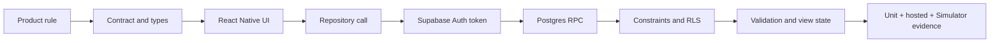
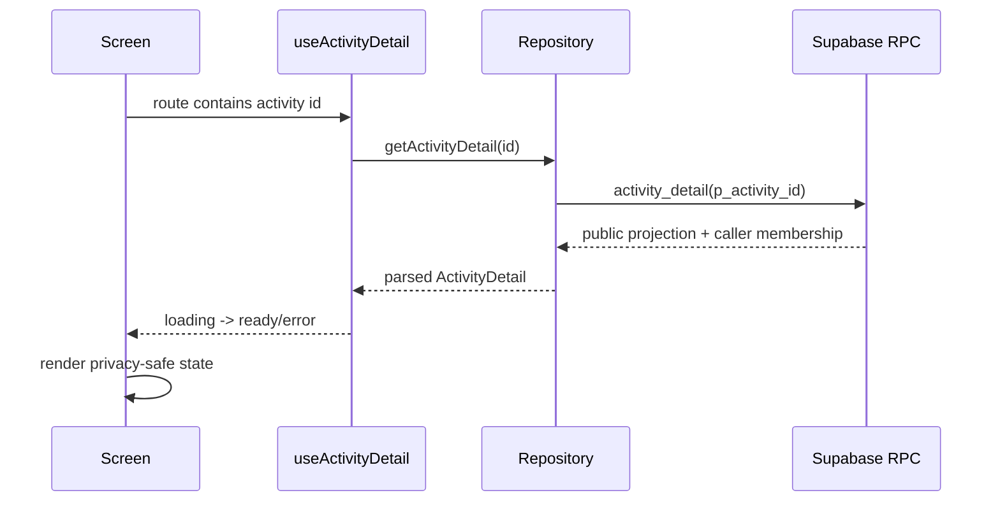

# NearHere Code Tour: Read the Application from First Principles

This is the companion textbook for the repository. It explains how to move
from a product sentence to a running screen, a typed client call, a database
function, a security rule, and a verified user outcome.

The goal is not to memorize filenames. The goal is to learn the repeated
engineering loop:



## 1. Start at the repository boundary

| Area | Path | What to learn |
| --- | --- | --- |
| Mobile entry | `apps/mobile/app/` | Expo Router turns files into screens/routes |
| Screen behavior | `apps/mobile/app/**/*.tsx` | Rendering, events, loading/error states |
| Client state | `apps/mobile/providers/`, `apps/mobile/hooks/` | Session/profile/detail state and refresh |
| Backend boundary | `apps/mobile/lib/*-repository.ts` | One place for Supabase calls and error mapping |
| Runtime validation | `apps/mobile/lib/*-validation.ts` | JSON is unknown until checked |
| Shared contracts | `packages/contracts/` | Database-shaped values mapped into domain types |
| Database source of truth | `supabase/migrations/` | Versioned schema, policies, and functions |
| Black-box proof | `supabase/tests/hosted/` | Real hosted authorization and concurrency behavior |
| Learning tests | `apps/mobile/lib/*.test.mjs` | Small deterministic parser and rule examples |

Read files in this order for any feature:

1. The product requirement in [`prd.md`](prd.md).
2. The user flow in [`ux-flows.md`](ux-flows.md).
3. The screen route and its state model.
4. The repository function used by that screen.
5. The parser and shared contract.
6. The migration/RPC that authorizes and persists the operation.
7. The unit and hosted test proving the behavior.

## 2. TypeScript from the ground up

TypeScript is JavaScript plus a compile-time description of values. It does
not protect us from a malicious server response at runtime, so NearHere uses
both types and parsers.

### A simple type

```ts
type MembershipStatus = 'pending' | 'accepted' | 'waitlisted' | 'left';

interface ActivityMessage {
  id: string;
  body: string;
  createdAt: string;
}

function preview(message: ActivityMessage): string {
  return message.body.slice(0, 40);
}
```

The union limits valid states. The interface documents the shape. The return
type tells the compiler what callers may rely on. This catches mistakes while
we write code, but it cannot validate JSON arriving over the network.

### Unknown input must be narrowed

```ts
function isRecord(value: unknown): value is Record<string, unknown> {
  return typeof value === 'object' && value !== null;
}

function parseMessage(value: unknown): ActivityMessage {
  if (!isRecord(value) || typeof value.id !== 'string') {
    throw new Error('Invalid message');
  }
  return {
    id: value.id,
    body: typeof value.body === 'string' ? value.body : '',
    createdAt: typeof value.created_at === 'string' ? value.created_at : '',
  };
}
```

This is why [`activity-validation.ts`](../apps/mobile/lib/activity-validation.ts)
exists. A type assertion such as `value as ActivityMessage` is only a promise
to the compiler; it performs no check.

### Database names versus app names

Postgres returns `activity_id` and `created_at`. The app uses
`activityId` and `createdAt`. The parser is the deliberate translation layer:

```text
database row:  { activity_id, created_at }
                    |
                    v
domain object: { activityId, createdAt }
```

Keeping this translation in one place prevents snake_case and camelCase from
leaking randomly through the UI.

## 3. How one screen works

Activity Detail is the best teaching example: `apps/mobile/app/activity/[id].tsx`.

### Screen lifecycle



The screen owns interaction state such as `action`, `actionError`, and chat
draft text. The hook owns server-backed activity state. The repository owns
transport and error wording. This separation makes each part testable.

### Why every state matters

| State | User-visible behavior | Engineering reason |
| --- | --- | --- |
| Loading | Spinner and “Loading activity…” | Network work is asynchronous |
| Error | Retry action | Failure is recoverable, not a blank screen |
| Anonymous | Public activity, no private point | Browse is allowed; protected actions require Auth |
| Pending | Locked meeting point | Membership exists but authorization is incomplete |
| Accepted | Exact meeting point and chat | Database has granted access |
| Ended/cancelled | Redacted point, disabled actions | Access is time- and status-bounded |

## 4. The repository pattern

`apps/mobile/lib/activity-repository.ts` is a small anti-corruption layer
between React Native and Supabase:

```ts
export async function getActivityMessages(
  activityId: string,
): Promise<ActivityMessagesResult> {
  if (!supabase) {
    return { ok: false, message: 'Chat is unavailable.' };
  }

  const { data, error } = await supabase.rpc('activity_messages', {
    p_activity_id: activityId,
    p_limit: 50,
  });

  if (error) return { ok: false, message: 'Could not load activity chat.' };
  try {
    return { ok: true, messages: parseActivityMessageRows(data) };
  } catch {
    return { ok: false, message: 'Received an invalid chat response.' };
  }
}
```

Important ideas:

- `Promise` means the result arrives later.
- The discriminated union `{ ok: true, ... } | { ok: false, ... }` forces the
  caller to handle success and failure.
- The screen never receives raw database JSON.
- The client does not decide whether a user is authorized; it asks the server.

## 5. Supabase, SQL, and authorization

The chat migration is split into two files because migrations are append-only:

1. `202609090001_activity_chat.sql` created the private table and RPCs.
2. `202609090002_fix_activity_chat_host_membership.sql` corrected a discovered
   authorization bug without rewriting history.

The durable path is:

```mermaid
flowchart TD
  A[Auth access token] --> B[auth.uid()]
  B --> C[accepted membership lookup]
  C -->|host or participant| D[activity status check]
  D --> E[message insert/read]
  E --> F[private block predicate]
```

The important security rule is **accepted membership**, not “participant role.”
The host also has an accepted membership row, so one invariant covers both
actors. This bug was caught by the hosted harness before it reached users.

## 6. Database model in plain language

NearHere stores facts in relational tables:

- `profiles`: one application profile for each Auth identity.
- `activities`: public-safe activity metadata plus private exact coordinates.
- `activity_memberships`: who hosts or joins, and their durable status.
- `activity_messages`: private coordination messages.
- `safety_reports` and `user_blocks`: private safety operations.

Foreign keys prevent references to missing records. Check constraints prevent
impossible values. Unique constraints prevent duplicate membership. A
transaction plus an activity-row lock protects the capacity invariant:

```text
accepted participants <= capacity
```

That invariant belongs in Postgres because two phones may press Join at nearly
the same time.

## 7. Testing as evidence, not ceremony

NearHere uses three complementary test layers:

| Layer | Example | Proves |
| --- | --- | --- |
| Unit | `activity-validation.test.mjs` | Pure mapping and malformed-input behavior |
| Hosted black-box | `supabase/tests/hosted/chat.mjs` | Real Auth, RPC authorization, block filtering |
| Simulator/device | `docs/phase-3-acceptance-runbook.md` | Visual labels, gestures, navigation, native behavior |

For each feature, write the denial case before the happy path. For chat the
matrix is: anonymous denied, accepted host allowed, accepted participant
allowed, blocked author filtered, non-member denied.

## 8. How to read a TypeScript feature like an interviewer

Use this five-question checklist:

1. What is the user-visible requirement?
2. What is the domain type and what states can it have?
3. Where does asynchronous work happen, and how is loading/error represented?
4. Which server-side invariant prevents abuse or races?
5. Which test proves the important success and denial paths?

For chat, a concise interview answer is:

> “I implemented a private activity message model behind authenticated
> Postgres functions. The client validates every response, while the database
> derives the actor from `auth.uid()`, requires an active accepted membership,
> and filters blocked users. I verified the authorization matrix with a hosted
> multi-actor harness and kept realtime as a replaceable delivery optimization.”

## 9. Safety operations and least privilege

The safety foundation demonstrates that a signed-in user is not automatically
an operator. `private.operator_accounts` is an allowlist, and it is empty until
an explicit provisioning procedure is chosen. The review RPCs check this table
inside the database. This is stronger than a hidden button or an environment
variable in the app because a modified client cannot manufacture operator
authority.

The implementation intentionally stops before a console and operator bootstrap.
Granting the first operator is an external authority change that needs a named
owner, recovery plan, and audit trail. The hosted harness proves the safe
default: ordinary authenticated users cannot read or mutate the review queue.

## 10. Exercises for the learner

1. Find `ActivityMessage` in `packages/contracts/activity.ts` and explain each
   field without looking at the UI.
2. Trace `sendActivityMessage` from the button press to the SQL insert.
3. Change the parser test to reject a blank body and explain why validation is
   duplicated at both client and database boundaries.
4. Read `activity_messages` and `nearby_activities` in the migrations and
   identify where blocks are applied.
5. Open the Activity Detail screen in Simulator and record a screenshot for
   anonymous, pending, accepted, and ended states.
6. Read `202609090003_operator_safety_review.sql` and explain why an empty
   operator table is safer than a hard-coded email check.

The answers belong in the challenge log, not in memory. A future LaTeX book
can turn each section into a chapter with the diagrams and screenshot evidence
from [`visual-evidence.md`](visual-evidence.md).
