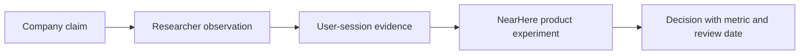

# NearHere Competitive Research Plan

Status: **research plan, not findings**. Do not convert product marketing, app-store copy, or assumptions into evidence without recording the source and observation date.

## Questions

- Which products make local activity discovery feel immediate and trustworthy?
- Where do event platforms, neighborhood networks, group chats, and map products create friction?
- How do products explain public, approximate, and participant-only location?
- Which host tools increase reliable activity supply without heavy administration?
- Does identity customization improve trust/activation enough to justify onboarding effort?
- What happens when there are few or no nearby activities?

## Research set

Compare current versions of Meetup, Eventbrite, Nextdoor, Geneva, Discord community discovery, Snap Map, Google Maps/community-list patterns, and local WhatsApp/Telegram group behavior. Refresh this set before research because products and policies change.

## Method

1. Define tasks: first browse, first join, first host, cancellation, report, and empty-area recovery.
2. Record product/version/date, device, screenshots or notes, exact steps, and observed—not inferred—behavior.
3. Build a capability matrix: discovery, map/list, spontaneity, time/distance, host tools, coordination, privacy, safety, identity, empty states, and monetization.
4. Run at least five exploratory and five host usability sessions using consented research protocols.
5. Interview community organizers about density, repeat hosting, no-shows, cancellation, and safety operations.
6. Test two launch-density narratives in one selected neighborhood.

## Evidence ladder

A competitor feature is not proof NearHere should build it. The research output must connect observations to a NearHere problem, alternative, expected impact, cost, and decision.

## Deliverables

- Dated competitive matrix with evidence links
- Jobs-to-be-done and friction synthesis
- Privacy/trust language recommendations
- Host-supply and pricing hypotheses
- Decision log of patterns to adopt, test, defer, or deliberately avoid
- Open questions and confidence level
