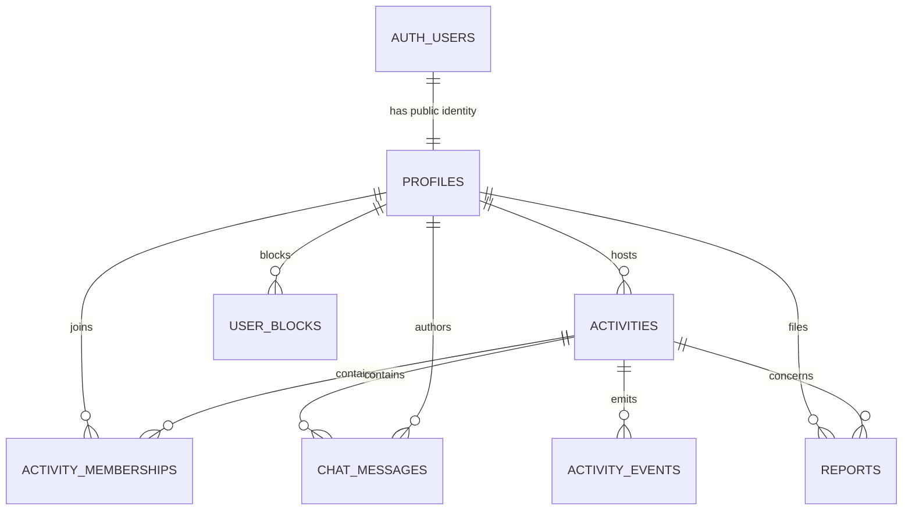
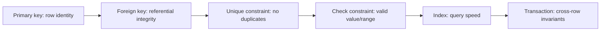
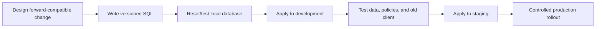

# NearHere Data Model

The data model turns product rules into durable database structure. PostgreSQL is the system of record; TypeScript types and UI state are useful representations, not authoritative storage.

## 1. Modeling principles

- Put identity credentials in Supabase's protected `auth` schema and application identity in `public.profiles`; the schema name does not imply anonymous visibility.
- Use constraints for rules that must survive every code path.
- Use transactions for rules involving multiple reads/writes or concurrency.
- Store precise and public activity geometry in fields with different access paths.
- Prefer explicit status values and transition functions over ambiguous booleans.
- Enable Row Level Security on every client-exposed table.
- Change schemas through ordered, reviewable migrations—never undocumented dashboard edits.

## 2. Entity relationship model

## 3. Lesson 4 implemented schema: profiles

`auth.users` is managed by Supabase and stores phone identity, authentication metadata, and sessions. It is not exposed through the public data API.

`public.profiles` stores application identity without credentials. Here `public` is PostgreSQL's API-exposed schema name; it does not mean anonymous access:

| Column | Type | Meaning |
| --- | --- | --- |
| `id` | UUID primary/foreign key | Same stable identity as `auth.users.id` |
| `display_name` | text, nullable | User-selected public label; constrained after trimming |
| `onboarding_status` | enum | `needs_profile` or `complete` |
| `avatar_config` | JSONB | Deferred/generated avatar configuration, initially `{}` |
| `interests` | text array | Lightweight preference identifiers, initially empty |
| `created_at` | timestamptz | Server creation time |
| `updated_at` | timestamptz | Server-maintained last-update time |

A database trigger creates one profile after every new Auth user. A failed trigger can block signup, so it must remain small and be integration-tested.

The original sketch included `phone_or_email_hash` in a public users table. That is removed: NearHere uses phone only, Supabase already owns the phone identity, and duplicating even a hash creates unnecessary linkage and lifecycle burden.

## 4. Planned activity model

### `activities`

| Field group | Representative fields | Rules |
| --- | --- | --- |
| Identity/owner | `id`, `host_user_id` | Host references profile/auth identity |
| Content | `kind`, `title`, `description` | Server-defined kinds; bounded text |
| Lifecycle | `starts_at`, `ends_at`, `status` | End after start; explicit transitions |
| Location | `private_point`, `public_point`, `privacy_radius_m` | Private point excluded from discovery |
| Participation | `capacity`, `join_mode` | Capacity bounded; `open` or `approval` |
| Audit | `created_at`, `updated_at`, `cancelled_at` | Server time |

`private_point` and `public_point` should use PostGIS `geography(Point, 4326)` or a deliberately selected equivalent. `public_point` is derived by trusted code and indexed with GiST for discovery. Whether to retain the exact point and when to disclose it requires a documented retention/release policy.

### `activity_memberships`

Composite identity: `(activity_id, user_id)`.

Representative fields: `role`, `status`, `requested_at`, `accepted_at`, `left_at`, and status metadata. A partial index or transactional query helps count accepted members efficiently. Status values model pending, accepted, waitlisted, rejected, left, removed, and cancelled; the API exposes commands rather than arbitrary status mutation.

### `idempotency_records`

Representative fields: actor, operation scope, idempotency key, request fingerprint, stored response, status code, and expiration. A uniqueness constraint prevents the same logical write from being executed twice.

### `chat_messages`

Representative fields: `id`, `activity_id`, `author_user_id`, client-generated idempotency identifier, body, `created_at`, and `deleted_at`. Membership authorization is evaluated server-side.

### `activity_events`

Append-only business audit events such as created, cancelled, joined, approved, left, and capacity changed. These are durable facts, not a replacement for current-state tables.

### `reports` and `user_blocks`

Reports have reporter, optional reported user/activity/message, reason/category, status, timestamps, and restricted operator notes. A block relation prevents relevant discovery/participation exposure according to a defined safety policy.

## 5. Keys, constraints, and indexes

Indexes are not free. They speed matching reads but consume storage and increase write work. Add indexes from query shapes:

- GiST on public activity geography for nearby lookup.
- B-tree on activity status/start time for filtering active time windows.
- Composite/partial membership indexes for activity plus accepted status.
- Unique membership and idempotency constraints for retry safety.
- Cursor index on `(activity_id, created_at, id)` for chat pagination.

Use `EXPLAIN (ANALYZE, BUFFERS)` on realistic data before claiming an index improves performance.

## 6. Row Level Security model

RLS acts like an automatic row filter/check on every data operation made through exposed Postgres roles.

| Actor | Profiles | Public activities | Private meeting data | Memberships/chat |
| --- | --- | --- | --- | --- |
| Anonymous | No direct profile-table access; API may project required host fields | Published summaries | Never | Never |
| Authenticated non-member | Own profile; API-projected host summaries | Published summaries | Never | Own request state only |
| Accepted member | Own profile and API-projected participant summaries | Relevant activity | When release policy permits | Activity-scoped access |
| Host | Own profile/activity management | Own and public activities | Own activity | Host management rules |
| Service role | Operational access | Operational access | Operational access | Protected server only |

RLS protects direct data access, but complex capacity/join invariants still require a transactional function or trusted API operation.

## 7. Migration strategy

For mobile clients, old binaries can remain active for weeks. Prefer expand/migrate/contract:

1. **Expand:** add nullable/new structures without breaking old readers.
2. **Migrate:** deploy code, backfill data, observe.
3. **Contract:** remove old structures only after old clients are no longer supported.

## 8. Data lifecycle questions still to decide

- How long is private meeting geometry retained after completion/cancellation?
- When exactly does an accepted participant receive it?
- What deletion/anonymization occurs when an account is deleted?
- Which moderation evidence is retained and for how long?
- Which avatar fields are configuration versus generated/uploaded assets?
- Are interests public, private, or used only for discovery preferences?
