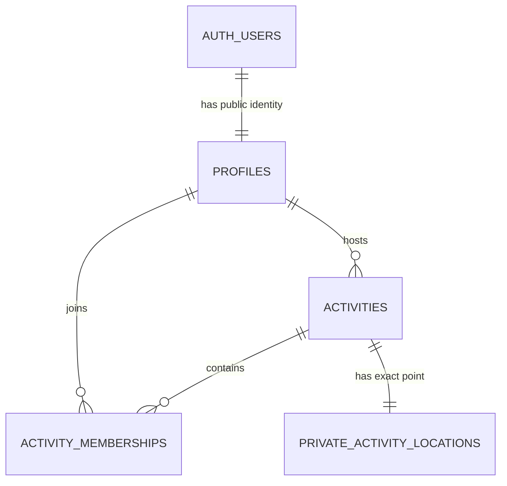
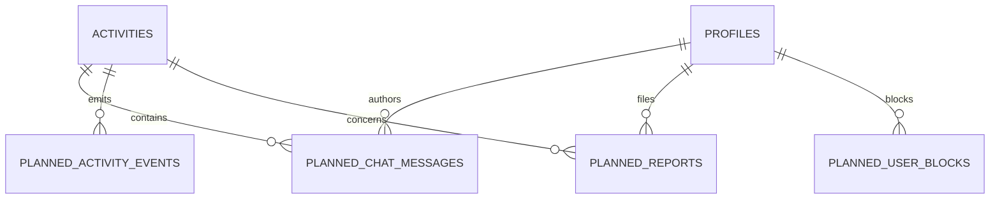
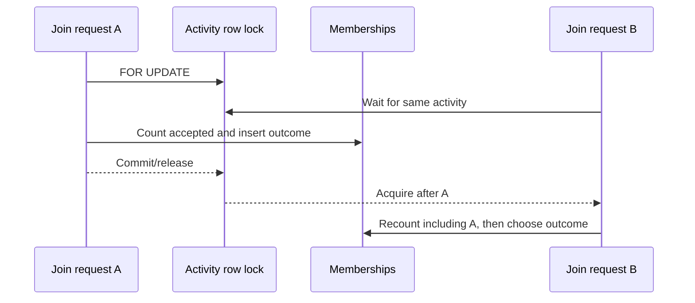
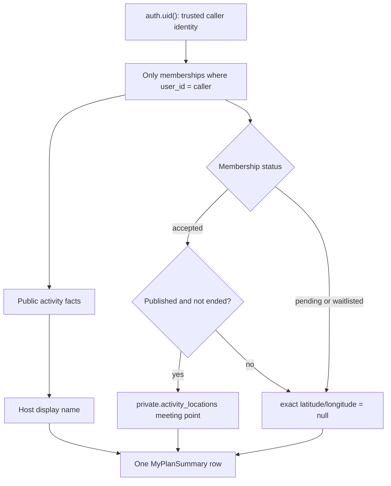
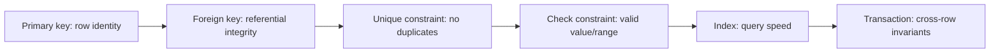
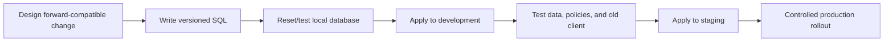

# NearHere Data Model

## Avatar assignment update — deployed 23 September 2026

`profiles.avatar_config` now defaults to a JSON object with `version: 1` and a
random UUID string `seed`, generated by PostgreSQL for each inserted profile.
Migration `202609230001_assigned_avatars.sql` backfills only `{}` configs; existing
nonempty configurations are preserved. The existing auth-user trigger inserts a
profile and therefore receives this default. A rename does not regenerate it.
The seed is visual identity, not authentication or a uniqueness promise for art.

The column currently accepts arbitrary object-shaped legacy JSON. A catalog ID
and stricter validation are **future ticket 4 work**, not deployed constraints.
Own-profile reads use existing RLS. Public host-avatar projection is also pending;
do not expose complete profile rows to solve marker rendering. See
[tickets 2–4](handoffs/night-arcade-execution.md).

The data model turns product rules into durable database structure. PostgreSQL is the system of record; TypeScript types and UI state are useful representations, not authoritative storage.

## 1. Modeling principles

- Put identity credentials in Supabase's protected `auth` schema and application identity in `public.profiles`; the schema name does not imply anonymous visibility.
- Use constraints for rules that must survive every code path.
- Use transactions for rules involving multiple reads/writes or concurrency.
- Store precise and public activity geometry in fields with different access paths.
- Prefer explicit status values and transition functions over ambiguous booleans.
- Enable Row Level Security on every client-exposed table.
- Change schemas through ordered, reviewable migrations—never undocumented dashboard edits.

## 2. Entity relationship model

The first diagram is the schema deployed today. It is intentionally smaller than the beta domain: only model relationships that an executable migration actually creates are shown as current.

The following relationships are planned and must not be mistaken for deployed tables:

## 3. Lesson 4 deployed development schema: profiles

`auth.users` is managed by Supabase and stores phone identity, authentication metadata, and sessions. It is not exposed through the public data API.

`public.profiles` stores application identity without credentials. Here `public` is PostgreSQL's API-exposed schema name; it does not mean anonymous access:

| Column | Type | Meaning |
| --- | --- | --- |
| `id` | UUID primary/foreign key | Same stable identity as `auth.users.id` |
| `display_name` | text, nullable | User-selected public label; constrained after trimming |
| `onboarding_status` | enum | `needs_profile` or `complete` |
| `avatar_config` | JSONB | Deferred/generated avatar configuration, initially `{}` |
| `interests` | text array | Lightweight preference identifiers, initially empty |
| `created_at` | timestamptz | Server creation time |
| `updated_at` | timestamptz | Server-maintained last-update time |

A database trigger creates one profile after every new Auth user. A failed trigger can block signup, so it must remain small and be integration-tested.

Deployment evidence on 2026-08-15: migration `202608150001` appears in both local and hosted migration history. An anonymous Data API request to `profiles` returns HTTP 401 / PostgreSQL `42501`. A fixed hosted OTP produced one Auth user and exactly one owner-readable `needs_profile` row, proving the signup trigger and owner-read path for that actor. Cross-user and restricted-operation policies still require the two-actor harness.

The original sketch included `phone_or_email_hash` in a public users table. That is removed: NearHere uses phone only, Supabase already owns the phone identity, and duplicating even a hash creates unnecessary linkage and lifecycle burden.

## 4. Lesson 6 deployed activity model

### `activities`

| Field group | Representative fields | Rules |
| --- | --- | --- |
| Identity/owner | `id`, `host_user_id` | Host references profile/auth identity |
| Content | `kind`, `title`, `description` | Server-defined kinds; bounded text |
| Lifecycle | `starts_at`, `ends_at`, `status` | End after start; explicit transitions |
| Public location | `public_point`, `privacy_radius_m` | Contains only server-derived approximate geometry |
| Participation | `capacity`, `join_mode` | Capacity bounded; `open` or `approval` |
| Audit | `created_at`, `updated_at`, `cancelled_at` | Server time |

Both `public.activities.public_point` and `private.activity_locations.meeting_point` use PostGIS `geography(Point, 4326)`. The separation is structural: there is no exact-coordinate column to accidentally select from the public activity table. `public_point` is derived by trusted code and indexed with GiST for discovery. The first disclosure policy requires accepted membership plus a still-published, not-ended activity through `my_plans`. The row is retained after completion/cancellation for now, but the operational coordinate is no longer returned; deletion/anonymization retention still requires a decision.

The deployed migration stores public-safe activity facts in `public.activities` and the exact meeting point in `private.activity_locations`. The `private` schema is not exposed through the Data API and grants no access to client roles. `create_activity` writes both records atomically and derives `public_point` by displacing the exact point into the outer 40% of a 150–1,000 metre privacy radius.

Anonymous discovery calls `nearby_activities`; it cannot select the table directly. The function validates coordinates/radius/limit, uses `ST_DWithin` against a GiST index, filters published non-ended activities, and returns latitude/longitude only from `public_point`.

### Why two geometry records are stronger than one response filter

If exact and approximate coordinates shared a client-readable row, every query, view, serializer, and future policy would need to remember to exclude the exact field. Storing the exact point in a non-exposed schema makes the safe path the default. This is **defense in depth**: response shaping still matters, but one accidental `SELECT *` cannot disclose the meeting point through normal client roles.

### `activity_memberships`

Composite identity: `(activity_id, user_id)`.

The deployed table has composite identity `(activity_id, user_id)`, role, status, `joined_at`, and audit timestamps. The creation transaction inserts exactly one accepted host row; a partial unique index enforces one host per activity. The deployed `join_activity` command creates or returns participant membership through `pending`, `accepted`, and `waitlisted`. Deployed migration `007` implements `left`, host-produced `rejected`, and deterministic waitlist promotion. Migrations `202609060001`/`002` implement host-only `removed` transitions and a host-safe accepted/waitlisted participant projection. Hosted verification covers these transitions, retry behavior, concurrent capacity safety, and chronological FIFO promotion.

The composite primary key is also the natural idempotency key for this one operation: the same actor/activity pair cannot produce a second membership row. If an active membership already exists, the function returns that durable status before attempting an insert. This is narrower than a general request-idempotency system because it cannot distinguish two different payloads under the same client-generated key or replay an arbitrary stored HTTP response.

Capacity correctness is a cross-row invariant, so a uniqueness constraint alone is insufficient. `join_activity` locks the selected `activities` row with `FOR UPDATE`, counts accepted memberships while holding that lock, chooses the next state, and commits before the next join decision for that activity proceeds:

Migration `007` also adds a partial queue index on `(activity_id, status, created_at, user_id)` for pending/waitlisted participant rows. It supports two bounded operations without granting table reads: a host-only FIFO pending-request projection and the oldest-waiter lookup during Leave. The activity row remains the serialization lock because the capacity invariant spans the parent row and many membership rows.

An accepted participant Leave sets `status = left` and `joined_at = null`. If the activity is published and has not ended, the same transaction promotes at most one waitlisted participant to accepted and sets that participant's `joined_at`. Pending/waitlisted Leave simply becomes `left`; rejected/removed memberships cannot disguise themselves as voluntary Leave; hosts require a separate cancellation/ownership flow.

### Lesson 8 caller-scoped Plans projection

Migration `202608150005_create_my_plans.sql` adds a read function rather than granting the mobile app `SELECT` access to the underlying activity, profile, membership, or private-location tables. A **projection** is a purpose-shaped read result: it can combine stored facts while returning fewer and safer fields than the base tables contain.

The function is `stable` because it reads but does not intentionally modify data. It is `security definer` because normal client roles deliberately lack direct access to these tables; its empty `search_path`, schema-qualified names, explicit return columns, actor check, non-null bounded limit, status filter, and authenticated-only execute grant constrain that elevated privilege. The host already has an `accepted` host membership by database constraint, so the same accepted/active release rule unlocks the host's exact point without a special client-side exception.

The ordering places non-ended plans first by nearest start time, followed by ended plans from newest start time backward. This is useful presentation ordering, not an archival or retention policy. Cancelled/completed activities can still be projected if the caller retains an active membership. Leave and approval/rejection are deployed and hosted-verified; participant Leave and host approval are also Simulator-accepted, while host Reject still needs Simulator acceptance. Cancellation and removal commands remain unimplemented.

### `idempotency_records`

This table remains planned for general commands. Representative fields: actor, operation scope, idempotency key, request fingerprint, stored response, status code, and expiration. A uniqueness constraint prevents the same logical write from being executed twice. The current Join command instead uses membership identity plus an existing-state early return.

### `activity_messages`

Deployed in `202609090001_activity_chat.sql` inside the private schema. Each row
stores an activity, author, bounded message body, and server timestamp. Direct
client table access is revoked; `send_activity_message` and
`activity_messages` are the only current application boundary. Both require a
published, active activity and an accepted membership (the host's accepted
membership is included). Reads exclude either side of a private block.
The mobile slice uses explicit refetch on focus; realtime delivery is a later
transport optimization, not a second source of truth.

### `activity_events`

Append-only business audit events such as created, cancelled, joined, approved, left, and capacity changed. These are durable facts, not a replacement for current-state tables.

### `reports` and `user_blocks`

Migration `202609080001` deploys the first private `safety_reports` and
`user_blocks` tables. Reports contain reporter, optional reported user/activity,
reason, details, and timestamp; direct client access is denied. A block relation
is private and idempotent. Chat reads, authenticated discovery, and host
participant projections now consume the block relation. Join authorization and
other participation commands still need a deliberate block policy before
launch.

Migration `202609090005_block_existing_membership_privacy.sql` records the MVP
policy: a block does not delete an existing membership, but it prevents a new
Join attempt and redacts the exact meeting point for the blocked relationship.
The user can leave, and the host can remove, so membership history remains
explicit rather than being silently destroyed.

Migration `202609090006_safety_audit_events.sql` adds append-only private audit
events. Database triggers record report creation/review and block/unblock
changes, so logging is coupled to the state mutation rather than remembered by
the UI. Migration `202609090008_rate_limit_sensitive_writes.sql` adds bounded
per-actor windows for chat, reports, blocks, and joins; migration
`202609090009_observability_events.sql` records rate-limit warnings for the
operator boundary without exposing operational data to clients.

Migration `202609090003_operator_safety_review.sql` adds a report lifecycle
(`open`, `reviewing`, `resolved`, `dismissed`) and review metadata. The private
`operator_accounts` table is deliberately empty by default. Operator queue and
review RPCs check that allowlist inside the database; there is no client-side
admin flag that a modified app could manufacture.

## 5. Keys, constraints, and indexes

Indexes are not free. They speed matching reads but consume storage and increase write work. Add indexes from query shapes:

- GiST on public activity geography for nearby lookup.
- B-tree on activity status/start time for filtering active time windows.
- Composite/partial membership indexes for activity plus accepted status.
- Unique membership and idempotency constraints for retry safety.
- Cursor index on `(activity_id, created_at, id)` for chat pagination.

Use `EXPLAIN (ANALYZE, BUFFERS)` on realistic data before claiming an index improves performance.

## 6. Row Level Security model

RLS acts like an automatic row filter/check on every data operation made through exposed Postgres roles.

The deployed access surface is deliberately narrower than the beta target:

| Deployed object | Direct client table access | Intended operation |
| --- | --- | --- |
| `public.profiles` | Authenticated owner can select and update granted columns under RLS | Minimal profile onboarding/editing |
| `public.activities` | None for `anon` or `authenticated` | Read through `nearby_activities` and caller-scoped `my_plans`; write through `create_activity` |
| `public.activity_memberships` | None for `anon` or `authenticated` | Host row is written inside `create_activity`; participant Join is written inside `join_activity`; caller state is projected by `my_plans` |
| `private.activity_locations` | None; schema and table are not client-exposed | `my_plans` releases the exact point only to an accepted caller while the activity is published and not ended |

The following table describes the current authorization model for deployed rows:

| Actor | Profiles | Public activities | Private meeting data | Memberships/chat |
| --- | --- | --- | --- | --- |
| Anonymous | No direct profile-table access; API may project required host fields | Published summaries | Never | Never |
| Authenticated non-member | Own profile; API-projected host summaries | Published summaries | Never | Own request state only |
| Accepted member | Own profile and API-projected participant summaries | Relevant activity | When release policy permits | Activity-scoped access |
| Host | Own profile/activity management | Own and public activities | Own activity | Host management rules |
| Service role | Operational access | Operational access | Operational access | Protected server only |

RLS protects direct data access, but complex capacity/join invariants still require a transactional function or trusted API operation.

## 7. Migration strategy

For mobile clients, old binaries can remain active for weeks. Prefer expand/migrate/contract:

1. **Expand:** add nullable/new structures without breaking old readers.
2. **Migrate:** deploy code, backfill data, observe.
3. **Contract:** remove old structures only after old clients are no longer supported.

## 8. Data lifecycle questions still to decide

- How long is private meeting geometry retained after completion/cancellation?
- When exactly does an accepted participant receive it?
- What deletion/anonymization occurs when an account is deleted?
- Which moderation evidence is retained and for how long?
- Which avatar fields are configuration versus generated/uploaded assets?
- Are interests public, private, or used only for discovery preferences?
