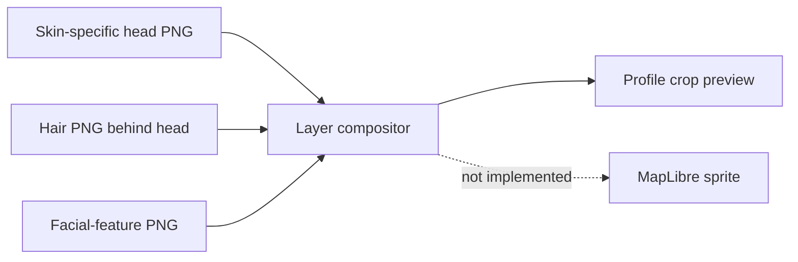

# Kenney modular-avatar crop proof

Status: design/asset prototype only. It is not imported by the app and does
not change any account's saved avatar.

## What we tried

The creator-hosted Kenney Modular Characters pack supplies separate transparent
PNG layers for skin, hair, facial features, clothing, pants, and shoes. Its own
`license.txt` names Kenney Vleugels and CC0 1.0 Universal. CC0 permits copying,
modifying, and commercial use without attribution; we retain the notice anyway.
Official source: <https://kenney.nl/assets/modular-characters>.

The `assets/` folder contains only the source PNG layers used here and the
original license notice, not the complete 521-entry archive. The generated
[`kenney-profile-crops-prototype.png`](kenney-profile-crops-prototype.png) is a
256 px circular crop mockup using four skin/head tints, four hair styles, and
the same neutral face features. This verifies that the layers can become a
small profile-style portrait at a useful size. It is not a full-body map sprite
and does not prove arbitrary outfits or hairstyles align.

## Recreate it

From the repository root on macOS:

```sh
swift docs/design-concepts/kenney-avatar-prototype/render-preview.swift
```

The Swift/AppKit script draws the source PNGs in a fixed layer order onto four
cards and writes the preview beside itself. The source is the input; the PNG is
generated evidence. Changing a sprite should be checked at actual profile and
map sizes, in both themes, before its ID is added to an app catalog.

## Engineering lesson

An avatar's “crop” is not necessarily a simple rectangular crop. Here the pack's
`Face/Completes` files contain eyes, brows, nose and mouth but no skin silhouette.
We must composite them over the matching head and place hair on a separate
layer. The first pass drew hair above the face and hid part of the eyebrows. We
inspected the image, corrected order to hair → head → face, moved hair up enough
to reveal the crown, then regenerated and inspected again. This is a visual
regression loop: render, inspect at target size, adjust, rerender.



The crop is currently created offline using AppKit. App runtime composition and
MapLibre registration are separate engineering problems. A picture visible in
a document is not proof that React Native can generate it on-device or that the
database safely stores/selects it. The existing app identity is stable across
Me, map, detail, and Plans; a profile-only switch would create two apparent
identities, so this preview deliberately does not replace `HostAvatar`.

## Next acceptance checks

1. Compare this flat/vector art with the approved NearHere cel-shaded full-body
   direction and decide whether it belongs in the product.
2. Test multiple face expressions, all chosen hair shapes, crop centering,
   consistent bounds, and light/dark contrast.
3. If accepted, implement one validated saved appearance and resolve that same
   sprite in onboarding, Me, Browse, map, Detail, and Plans; preserve legacy IDs
   and fallback behavior.
4. Prove the actual native composition/raster path and MapLibre image registration
   before calling these map sprites or a working wardrobe.
