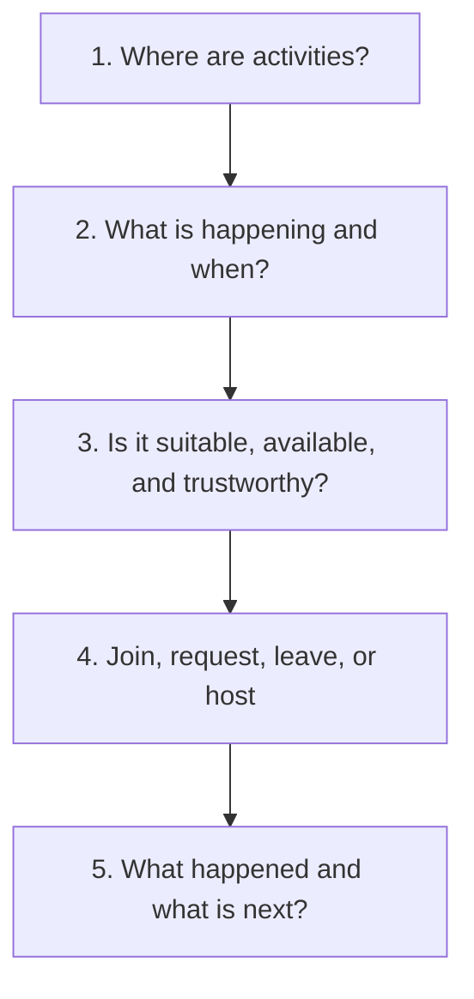

# NearHere Design System Direction

## Current target — Night Arcade

The user's chosen direction is [Night Arcade: palette, hierarchy, avatars and
research](design-concepts/design-review.md). The currently implemented semantic
tokens live in `apps/mobile/constants/design-tokens.ts`; do not treat the older
values below as active. Migration remains incomplete. Follow [the implementation
tickets](handoffs/night-arcade-execution.md) and preserve safety/privacy behavior.

## Map-first revision — 23 September 2026

Nearby uses charcoal/lime Night Arcade colors, a native MapLibre renderer, a locally authored 13-layer Night Arcade style, locally bundled human avatar sprites and clustered markers. The vector geography, fonts and map attribution still come from OpenFreeMap; only the cartographic style document is NearHere's. Map controls remain deliberately sparse; category filters live in Browse, an activity card appears only after selection, and Nearby hides its tab bar. Plans, Host creation, Activity Detail, location search, and private meeting-point picking now use the same semantic palette. The two picker basemaps still use the native map provider. See [the design research and implementation guide](map-first-design.md).

Status: **semantic tokens + Button/Field shared controls + broad screen migration**; not a finished component library or visually accepted redesign. The first native MapLibre build/map smoke passed. Profile editor save/reload and Simulator visual acceptance of the latest themed screens remain tracked in the [status checkpoint](handoffs/night-arcade-status.md).

### Active semantic tokens (23 Sep 2026)

| Role | Value | Contrast behavior |
| --- | --- | --- |
| Canvas | `#111516` | Main dark background |
| Surface | `#1C2223` | Sheets/cards |
| Raised | `#272F30` | Secondary controls |
| Primary text | `#F4F5EF` | Warm-white foreground |
| Muted text | `#AEBAB6` | Supporting information |
| Subtle text | `#82908B` | Non-critical metadata; verify before body use |
| Accent | `#D4F76A` | Lime action/focus; pair with dark `#182013` text |
| Danger | `#FF9E96` | Error/destructive status, with text/icon too |

## 1. Character

Warm, kinetic, local, and legible. NearHere should feel like a living neighborhood board—not a surveillance dashboard, dating grid, or conventional social feed.

## 2. Information hierarchy



The map is the persistent primary surface. Activity information appears above it in a card/bottom sheet. Nearby, Plans, and Me are the bottom tabs; Host is a prominent contextual action rather than a fourth permanent destination.

## 3. Historical light/coral exploration tokens

The following table records an earlier design exploration only. These values
are not active source tokens; use the active Night Arcade table above.

Tokens are named decisions reused across components. React Native will express them as TypeScript objects rather than CSS variables, but the conceptual starting values are:

| Token | Value | Use |
| --- | --- | --- |
| `ink` | `#16202A` | Primary text/icon |
| `muted` | `#66717D` | Secondary text with contrast verification |
| `paper` | `#F7F4EE` | Warm application background |
| `surface` | `#FFFFFF` | Cards/controls |
| `accent` | `#FF6B4A` | Primary action/highlight |
| `accentStrong` | `#DB4C2F` | Pressed/emphasis state |
| `mint` | `#BFE9D4` | Supporting category/status |
| `sky` | `#CFE8F6` | Supporting category/status |
| `radiusCard` | `22` | Major floating surface |
| `radiusPill` | `999` | Filters/status pills |

Color is never the only status channel. Text/icon/shape must distinguish pending, accepted, waitlisted, cancelled, full, and error states.

## 4. Component state contract

Every interactive component should define:

```text
default -> pressed/focused -> loading -> success
                  |             |
                  +-----------> error -> retry
disabled is a reasoned state, not hidden failure
```

Buttons prevent accidental duplicate submission while loading. Error copy explains whether retry is safe. A successful animation never occurs before server confirmation for authoritative writes.

## 5. Motion

- Use soft marker scale/fade and bottom-sheet transitions to preserve spatial context.
- Use brief confirmation motion after a successful join.
- Participant activity can use restrained pulses only if it communicates a real state.
- Respect reduced-motion settings.
- Never use motion to mask loading or change capacity truth.
- Keep continuous decorative animation minimal for battery and attention.

## 6. Accessibility baseline

- Minimum practical touch targets around 44×44 points on iOS and equivalent Android guidance.
- Semantic accessibility labels for icon-only controls and map actions.
- Dynamic text/layout testing; do not assume a single font size.
- Contrast verification against both map and floating surfaces.
- Logical focus order in sheets, modals, auth, and creation steps.
- Announce asynchronous success/error state changes.
- Read the system Reduce Motion preference through `apps/mobile/hooks/use-reduced-motion.ts`; remove decorative motion while preserving the same state and action semantics.
- Provide non-map ways to understand selected activity details. The native Nearby screen now offers a list view using the same privacy-safe result projection, improving scanability and accessibility without adding a second data source.

## 7. Avatar direction

Avatars should be expressive and identifiable at marker size without becoming profile-first social currency. The builder is deferred; initial placeholders must still have consistent silhouette, contrast, fallback initials/shape, and accessibility labels.

Before implementing the builder, decide:

- Configuration JSON versus generated image assets
- Deterministic rendering across iOS/Android versions
- Moderation and cultural representation
- Marker-size readability and performance
- Editing/version migration
- Whether onboarding requires it or allows later personalization

## 8. Component inventory

Map shell, privacy-safe activity marker, filter pill, activity card/bottom sheet, participant cluster, walking-distance row, host trust row, Join/Request/Waitlist/Leave controls, Host floating action, creation stepper, place search, permission fallback, OTP input, profile form, chat composer, toast/banner, bottom tabs, safety menu, loading skeleton, empty state, and retry surface.
