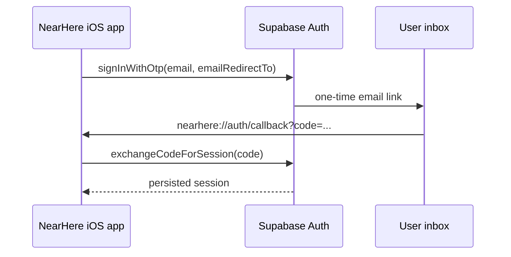

# Email sign-in: supported magic link and OTP gate

## What this adds

NearHere offers email in addition to phone OTP. In the current development
project, a person enters an email address, Supabase sends a magic link, and the
link returns to the native app at `nearhere://auth/callback`. The product plan
prefers an email code; that requires changing the hosted email template to emit
`{{ .Token }}`, which this free project's default mailer does not permit.

## Why the callback needs two parts

The app-side code in `apps/mobile/app/auth/callback.tsx` is only half of a
deep-link login. iOS must know that the `nearhere` scheme belongs to this app
(`apps/mobile/app.json`), and Supabase must be allowed to redirect to that same
address. The development project's Auth URL allow-list now contains exactly
`nearhere://auth/callback`; its older site URL remains `http://localhost:3000`.

`parseEmailAuthLink` only accepts that exact scheme, host and path. It ignores
web links and unrelated NearHere links before an authorization-code exchange is
attempted. This limits the native app from treating arbitrary URLs as login
callbacks.

## Files to trace

1. `apps/mobile/app/auth/phone.tsx` links to the email alternative.
2. `apps/mobile/app/auth/email.tsx` validates the address and asks Auth to send
   a link. It deliberately does not show or store a link token.
3. `apps/mobile/providers/auth-provider.tsx` sends the request and exchanges a
   callback code for a session.
4. `apps/mobile/app/auth/callback.tsx` completes that exchange and returns to
   onboarding.
5. `apps/mobile/lib/auth-link.ts` is the pure, testable URL boundary.

The Supabase client uses the PKCE flow (`flowType: 'pkce'`). PKCE causes the
verified email link to carry a short-lived authorization code which the app can
exchange using its locally persisted verifier. Without that setting, the SDK's
default implicit flow would not match this code-exchange callback design.

## Verification boundary — 4 October 2026

- Implemented and locally verified: callback parser, native URL route, email
  screen, PKCE code exchange path, TypeScript, Expo lint and unit suite. A direct
  Xcode build succeeded; the fresh app installed and ran on the iPhone 17 Pro
  Simulator. The email screen and safe expired/invalid callback state are
  captured at [`email screen`](screenshots/email-signin-simulator-20261004.png)
  and [`callback error`](screenshots/email-callback-error-simulator-20261004.png).
- Gmail read-only inspection confirmed a Supabase Auth confirmation message
  reached each of the two user-authorized test inboxes. Message bodies, tokens,
  links, and mailbox contents were not recorded. This proves receipt of those
  earlier signup/confirmation emails, not a post-allow-list session exchange.
- Hosted configuration verified without reading secrets: phone and email are
  enabled, `nearhere://auth/callback` is allow-listed, Google and Apple are
  disabled, no custom SMTP host exists, and Supabase email sending is capped at
  two per hour. Initial requests for the two owner-authorized test inboxes were
  accepted; immediate fresh requests received HTTP 429. This proves request
  acceptance only, not inbox delivery or successful sign-in.
- Challenge discovered: Supabase rejected changing the free project's default
  magic-link template into an OTP-code template (HTTP 400: template changes are
  unavailable with the default email provider on the free tier). No hosted
  email-template setting was changed. Email-code authentication therefore
  remains blocked until custom SMTP is configured or the project is upgraded.
- Still open: using a fresh allowed-list-compliant email on the same Simulator
  to complete PKCE exchange and prove the persisted session after relaunch. A
  fake callback code was used only to verify friendly error handling; it is not
  an authentication pass.

## Release implication

Email magic-link sign-in does not configure Google, Apple, Instagram, or
production email delivery. Google/Apple provider credentials are absent. A
monitored SMTP sender is required for dependable production email volume and
for the planned email-code template. Do not represent these gates as complete
merely because the email screen exists.

## Primary references

- [Supabase native mobile deep-linking](https://supabase.com/docs/guides/auth/native-mobile-deep-linking)
- [Supabase passwordless email sign-in](https://supabase.com/docs/guides/auth/auth-email-passwordless)
- [Supabase email templates](https://supabase.com/docs/guides/auth/auth-email-templates)
