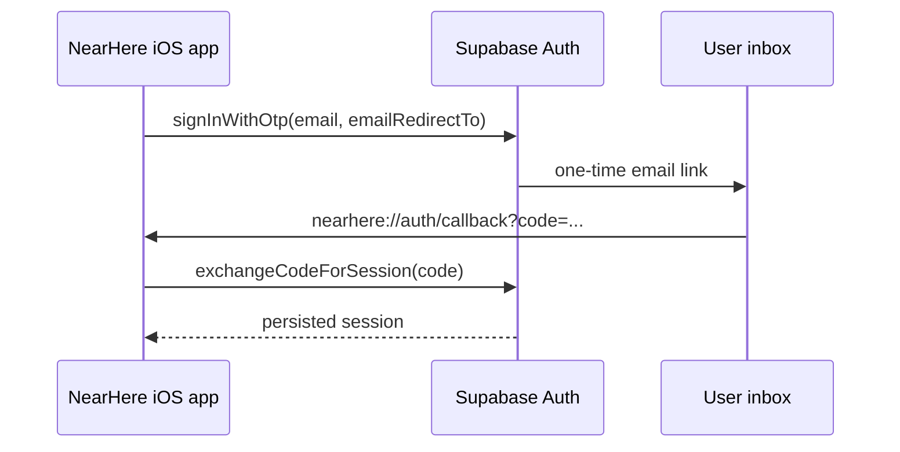

# Email magic-link sign-in

## What this adds

NearHere now offers email in addition to phone OTP. A person enters an email
address, Supabase sends a one-time sign-in link, and the link returns to the
native app at `nearhere://auth/callback`.

## Why the callback needs two parts

The app-side code in `apps/mobile/app/auth/callback.tsx` is only half of a
deep-link login. iOS must know that the `nearhere` scheme belongs to this app
(`apps/mobile/app.json`), and Supabase must be allowed to redirect to that same
address. The development project's Auth URL allow-list now contains exactly
`nearhere://auth/callback`; its older site URL remains `http://localhost:3000`.

`parseEmailAuthLink` only accepts that exact scheme, host and path. It ignores
web links and unrelated NearHere links before an authorization-code exchange is
attempted. This limits the native app from treating arbitrary URLs as login
callbacks.

## Files to trace

1. `apps/mobile/app/auth/phone.tsx` links to the email alternative.
2. `apps/mobile/app/auth/email.tsx` validates the address and asks Auth to send
   a link. It deliberately does not show or store a link token.
3. `apps/mobile/providers/auth-provider.tsx` sends the request and exchanges a
   callback code for a session.
4. `apps/mobile/app/auth/callback.tsx` completes that exchange and returns to
   onboarding.
5. `apps/mobile/lib/auth-link.ts` is the pure, testable URL boundary.

The Supabase client uses the PKCE flow (`flowType: 'pkce'`). PKCE causes the
verified email link to carry a short-lived authorization code which the app can
exchange using its locally persisted verifier. Without that setting, the SDK's
default implicit flow would not match this code-exchange callback design.

## Verification boundary — 4 October 2026

- Implemented and local-verified: callback parser, email screen, session
  exchange path, TypeScript, Expo lint, and 112 unit tests.
- Hosted request verified: Supabase accepted initial magic-link requests for the
  two user-authorized test inboxes without exposing a URL or token in logs.
  Fresh requests immediately after the redirect allow-list change received the
  provider's `429 email rate limit exceeded` response, so a post-change email
  delivery/callback is deliberately not claimed yet.
- Hosted configuration verified: email provider enabled; the native callback was
  allow-listed with a narrow Auth configuration PATCH.
- Still open: an installed fresh native build must open a newly sent link and
  demonstrate a persisted session in the iPhone Simulator. A direct Xcode build
  is currently stalling in this environment; that is not treated as a pass.

## Release implication

Email sign-in does not configure Google, Apple, Instagram, or production email
delivery branding. Those need their own provider-console credentials and tested
redirect URLs. Do not represent them as implemented merely because the email
screen exists.

## Primary references

- [Supabase native mobile deep-linking](https://supabase.com/docs/guides/auth/native-mobile-deep-linking)
- [Supabase passwordless email sign-in](https://supabase.com/docs/guides/auth/auth-email-passwordless)
