# NearHere Engineering Learning Guide

This document explains NearHere from first principles. It is a living companion to the codebase: every meaningful product slice should add a lesson covering the problem, architecture, implementation, tradeoffs, verification, and interview language.

The companion [`practical-engineering-curriculum.md`](practical-engineering-curriculum.md) defines the broader path from CS theory to practical product engineering, including TypeScript, client state, APIs, authentication, databases, concurrency, realtime systems, Redis, testing, security, delivery, and system design.

## Documentation contract

Every meaningful feature added to NearHere must update this guide with:

- The user problem and acceptance criteria.
- Definitions for newly introduced engineering terms.
- The architecture and end-to-end data or state flow.
- Important code boundaries and why they exist.
- Alternatives considered and the selected tradeoff.
- Security, privacy, concurrency, and failure considerations.
- Verification performed and what each check can or cannot prove.
- Challenges encountered, including symptoms, root causes, investigation, rejected fixes, final resolution, and prevention lessons.
- Interview explanations and resume language that accurately match the implementation.

The guide should not rewrite history to make the implementation appear effortless. Debugging evidence and unresolved limitations are part of the engineering record.

## How to use this guide

For each lesson, be able to answer six questions:

1. What user problem did we solve?
2. What technical constraints did we have?
3. What design did we choose and why?
4. How does data move through the implementation?
5. What alternatives did we reject?
6. How did we verify the result?

Do not memorize framework syntax first. Understand the system boundaries and data flow; syntax can always be looked up.

# Lesson 1: From a static web concept to a native mobile vertical slice

## 1. The product requirement

NearHere needs to feel like an application someone opens while moving through the real world. Its primary interaction is a map centered near the user, with nearby activities layered on top.

That creates several requirements:

- It must run as an iOS and Android application.
- It must request device location permission.
- It must remain useful if permission is denied.
- It must render a native map and tappable markers.
- It must support multiple screens without page reloads.
- Prototype data must never be represented as live data.

The original `apps/web` folder is a static HTML/CSS design reference. Static HTML cannot directly become a production native interface because React Native renders platform views rather than browser DOM elements.

## 2. The chosen stack

### React Native

React Native lets us describe interfaces with React components while rendering native platform controls. A `View` becomes a native container, `Text` becomes native text, and `Pressable` becomes an accessible native interaction target.

This differs from a normal React website:

- Web React renders HTML elements such as `div`, `p`, and `button` into a browser DOM.
- React Native renders native iOS and Android views.
- Styling uses JavaScript objects through `StyleSheet`, not a full browser CSS engine.
- Native capabilities such as location require platform permission APIs.

### Expo

Expo is the React Native framework and toolchain used by NearHere. It provides:

- A project structure and development server.
- Version-compatible native packages.
- Expo Go for testing on a physical phone.
- Native build tooling for later App Store and Play Store distribution.
- Modules such as `expo-location`.

Expo does not turn the product into a website. It manages a genuine React Native application while reducing the amount of Xcode and Gradle configuration required during early development.

### TypeScript

TypeScript adds static types to JavaScript. The `Activity` type specifies that every activity must contain fields such as `id`, `title`, `startsIn`, and coordinate offsets.

Benefits include:

- Misspelled or missing fields are caught before runtime.
- Component contracts are explicit.
- Refactoring is safer.
- Editors can offer accurate autocomplete.
- Domain concepts become visible in code.

TypeScript does not validate untrusted server data at runtime. When the backend is added, API responses will also need runtime validation.

### Expo Router

Expo Router maps files to application screens. The current tab routes are:

```text
app/(tabs)/index.tsx  -> Nearby
app/(tabs)/plans.tsx  -> Plans
app/(tabs)/me.tsx     -> Me
```

The `(tabs)` folder is a route group. Its `_layout.tsx` defines shared bottom-tab navigation without adding `(tabs)` to the user-visible route.

### react-native-maps

`react-native-maps` provides the map component and marker primitives. It uses platform map implementations: Apple Maps or Google Maps depending on platform and configuration.

The current prototype uses the provider default. This avoids requesting production Google Maps credentials before they are necessary.

### expo-location

`expo-location` provides the permission request and foreground position lookup. NearHere requests location only while the application is being used. Background tracking is neither enabled nor required.

## 2.1 Expo Go, development builds, and production builds

A React Native application has three relevant layers:

```text
TypeScript/JavaScript source
  -> Metro JavaScript bundle
  -> installed native iOS/Android application binary
```

The installed native binary contains React Native and compiled platform code for capabilities such as maps, location, notifications, and secure storage. Metro is the development server that transforms the application's TypeScript/JavaScript dependency graph into a bundle that the native application can execute.

### Expo Go

Expo Go is a native application compiled and distributed by Expo. It includes a fixed collection of native libraries. When NearHere is opened through Expo Go, Expo Go downloads NearHere's JavaScript bundle from Metro and executes it using the native capabilities already present in the Expo Go binary.

Installing an npm package cannot add new native code to the copy of Expo Go already installed from the App Store or Play Store. A package that depends on native code absent from Expo Go will therefore fail at runtime even if its TypeScript/JavaScript files exist in `node_modules`.

### Native development build

A native development build is a debug binary compiled specifically for NearHere. It can contain NearHere's selected native libraries, application name, icon, bundle/application identifier, permissions, entitlements, and platform configuration while retaining developer tooling and the ability to load JavaScript from Metro.

It is useful to think of it as a custom development shell:

```text
NearHere development binary installed on phone
  + NearHere native dependencies
  + Expo developer tooling
  + JavaScript bundle loaded from Metro
```

The development build can remain installed while TypeScript and UI changes use Fast Refresh. It must be rebuilt when the native portion of the application changes.

### Production build

A production build is the signed, optimized binary distributed through an app store or another release channel. It contains the production JavaScript bundle, does not expose the normal development menu, and must not depend on a developer's local Metro server.

| Build | Owner of native binary | Native libraries | JavaScript source | Primary purpose |
| --- | --- | --- | --- | --- |
| Expo Go | Expo | Fixed by Expo | Loaded from Metro | Fast experimentation |
| Development build | NearHere | Selected by NearHere | Usually loaded from Metro | Full application development |
| Production build | NearHere | Selected by NearHere | Bundled into the release | End users |

### Development build versus development server

These terms are not interchangeable:

- The **development build** is the application installed on the device.
- The **development server** is the Metro process normally started with `npm start`.
- The **JavaScript bundle** is the transformed application code Metro sends to the development build.

A development build can stay installed across many coding sessions. Metro is started when development resumes and can deliver updated JavaScript without recompiling the native binary.

### Native rebuild boundary

A practical rule is:

| Change | Native rebuild normally required? |
| --- | --- |
| React component or TypeScript logic | No |
| Style, text, or marker presentation | No |
| Install a JavaScript-only package | No |
| Install a package containing new native code | Yes |
| Change native permission or entitlement configuration | Yes |
| Change certain icons, splash configuration, or application capabilities | Yes |

Fast Refresh changes the JavaScript running inside an existing native binary. It cannot compile an iOS framework, Android library, CocoaPod, Gradle dependency, permission, or entitlement into that already-installed binary.

### Why custom MapLibre maps require a development build

The current `react-native-maps` implementation works in Expo Go because its native support is included in the Expo Go binary. On iOS, the default provider uses Apple MapKit.

MapLibre React Native has multiple layers:

```text
NearHere TypeScript components
  -> MapLibre React Native binding
  -> compiled MapLibre native engine
  -> iOS/Android graphics and map APIs
```

Expo Go does not contain the MapLibre native engine. Installing the npm dependency supplies the TypeScript/JavaScript binding but cannot modify Expo Go. A NearHere development build must compile and link the native MapLibre implementation using the iOS and Android build toolchains.

MapLibre can provide deeper control over road and land colors, labels, buildings, vector-tile layers, clusters, heatmaps, and zoom-dependent presentation. Adopting it also introduces responsibilities involving tile sources, attribution, licensing, performance, offline behavior, and separate iOS/Android verification.

### Native toolchains still exist under Expo

Expo manages and automates native work; it does not remove the native platforms:

- iOS compilation uses Xcode, CocoaPods, bundle identifiers, provisioning profiles, entitlements, and code signing.
- Android compilation uses Gradle, application IDs, manifests, keystores, and signing configuration.
- Cloud services such as EAS Build can run these toolchains remotely, while local builds run them on a configured development machine.

This distinction matters when diagnosing failures: a TypeScript error, Metro bundling error, native compilation error, signing error, and runtime native-module error occur at different stages and require different debugging approaches.

### Mobile configuration is observable

Values packaged in a mobile application can be extracted by a motivated user. API keys shipped in the binary must not be treated like server secrets. Client-side map keys should be restricted by bundle/application identity and allowed APIs. Privileged credentials must remain on a trusted server.

## 2.2 Developer command reference

This is a living record of important commands used while building NearHere. Future lessons should add commands here when they introduce a new tool or workflow.

### How to read a terminal command

Consider:

```bash
npx expo install @react-native-async-storage/async-storage
```

The shell separates this into tokens:

| Token | Meaning |
| --- | --- |
| `npx` | Locate and execute a package-provided command without requiring a permanent global installation. |
| `expo` | The executable being run. In this project it resolves to the Expo CLI associated with the installed Expo package. |
| `install` | The Expo CLI subcommand. It installs packages while selecting versions compatible with the current Expo SDK. |
| `@react-native-async-storage/async-storage` | The npm package name. The `@react-native-async-storage` portion is an npm scope or namespace. |

The command is run from `apps/mobile` because package installation changes that application's `package.json` and `package-lock.json`.

### `npm` versus `npx`

`npm` is primarily the package manager. It installs dependencies and runs scripts declared in `package.json`.

```bash
npm install
npm run lint
npm start
```

`npx` executes a binary supplied by an npm package. It first looks for a project-local executable and may download a temporary package when the executable is unavailable locally.

```bash
npx tsc --noEmit
npx expo install --check
```

Using project-local tools improves reproducibility because developers and CI use the versions recorded by the project rather than unrelated global versions.

### Create the native application scaffold

```bash
npx create-expo-app@latest apps/mobile --template default@sdk-54 --yes
```

Breakdown:

- `create-expo-app@latest` runs the latest published project generator.
- `apps/mobile` is the destination directory.
- `--template default@sdk-54` selects the default Expo SDK 54 template, which was compatible with the physical-device Expo Go version used for this project.
- `--yes` accepts non-destructive generator defaults where supported.

Effects:

- Created the Expo Router and TypeScript project structure.
- Created `package.json` and `package-lock.json`.
- Downloaded and installed the initial dependency graph.
- Created application configuration and starter assets.

This is normally run once. Rerunning it over an existing application directory can conflict with existing files and is not a normal update mechanism.

### Install native map and location dependencies

```bash
npx expo install expo-location react-native-maps
```

Why use `expo install` instead of plain `npm install`?

Expo SDK releases are tested against specific native-library versions. `expo install` consults Expo's compatibility map and selects versions appropriate for the installed SDK. Plain `npm install` normally selects versions from semantic-version ranges without understanding Expo SDK compatibility.

Effects:

- Added `expo-location` for foreground permission and coordinate access.
- Added `react-native-maps` for the native map and markers.
- Updated both the dependency manifest and lockfile.

The packages are already included in Expo Go's native binary. Installing them adds the JavaScript/TypeScript side and records the dependency for NearHere's future native builds.

### Install persistent key-value storage

```bash
npx expo install @react-native-async-storage/async-storage
```

This added Expo-compatible AsyncStorage to the mobile application and updated `package.json` and `package-lock.json`.

#### What is AsyncStorage?

AsyncStorage is persistent, asynchronous, unencrypted key-value storage on the device.

- **Persistent:** data can survive component unmounts, navigation, and application restarts.
- **Asynchronous:** reads and writes complete later and return Promises instead of blocking the JavaScript thread.
- **Key-value:** a string key identifies a stored string value, similar to a persistent dictionary.
- **Unencrypted:** somebody with sufficient access to the device or its backups may be able to inspect the stored content.

Example mental model:

```text
"nearhere.manual-location.v1"
  -> "{\"latitude\":12.93,\"longitude\":77.62,\"source\":\"manual\"}"
```

AsyncStorage stores strings. Structured objects are serialized with `JSON.stringify` before writing and parsed with `JSON.parse` after reading.

The parsed result has the TypeScript type `unknown` in a trustworthy design. TypeScript types disappear at runtime, and persisted content can be old, corrupted, or written by a previous application version. NearHere therefore validates latitude, longitude, label, and source before treating stored content as a `ManualLocation`.

#### Appropriate AsyncStorage data

- A manually selected discovery area.
- Dismissed onboarding hints.
- Non-sensitive UI preferences.
- Cached data that can safely be recreated.

#### Inappropriate AsyncStorage data

- Passwords.
- SMS OTP codes.
- Privileged server secrets.
- Long-lived authentication credentials when secure storage is available.
- The authoritative copy of memberships, activity capacity, or chat history.

Authentication tokens should use platform-backed secure storage such as iOS Keychain or Android Keystore through an appropriate library. Authoritative shared product data belongs on the server because AsyncStorage is local to one application installation and does not synchronize between users or devices.

AsyncStorage is not Redis. Both expose key-value operations, but AsyncStorage is local device persistence, while Redis is normally a network service shared by backend processes.

### Start the Metro development server

```bash
cd apps/mobile
npm start
```

`cd` changes the shell's working directory. `npm start` runs the `start` script from `apps/mobile/package.json`, which starts Expo CLI and Metro.

Metro:

- Resolves imports from the application's dependency graph.
- Transforms TypeScript/JavaScript into executable JavaScript.
- Serves the development bundle over the local network.
- Watches source files and enables Fast Refresh.

The command remains running while the application is being developed. Stop it with `Ctrl+C`.

Offline verification used:

```bash
npm start -- --offline
```

The first `--` tells npm to forward the remaining arguments to the underlying `expo start` command. `--offline` prevents Expo CLI from relying on network lookups where local metadata is sufficient.

### Run static lint checks

```bash
npm run lint
```

This executes the `lint` script declared in `package.json`. In NearHere it runs Expo's ESLint configuration.

Linting detects configured code-quality and correctness patterns. It does not execute the application and cannot prove that a user flow works.

### Run TypeScript without producing build files

```bash
npx tsc --noEmit
```

- `tsc` is the TypeScript compiler.
- `--noEmit` performs type analysis without writing compiled JavaScript files.

This catches incompatible props, invalid route types, missing fields, unsafe assignments, and other static contract violations. It cannot validate arbitrary runtime JSON unless the application performs runtime validation.

### Check Expo dependency compatibility

```bash
npx expo install --check
```

This compares installed dependency versions with versions expected by the current Expo SDK. It helps detect packages that npm can install successfully but that may be incompatible with the native Expo runtime.

### Produce an iOS bundle without publishing it

```bash
npx expo export --platform ios --output-dir /tmp/nearhere-expo-export
```

Breakdown:

- `expo export` creates production-style application bundles and assets.
- `--platform ios` limits the export to iOS.
- `--output-dir` chooses a temporary output directory outside the source tree.

This verifies that Metro can resolve and bundle the iOS dependency graph. It does not compile or sign an iOS native binary, install the app, exercise runtime permissions, or prove App Store readiness.

### Check patch whitespace

```bash
git diff --check
```

This inspects current Git changes for whitespace errors and unresolved conflict markers. It does not run tests or review the behavior of the changes.

### Command safety and reproducibility checklist

Before running an unfamiliar command, ask:

1. Which executable will run?
2. What is the current working directory?
3. Which files or external systems can it change?
4. Does it require network access or credentials?
5. Is it safe to rerun?
6. Is its version recorded in the project?
7. How will success be verified?
8. How can the change be reversed without deleting unrelated work?

## 3. Repository structure

```text
NearHere/
├── apps/
│   ├── mobile/        # Primary Expo/React Native application
│   └── web/           # Legacy visual concept
├── docs/              # Product and engineering decisions
├── packages/
│   └── contracts/     # Shared domain contracts
└── services/
    └── api/           # Future backend boundary
```

This is a monorepo: one repository contains multiple related applications and packages. The benefit is that the mobile client, API, and shared contracts can evolve together.

It is not yet using a monorepo build orchestrator. Adding one now would increase complexity without solving a current problem.

## 4. What is a vertical slice?

A horizontal approach would build all database tables first, then all API endpoints, then all screens. The user would see nothing useful until the end.

A vertical slice implements a thin path through the product:

```text
Open app
  -> request foreground location
  -> display native map
  -> render prototype activities
  -> select a marker
  -> inspect activity information
  -> reach the authentication boundary when joining
```

The backend is not present yet, but the interaction and architectural boundaries are visible and testable.

## 5. How React state drives the screen

The Nearby screen stores four important pieces of state:

- `region`: the geographic center and zoom level.
- `locationState`: whether permission is being requested, granted, or denied.
- `selectedId`: which activity is selected.
- `filter`: which activity category is visible.

React state is declarative. We do not manually tell every label and marker to redraw. We update state, React computes the next UI tree, and React Native updates the necessary platform views.

For example:

```text
User taps Coffee
  -> setFilter('coffee')
  -> React calculates visibleActivities
  -> non-coffee markers disappear
  -> the first coffee activity becomes selected
  -> the bottom card renders its details
```

This is a single-source-of-truth principle: the filter state determines both markers and card content. Maintaining separate unrelated copies would allow the UI to contradict itself.

## 6. Location permission flow

The location flow is:

```text
Nearby screen mounts
  -> requestForegroundPermissionsAsync()
     -> granted: getCurrentPositionAsync()
        -> update region
        -> animate map to the user
        -> show the platform user-location marker
     -> denied or error:
        -> retain the safe default region
        -> show the manual-location fallback state
```

Important principles:

- **Least privilege:** request foreground location, not background location.
- **Graceful degradation:** denial does not make the app unusable.
- **Purposeful permission copy:** explain why location is needed and state that live location is not shared.
- **Failure handling:** permission and location calls can fail, so they are wrapped in `try/catch`.

The Change action now opens a complete manual-selection slice: the user may submit a neighborhood/landmark query, select a runtime-validated result, adjust the fixed pin, and persist the final coordinate. Search failure does not disable manual map movement.

## 7. Map coordinates and regions

A coordinate is a latitude/longitude pair. A map `Region` adds `latitudeDelta` and `longitudeDelta`, which approximately control how much geographic area is visible.

Prototype activities are defined as offsets from the selected map center. This lets the interface remain playable around the user's location without claiming the activities are real.

This fixture approach will be replaced by a backend query resembling:

```text
GET /activities/nearby?lat=...&lng=...&radius=...
```

The server—not the mobile client—will later decide which public approximate coordinates are safe to return.

## 8. Navigation architecture

The application currently has three primary destinations:

- **Nearby:** discovery and map interaction.
- **Plans:** joined and hosted activities.
- **Me:** authentication, identity, and avatar settings.

Hosting is a prominent action on the map instead of a permanent fourth tab. This keeps navigation focused on destinations while treating creation as an action.

The root layout owns the navigation stack and status bar. The tab layout owns the bottom navigation. This is separation of concerns: each layout controls one navigation responsibility.

## 9. Why authentication stops honestly

Join and Host currently explain that phone authentication is required. They do not silently create a fake account or pretend an SMS was sent.

Real phone OTP requires:

- An authentication backend such as Supabase Auth.
- An SMS provider.
- Secure project configuration.
- Rate limiting and abuse protection.
- OTP verification and session persistence.
- Regulatory consideration for the launch country.

The future flow will be:

```text
Enter phone number
  -> backend requests SMS OTP
  -> enter received code
  -> backend verifies code
  -> secure session stored on device
  -> original Join or Host action resumes
```

## 10. Where avatars fit

Avatars remain part of the product identity. The current interface proves their value at marker and participant-stack sizes using simple representations.

The full builder is deferred because it needs additional decisions:

- Which visual parts are customizable?
- Are avatars stored as configuration or generated images?
- How do they remain recognizable at small sizes?
- How do we prevent abusive visual combinations?
- Is avatar creation required during onboarding or editable later?

Deferring the builder does not mean abandoning the differentiator. It means proving its display contexts before building the editor.

## 11. Infrastructure deliberately not added

### Redis

Redis is an in-memory data store. NearHere may later use it for rate limits, short-lived presence, caching, and realtime fan-out. PostgreSQL remains the durable source of truth.

Redis is not needed for local fixtures and would introduce another service to configure, secure, monitor, and debug.

### WebSockets

Normal HTTP follows request/response: the client asks and the server replies. A WebSocket maintains a connection so the server can push events such as new chat messages or changed participant counts immediately.

There is currently no server and no concurrent user state, so a WebSocket would provide no benefit yet.

### Continuous presence

Continuous presence would repeatedly publish a person's changing location. NearHere explicitly avoids this. Future presence should mean temporary activity-scoped status such as “arrived” or “active in chat,” not a live movement trail.

## 12. Engineering principles demonstrated

- **YAGNI:** do not add infrastructure before a real requirement exists.
- **Separation of concerns:** navigation, location, map rendering, and domain data have distinct responsibilities.
- **Least privilege:** foreground location only.
- **Graceful degradation:** denied permission has a fallback path.
- **Single source of truth:** state drives markers and activity details.
- **Honest system behavior:** fixtures are labeled and authentication is not simulated as real.
- **Progressive delivery:** build a working vertical slice before the entire backend.
- **Compatibility over novelty:** dependencies are installed through Expo's version-aware installer.
- **Verification:** linting, type checking, dependency checks, diff checks, and native bundle generation test different failure classes.

## 13. Verification layers

Each check answers a different question:

| Check | Question answered |
| --- | --- |
| `git diff --check` | Did edits introduce whitespace or patch-format problems? |
| `npm run lint` | Does the code violate configured static-quality rules? |
| `npx tsc --noEmit` | Are TypeScript contracts internally consistent? |
| `npx expo install --check` | Are package versions compatible with the installed Expo SDK? |
| `npx expo export --platform ios` | Can Metro resolve and bundle the native application graph? |

Passing a type check does not prove the user experience works. Later slices will add component tests, integration tests, and device-level interaction tests.

## 14. How to explain this in an interview

Use a problem-decision-tradeoff-result structure:

> I converted an early static product concept into a cross-platform React Native application using Expo and TypeScript. I implemented a location-aware native map, foreground permission handling with a denied-permission fallback, marker-driven activity selection, and file-based tab navigation. I deliberately used local fixtures and deferred Redis, WebSockets, and real phone authentication until the corresponding backend requirements existed. I validated the slice with linting, TypeScript checks, Expo dependency validation, and an iOS production bundle.

Be ready for follow-up questions:

- Why React Native instead of separate Swift and Kotlin apps?
- What does Expo provide beyond React Native?
- Why is background location unnecessary?
- How would you prevent exact coordinates from leaking?
- What happens when two people claim the last activity spot?
- When would Redis or WebSockets become justified?
- How would the app resume a Join action after OTP verification?

## 15. Honest resume language at the current stage

Use language that matches what exists today:

- Built a cross-platform location-aware mobile prototype with Expo, React Native, and TypeScript, featuring native map discovery, activity filtering, and marker-linked detail state.
- Designed a privacy-conscious foreground location flow with explicit permission handling and a manual-location fallback boundary.
- Established file-based mobile navigation and validated the application through linting, static type checks, Expo dependency checks, and native iOS bundle generation.

Do not yet claim production authentication, real-time chat, a deployed backend, active users, scalability results, or App Store distribution.

# Lesson 2: A complete manual-location vertical slice

## 1. What “vertical slice” means

A vertical slice implements one user-visible capability through every layer required to make it complete. It is vertical because it cuts across presentation, state, domain types, storage, platform APIs, navigation, and verification.

For manual location, the slice is:

```text
Permission denied
  -> user opens the location picker
  -> user moves the map under a fixed pin
  -> user confirms the coordinate
  -> app validates and serializes the selection
  -> device storage persists it
  -> navigation returns to Nearby
  -> Nearby reloads the selection on focus
  -> the map and prototype activities recenter
  -> a future app launch restores the selection
```

A horizontal slice would implement only “all storage functions” or “all location screens” without completing a usable journey. Horizontal layers are still useful architectural boundaries, but vertical slices are usually better delivery units.

## 2. Refactoring the original screen

The first prototype placed activity types, fixture data, location permission code, map behavior, and UI in one screen. That was fast for proving the interaction, but it mixed responsibilities.

The new boundaries are:

```text
types/activity.ts                  Activity domain vocabulary
types/location.ts                  Location domain vocabulary
data/prototype-activities.ts       Explicitly non-live activity data
lib/location-storage.ts            Persistence and runtime validation
hooks/use-nearby-location.ts       Permission and location state machine
app/location-picker.tsx            Manual selection interaction
app/(tabs)/index.tsx               Nearby screen composition
```

This is separation of concerns. It does not mean creating a file for every function. A boundary is valuable when it isolates a reason to change.

Examples:

- Backend activity data can replace fixtures without changing location storage.
- Secure authentication storage can be added without changing map rendering.
- MapLibre can replace `react-native-maps` without changing the `Activity` domain type.

## 3. Domain modeling with TypeScript

`ActivityKind` is a union:

```ts
type ActivityKind = 'walk' | 'coffee' | 'sport';
```

This represents a closed set. TypeScript rejects arbitrary values such as `'concert'` until the domain explicitly supports them.

`ManualLocation` combines a coordinate with metadata:

```ts
type ManualLocation = Coordinate & {
  label: string;
  source: 'manual';
};
```

The literal `source: 'manual'` is a discriminator. As more location sources appear, code can narrow behavior based on the source while TypeScript checks that every case is handled.

## 4. The location state machine

The hook exposes explicit states:

```text
loading -> requesting -> ready
                     -> denied
                     -> error
```

The source is modeled separately:

```text
default | device | manual
```

Status answers “what is the operation doing?” Source answers “where did this coordinate come from?” Combining these into one ambiguous boolean such as `hasLocation` would lose information needed by the UI.

The initialization priority is:

1. Restore an explicit saved manual selection.
2. Otherwise request foreground device location.
3. Otherwise retain the safe default region and display the fallback.

An explicit user selection wins on later launches. Tapping the device-location button successfully clears that manual override.

## 5. Persistent device storage

AsyncStorage is an asynchronous key-value store. “Persistent” means the value survives component unmounts and normal application restarts. “Asynchronous” means storage operations return promises rather than blocking the JavaScript thread.

The stored value is JSON because key-value storage stores strings:

```text
ManualLocation object
  -> JSON.stringify
  -> device key-value storage
  -> JSON.parse
  -> runtime validation
  -> ManualLocation object
```

AsyncStorage is unencrypted. A chosen discovery coordinate is appropriate for it in this prototype, but access tokens, refresh tokens, or other credentials should use secure platform-backed storage.

## 6. Why runtime validation is still required

TypeScript disappears when the program runs. It cannot prove that a string read from device storage contains a valid coordinate.

The storage layer therefore checks:

- The parsed value is an object.
- Latitude and longitude are finite numbers.
- Latitude is between -90 and 90.
- Longitude is between -180 and 180.
- The expected label and source exist.

Invalid persisted data is removed instead of crashing startup. This demonstrates the difference between compile-time type safety and runtime input validation.

## 7. Navigation and focus lifecycle

The location picker is a modal route. It is presented above the tabs and dismissed after confirmation.

The Nearby screen remains mounted behind the modal. When it becomes focused again, `useFocusEffect` reloads the saved selection. A normal mount-only effect would not run because returning from a modal does not necessarily recreate the screen.

This is lifecycle-aware state synchronization: reload data when the navigation lifecycle says it may have changed.

## 8. Custom map options

The map renderer is replaceable infrastructure. Current choices are:

### Native Apple/Google provider

The current `react-native-maps` setup works in the installed NearHere development build and is also compatible with Expo Go. It is the lowest-friction choice for learning and functional development. Apple Maps styling is limited; Google-based styling requires selecting the Google provider and configuring its SDK, billing, API keys, and map style.

### MapLibre

MapLibre supports custom vector-map styles, sources, layers, icons, and tiles. It is the better fit for a distinctive NearHere visual language, but its native library is not included in Expo Go. It requires our own development build.

### Illustrated map-like canvas

A custom canvas can provide maximum artistic control, but standard map behavior—geographic projection, roads, labels, gestures, accessibility, and routing—must then be sourced or rebuilt. It is suitable for a deliberately abstract neighborhood experience, not as the default mapping foundation.

The current decision is to finish product behavior on `react-native-maps`, then migrate deliberately to MapLibre in a development-build slice.

## 9. Failure cases considered

- Permission is denied.
- Foreground location lookup throws an error.
- Stored JSON is corrupt.
- Stored coordinates are outside valid ranges.
- Writing to device storage fails.
- Route metadata is stale after adding a screen.
- The screen returns from a modal without remounting.
- A previous manual location conflicts with a newly granted device location.

## 10. Verification

The slice passed:

- `git diff --check`
- Expo ESLint
- TypeScript with no emitted output
- Expo SDK dependency compatibility validation
- iOS production bundle generation through Metro

The typed-route check initially failed because Expo's generated route metadata did not include the new screen. Starting Expo regenerated that metadata; no unsafe type cast was added to hide the problem.

## 10.1 Challenges encountered in this slice

### Challenge: the new route existed, but TypeScript rejected it

**Symptom:** `router.push('/location-picker')` failed type checking even though `app/location-picker.tsx` had been created.

**Initial possibilities:** the route path could have been misspelled, the file could have been in the wrong directory, or Expo Router's generated type information could have been stale.

**Investigation:** the route file and root stack registration were verified, and the TypeScript error's allowed-route union was inspected. That union listed only routes that existed before the new screen was added.

**Root cause:** Expo's typed routes are generated metadata. The development server had not run since the new route was created, so its generated declaration file was stale.

**Rejected workaround:** cast the path to a broad route type. That would silence the compiler without correcting its knowledge of the route graph.

**Resolution:** start Expo once so it regenerates typed-route metadata, then rerun TypeScript.

**Verification:** `npx tsc --noEmit` passed with the normal string route and no unsafe cast.

**Lesson:** generated code is a build artifact with a lifecycle. When source files and generated metadata disagree, regenerate from the authoritative source before weakening type safety.

### Challenge: persisted JSON cannot be trusted by TypeScript

**Symptom:** AsyncStorage returns a string, while application code needs a valid `ManualLocation`.

**Root cause:** TypeScript checks source code at compile time; values loaded from storage enter the application at runtime and may be old, corrupt, manually modified, or written by a previous schema.

**Rejected workaround:** use `JSON.parse(raw) as ManualLocation`. A type assertion tells TypeScript to trust the programmer but performs no validation.

**Resolution:** parse into `unknown`, validate object shape, numeric finiteness, coordinate ranges, label, and source, then narrow it to `ManualLocation`. Remove invalid persisted state.

**Verification:** TypeScript confirms that consumers only receive `ManualLocation | null`, while the runtime guard protects the storage boundary.

**Lesson:** static types do not validate external or persisted inputs. Every untrusted boundary needs runtime validation.

### Challenge: returning from a modal does not necessarily remount Nearby

**Symptom:** a mount-only effect would not be sufficient to reload a location saved by the modal because the Nearby screen remains mounted behind it.

**Root cause:** component lifecycle and navigation focus lifecycle are different. A mounted screen can lose and regain focus without being destroyed.

**Resolution:** use `useFocusEffect` to reload manual location whenever Nearby regains focus.

**Verification:** the saved selection is read on return, updates the hook's state, and triggers the map-centering effect.

**Lesson:** synchronize data at the lifecycle boundary where it can change. Do not assume navigation always recreates screens.

## 11. Interview explanation

> I implemented a complete manual-location fallback as a vertical slice across React Native UI, Expo Router navigation, typed domain models, a location state-machine hook, and persistent device storage. I added runtime validation because TypeScript cannot validate persisted JSON, restored the selection through navigation focus lifecycle handling, and preserved foreground-only permission behavior. I also separated map infrastructure from domain types so the renderer can later migrate to MapLibre without rewriting activity models.

## 12. Honest resume addition

- Implemented a persistent manual map-location flow with runtime-validated AsyncStorage data, permission fallback states, modal map-pin selection, and navigation-focus synchronization.

# Lesson 3: Phone OTP authentication architecture

## 1. Authentication versus authorization

Authentication establishes identity: “Who is the user?” Authorization evaluates permission: “May this user perform this action?”

NearHere allows unauthenticated discovery but protects Join and Host. Therefore browsing is public product state, while membership and activity creation require an authenticated session and later require server-side authorization.

The mobile client must never decide that an arbitrary OTP is valid. It collects input and calls the authentication server. Supabase Auth generates the challenge, uses the configured SMS provider for delivery, verifies the submitted code, and issues a session.

## 2. Current end-to-end flow

```text
User taps Join, Host, or Continue with phone
  -> NearHere records a ProtectedIntent
  -> phone screen collects and normalizes an E.164 number
  -> Supabase signInWithOtp requests SMS delivery
  -> verification screen collects a six-digit code
  -> Supabase verifyOtp validates the code
  -> Supabase returns a session
  -> AuthProvider stores signed-in state
  -> NearHere restores the protected intent
  -> actual Join/Host backend remains a separate authorization boundary
```

When Supabase configuration is missing, the UI explains the dependency and does not claim that an SMS was sent.

## 3. Authentication state machine

The client models these states:

```text
restoring
  -> signedOut
  -> signedIn

signedOut
  -> sendingCode
     -> awaitingCode
     -> signedOut on failure

awaitingCode
  -> verifyingCode
     -> signedIn
     -> awaitingCode on failure
```

Explicit states prevent ambiguous combinations such as “loading is true, but is the app restoring a session, sending SMS, or verifying a code?”

## 4. Protected intents

`ProtectedIntent` is a discriminated union:

```ts
type ProtectedIntent =
  | { kind: 'joinActivity'; activityId: string }
  | { kind: 'hostActivity' }
  | { kind: 'openAccount' };
```

It records why authentication started. After verification, NearHere can return the user to the correct product boundary rather than losing context.

The real join operation is not implemented yet. A signed-in client will eventually submit the intent to an activity API that independently checks session validity, capacity, blocks, activity status, and authorization.

## 5. Phone normalization and E.164

Users enter phone numbers with spaces, parentheses, or dashes. Authentication providers need a consistent international representation.

E.164 uses a leading `+`, country code, and subscriber digits. The client removes presentation punctuation and validates the normalized structure before making a network request.

Client validation improves feedback and avoids obviously invalid requests. It is not a security boundary; the authentication server must validate again.

## 6. Supabase client configuration

The mobile application reads:

```text
EXPO_PUBLIC_SUPABASE_URL
EXPO_PUBLIC_SUPABASE_PUBLISHABLE_KEY
```

The publishable key identifies the project and is intended for client use under database Row Level Security and server-enforced authorization. A service-role key bypasses normal protections and must never be embedded in a mobile application.

`.env.example` documents required variable names without containing real credentials. Local `.env` files remain ignored by Git.

## 7. Sessions and persistence

A session contains authentication tokens and user identity metadata. The Supabase React Native client persists the session using AsyncStorage, restores it at startup, refreshes expiring tokens while the application is active, and stops automatic refresh when backgrounded.

AsyncStorage is unencrypted. The official React Native integration supports it, but a production security review should evaluate encrypted session-storage patterns, token lifetime, device compromise assumptions, sign-out revocation, and whether platform secure storage is needed.

## 8. Trust boundaries

The mobile application is controlled by the user and must be treated as untrusted by the backend. Attackers can modify client code, bypass screens, and call APIs directly.

Therefore:

- The client may request an OTP but cannot mint a session.
- The client may request Join but cannot enforce capacity.
- The client may hide a private coordinate but cannot be trusted to protect data it already received.
- The server must return only data the authenticated user is authorized to access.

## 9. Configuration still required

The code boundary exists, but real SMS needs external configuration:

- A Supabase project.
- Phone authentication enabled.
- A supported SMS provider configured.
- Publishable project configuration placed in local environment variables.
- Rate limits, CAPTCHA/abuse controls, and country-specific messaging compliance.

No project or SMS credentials were created automatically because those actions create external state, cost exposure, and persistent access.

## 10. Challenges encountered

### Challenge: TypeScript narrowing did not cross an asynchronous callback

**Symptom:** TypeScript reported that `supabase` could be `null` inside the AppState event callback even after an earlier null check.

**Root cause:** control-flow narrowing on an imported nullable binding is not preserved across a callback that executes later. TypeScript cannot generally prove that the referenced binding remains unchanged.

**Rejected fix:** use `supabase!` to assert non-null. That would suppress the diagnostic without carrying proof into the closure.

**Resolution:** copy the narrowed value into a local `client` constant after the guard and close over that stable constant.

**Verification:** strict TypeScript passed without a non-null assertion.

**Lesson:** when asynchronous closures need a narrowed dependency, capture the proven value explicitly rather than weakening types.

### Challenge: the iOS toolchain existed but Simulator discovery failed

**Symptom:** `xcrun simctl list devices available` returned an Xcode license error.

**Investigation:** `xcodebuild`, `xcode-select`, and `/Applications/Xcode.app` confirmed that Xcode was installed and selected. Opening Xcode showed the Apple SDK agreement.

**Root cause:** Xcode had not completed its legal first-launch agreement, so Apple disabled developer tools.

**Resolution:** the developer personally read and accepted the agreement. Xcode 26.6 then reported correctly, and `simctl` discovered the installed iOS 26.5 devices, including a booted iPhone 17 Pro.

**Verification:** `npx expo run:ios --device "iPhone 17 Pro"` completed with `Build Succeeded`, zero errors, and three non-blocking native dependency warnings.

### Challenge: Expo Go could not be downloaded

**Symptom:** Metro connected to the booted Simulator, but pressing `i` attempted to fetch Expo Go and ended with `TypeError: fetch failed`.

**Investigation:** `simctl listapps booted` confirmed Expo Go was not already installed. A second fetch attempt produced the same failure, while the Simulator and Metro themselves remained healthy.

**Decision:** proceed with a NearHere development build instead of blocking on the generic Expo Go container.

**Resolution:** `npx expo run:ios --device "iPhone 17 Pro"` generated the native iOS project, installed CocoaPods, compiled NearHere, and installed the app directly on the Simulator.

**Lesson:** Expo Go and a development build are two different native containers for the same Metro-served TypeScript application. A failure to obtain Expo Go does not imply that application code or the iOS toolchain is broken.

### Challenge: the native app launched without Metro's script URL

**Symptom:** the first installed build displayed `No script URL provided` and `unsanitizedScriptURLString = (null)`.

**Root cause:** Xcode successfully built and installed the application, but Expo's final AppleScript command could not activate Simulator because macOS denied automation access. The subsequent custom-URL confirmation opened NearHere without forwarding the Metro URL on that first attempt.

**Resolution:** start Metro explicitly with `npx expo start --dev-client`, terminate the stale app process, and send the complete development-client URL with `xcrun simctl openurl booted ...`.

**Verification:** Metro bundled 1,586 modules, and NearHere visibly rendered its native map, activity card, tab navigation, and iOS location-permission dialog on an iPhone 17 Pro Simulator.

**Lesson:** separate build success, installation success, process launch, and JavaScript-bundle connection. They are four different stages and can fail independently.

## 11. Interview explanation

> I designed a phone OTP authentication boundary for an Expo React Native application using a typed state machine, Supabase Auth, persisted session restoration, app-lifecycle token refresh, E.164 phone normalization, and protected intents that preserve Join or Host context. Missing external configuration fails honestly, and authorization-sensitive activity operations remain server responsibilities rather than client assumptions.

## 12. Honest resume addition

- Designed a Supabase-compatible phone OTP authentication flow with typed state transitions, session restoration, app-lifecycle refresh, E.164 validation, and resumable protected actions.

# Lesson 3.1: Searchable manual location selection

## Product requirement

Users who decline device-location permission must still be able to find an area by typing a neighborhood, landmark, or city. Search therefore cannot depend on access to the device's precise location.

## Provider decision

Expo Location exposes native forward geocoding, but its Android implementation requires foreground location permission. That conflicts with NearHere's permission-denied fallback. The development slice instead uses Nominatim, the OpenStreetMap search service, through a small typed adapter.

The public endpoint is appropriate only for low-volume development. NearHere sends a request only when the user explicitly submits the query; it does not implement request-on-every-keystroke autocomplete. Results show OpenStreetMap attribution. Production search must use a provider or backend with explicit reliability, quota, privacy, and commercial terms.

The adapter enforces at least 1.1 seconds between public requests and caches the 20 most recent normalized queries in memory. This respects the service's one-request-per-second ceiling and avoids repeatedly requesting identical searches during a development session. A production cache should live behind NearHere's backend so it is shared across users and the provider can be changed without publishing a new mobile binary.

## Data and trust flow

```text
TextInput state
  -> trim and validate query
  -> URL-encode request
  -> fetch untrusted JSON
  -> runtime-validate every result
  -> display at most five choices
  -> animate map to selected coordinate
  -> persist coordinate plus human-readable label
```

TypeScript checks our code at development time, but it cannot guarantee the shape of data returned over the network. `parseSearchResult` is the runtime boundary that rejects missing labels, invalid coordinates, and malformed identifiers.

## UX and load-control decisions

- A dedicated submit action avoids accidental requests on every keystroke.
- A one-request-per-second limiter and small in-memory cache protect the development provider.
- Loading, empty, and unavailable states are distinct.
- Search failure never disables manual map movement.
- Selecting a result moves the map but still allows final pin adjustment.
- Dragging the map clears the searched label so stale place text is not saved for a different coordinate.
- Provider attribution is visible with the results.

## Scaling path

Keep the UI dependent on the `searchPlaces` function rather than provider-specific response fields. A future backend, Mapbox, Google Places, or another commercial search provider can replace the adapter without rewriting the screen's state machine.

## Verification

On the iPhone 17 Pro Simulator, the query `Indiranagar Bengaluru` returned five attributed results. Selecting the first result removed the list, moved and zoomed the map to Indiranagar, and retained the human-readable label for persistence. ESLint and strict TypeScript validation passed after the change.

# Lesson 4: Backend and identity foundation

## 1. Why identity comes before real activities

An activity needs a host, and a membership needs a user. If we create real activities before stable identity exists, ownership and authorization would be built on temporary identifiers and later rewritten.

The dependency chain is:

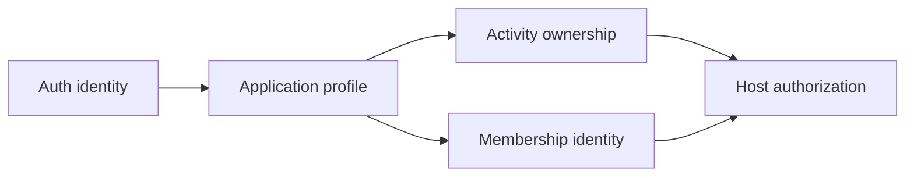

This does not mean every visitor must authenticate. Anonymous browsing remains independent; identity becomes necessary at Join or Host.

## 2. Backend, database, and Supabase

A backend is the trusted software and infrastructure behind the client. It may contain an API server, database, authentication service, background workers, and observability. A database is one backend component, not the entire backend.

Supabase is a hosted platform whose relevant parts are:

- **Auth:** verifies phone OTP and issues sessions.
- **PostgreSQL:** durably stores product data.
- **PostgREST/data API:** can expose permitted tables/functions over HTTP.
- **Realtime/Storage/Functions:** optional capabilities for later needs.

NearHere initially uses Supabase Auth and PostgreSQL. Complex activity commands remain behind a trusted application/database operation rather than arbitrary client table updates.

## 3. Authentication identity versus application profile

`auth.users` is managed by Supabase and contains authentication-sensitive identity. Supabase deliberately does not expose that schema through the normal generated data API.

NearHere needs an application `public.profiles` table for display name, interests, and future avatar configuration. `public` is the PostgreSQL schema name exposed to Supabase's data API; it does not mean the table should be anonymously readable:

```mermaid
erDiagram
    AUTH_USERS ||--|| PROFILES : "same UUID"
    AUTH_USERS {
      uuid id PK
      phone protected
      json metadata
    }
    PROFILES {
      uuid id PK_FK
      text display_name
      enum onboarding_status
      jsonb avatar_config
      text_array interests
    }
```

The same UUID provides a one-to-one relationship. `on delete cascade` removes the profile when the Auth user is deleted. We do not duplicate the phone number or a phone hash into the application table because it adds exposure and synchronization work without a product requirement.

## 4. What a database migration is

A migration is an ordered source-controlled program that changes the database schema from one known version to the next. The filename timestamp orders the history:

```text
empty database
  -> 202608150001_create_profiles.sql
  -> future activity migration
  -> future membership migration
```

Dashboard clicks are difficult to review, reproduce, or apply consistently across development, staging, and production. A migration provides an auditable record and lets a fresh database reach the same shape.

Migrations require more caution than ordinary app code because production data may outlive every binary. Prefer forward-compatible expansion, deploy code, migrate/backfill, and only later remove old structures.

## 5. Tables, keys, and constraints from first principles

A table represents a set of similar facts. A row is one fact instance, and a column has a database type.

- A **primary key** uniquely identifies a row. `profiles.id` is a UUID.
- A **foreign key** guarantees the referenced identity exists. `profiles.id` references `auth.users.id`.
- `not null` prevents absence where the domain requires a value.
- A `check` constraint rejects values outside a valid rule, such as too many interests.
- A default supplies a server-owned initial value.

Constraints protect every writer: mobile client, API, administrative script, migration, or future service. Client validation improves feedback, but a modified client cannot bypass a database constraint.

## 6. Trigger lifecycle

The migration installs an `after insert` trigger on `auth.users`:

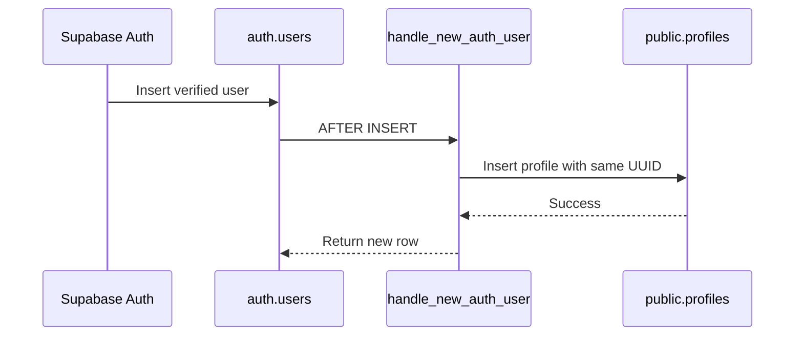

A trigger runs automatically inside the database transaction. This guarantees the profile relationship for all signup paths. It also creates a risk: if the trigger fails, it can block signup. Therefore the function is minimal, uses schema-qualified names, and must be tested against the real development database.

The separate `before update` trigger maintains `updated_at` using server time rather than trusting a phone clock.

## 7. Row Level Security

Row Level Security (RLS) attaches authorization policies to a table. Conceptually, PostgreSQL adds a filter or check to each operation.

```sql
using ((select auth.uid()) = id)
with check ((select auth.uid()) = id)
```

`using` decides which existing rows the actor may target. `with check` decides whether the resulting row remains allowed. Column grants separately ensure a user cannot update `id`, creation time, or server-managed update time.

Defense in depth looks like this:

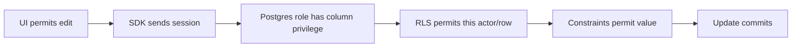

No single client check is trusted. The initial policy permits an authenticated user to read and edit only their own profile. Anonymous discovery will later receive a smaller host-summary response deliberately shaped by the NearHere API. Authentication secrets remain in `auth.users`.

## 8. Public key versus secret key

The Supabase URL and publishable key are embedded in the mobile JavaScript bundle. `EXPO_PUBLIC_` is an explicit warning that a value is readable by app users. The key selects the Supabase project and maps anonymous/authenticated requests into restricted database roles; it is not the main authorization mechanism.

The service-role key bypasses normal Row Level Security and is a secret. Embedding it in a mobile binary would let anyone extract it and obtain privileged data access. It belongs only in a protected server or controlled operations environment.

## 9. Local work versus external state

This lesson created the migration and contracts locally. A real phone flow still requires user-owned external actions:

```text
Create Supabase development project
  -> configure phone provider/test path
  -> apply migration
  -> test trigger and RLS actor matrix
  -> add URL/publishable key to ignored local .env
  -> restart Metro
  -> request and verify a real/test OTP
  -> restart app and verify session restoration
```

The project can start on Supabase's free development tier, but SMS delivery is a separate provider service and may cost money. Limits and pricing are operational inputs that must be checked before launch.

## 10. Challenge: local database tools were unavailable

**Symptom:** `supabase --version` and `psql --version` both returned command-not-found errors.

**Impact:** the SQL could be designed and statically reviewed, but its triggers, grants, and RLS policies could not honestly be claimed as executed.

**Rejected shortcut:** paste the SQL into an unapproved external project or state that static review proves runtime behavior. Either would create external state without the developer's account decision or overstate verification.

**Resolution:** preserve the schema as a versioned migration, document the official CLI/project sequence and explicit actor test matrix, and leave database execution open in the backlog.

**Lesson:** source-code completion and deployed-system verification are different milestones. A trustworthy engineer states which one is complete.

## 10.1 Project creation security defaults

The Supabase project wizard can enable the Data API, automatically expose new tables, and automatically enable Row Level Security. These controls solve different problems:

- The **Data API** turns permitted PostgreSQL objects into an HTTP-accessible interface.
- **Automatically expose new tables** grants Data API roles access to new objects by default.
- **Automatic RLS** installs a database event trigger that enables Row Level Security on new tables in the exposed schema.

NearHere enables the Data API, disables automatic table exposure, and enables automatic RLS. This is a fail-closed posture: a newly created table is unavailable until a reviewed migration deliberately grants privileges and adds policies.

Our migrations still include `alter table ... enable row level security`. Explicit migration SQL makes the intended security state reproducible in every environment, while project-level automatic RLS protects accidental dashboard-created tables.

The controls form two different authorization levels:

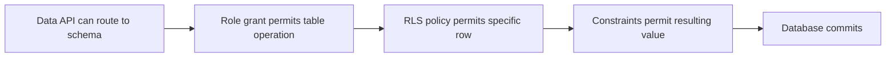

Disabling automatic exposure means future tables do not automatically receive grants for Data API roles. Enabling automatic RLS means future exposed-schema tables automatically have row security switched on. Together, an accidental new table has no implicit client privilege and no permissive row policy.

The full first-principles explanation, examples, request sequence, and misconception table live in `supabase/README.md` so the operational setup and security model remain next to the migrations.

## 10.2 Challenge: Supabase displayed Next.js environment-variable names

**Symptom:** the Supabase Connect dialog provided `NEXT_PUBLIC_SUPABASE_URL` and `NEXT_PUBLIC_SUPABASE_PUBLISHABLE_KEY`, while NearHere's client reads `EXPO_PUBLIC_SUPABASE_URL` and `EXPO_PUBLIC_SUPABASE_PUBLISHABLE_KEY`.

**Root cause:** environment-variable naming is partly a build-tool convention. `NEXT_PUBLIC_` is consumed by Next.js client builds; `EXPO_PUBLIC_` is statically substituted by Expo CLI into a React Native JavaScript bundle. Supabase's underlying URL and publishable-key values are framework-independent, but the variable names in each codebase are not.

**Rejected fix:** copy the Next.js names unchanged. NearHere's `process.env.EXPO_PUBLIC_...` expressions would remain undefined and the app would continue to report that authentication was not configured.

**Resolution:** store the public values in the Git-ignored `apps/mobile/.env` using the exact Expo names already documented in `.env.example`.

**Verification:** a non-secret health check loaded both Expo variables and received HTTP 200 from the project's Supabase Auth health endpoint. No value was printed. This proves service reachability and accepted public configuration, not SMS, migrations, RLS behavior, or mobile session restoration.

**Lesson:** an environment variable is found by exact name. “Public” prefixes describe client visibility and build-tool behavior; they do not encrypt a value or make a secret safe for client code.

## 10.3 Deploying and verifying the first migration

The Supabase CLI was authorized through its browser verification flow, initialized in the repository, and linked to the healthy `NearHere Dev` project. `supabase init` created `config.toml`, which defines local ports, database major version, Auth settings, and other local stack behavior as version-controlled configuration.

Before changing the database, `db push --dry-run` proved that exactly one migration was pending. The real push then applied `202608150001_create_profiles.sql`.

Verification used two independent surfaces:

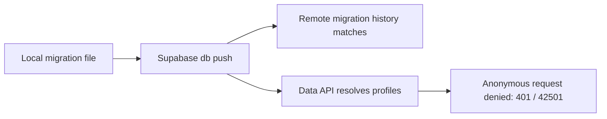

Matching migration history proves Supabase recorded the version. The Data API response proves the table exists and the anonymous role cannot access it. Neither proves the new-user trigger or authenticated owner/cross-user policy; those require real authenticated actors.

### Challenge: Docker catalog warning after a successful remote push

**Symptom:** after applying the migration, the CLI warned that it could not inspect a Docker image or cache the `pg-delta` migrations catalog because the Docker daemon was unavailable.

**Hypotheses:** the migration might have failed entirely, it might have applied but failed during optional post-processing, or the remote history might be inconsistent.

**Investigation:** the CLI's ordered output showed the migration being applied before the warning and ended with `Finished supabase db push`. A fresh remote migration list showed matching version `202608150001`. An anonymous Data API request reached `profiles` and returned permission error `42501` rather than a missing-table error.

**Root cause:** Docker was unavailable for local schema-catalog inspection/caching. The hosted database connection and migration execution used a different path and had completed.

**Resolution:** retain the warning as a local-tooling prerequisite, verify remote state independently, and avoid claiming that local reset/schema-diff testing has passed.

**Lesson:** warnings must be interpreted in execution order and verified against the affected subsystem. A successful command line is useful evidence, but independent state checks make the conclusion defensible.

## 10.4 Test OTP, hosted configuration, and Docker from first principles

A test OTP is a server-side exception for a deliberately fictional development phone number. Supabase Auth skips external SMS delivery for that mapping and accepts only the configured fixed code. The rest of the authentication pipeline remains real: user creation, OTP verification, session issuance, token refresh, the profile trigger, and RLS checks all execute against Supabase.

That distinction matters:

| Approach | What it tests | What it misses |
| --- | --- | --- |
| Client-side “pretend signed in” flag | Screen navigation only | Auth, tokens, trigger, RLS, restoration |
| Supabase fixed test OTP | Real Auth/session/database path | SMS-provider delivery |
| Real phone OTP | Full path including delivery | Nothing in the basic login path |

Docker solves a different problem. A production-shaped backend consists of multiple long-running programs. Installing and coordinating every program directly on a laptop is slow and version-sensitive. A container packages one service and its runtime; Docker starts those containers on a private network and gives stateful services named volumes.

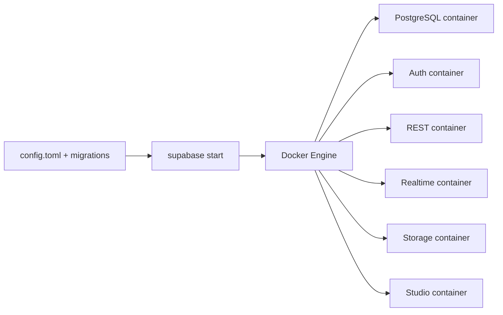

The container is not a lightweight virtual machine in the everyday sense. On Linux it is an isolated process sharing the host kernel; Docker Desktop supplies the Linux environment needed to run those containers on macOS. An image is the immutable packaged template, a container is a running instance, a volume preserves database files, and a network lets the services address each other predictably.

For NearHere, Docker enables:

- `supabase start`: run the private local stack;
- `supabase db reset`: destroy and recreate only the local database from migrations and seed data;
- repeatable migration/RLS/integration tests without touching hosted data;
- local fixed OTP and captured email without paying an external provider;
- schema-diff/catalog tooling that expects the matching Postgres image.

Docker is not required for the Expo app, iOS Simulator, TypeScript compilation, calls to hosted Supabase, or the remote migration already deployed.

### Challenge: a narrow OTP request exposed a broad configuration command

**Intent:** enable one fixed development OTP on the hosted project.

**Risk discovered:** `supabase config push` has no dry-run or field-selection flag. It pushes the generated `config.toml`, which contains many Auth, URL, email, provider, and runtime defaults. Using it for one OTP could silently change unrelated hosted settings.

**Resolution:** do not perform the broad push and do not commit the fixed hosted code. Use either a narrow hosted dashboard/Management API update or a local Docker stack. Keep `auth.sms.enable_signup = true` as the intended version-controlled development setting, while treating the actual hosted test identity as restricted operational configuration.

**Lesson:** configuration changes have a blast radius just like database migrations. Before applying one, identify whether the tool patches a field, merges a section, or replaces a whole configuration document.

### Challenge: three test-OTP representations looked plausible

**Symptom:** the first two narrow Management API requests returned HTTP 400. The initial `phone:code` value came from self-hosted environment documentation. Encoding a JSON phone-to-code object as a string also looked reasonable because the Auth server's internal configuration is a map.

**Evidence:** the hosted Management API returned its own validation contract: `sms_test_otp` must be a comma-separated list of `phone-number=code`, and each phone number must be E.164 digits without the leading `+`.

**Resolution:** send the hosted field as `phone=code`, set an explicit expiration, and keep the real development mapping out of Git. The third request returned HTTP 200.

**Lesson:** equivalent domain data can have different serialized representations at different boundaries. An internal map, a self-hosted environment variable, a TOML table, and a hosted Management API string are not interchangeable merely because they represent the same phone-to-code relationship. Preserve and test the contract at the boundary being called.

### Hosted authentication evidence

The configured fictional identity was tested directly through the public Auth endpoints. OTP request and verification both returned HTTP 200, the verification response contained a real session, and the authenticated Data API request returned exactly one profile with `needs_profile` onboarding state. Temporary files containing session tokens were deleted without printing their contents.

This proves the hosted Auth-to-database path:

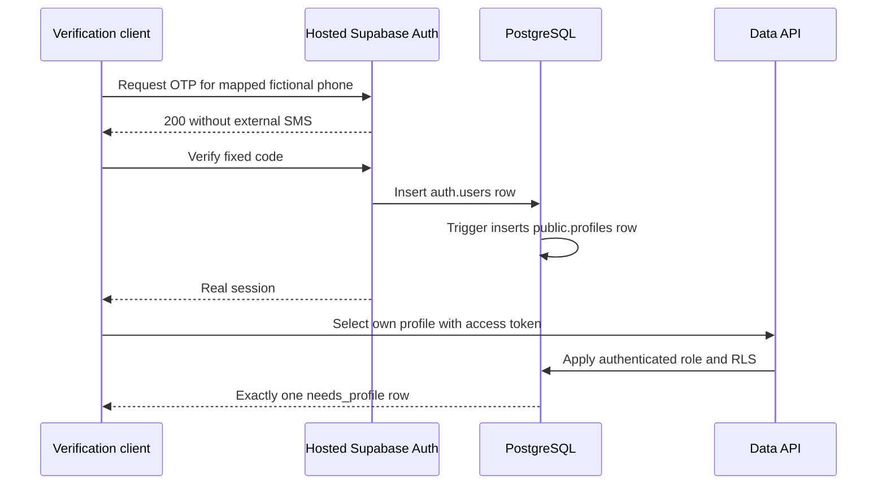

It does not prove that one user cannot read another user's profile. Session restoration was subsequently confirmed in the mobile application; cross-user authorization is a separate independent check.

## 11. Lesson 4 files introduced or changed

- `packages/contracts/user.ts` defines public profile vocabulary without auth secrets.
- `supabase/migrations/202608150001_create_profiles.sql` defines the executable schema/policies.
- `supabase/README.md` defines deployment and verification.
- `docs/system-design.md`, `data-model.md`, and `api-spec.md` explain responsibilities at different abstraction levels.

## 12. Lesson 4 interview explanation

> I designed the initial identity data boundary for a mobile application using Supabase Auth and PostgreSQL. Authentication-sensitive phone data remains in the protected Auth schema, while a one-to-one public profile is created by a minimal database trigger. I added constraints, column-level grants, and Row Level Security so authenticated users can update only permitted fields on their own profile. I captured the change in a versioned migration and explicitly separated static validation from pending database integration tests.

## 13. Lesson 4 honest resume addition

- Designed a Supabase/PostgreSQL identity foundation with versioned migrations, one-to-one Auth profiles, automatic profile provisioning, constraints, least-privilege column grants, and Row Level Security policies.

# Lesson 5: Runtime-safe profile onboarding

## 1. The user journey and why it is a vertical slice

After OTP verification, NearHere must do more than show a success message. It must connect the authenticated identity to the database profile, collect the minimum public information, enforce the rule at every boundary, survive network errors, and show the result in the account UI.

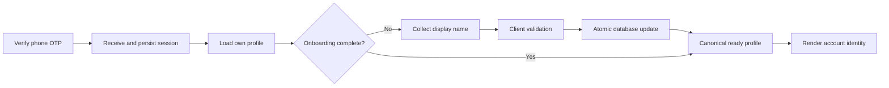

This is vertical because it crosses navigation, React state, a network adapter, runtime validation, TypeScript contracts, PostgreSQL constraints, RLS, error handling, tests, and user-visible UI.

## 2. Compile-time types versus runtime data

TypeScript checks source code before the app runs. The annotation `data: UserProfile` can help the compiler, but it cannot force an HTTP server to return that shape. Types are erased from the JavaScript bundle.

NearHere therefore uses three representations:

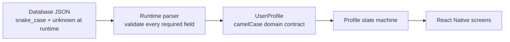

- `packages/contracts/user.ts` is provider-independent domain vocabulary.
- `lib/profile-validation.ts` treats network input as `unknown`, validates it, and maps `display_name` to `displayName`.
- `lib/profile-repository.ts` knows Supabase query syntax but returns only domain results.
- Screens and providers do not depend on PostgREST response internals.

This adapter boundary makes a future API migration smaller: the UI can keep consuming `UserProfile` even if the transport changes.

## 3. Why a profile repository exists

A repository is a small module that hides storage/transport details behind product-shaped functions. NearHere exposes `getMyProfile(userId)` and `completeMyProfile(userId, displayName)` instead of scattering `.from('profiles')` queries through screens.

The query selects explicit columns rather than `*`. Explicit selection reduces accidental exposure when a later migration adds a column. The client never inserts or upserts a profile because the database signup trigger owns creation. If a row is unexpectedly missing, the app shows a retry/support failure instead of creating data through an unauthorized fallback.

Display name and onboarding status are updated in one database statement:

```text
UPDATE profiles
SET display_name = normalized_name,
    onboarding_status = 'complete'
WHERE id = authenticated_user_id
RETURNING allowed_profile_columns
```

This is **atomic**: PostgreSQL commits both changes or neither. Setting the status first would violate the database rule that a completed profile must contain a valid display name. Returning the canonical row avoids assuming that local input equals stored truth.

## 4. The profile state machine

Several independent booleans such as `loading`, `saving`, `hasProfile`, and `hasError` can represent impossible combinations. A discriminated union gives exactly one meaningful state at a time:

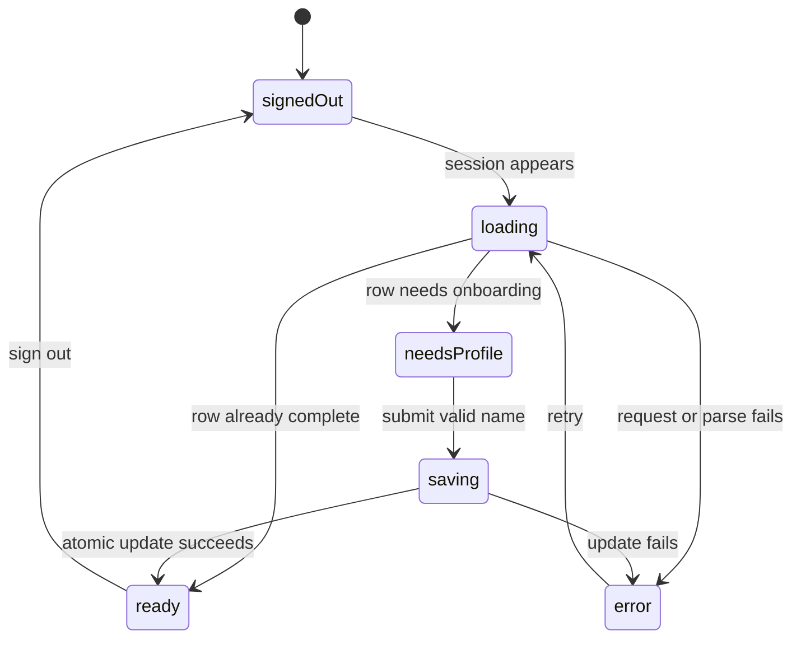

The `profile` object is unavailable in states where it is not safe to use and required in states where the UI needs it. TypeScript narrows the union after checking `state.status`, so accessing `state.profile.displayName` is legal only in the `ready` branch.

The provider also uses a monotonically increasing request ID. If user A signs out while a slow request is running, that old response cannot populate user B's state. This is a practical defense against asynchronous race conditions.

## 5. Session restoration is an application gate

AsyncStorage restoration is asynchronous. During startup, `session === null` can mean either “confirmed signed out” or “not checked yet.” Rendering protected actions immediately would briefly show the wrong account state and could open an unnecessary sign-in screen.

The root navigator therefore waits in `restoring`. A read failure becomes a visible `restoreError` with Retry rather than silently treating the user as signed out.

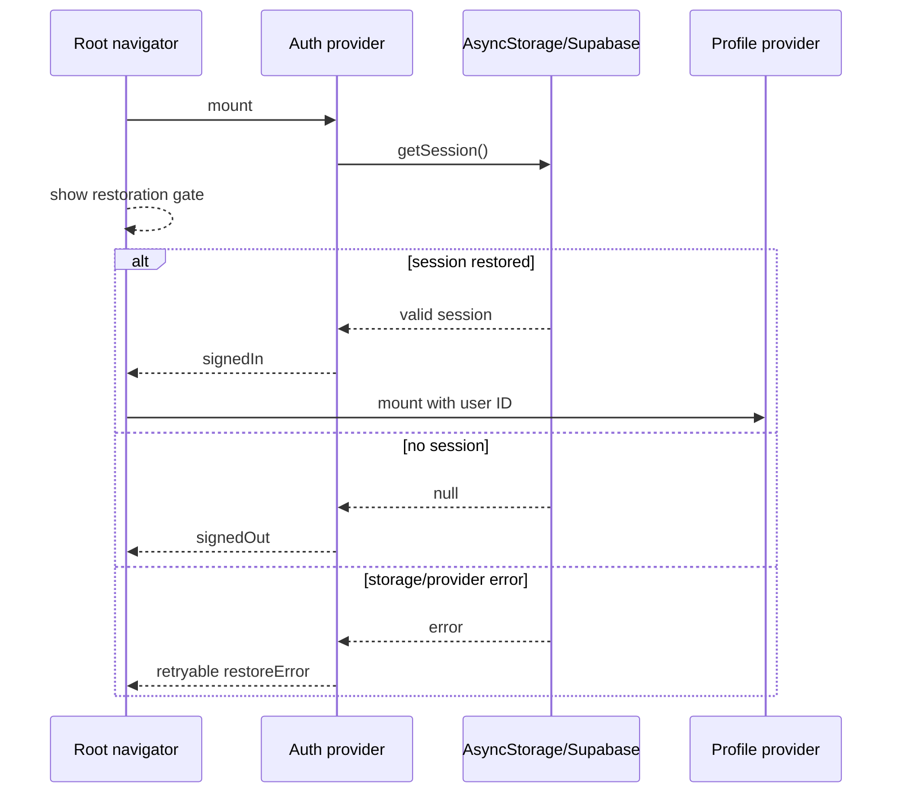

The user verified restoration by restarting the app and observing the authenticated state return. This is interaction evidence, while lint/type/bundle checks cover different failure classes.

## 6. Validation and defense in depth

The form trims the display name and checks 2–40 characters for immediate feedback. The runtime parser rechecks server data. PostgreSQL constraints remain authoritative because an attacker can bypass the UI and call the Data API directly.

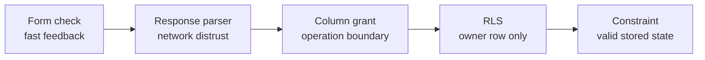

These layers are complementary, not duplicates. Each protects against a different class of failure.

## 7. Testing strategy

The local unit suite uses Node's test runner and has no new testing dependency. It verifies name boundaries, database-to-domain mapping, onboarding-state rules, and rejection of malformed data. Lint checks code-quality rules; `tsc --noEmit` checks compile-time contracts; Expo export proves Metro can create an iOS production bundle.

The hosted RLS harness under `supabase/tests/hosted` is deliberately separate. With two fictional test identities it will prove:

- anonymous requests cannot read profiles;
- each actor can read and update their own allowed fields;
- actor A cannot read or change actor B;
- protected columns, insert, and delete remain denied;
- database constraints reject invalid values;
- test mutations are restored in `finally`.

It never prints phone numbers, OTPs, access tokens, refresh tokens, or raw Auth responses. It is a manual/pre-release check rather than a per-commit CI job because hosted OTP endpoints have operational rate limits. Deleting an Auth user to prove cascade behavior is deferred to an isolated local stack or protected admin harness; the service-role credential never belongs in mobile configuration.

## 8. Challenges and resolutions

### Challenge: restoration errors looked like signed-out users

**Cause:** the original provider ignored the `getSession()` error and account UI branched only on a nullable session.

**Resolution:** introduce explicit `restoring` and `restoreError` states, gate the root navigator, and expose a retry operation.

**Lesson:** absence of data and failure to load data are different states.

### Challenge: late asynchronous results can cross account boundaries

**Cause:** promises cannot always be cancelled after a request has reached the network.

**Resolution:** increment a request identifier whenever the active user changes and ignore a response whose identifier is stale.

**Lesson:** authentication changes invalidate all user-scoped in-flight work and cached state.

### Challenge: generated TypeScript types are not runtime validation

**Cause:** compile-time types disappear and remote JSON can be malformed, stale, or unexpectedly shaped.

**Resolution:** accept `unknown` at the repository boundary and explicitly validate/map the row before it reaches React state.

**Lesson:** every external boundary needs both a compile-time representation and runtime validation.

### Current limitation: protected intent is memory-only

Join/Host intent and the pending phone number survive the continuous OTP flow but not process death in the middle of verification. Persisting them now would introduce expiry, cleanup, replay, and privacy rules before the real Join/Host operations exist. This resilience work remains deferred and must be designed before production.

## 9. Lesson 5 files introduced or changed

- `apps/mobile/lib/profile-validation.ts` validates and maps external profile JSON.
- `apps/mobile/lib/profile-repository.ts` contains explicit owner-profile queries.
- `apps/mobile/providers/profile-provider.tsx` owns the profile state machine and stale-request guard.
- `apps/mobile/app/onboarding/profile.tsx` implements minimum display-name onboarding.
- `apps/mobile/app/_layout.tsx` gates navigation during session restoration.
- `apps/mobile/app/(tabs)/me.tsx` renders profile-aware account states.
- `apps/mobile/lib/profile-validation.test.mjs` covers the runtime boundary.
- `supabase/tests/hosted/profiles-rls.mjs` contains the manual two-actor security matrix.

## 10. Verification evidence

- ESLint: passed.
- Strict TypeScript compile (`tsc --noEmit`): passed.
- Profile runtime unit tests: 6 passed, 0 failed.
- iOS production bundle export: passed with 1,469 modules.
- Hosted fixed OTP/session/profile trigger: passed earlier.
- Mobile session restoration after restart: user-confirmed.
- Display-name onboarding interaction: pending Simulator acceptance.
- Two-actor hosted RLS matrix: harness ready; second fictional identity/configuration pending.

## 11. Interview explanation

> I implemented a runtime-safe mobile profile onboarding slice on top of Supabase Auth and PostgreSQL. I separated provider-specific database rows from camelCase domain contracts using a repository and runtime parser, modeled loading/onboarding/saving/error behavior as a discriminated state machine, prevented stale cross-account responses with request IDs, gated navigation during asynchronous session restoration, and completed onboarding with one atomic RLS-protected update. I added unit tests, a production bundle check, and a credential-safe two-actor RLS harness.

## 12. Honest resume addition

- Built a React Native/Supabase identity and profile vertical slice with persisted phone sessions, retryable restoration, runtime-validated data adapters, atomic onboarding, owner-only RLS, stale-request protection, and layered automated verification.

# Next lesson

Run the two-actor hosted RLS matrix and accept the display-name flow in Simulator. Then begin the first real activity slice: PostGIS schema, privacy-separated geometry, transactional host creation, and nearby discovery replacing fixtures.

# Engineering challenge log

This chronological log collects cross-cutting challenges that are useful beyond a single lesson. Lesson-specific sections retain the full investigation.

## 1. Choosing a native foundation without prematurely adopting native complexity

**Context:** the repository began with a static HTML/CSS concept, but the product requirement was an installable iOS and Android application.

**Decision:** use Expo and React Native to share TypeScript product code across platforms while rendering native controls. The project initially targeted Expo Go compatibility, then moved to a dedicated NearHere development build when Expo Go acquisition failed and native control became useful.

**Tradeoff:** Expo Go is fast for development but cannot load arbitrary third-party native code.

**Current state:** the development build is installed and is the normal iOS workflow. MapLibre and other native modules can be introduced deliberately without depending on Expo Go.

## 2. Custom map identity versus Expo Go compatibility

**Context:** Apple Maps works immediately on iOS but does not provide the desired depth of custom visual styling.

**Options considered:** retain native Apple/Google maps, configure styled Google Maps, use MapLibre, or build a custom illustrated canvas.

**Decision:** keep `react-native-maps` while core behavior is changing; prefer MapLibre for the later custom-map renderer.

**Reasoning:** changing the feature behavior and native rendering infrastructure in one slice would increase the number of possible causes for every defect.

**Unresolved work:** MapLibre migration, custom style design, tile-source selection, attribution, offline policy, and development-build configuration remain future work.

## 3. Dependency audit warnings in the generated Expo tree

**Symptom:** npm reported 22 dependency audit findings after generating the Expo SDK 54 application.

**Risk:** `npm audit fix --force` can replace framework-managed packages with versions incompatible with the installed Expo SDK.

**Decision:** do not apply an indiscriminate forced upgrade. Use Expo's version-aware installer and compatibility check, then assess dependency advisories in the context of reachable application code and official framework upgrades.

**Current status:** unresolved as a dependency-review item; the application passes Expo's SDK compatibility validation. This is not equivalent to proving that every transitive dependency is vulnerability-free.

**Lesson:** security tooling produces evidence, not automatic architecture decisions. Remediation must preserve framework compatibility and consider exploitability, reachability, and supported upgrade paths.

## Challenge-entry template

Future entries should use:

```text
Challenge:
User or system impact:
Observed symptom or error:
Relevant architecture:
Hypotheses considered:
Investigation and evidence:
Root cause:
Rejected fixes and why:
Final resolution:
Verification:
Remaining limitations:
Prevention or general lesson:
```
