# NearHere Engineering Learning Guide

## Live lessons — themes, modular sprites and identity

[The 2 October execution guide](handoffs/daylight-avatar-identity-20261002.md)
specifies the next learning sequence: reactive theme state, shared map styling,
database uniqueness under concurrent requests, deterministic avatar composition
and cache keys, backward-compatible contracts, OAuth versus account linking,
and native/device acceptance. Some source work is now implemented; the handoff
ledger keeps code, database execution, Simulator acceptance and production
readiness separate. Each ticket adds its actual walkthrough, challenges, fixes
and evidence here or in a linked lesson.

### D01 first implementation note — preference state versus rendered styles

NearHere's current palette used to be imported as plain hex values and baked
into module-scope `StyleSheet.create` objects. Adding a context alone could not
recolor those existing styles. D01 now has `ThemeProvider`, persisted
System/Daylight/Night Arcade preference, active palette factories across the
feature screens and derived day/night map styles. The preference belongs in
AsyncStorage because it is not secret; auth tokens do not. Expo's SDK54 native
configuration (`userInterfaceStyle`) still requires a rebuilt binary. Source
migration and local checks pass, but device appearance switching and full visual
acceptance remain open.

Flow: `Me or signed-out Settings → setPreference → ThemeProvider state →
resolved mode → themed screen factories + map style → AsyncStorage persistence`.
The implementation is in `apps/mobile/providers/theme-provider.tsx`,
`apps/mobile/lib/theme.ts`, `apps/mobile/lib/map-style.ts` and
`apps/mobile/app/settings/appearance.tsx`. Each consumer calls a `makeStyles`
factory with semantic colors; it does not mutate a global palette object.
`lib/map-style-core.mjs` remains a pure tested function, separate from Expo's
Metro asset imports.

### D03 — Reduce Motion at the native camera boundary

Picture the call path: a user taps an avatar; Nearby calls the map's imperative
handle; `ActivityMap` decides between an immediate jump and a timed ease; native
MapLibre moves the viewport. The important rule is that there is one camera
boundary. If only the card animates accessibly but a map camera still flies, the
user's motion preference was not honored.

`useReducedMotion()` reads `AccessibilityInfo.isReduceMotionEnabled()` and
subscribes to `reduceMotionChanged`. `ActivityMap` stores the latest boolean in
a ref because `useImperativeHandle` can retain a callback across renders. A
React closure captures the values from the render that created it; the mutable
ref lets the stable camera handle read the current setting. The pure
`cameraMotionDuration` function tests the policy: immediate when Reduce Motion
is enabled, otherwise retain the intended 350–500 ms duration with a 1,200 ms
safety cap. The native layer calls `jumpTo` for the immediate branch and
`easeTo` otherwise. The installed MapLibre source confirms `jumpTo` sets a
zero-duration stop; this avoids guessing that `easeTo(duration: 0)` is portable.

Verification: five policy assertions joined the suite (107 total pass), then
TypeScript, lint, iOS export and an Xcode Release build passed. The built app
launched through `simctl` on iPhone 17 Pro Simulator. That simulator CLI has no
Reduce Motion switch, and Simulator.app is missing; therefore OS event delivery,
visible camera movement and performance profiling are not accepted yet.

### U01 — a username is a column, not a new user identity

Database first principles: `profiles` is the table; one `profiles` row belongs
to one `auth.users.id`; `username` is a nullable column on that row. A unique
index is the database rule that makes “nobody else can have this handle” true
even if two phones submit at the same instant. An availability hint in the UI
can become stale; it cannot reserve the name.

The claim flow is:

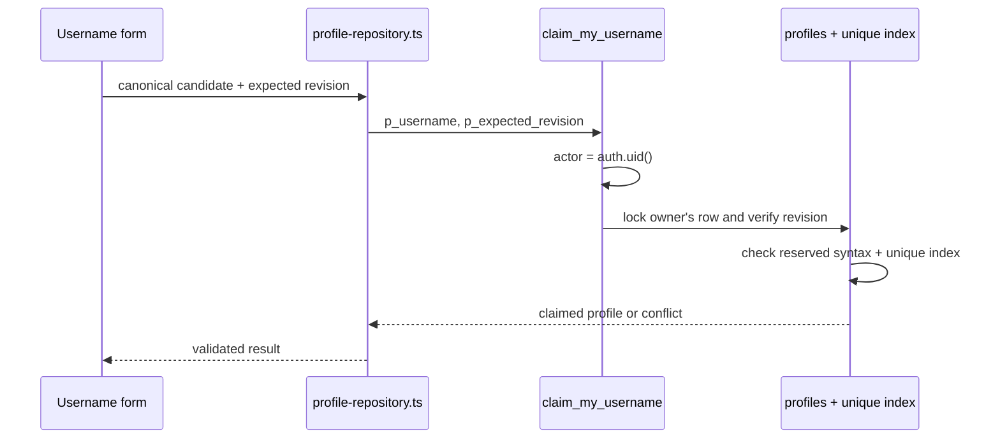

Files: `packages/contracts/user.ts` defines `ClaimMyUsernameRequest`;
`apps/mobile/lib/profile-validation.ts` normalizes/checks local input;
`apps/mobile/lib/profile-repository.ts` calls the RPC without an owner ID;
`supabase/migrations/202610030001_username_claim.sql` owns final validation,
locking and uniqueness. `profile_revision` prevents a stale screen from
overwriting a newer profile. Existing `update_my_profile_v2` cannot write this
column and direct `UPDATE(username)` remains revoked. First claim is currently
immutable; a rename/cooldown policy has not been designed.

Challenge: current OTP actors already represent durable user rows. Using one to
test the first claim would permanently claim a username because no rename or
release exists. Docker's executable is installed but no daemon is running, so
there is no disposable local PostgreSQL stack. We therefore added input/parser
tests and source-text migration guards only, left the migration unapplied, and
did not claim database verification. The repository temporarily falls back to
the old profile projection only when the backend explicitly lacks the new
column/RPC; this preserves staged app compatibility but does not make username
claim work until the migration is applied.

### A01 — do not confuse a pretty PNG with an avatar system

The saved [style anchor](design-concepts/avatar-modular-style-proof-20261003.png)
is a single complete raster character. Its PNG has alpha and 1,188,852 fully
transparent pixels; the full-body silhouette is still legible after downscaling
to 64 pixels. That proves basic visual suitability, not modularity. A custom
maker needs multiple aligned parts in the same canvas coordinate system, a
stable layer order and compatibility rules. Until those parts compose in the
same renderer, the art stays out of the app catalog. Existing v1 avatars remain
the fallback.

## Lesson 35 — A green code check is not an App Store release

The current release audit begins at
[the T-pass plan](handoffs/app-store-t-pass-20260930.md) and its
[V1 scope draft](release/v1-scope.md). On 30 September, the current worktree
passed 88 unit tests, TypeScript, lint, and `git diff --check`. The linked
development database also reported 30/30 migration IDs matching. These are
useful but separate observations: none signs the app, tests a physical GPS chip,
proves real SMS, approves account deletion, or predicts App Review.

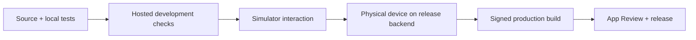

The code path for a small test starts at `apps/mobile/package.json`'s
`test:unit` script. It invokes Node's test runner over mobile parser/state tests
and the fixture utility test. `npx tsc --noEmit` checks static type consistency;
`npm run lint` applies the project's Expo lint configuration. The migration
inventory compares local SQL filenames to the linked remote migration ledger;
it does not prove each routine's behavior or that a production project exists.

The audit also found product boundaries that need owner policy: deleting a
profile currently intersects with host activities, chat, reports, and audit
retention; and UGC has length validation but no server content filter. That is
why an account-deletion button or a regex added in the UI would not make the app
safe. The database must own authorization and durable transitions, and the
product owner must decide retention/moderation rules first.

**Interview explanation:** “I distinguish static checks, automated unit tests,
hosted integration evidence, Simulator flows, physical-device behavior, signed
builds, and store review. Each tests a different boundary, so I report the exact
gate rather than calling the whole product production-ready after compilation.”

**Exercise:** Pick one report from `docs/testing-status.md`. Mark each claimed
result as local, hosted, Simulator, physical device, signed build, or App Review.
For every missing layer, name the smallest evidence artifact that could close it.

## Implemented lessons — 28–29 September 2026

Read [owner-profile editing](profile-owner-editing.md) for optimistic concurrency,
row locks, account-switch races, Unicode limits and hosted boundary tests. Then
read [hosting time selection](host-time-selection.md) for draft/commit state,
local versus UTC time, native dialogs and local double-submit protection.
Both chapters separate code verification from device acceptance.

For a smaller P04 example, see the [location recovery lesson](code-tour.md#location-failure-copy-is-part-of-the-recovery-contract): typed permission/service/fix states become platform-neutral recovery copy. Its regression is local evidence only; OS prompts and device GPS remain separate acceptance work.

## Planned next learning path (24 September 2026)

The [premium implementation guide](handoffs/premium-product-execution.md) maps
each future ticket to code, tests, a diagram and an interview explanation. This
is a syllabus, not a claim that the following lessons are implemented:

1. P00-P01: reproducible baselines, fixture identity, idempotency and race conditions.
2. P02: read models, additive API evolution, RLS and negative authorization tests.
3. P03-P04: pure geometry transformations, renderer boundaries, accessibility,
   measured layout and asynchronous native state.
4. P05-P06: auth versus profile, draft versus saved state, optimistic concurrency,
   private/public projections and reference-faithful native UI.
5. P07: stable identity, versioned catalogs, backwards compatibility and asset QA.
6. P08: meshes/materials/rigging versus images, GPU lifecycle, asynchronous render
   jobs and cache invalidation. Read the [wardrobe specification](handoffs/premium-profile-avatar-spec.md).
7. E01-E08: durable events/outbox, delivery retries, metric definitions, deterministic
   ranking, recurrence/timezones, moderation, payment state machines and measured
   scaling. Read the [extension roadmap](handoffs/premium-community-roadmap.md).

After every implemented ticket add the actual lesson and evidence here or link
its focused lesson. An exercise should ask you to trace/debug/change one small
thing yourself. Explain both why the solution works and what the tests do not
prove. Keep this distinction clear for resume and interview discussions.

## Lesson 34 — Separate appearance, identity, and evidence

The same host should look the same after changing their name. A random choice in
a React render would change appearance on rerenders; a display-name hash changes
on rename. Instead PostgreSQL assigns a random UUID **once** in the profile's
`avatar_config` default. A seed is an input to a deterministic selection rule:
same seed + same catalog version = same artwork. The image itself need not be
stored in each database row. A later bundled catalog makes that identity visible.

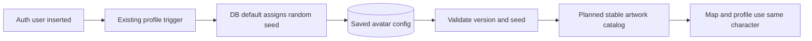

Current implementation: `202609230001_assigned_avatars.sql`,
`202609230002`/`003`/`004` public discovery projections, the six-image catalog,
the preset editor and own-profile render calls. Migration 230001 backfills only
empty JSON so existing customisation isn't erased. The later migration safely
allowlists the seed and optional character ID for discovery.
A rollback-only database test exercised the auth trigger and rename stability.

Location taught a second boundary: “permission granted” means the app may ask;
it does not mean GPS has produced coordinates. `lib/device-location.ts` accepts
an injected provider (a set of functions). Unit tests can therefore simulate a
denial, missing fix or cached result without calling actual phone hardware. Its
union result has `ok:true` with a point, or `ok:false` with a reason. TypeScript
narrows these branches so the UI cannot blindly read coordinates on failure.
The hook keeps the selected area on failure. A recent cached fix is labelled
honestly. Remaining lifecycle/storage races require the next ticket's tests.

The command-output lesson matters too: the test summariser reported 56 passing
tests but the combined command exited nonzero. Inspection found the compiler was
invoked from the wrong directory. Run the installed mobile compiler, not an
unrelated executable resolved from the repository root. A summary is a convenience,
not stronger evidence than the real exit status and exact diagnostics.

Finally, demo activities expire because discovery filters by time. A repeatable
seeder creates missing live slots while preserving history. This is **idempotency**:
repeating the operation should not multiply equivalent live fixtures. The current
single-run test passes, but its discovery-based lookup has blocking/pagination
limits documented in ticket 0; don't overstate it as concurrency-safe.

Learner exercise: trace a services-disabled result from resolver to hook to the
Nearby notice. Then explain why changing the user's display name must not call
the random-seed generator. Interview framing: “I separated persistent identity,
presentation, and location failure states, and tested their boundaries.” The
six-preset profile editor is implemented; a custom builder and its Simulator
save/reload acceptance remain separate.

## Lesson 33 — Designing around a map

A map-first interface needs more than a map background. In the previous screen, a card was selected automatically, filter chips were always visible, and a tab bar occupied the bottom. These independent elements competed for the same space. The new screen stores a nullable `selectedId`: null is a valid resting state with no card. A marker or Browse row selects it; tapping the map clears it. The selected object is derived from current nearby rows so a vanished activity does not keep a stale preview.

Browse is a modal, meaning an explicit temporary surface above the map. It owns filter/list presentation but shares the map's `filter` and nearby-data hook. The privacy contract therefore remains in the existing repository/RPC. UI minimalism must preserve recovery and navigation: the modal still has loading, empty, retry, close, and Your plans actions.

`HostAvatar` is a reusable native component. The current catalog contains six locally bundled full-body characters. A deterministic hash maps an account's versioned seed to a stable catalog index. The seed is visual configuration only; it never authorizes a request. Public discovery obtains a minimal avatar config from a dedicated RPC rather than fetching whole profiles. See the detailed flow in [Map-first design](map-first-design.md).

This document explains NearHere from first principles. It is a living companion to the codebase: every meaningful product slice should add a lesson covering the problem, architecture, implementation, tradeoffs, verification, and interview language.

The companion [`practical-engineering-curriculum.md`](practical-engineering-curriculum.md) defines the broader path from CS theory to practical product engineering, including TypeScript, client state, APIs, authentication, databases, concurrency, realtime systems, Redis, testing, security, delivery, and system design.

## Documentation contract

Every meaningful feature added to NearHere must update this guide with:

- The user problem and acceptance criteria.
- Definitions for newly introduced engineering terms.
- The architecture and end-to-end data or state flow.
- Important code boundaries and why they exist.
- Alternatives considered and the selected tradeoff.
- Security, privacy, concurrency, and failure considerations.
- Verification performed and what each check can or cannot prove.
- Challenges encountered, including symptoms, root causes, investigation, rejected fixes, final resolution, and prevention lessons.
- Interview explanations and resume language that accurately match the implementation.

The guide should not rewrite history to make the implementation appear effortless. Debugging evidence and unresolved limitations are part of the engineering record.

## How to use this guide

For each lesson, be able to answer six questions:

1. What user problem did we solve?
2. What technical constraints did we have?
3. What design did we choose and why?
4. How does data move through the implementation?
5. What alternatives did we reject?
6. How did we verify the result?

Do not memorize framework syntax first. Understand the system boundaries and data flow; syntax can always be looked up. Use [`code-tour.md`](code-tour.md) for a compact end-to-end walkthrough and [`visual-evidence.md`](visual-evidence.md) to connect code behavior to what appears in the Simulator.

# Lesson 1: From a static web concept to a native mobile vertical slice

## 1. The product requirement

NearHere needs to feel like an application someone opens while moving through the real world. Its primary interaction is a map centered near the user, with nearby activities layered on top.

That creates several requirements:

- It must run as an iOS and Android application.
- It must request device location permission.
- It must remain useful if permission is denied.
- It must render a native map and tappable markers.
- It must support multiple screens without page reloads.
- Prototype data must never be represented as live data.

The original `apps/web` folder is a static HTML/CSS design reference. Static HTML cannot directly become a production native interface because React Native renders platform views rather than browser DOM elements.

## 2. The chosen stack

### React Native

React Native lets us describe interfaces with React components while rendering native platform controls. A `View` becomes a native container, `Text` becomes native text, and `Pressable` becomes an accessible native interaction target.

This differs from a normal React website:

- Web React renders HTML elements such as `div`, `p`, and `button` into a browser DOM.
- React Native renders native iOS and Android views.
- Styling uses JavaScript objects through `StyleSheet`, not a full browser CSS engine.
- Native capabilities such as location require platform permission APIs.

### Expo

Expo is the React Native framework and toolchain used by NearHere. It provides:

- A project structure and development server.
- Version-compatible native packages.
- Expo Go for testing on a physical phone.
- Native build tooling for later App Store and Play Store distribution.
- Modules such as `expo-location`.

Expo does not turn the product into a website. It manages a genuine React Native application while reducing the amount of Xcode and Gradle configuration required during early development.

### TypeScript

TypeScript adds static types to JavaScript. The `Activity` type specifies that every activity must contain fields such as `id`, `title`, `startsIn`, and coordinate offsets.

Benefits include:

- Misspelled or missing fields are caught before runtime.
- Component contracts are explicit.
- Refactoring is safer.
- Editors can offer accurate autocomplete.
- Domain concepts become visible in code.

TypeScript does not validate untrusted server data at runtime. When the backend is added, API responses will also need runtime validation.

### Expo Router

Expo Router maps files to application screens. The current tab routes are:

```text
app/(tabs)/index.tsx  -> Nearby
app/(tabs)/plans.tsx  -> Plans
app/(tabs)/me.tsx     -> Me
```

The `(tabs)` folder is a route group. Its `_layout.tsx` defines shared bottom-tab navigation without adding `(tabs)` to the user-visible route.

### react-native-maps

`react-native-maps` provides the map component and marker primitives. It uses platform map implementations: Apple Maps or Google Maps depending on platform and configuration.

The current prototype uses the provider default. This avoids requesting production Google Maps credentials before they are necessary.

### expo-location

`expo-location` provides the permission request and foreground position lookup. NearHere requests location only while the application is being used. Background tracking is neither enabled nor required.

## 2.1 Expo Go, development builds, and production builds

A React Native application has three relevant layers:

```text
TypeScript/JavaScript source
  -> Metro JavaScript bundle
  -> installed native iOS/Android application binary
```

The installed native binary contains React Native and compiled platform code for capabilities such as maps, location, notifications, and secure storage. Metro is the development server that transforms the application's TypeScript/JavaScript dependency graph into a bundle that the native application can execute.

### Expo Go

Expo Go is a native application compiled and distributed by Expo. It includes a fixed collection of native libraries. When NearHere is opened through Expo Go, Expo Go downloads NearHere's JavaScript bundle from Metro and executes it using the native capabilities already present in the Expo Go binary.

Installing an npm package cannot add new native code to the copy of Expo Go already installed from the App Store or Play Store. A package that depends on native code absent from Expo Go will therefore fail at runtime even if its TypeScript/JavaScript files exist in `node_modules`.

### Native development build

A native development build is a debug binary compiled specifically for NearHere. It can contain NearHere's selected native libraries, application name, icon, bundle/application identifier, permissions, entitlements, and platform configuration while retaining developer tooling and the ability to load JavaScript from Metro.

It is useful to think of it as a custom development shell:

```text
NearHere development binary installed on phone
  + NearHere native dependencies
  + Expo developer tooling
  + JavaScript bundle loaded from Metro
```

The development build can remain installed while TypeScript and UI changes use Fast Refresh. It must be rebuilt when the native portion of the application changes.

### Production build

A production build is the signed, optimized binary distributed through an app store or another release channel. It contains the production JavaScript bundle, does not expose the normal development menu, and must not depend on a developer's local Metro server.

| Build | Owner of native binary | Native libraries | JavaScript source | Primary purpose |
| --- | --- | --- | --- | --- |
| Expo Go | Expo | Fixed by Expo | Loaded from Metro | Fast experimentation |
| Development build | NearHere | Selected by NearHere | Usually loaded from Metro | Full application development |
| Production build | NearHere | Selected by NearHere | Bundled into the release | End users |

### Development build versus development server

These terms are not interchangeable:

- The **development build** is the application installed on the device.
- The **development server** is the Metro process normally started with `npm start`.
- The **JavaScript bundle** is the transformed application code Metro sends to the development build.

A development build can stay installed across many coding sessions. Metro is started when development resumes and can deliver updated JavaScript without recompiling the native binary.

### Native rebuild boundary

A practical rule is:

| Change | Native rebuild normally required? |
| --- | --- |
| React component or TypeScript logic | No |
| Style, text, or marker presentation | No |
| Install a JavaScript-only package | No |
| Install a package containing new native code | Yes |
| Change native permission or entitlement configuration | Yes |
| Change certain icons, splash configuration, or application capabilities | Yes |

Fast Refresh changes the JavaScript running inside an existing native binary. It cannot compile an iOS framework, Android library, CocoaPod, Gradle dependency, permission, or entitlement into that already-installed binary.

### Why custom MapLibre maps require a development build

The current `react-native-maps` implementation works in Expo Go because its native support is included in the Expo Go binary. On iOS, the default provider uses Apple MapKit.

MapLibre React Native has multiple layers:

```text
NearHere TypeScript components
  -> MapLibre React Native binding
  -> compiled MapLibre native engine
  -> iOS/Android graphics and map APIs
```

Expo Go does not contain the MapLibre native engine. Installing the npm dependency supplies the TypeScript/JavaScript binding but cannot modify Expo Go. A NearHere development build must compile and link the native MapLibre implementation using the iOS and Android build toolchains.

MapLibre can provide deeper control over road and land colors, labels, buildings, vector-tile layers, clusters, heatmaps, and zoom-dependent presentation. Adopting it also introduces responsibilities involving tile sources, attribution, licensing, performance, offline behavior, and separate iOS/Android verification.

### Native toolchains still exist under Expo

Expo manages and automates native work; it does not remove the native platforms:

- iOS compilation uses Xcode, CocoaPods, bundle identifiers, provisioning profiles, entitlements, and code signing.
- Android compilation uses Gradle, application IDs, manifests, keystores, and signing configuration.
- Cloud services such as EAS Build can run these toolchains remotely, while local builds run them on a configured development machine.

This distinction matters when diagnosing failures: a TypeScript error, Metro bundling error, native compilation error, signing error, and runtime native-module error occur at different stages and require different debugging approaches.

### Mobile configuration is observable

Values packaged in a mobile application can be extracted by a motivated user. API keys shipped in the binary must not be treated like server secrets. Client-side map keys should be restricted by bundle/application identity and allowed APIs. Privileged credentials must remain on a trusted server.

## 2.2 Developer command reference

This is a living record of important commands used while building NearHere. Future lessons should add commands here when they introduce a new tool or workflow.

### How to read a terminal command

Consider:

```bash
npx expo install @react-native-async-storage/async-storage
```

The shell separates this into tokens:

| Token | Meaning |
| --- | --- |
| `npx` | Locate and execute a package-provided command without requiring a permanent global installation. |
| `expo` | The executable being run. In this project it resolves to the Expo CLI associated with the installed Expo package. |
| `install` | The Expo CLI subcommand. It installs packages while selecting versions compatible with the current Expo SDK. |
| `@react-native-async-storage/async-storage` | The npm package name. The `@react-native-async-storage` portion is an npm scope or namespace. |

The command is run from `apps/mobile` because package installation changes that application's `package.json` and `package-lock.json`.

### `npm` versus `npx`

`npm` is primarily the package manager. It installs dependencies and runs scripts declared in `package.json`.

```bash
npm install
npm run lint
npm start
```

`npx` executes a binary supplied by an npm package. It first looks for a project-local executable and may download a temporary package when the executable is unavailable locally.

```bash
npx tsc --noEmit
npx expo install --check
```

Using project-local tools improves reproducibility because developers and CI use the versions recorded by the project rather than unrelated global versions.

### Create the native application scaffold

```bash
npx create-expo-app@latest apps/mobile --template default@sdk-54 --yes
```

Breakdown:

- `create-expo-app@latest` runs the latest published project generator.
- `apps/mobile` is the destination directory.
- `--template default@sdk-54` selects the default Expo SDK 54 template, which was compatible with the physical-device Expo Go version used for this project.
- `--yes` accepts non-destructive generator defaults where supported.

Effects:

- Created the Expo Router and TypeScript project structure.
- Created `package.json` and `package-lock.json`.
- Downloaded and installed the initial dependency graph.
- Created application configuration and starter assets.

This is normally run once. Rerunning it over an existing application directory can conflict with existing files and is not a normal update mechanism.

### Install native map and location dependencies

```bash
npx expo install expo-location react-native-maps
```

Why use `expo install` instead of plain `npm install`?

Expo SDK releases are tested against specific native-library versions. `expo install` consults Expo's compatibility map and selects versions appropriate for the installed SDK. Plain `npm install` normally selects versions from semantic-version ranges without understanding Expo SDK compatibility.

Effects:

- Added `expo-location` for foreground permission and coordinate access.
- Added `react-native-maps` for the native map and markers.
- Updated both the dependency manifest and lockfile.

The packages are already included in Expo Go's native binary. Installing them adds the JavaScript/TypeScript side and records the dependency for NearHere's future native builds.

### Install persistent key-value storage

```bash
npx expo install @react-native-async-storage/async-storage
```

This added Expo-compatible AsyncStorage to the mobile application and updated `package.json` and `package-lock.json`.

#### What is AsyncStorage?

AsyncStorage is persistent, asynchronous, unencrypted key-value storage on the device.

- **Persistent:** data can survive component unmounts, navigation, and application restarts.
- **Asynchronous:** reads and writes complete later and return Promises instead of blocking the JavaScript thread.
- **Key-value:** a string key identifies a stored string value, similar to a persistent dictionary.
- **Unencrypted:** somebody with sufficient access to the device or its backups may be able to inspect the stored content.

Example mental model:

```text
"nearhere.manual-location.v1"
  -> "{\"latitude\":12.93,\"longitude\":77.62,\"source\":\"manual\"}"
```

AsyncStorage stores strings. Structured objects are serialized with `JSON.stringify` before writing and parsed with `JSON.parse` after reading.

The parsed result has the TypeScript type `unknown` in a trustworthy design. TypeScript types disappear at runtime, and persisted content can be old, corrupted, or written by a previous application version. NearHere therefore validates latitude, longitude, label, and source before treating stored content as a `ManualLocation`.

#### Appropriate AsyncStorage data

- A manually selected discovery area.
- Dismissed onboarding hints.
- Non-sensitive UI preferences.
- Cached data that can safely be recreated.

#### Inappropriate AsyncStorage data

- Passwords.
- SMS OTP codes.
- Privileged server secrets.
- Long-lived authentication credentials when secure storage is available.
- The authoritative copy of memberships, activity capacity, or chat history.

Authentication tokens should use platform-backed secure storage such as iOS Keychain or Android Keystore through an appropriate library. Authoritative shared product data belongs on the server because AsyncStorage is local to one application installation and does not synchronize between users or devices.

AsyncStorage is not Redis. Both expose key-value operations, but AsyncStorage is local device persistence, while Redis is normally a network service shared by backend processes.

### Start the Metro development server

```bash
cd apps/mobile
npm start
```

`cd` changes the shell's working directory. `npm start` runs the `start` script from `apps/mobile/package.json`, which starts Expo CLI and Metro.

Metro:

- Resolves imports from the application's dependency graph.
- Transforms TypeScript/JavaScript into executable JavaScript.
- Serves the development bundle over the local network.
- Watches source files and enables Fast Refresh.

The command remains running while the application is being developed. Stop it with `Ctrl+C`.

Offline verification used:

```bash
npm start -- --offline
```

The first `--` tells npm to forward the remaining arguments to the underlying `expo start` command. `--offline` prevents Expo CLI from relying on network lookups where local metadata is sufficient.

### Run static lint checks

```bash
npm run lint
```

This executes the `lint` script declared in `package.json`. In NearHere it runs Expo's ESLint configuration.

Linting detects configured code-quality and correctness patterns. It does not execute the application and cannot prove that a user flow works.

### Run TypeScript without producing build files

```bash
npx tsc --noEmit
```

- `tsc` is the TypeScript compiler.
- `--noEmit` performs type analysis without writing compiled JavaScript files.

This catches incompatible props, invalid route types, missing fields, unsafe assignments, and other static contract violations. It cannot validate arbitrary runtime JSON unless the application performs runtime validation.

### Check Expo dependency compatibility

```bash
npx expo install --check
```

This compares installed dependency versions with versions expected by the current Expo SDK. It helps detect packages that npm can install successfully but that may be incompatible with the native Expo runtime.

### Produce an iOS bundle without publishing it

```bash
npx expo export --platform ios --output-dir /tmp/nearhere-expo-export
```

Breakdown:

- `expo export` creates production-style application bundles and assets.
- `--platform ios` limits the export to iOS.
- `--output-dir` chooses a temporary output directory outside the source tree.

This verifies that Metro can resolve and bundle the iOS dependency graph. It does not compile or sign an iOS native binary, install the app, exercise runtime permissions, or prove App Store readiness.

### Check patch whitespace

```bash
git diff --check
```

This inspects current Git changes for whitespace errors and unresolved conflict markers. It does not run tests or review the behavior of the changes.

### Command safety and reproducibility checklist

Before running an unfamiliar command, ask:

1. Which executable will run?
2. What is the current working directory?
3. Which files or external systems can it change?
4. Does it require network access or credentials?
5. Is it safe to rerun?
6. Is its version recorded in the project?
7. How will success be verified?
8. How can the change be reversed without deleting unrelated work?

## 3. Repository structure

```text
NearHere/
├── apps/
│   ├── mobile/        # Primary Expo/React Native application
│   └── web/           # Legacy visual concept
├── docs/              # Product and engineering decisions
├── packages/
│   └── contracts/     # Shared domain contracts
└── services/
    └── api/           # Future backend boundary
```

This is a monorepo: one repository contains multiple related applications and packages. The benefit is that the mobile client, API, and shared contracts can evolve together.

It is not yet using a monorepo build orchestrator. Adding one now would increase complexity without solving a current problem.

## 4. What is a vertical slice?

A horizontal approach would build all database tables first, then all API endpoints, then all screens. The user would see nothing useful until the end.

A vertical slice implements a thin path through the product:

```text
Open app
  -> request foreground location
  -> display native map
  -> render prototype activities
  -> select a marker
  -> inspect activity information
  -> reach the authentication boundary when joining
```

The backend is not present yet, but the interaction and architectural boundaries are visible and testable.

## 5. How React state drives the screen

The Nearby screen stores four important pieces of state:

- `region`: the geographic center and zoom level.
- `locationState`: whether permission is being requested, granted, or denied.
- `selectedId`: which activity is selected.
- `filter`: which activity category is visible.

React state is declarative. We do not manually tell every label and marker to redraw. We update state, React computes the next UI tree, and React Native updates the necessary platform views.

For example:

```text
User taps Coffee
  -> setFilter('coffee')
  -> React calculates visibleActivities
  -> non-coffee markers disappear
  -> the first coffee activity becomes selected
  -> the bottom card renders its details
```

This is a single-source-of-truth principle: the filter state determines both markers and card content. Maintaining separate unrelated copies would allow the UI to contradict itself.

## 6. Location permission flow

The location flow is:

```text
Nearby screen mounts
  -> requestForegroundPermissionsAsync()
     -> granted: getCurrentPositionAsync()
        -> update region
        -> animate map to the user
        -> show the platform user-location marker
     -> denied or error:
        -> retain the safe default region
        -> show the manual-location fallback state
```

Important principles:

- **Least privilege:** request foreground location, not background location.
- **Graceful degradation:** denial does not make the app unusable.
- **Purposeful permission copy:** explain why location is needed and state that live location is not shared.
- **Failure handling:** permission and location calls can fail, so they are wrapped in `try/catch`.

The Change action now opens a complete manual-selection slice: the user may submit a neighborhood/landmark query, select a runtime-validated result, adjust the fixed pin, and persist the final coordinate. Search failure does not disable manual map movement.

## 7. Map coordinates and regions

A coordinate is a latitude/longitude pair. A map `Region` adds `latitudeDelta` and `longitudeDelta`, which approximately control how much geographic area is visible.

Prototype activities are defined as offsets from the selected map center. This lets the interface remain playable around the user's location without claiming the activities are real.

This fixture approach will be replaced by a backend query resembling:

```text
GET /activities/nearby?lat=...&lng=...&radius=...
```

The server—not the mobile client—will later decide which public approximate coordinates are safe to return.

## 8. Navigation architecture

The application currently has three primary destinations:

- **Nearby:** discovery and map interaction.
- **Plans:** joined and hosted activities.
- **Me:** authentication, identity, and avatar settings.

Hosting is a prominent action on the map instead of a permanent fourth tab. This keeps navigation focused on destinations while treating creation as an action.

The root layout owns the navigation stack and status bar. The tab layout owns the bottom navigation. This is separation of concerns: each layout controls one navigation responsibility.

## 9. Why authentication stops honestly

Join and Host currently explain that phone authentication is required. They do not silently create a fake account or pretend an SMS was sent.

Real phone OTP requires:

- An authentication backend such as Supabase Auth.
- An SMS provider.
- Secure project configuration.
- Rate limiting and abuse protection.
- OTP verification and session persistence.
- Regulatory consideration for the launch country.

The future flow will be:

```text
Enter phone number
  -> backend requests SMS OTP
  -> enter received code
  -> backend verifies code
  -> secure session stored on device
  -> original Join or Host action resumes
```

## 10. Where avatars fit

Avatars remain part of the product identity. The current interface proves their value at marker and participant-stack sizes using simple representations.

The full builder is deferred because it needs additional decisions:

- Which visual parts are customizable?
- Are avatars stored as configuration or generated images?
- How do they remain recognizable at small sizes?
- How do we prevent abusive visual combinations?
- Is avatar creation required during onboarding or editable later?

Deferring the builder does not mean abandoning the differentiator. It means proving its display contexts before building the editor.

## 11. Infrastructure deliberately not added

### Redis

Redis is an in-memory data store. NearHere may later use it for rate limits, short-lived presence, caching, and realtime fan-out. PostgreSQL remains the durable source of truth.

At this lesson's prototype stage, Redis was not needed for local fixtures and would have introduced another service to configure, secure, monitor, and debug. That conclusion still holds after live discovery: PostgreSQL answers the current query within one hosted system, and no measured cache or distributed rate-limit requirement exists yet.

### WebSockets

Normal HTTP follows request/response: the client asks and the server replies. A WebSocket maintains a connection so the server can push events such as new chat messages or changed participant counts immediately.

At this lesson's prototype stage there was no server or concurrent user state, so a WebSocket would have provided no benefit. The backend now exists, but the product still has no implemented chat/presence requirement; durable HTTP/RPC operations remain the correct current transport.

### Continuous presence

Continuous presence would repeatedly publish a person's changing location. NearHere explicitly avoids this. Future presence should mean temporary activity-scoped status such as “arrived” or “active in chat,” not a live movement trail.

## 12. Engineering principles demonstrated

- **YAGNI:** do not add infrastructure before a real requirement exists.
- **Separation of concerns:** navigation, location, map rendering, and domain data have distinct responsibilities.
- **Least privilege:** foreground location only.
- **Graceful degradation:** denied permission has a fallback path.
- **Single source of truth:** state drives markers and activity details.
- **Honest system behavior:** fixtures are labeled and authentication is not simulated as real.
- **Progressive delivery:** build a working vertical slice before the entire backend.
- **Compatibility over novelty:** dependencies are installed through Expo's version-aware installer.
- **Verification:** linting, type checking, dependency checks, diff checks, and native bundle generation test different failure classes.

## 13. Verification layers

Each check answers a different question:

| Check | Question answered |
| --- | --- |
| `git diff --check` | Did edits introduce whitespace or patch-format problems? |
| `npm run lint` | Does the code violate configured static-quality rules? |
| `npx tsc --noEmit` | Are TypeScript contracts internally consistent? |
| `npx expo install --check` | Are package versions compatible with the installed Expo SDK? |
| `npx expo export --platform ios` | Can Metro resolve and bundle the native application graph? |

Passing a type check does not prove the user experience works. Later slices will add component tests, integration tests, and device-level interaction tests.

## 14. How to explain this in an interview

Use a problem-decision-tradeoff-result structure:

> I converted an early static product concept into a cross-platform React Native application using Expo and TypeScript. I implemented a location-aware native map, foreground permission handling with a denied-permission fallback, marker-driven activity selection, and file-based tab navigation. I deliberately used local fixtures and deferred Redis, WebSockets, and real phone authentication until the corresponding backend requirements existed. I validated the slice with linting, TypeScript checks, Expo dependency validation, and an iOS production bundle.

Be ready for follow-up questions:

- Why React Native instead of separate Swift and Kotlin apps?
- What does Expo provide beyond React Native?
- Why is background location unnecessary?
- How would you prevent exact coordinates from leaking?
- What happens when two people claim the last activity spot?
- When would Redis or WebSockets become justified?
- How would the app resume a Join action after OTP verification?

## 15. Historical resume checkpoint after Lesson 1

At the end of Lesson 1, the honest claims were:

- Built a cross-platform location-aware mobile prototype with Expo, React Native, and TypeScript, featuring native map discovery, activity filtering, and marker-linked detail state.
- Designed a privacy-conscious foreground location flow with explicit permission handling and a manual-location fallback boundary.
- Established file-based mobile navigation and validated the application through linting, static type checks, Expo dependency checks, and native iOS bundle generation.

At that checkpoint it was not honest to claim authentication or a deployed backend. Later lessons now support stronger identity and PostGIS claims, recorded in their own resume sections. Real SMS delivery, realtime chat, active-user/scale results, and App Store distribution still must not be claimed.

# Lesson 2: A complete manual-location vertical slice

## 1. What “vertical slice” means

A vertical slice implements one user-visible capability through every layer required to make it complete. It is vertical because it cuts across presentation, state, domain types, storage, platform APIs, navigation, and verification.

For manual location, the slice is:

```text
Permission denied
  -> user opens the location picker
  -> user moves the map under a fixed pin
  -> user confirms the coordinate
  -> app validates and serializes the selection
  -> device storage persists it
  -> navigation returns to Nearby
  -> Nearby reloads the selection on focus
  -> the map and prototype activities recenter
  -> a future app launch restores the selection
```

A horizontal slice would implement only “all storage functions” or “all location screens” without completing a usable journey. Horizontal layers are still useful architectural boundaries, but vertical slices are usually better delivery units.

## 2. Refactoring the original screen

The first prototype placed activity types, fixture data, location permission code, map behavior, and UI in one screen. That was fast for proving the interaction, but it mixed responsibilities.

The new boundaries are:

```text
types/activity.ts                  Activity domain vocabulary
types/location.ts                  Location domain vocabulary
data/prototype-activities.ts       Explicitly non-live activity data (removed in Lesson 6)
lib/location-storage.ts            Persistence and runtime validation
hooks/use-nearby-location.ts       Permission and location state machine
app/location-picker.tsx            Manual selection interaction
app/(tabs)/index.tsx               Nearby screen composition
```

This is separation of concerns. It does not mean creating a file for every function. A boundary is valuable when it isolates a reason to change.

Examples:

- Backend activity data can replace fixtures without changing location storage.
- Secure authentication storage can be added without changing map rendering.
- MapLibre can replace `react-native-maps` without changing the `Activity` domain type.

## 3. Domain modeling with TypeScript

`ActivityKind` is a union:

```ts
type ActivityKind = 'walk' | 'coffee' | 'sports';
```

This represents a closed set. TypeScript rejects arbitrary values such as `'concert'` until the domain explicitly supports them.

`ManualLocation` combines a coordinate with metadata:

```ts
type ManualLocation = Coordinate & {
  label: string;
  source: 'manual';
};
```

The literal `source: 'manual'` is a discriminator. As more location sources appear, code can narrow behavior based on the source while TypeScript checks that every case is handled.

## 4. The location state machine

The hook exposes explicit states:

```text
loading -> requesting -> ready
                     -> denied
                     -> error
```

The source is modeled separately:

```text
default | device | manual
```

Status answers “what is the operation doing?” Source answers “where did this coordinate come from?” Combining these into one ambiguous boolean such as `hasLocation` would lose information needed by the UI.

The initialization priority is:

1. Restore an explicit saved manual selection.
2. Otherwise request foreground device location.
3. Otherwise retain the safe default region and display the fallback.

An explicit user selection wins on later launches. Tapping the device-location button successfully clears that manual override.

## 5. Persistent device storage

AsyncStorage is an asynchronous key-value store. “Persistent” means the value survives component unmounts and normal application restarts. “Asynchronous” means storage operations return promises rather than blocking the JavaScript thread.

The stored value is JSON because key-value storage stores strings:

```text
ManualLocation object
  -> JSON.stringify
  -> device key-value storage
  -> JSON.parse
  -> runtime validation
  -> ManualLocation object
```

AsyncStorage is unencrypted. A chosen discovery coordinate is appropriate for it in this prototype, but access tokens, refresh tokens, or other credentials should use secure platform-backed storage.

## 6. Why runtime validation is still required

TypeScript disappears when the program runs. It cannot prove that a string read from device storage contains a valid coordinate.

The storage layer therefore checks:

- The parsed value is an object.
- Latitude and longitude are finite numbers.
- Latitude is between -90 and 90.
- Longitude is between -180 and 180.
- The expected label and source exist.

Invalid persisted data is removed instead of crashing startup. This demonstrates the difference between compile-time type safety and runtime input validation.

## 7. Navigation and focus lifecycle

The location picker is a modal route. It is presented above the tabs and dismissed after confirmation.

The Nearby screen remains mounted behind the modal. When it becomes focused again, `useFocusEffect` reloads the saved selection. A normal mount-only effect would not run because returning from a modal does not necessarily recreate the screen.

This is lifecycle-aware state synchronization: reload data when the navigation lifecycle says it may have changed.

## 8. Custom map options

The map renderer is replaceable infrastructure. Current choices are:

### Native Apple/Google provider

The current `react-native-maps` setup works in the installed NearHere development build and is also compatible with Expo Go. It is the lowest-friction choice for learning and functional development. Apple Maps styling is limited; Google-based styling requires selecting the Google provider and configuring its SDK, billing, API keys, and map style.

### MapLibre

MapLibre supports custom vector-map styles, sources, layers, icons, and tiles. It is the better fit for a distinctive NearHere visual language, but its native library is not included in Expo Go. It requires our own development build.

### Illustrated map-like canvas

A custom canvas can provide maximum artistic control, but standard map behavior—geographic projection, roads, labels, gestures, accessibility, and routing—must then be sourced or rebuilt. It is suitable for a deliberately abstract neighborhood experience, not as the default mapping foundation.

The current decision is to finish product behavior on `react-native-maps`, then migrate deliberately to MapLibre in a development-build slice.

## 9. Failure cases considered

- Permission is denied.
- Foreground location lookup throws an error.
- Stored JSON is corrupt.
- Stored coordinates are outside valid ranges.
- Writing to device storage fails.
- Route metadata is stale after adding a screen.
- The screen returns from a modal without remounting.
- A previous manual location conflicts with a newly granted device location.

## 10. Verification

The slice passed:

- `git diff --check`
- Expo ESLint
- TypeScript with no emitted output
- Expo SDK dependency compatibility validation
- iOS production bundle generation through Metro

The typed-route check initially failed because Expo's generated route metadata did not include the new screen. Starting Expo regenerated that metadata; no unsafe type cast was added to hide the problem.

## 10.1 Challenges encountered in this slice

### Challenge: the new route existed, but TypeScript rejected it

**Symptom:** `router.push('/location-picker')` failed type checking even though `app/location-picker.tsx` had been created.

**Initial possibilities:** the route path could have been misspelled, the file could have been in the wrong directory, or Expo Router's generated type information could have been stale.

**Investigation:** the route file and root stack registration were verified, and the TypeScript error's allowed-route union was inspected. That union listed only routes that existed before the new screen was added.

**Root cause:** Expo's typed routes are generated metadata. The development server had not run since the new route was created, so its generated declaration file was stale.

**Rejected workaround:** cast the path to a broad route type. That would silence the compiler without correcting its knowledge of the route graph.

**Resolution:** start Expo once so it regenerates typed-route metadata, then rerun TypeScript.

**Verification:** `npx tsc --noEmit` passed with the normal string route and no unsafe cast.

**Lesson:** generated code is a build artifact with a lifecycle. When source files and generated metadata disagree, regenerate from the authoritative source before weakening type safety.

### Challenge: persisted JSON cannot be trusted by TypeScript

**Symptom:** AsyncStorage returns a string, while application code needs a valid `ManualLocation`.

**Root cause:** TypeScript checks source code at compile time; values loaded from storage enter the application at runtime and may be old, corrupt, manually modified, or written by a previous schema.

**Rejected workaround:** use `JSON.parse(raw) as ManualLocation`. A type assertion tells TypeScript to trust the programmer but performs no validation.

**Resolution:** parse into `unknown`, validate object shape, numeric finiteness, coordinate ranges, label, and source, then narrow it to `ManualLocation`. Remove invalid persisted state.

**Verification:** TypeScript confirms that consumers only receive `ManualLocation | null`, while the runtime guard protects the storage boundary.

**Lesson:** static types do not validate external or persisted inputs. Every untrusted boundary needs runtime validation.

### Challenge: returning from a modal does not necessarily remount Nearby

**Symptom:** a mount-only effect would not be sufficient to reload a location saved by the modal because the Nearby screen remains mounted behind it.

**Root cause:** component lifecycle and navigation focus lifecycle are different. A mounted screen can lose and regain focus without being destroyed.

**Resolution:** use `useFocusEffect` to reload manual location whenever Nearby regains focus.

**Verification:** the saved selection is read on return, updates the hook's state, and triggers the map-centering effect.

**Lesson:** synchronize data at the lifecycle boundary where it can change. Do not assume navigation always recreates screens.

## 11. Interview explanation

> I implemented a complete manual-location fallback as a vertical slice across React Native UI, Expo Router navigation, typed domain models, a location state-machine hook, and persistent device storage. I added runtime validation because TypeScript cannot validate persisted JSON, restored the selection through navigation focus lifecycle handling, and preserved foreground-only permission behavior. I also separated map infrastructure from domain types so the renderer can later migrate to MapLibre without rewriting activity models.

## 12. Honest resume addition

- Implemented a persistent manual map-location flow with runtime-validated AsyncStorage data, permission fallback states, modal map-pin selection, and navigation-focus synchronization.

# Lesson 3: Phone OTP authentication architecture

## 1. Authentication versus authorization

Authentication establishes identity: “Who is the user?” Authorization evaluates permission: “May this user perform this action?”

NearHere allows unauthenticated discovery but protects Join and Host. Therefore browsing is public product state, while membership and activity creation require an authenticated session and later require server-side authorization.

The mobile client must never decide that an arbitrary OTP is valid. It collects input and calls the authentication server. Supabase Auth generates the challenge, uses the configured SMS provider for delivery, verifies the submitted code, and issues a session.

## 2. Current end-to-end flow

```text
User taps Join, Host, or Continue with phone
  -> NearHere records a ProtectedIntent
  -> phone screen collects and normalizes an E.164 number
  -> Supabase signInWithOtp requests SMS delivery
  -> verification screen collects a six-digit code
  -> Supabase verifyOtp validates the code
  -> Supabase returns a session
  -> AuthProvider stores signed-in state
  -> NearHere restores the protected intent
  -> actual Join/Host backend remains a separate authorization boundary
```

When Supabase configuration is missing, the UI explains the dependency and does not claim that an SMS was sent.

## 3. Authentication state machine

The client models these states:

```text
restoring
  -> signedOut
  -> signedIn

signedOut
  -> sendingCode
     -> awaitingCode
     -> signedOut on failure

awaitingCode
  -> verifyingCode
     -> signedIn
     -> awaitingCode on failure
```

Explicit states prevent ambiguous combinations such as “loading is true, but is the app restoring a session, sending SMS, or verifying a code?”

## 4. Protected intents

`ProtectedIntent` is a discriminated union:

```ts
type ProtectedIntent =
  | { kind: 'joinActivity'; activityId: string }
  | { kind: 'hostActivity' }
  | { kind: 'openAccount' };
```

It records why authentication started. After verification, NearHere can return the user to the correct product boundary rather than losing context.

The real join operation is not implemented yet. A signed-in client will eventually submit the intent to an activity API that independently checks session validity, capacity, blocks, activity status, and authorization.

## 5. Phone normalization and E.164

Users enter phone numbers with spaces, parentheses, or dashes. Authentication providers need a consistent international representation.

E.164 uses a leading `+`, country code, and subscriber digits. The client removes presentation punctuation and validates the normalized structure before making a network request.

Client validation improves feedback and avoids obviously invalid requests. It is not a security boundary; the authentication server must validate again.

## 6. Supabase client configuration

The mobile application reads:

```text
EXPO_PUBLIC_SUPABASE_URL
EXPO_PUBLIC_SUPABASE_PUBLISHABLE_KEY
```

The publishable key identifies the project and is intended for client use under database Row Level Security and server-enforced authorization. A service-role key bypasses normal protections and must never be embedded in a mobile application.

`.env.example` documents required variable names without containing real credentials. Local `.env` files remain ignored by Git.

## 7. Sessions and persistence

A session contains authentication tokens and user identity metadata. The Supabase React Native client persists the session using AsyncStorage, restores it at startup, refreshes expiring tokens while the application is active, and stops automatic refresh when backgrounded.

AsyncStorage is unencrypted. The official React Native integration supports it, but a production security review should evaluate encrypted session-storage patterns, token lifetime, device compromise assumptions, sign-out revocation, and whether platform secure storage is needed.

## 8. Trust boundaries

The mobile application is controlled by the user and must be treated as untrusted by the backend. Attackers can modify client code, bypass screens, and call APIs directly.

Therefore:

- The client may request an OTP but cannot mint a session.
- The client may request Join but cannot enforce capacity.
- The client may hide a private coordinate but cannot be trusted to protect data it already received.
- The server must return only data the authenticated user is authorized to access.

## 9. Configuration still required

The code boundary exists, but real SMS needs external configuration:

- A Supabase project.
- Phone authentication enabled.
- A supported SMS provider configured.
- Publishable project configuration placed in local environment variables.
- Rate limits, CAPTCHA/abuse controls, and country-specific messaging compliance.

No project or SMS credentials were created automatically because those actions create external state, cost exposure, and persistent access.

## 10. Challenges encountered

### Challenge: TypeScript narrowing did not cross an asynchronous callback

**Symptom:** TypeScript reported that `supabase` could be `null` inside the AppState event callback even after an earlier null check.

**Root cause:** control-flow narrowing on an imported nullable binding is not preserved across a callback that executes later. TypeScript cannot generally prove that the referenced binding remains unchanged.

**Rejected fix:** use `supabase!` to assert non-null. That would suppress the diagnostic without carrying proof into the closure.

**Resolution:** copy the narrowed value into a local `client` constant after the guard and close over that stable constant.

**Verification:** strict TypeScript passed without a non-null assertion.

**Lesson:** when asynchronous closures need a narrowed dependency, capture the proven value explicitly rather than weakening types.

### Challenge: the iOS toolchain existed but Simulator discovery failed

**Symptom:** `xcrun simctl list devices available` returned an Xcode license error.

**Investigation:** `xcodebuild`, `xcode-select`, and `/Applications/Xcode.app` confirmed that Xcode was installed and selected. Opening Xcode showed the Apple SDK agreement.

**Root cause:** Xcode had not completed its legal first-launch agreement, so Apple disabled developer tools.

**Resolution:** the developer personally read and accepted the agreement. Xcode 26.6 then reported correctly, and `simctl` discovered the installed iOS 26.5 devices, including a booted iPhone 17 Pro.

**Verification:** `npx expo run:ios --device "iPhone 17 Pro"` completed with `Build Succeeded`, zero errors, and three non-blocking native dependency warnings.

### Challenge: Expo Go could not be downloaded

**Symptom:** Metro connected to the booted Simulator, but pressing `i` attempted to fetch Expo Go and ended with `TypeError: fetch failed`.

**Investigation:** `simctl listapps booted` confirmed Expo Go was not already installed. A second fetch attempt produced the same failure, while the Simulator and Metro themselves remained healthy.

**Decision:** proceed with a NearHere development build instead of blocking on the generic Expo Go container.

**Resolution:** `npx expo run:ios --device "iPhone 17 Pro"` generated the native iOS project, installed CocoaPods, compiled NearHere, and installed the app directly on the Simulator.

**Lesson:** Expo Go and a development build are two different native containers for the same Metro-served TypeScript application. A failure to obtain Expo Go does not imply that application code or the iOS toolchain is broken.

### Challenge: the native app launched without Metro's script URL

**Symptom:** the first installed build displayed `No script URL provided` and `unsanitizedScriptURLString = (null)`.

**Root cause:** Xcode successfully built and installed the application, but Expo's final AppleScript command could not activate Simulator because macOS denied automation access. The subsequent custom-URL confirmation opened NearHere without forwarding the Metro URL on that first attempt.

**Resolution:** start Metro explicitly with `npx expo start --dev-client`, terminate the stale app process, and send the complete development-client URL with `xcrun simctl openurl booted ...`.

**Verification:** Metro bundled 1,586 modules, and NearHere visibly rendered its native map, activity card, tab navigation, and iOS location-permission dialog on an iPhone 17 Pro Simulator.

**Lesson:** separate build success, installation success, process launch, and JavaScript-bundle connection. They are four different stages and can fail independently.

## 11. Interview explanation

> I designed a phone OTP authentication boundary for an Expo React Native application using a typed state machine, Supabase Auth, persisted session restoration, app-lifecycle token refresh, E.164 phone normalization, and protected intents that preserve Join or Host context. Missing external configuration fails honestly, and authorization-sensitive activity operations remain server responsibilities rather than client assumptions.

## 12. Honest resume addition

- Designed a Supabase-compatible phone OTP authentication flow with typed state transitions, session restoration, app-lifecycle refresh, E.164 validation, and resumable protected actions.

# Lesson 3.1: Searchable manual location selection

## Product requirement

Users who decline device-location permission must still be able to find an area by typing a neighborhood, landmark, or city. Search therefore cannot depend on access to the device's precise location.

## Provider decision

Expo Location exposes native forward geocoding, but its Android implementation requires foreground location permission. That conflicts with NearHere's permission-denied fallback. The development slice instead uses Nominatim, the OpenStreetMap search service, through a small typed adapter.

The public endpoint is appropriate only for low-volume development. NearHere sends a request only when the user explicitly submits the query; it does not implement request-on-every-keystroke autocomplete. Results show OpenStreetMap attribution. Production search must use a provider or backend with explicit reliability, quota, privacy, and commercial terms.

The adapter enforces at least 1.1 seconds between public requests and caches the 20 most recent normalized queries in memory. This respects the service's one-request-per-second ceiling and avoids repeatedly requesting identical searches during a development session. A production cache should live behind NearHere's backend so it is shared across users and the provider can be changed without publishing a new mobile binary.

## Data and trust flow

```text
TextInput state
  -> trim and validate query
  -> URL-encode request
  -> fetch untrusted JSON
  -> runtime-validate every result
  -> display at most five choices
  -> animate map to selected coordinate
  -> persist coordinate plus human-readable label
```

TypeScript checks our code at development time, but it cannot guarantee the shape of data returned over the network. `parseSearchResult` is the runtime boundary that rejects missing labels, invalid coordinates, and malformed identifiers.

## UX and load-control decisions

- A dedicated submit action avoids accidental requests on every keystroke.
- A one-request-per-second limiter and small in-memory cache protect the development provider.
- Loading, empty, and unavailable states are distinct.
- Search failure never disables manual map movement.
- Selecting a result moves the map but still allows final pin adjustment.
- Dragging the map clears the searched label so stale place text is not saved for a different coordinate.
- Provider attribution is visible with the results.

## Scaling path

Keep the UI dependent on the `searchPlaces` function rather than provider-specific response fields. A future backend, Mapbox, Google Places, or another commercial search provider can replace the adapter without rewriting the screen's state machine.

## Verification

On the iPhone 17 Pro Simulator, the query `Indiranagar Bengaluru` returned five attributed results. Selecting the first result removed the list, moved and zoomed the map to Indiranagar, and retained the human-readable label for persistence. ESLint and strict TypeScript validation passed after the change.

# Lesson 4: Backend and identity foundation

## 1. Why identity comes before real activities

An activity needs a host, and a membership needs a user. If we create real activities before stable identity exists, ownership and authorization would be built on temporary identifiers and later rewritten.

The dependency chain is:

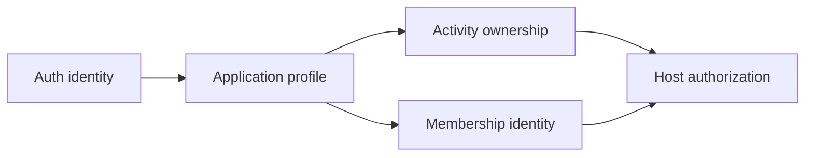

This does not mean every visitor must authenticate. Anonymous browsing remains independent; identity becomes necessary at Join or Host.

## 2. Backend, database, and Supabase

A backend is the trusted software and infrastructure behind the client. It may contain an API server, database, authentication service, background workers, and observability. A database is one backend component, not the entire backend.

Supabase is a hosted platform whose relevant parts are:

- **Auth:** verifies phone OTP and issues sessions.
- **PostgreSQL:** durably stores product data.
- **PostgREST/data API:** can expose permitted tables/functions over HTTP.
- **Realtime/Storage/Functions:** optional capabilities for later needs.

NearHere initially uses Supabase Auth and PostgreSQL. Complex activity commands remain behind a trusted application/database operation rather than arbitrary client table updates.

## 3. Authentication identity versus application profile

`auth.users` is managed by Supabase and contains authentication-sensitive identity. Supabase deliberately does not expose that schema through the normal generated data API.

NearHere needs an application `public.profiles` table for display name, interests, and future avatar configuration. `public` is the PostgreSQL schema name exposed to Supabase's data API; it does not mean the table should be anonymously readable:

```mermaid
erDiagram
    AUTH_USERS ||--|| PROFILES : "same UUID"
    AUTH_USERS {
      uuid id PK
      phone protected
      json metadata
    }
    PROFILES {
      uuid id PK_FK
      text display_name
      enum onboarding_status
      jsonb avatar_config
      text_array interests
    }
```

The same UUID provides a one-to-one relationship. `on delete cascade` removes the profile when the Auth user is deleted. We do not duplicate the phone number or a phone hash into the application table because it adds exposure and synchronization work without a product requirement.

## 4. What a database migration is

A migration is an ordered source-controlled program that changes the database schema from one known version to the next. The filename timestamp orders the history:

```text
empty database
  -> 202608150001_create_profiles.sql
  -> 202608150002_create_activities.sql
  -> future participation-command migration
```

Dashboard clicks are difficult to review, reproduce, or apply consistently across development, staging, and production. A migration provides an auditable record and lets a fresh database reach the same shape.

Migrations require more caution than ordinary app code because production data may outlive every binary. Prefer forward-compatible expansion, deploy code, migrate/backfill, and only later remove old structures.

## 5. Tables, keys, and constraints from first principles

A table represents a set of similar facts. A row is one fact instance, and a column has a database type.

- A **primary key** uniquely identifies a row. `profiles.id` is a UUID.
- A **foreign key** guarantees the referenced identity exists. `profiles.id` references `auth.users.id`.
- `not null` prevents absence where the domain requires a value.
- A `check` constraint rejects values outside a valid rule, such as too many interests.
- A default supplies a server-owned initial value.

Constraints protect every writer: mobile client, API, administrative script, migration, or future service. Client validation improves feedback, but a modified client cannot bypass a database constraint.

## 6. Trigger lifecycle

The migration installs an `after insert` trigger on `auth.users`:

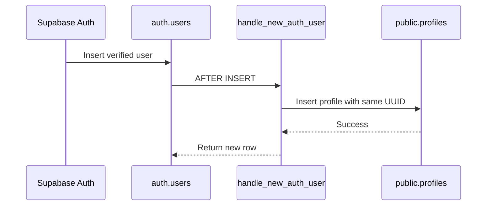

A trigger runs automatically inside the database transaction. This guarantees the profile relationship for all signup paths. It also creates a risk: if the trigger fails, it can block signup. Therefore the function is minimal, uses schema-qualified names, and must be tested against the real development database.

The separate `before update` trigger maintains `updated_at` using server time rather than trusting a phone clock.

## 7. Row Level Security

Row Level Security (RLS) attaches authorization policies to a table. Conceptually, PostgreSQL adds a filter or check to each operation.

```sql
using ((select auth.uid()) = id)
with check ((select auth.uid()) = id)
```

`using` decides which existing rows the actor may target. `with check` decides whether the resulting row remains allowed. Column grants separately ensure a user cannot update `id`, creation time, or server-managed update time.

Defense in depth looks like this:

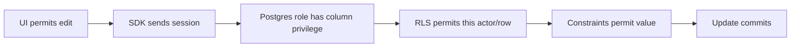

No single client check is trusted. The initial policy permits an authenticated user to read and edit only their own profile. Anonymous discovery will later receive a smaller host-summary response deliberately shaped by the NearHere API. Authentication secrets remain in `auth.users`.

## 8. Public key versus secret key

The Supabase URL and publishable key are embedded in the mobile JavaScript bundle. `EXPO_PUBLIC_` is an explicit warning that a value is readable by app users. The key selects the Supabase project and maps anonymous/authenticated requests into restricted database roles; it is not the main authorization mechanism.

The service-role key bypasses normal Row Level Security and is a secret. Embedding it in a mobile binary would let anyone extract it and obtain privileged data access. It belongs only in a protected server or controlled operations environment.

## 9. Local work versus external state

This lesson created the migration and contracts locally. A real phone flow still requires user-owned external actions:

```text
Create Supabase development project
  -> configure phone provider/test path
  -> apply migration
  -> test trigger and RLS actor matrix
  -> add URL/publishable key to ignored local .env
  -> restart Metro
  -> request and verify a real/test OTP
  -> restart app and verify session restoration
```

The project can start on Supabase's free development tier, but SMS delivery is a separate provider service and may cost money. Limits and pricing are operational inputs that must be checked before launch.

## 10. Challenge: local database tools were unavailable

**Symptom:** `supabase --version` and `psql --version` both returned command-not-found errors.

**Impact:** the SQL could be designed and statically reviewed, but its triggers, grants, and RLS policies could not honestly be claimed as executed.

**Rejected shortcut:** paste the SQL into an unapproved external project or state that static review proves runtime behavior. Either would create external state without the developer's account decision or overstate verification.

**Resolution:** preserve the schema as a versioned migration, document the official CLI/project sequence and explicit actor test matrix, and leave database execution open in the backlog.

**Lesson:** source-code completion and deployed-system verification are different milestones. A trustworthy engineer states which one is complete.

## 10.1 Project creation security defaults

The Supabase project wizard can enable the Data API, automatically expose new tables, and automatically enable Row Level Security. These controls solve different problems:

- The **Data API** turns permitted PostgreSQL objects into an HTTP-accessible interface.
- **Automatically expose new tables** grants Data API roles access to new objects by default.
- **Automatic RLS** installs a database event trigger that enables Row Level Security on new tables in the exposed schema.

NearHere enables the Data API, disables automatic table exposure, and enables automatic RLS. This is a fail-closed posture: a newly created table is unavailable until a reviewed migration deliberately grants privileges and adds policies.

Our migrations still include `alter table ... enable row level security`. Explicit migration SQL makes the intended security state reproducible in every environment, while project-level automatic RLS protects accidental dashboard-created tables.

The controls form two different authorization levels:

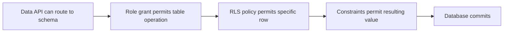

Disabling automatic exposure means future tables do not automatically receive grants for Data API roles. Enabling automatic RLS means future exposed-schema tables automatically have row security switched on. Together, an accidental new table has no implicit client privilege and no permissive row policy.

The full first-principles explanation, examples, request sequence, and misconception table live in `supabase/README.md` so the operational setup and security model remain next to the migrations.

## 10.2 Challenge: Supabase displayed Next.js environment-variable names

**Symptom:** the Supabase Connect dialog provided `NEXT_PUBLIC_SUPABASE_URL` and `NEXT_PUBLIC_SUPABASE_PUBLISHABLE_KEY`, while NearHere's client reads `EXPO_PUBLIC_SUPABASE_URL` and `EXPO_PUBLIC_SUPABASE_PUBLISHABLE_KEY`.

**Root cause:** environment-variable naming is partly a build-tool convention. `NEXT_PUBLIC_` is consumed by Next.js client builds; `EXPO_PUBLIC_` is statically substituted by Expo CLI into a React Native JavaScript bundle. Supabase's underlying URL and publishable-key values are framework-independent, but the variable names in each codebase are not.

**Rejected fix:** copy the Next.js names unchanged. NearHere's `process.env.EXPO_PUBLIC_...` expressions would remain undefined and the app would continue to report that authentication was not configured.

**Resolution:** store the public values in the Git-ignored `apps/mobile/.env` using the exact Expo names already documented in `.env.example`.

**Verification:** a non-secret health check loaded both Expo variables and received HTTP 200 from the project's Supabase Auth health endpoint. No value was printed. This proves service reachability and accepted public configuration, not SMS, migrations, RLS behavior, or mobile session restoration.

**Lesson:** an environment variable is found by exact name. “Public” prefixes describe client visibility and build-tool behavior; they do not encrypt a value or make a secret safe for client code.

## 10.3 Deploying and verifying the first migration

The Supabase CLI was authorized through its browser verification flow, initialized in the repository, and linked to the healthy `NearHere Dev` project. `supabase init` created `config.toml`, which defines local ports, database major version, Auth settings, and other local stack behavior as version-controlled configuration.

Before changing the database, `db push --dry-run` proved that exactly one migration was pending. The real push then applied `202608150001_create_profiles.sql`.

Verification used two independent surfaces:

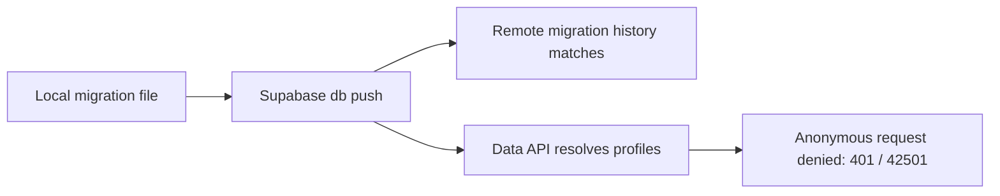

Matching migration history proves Supabase recorded the version. The Data API response proves the table exists and the anonymous role cannot access it. Neither proves the new-user trigger or authenticated owner/cross-user policy; those require real authenticated actors.

### Challenge: Docker catalog warning after a successful remote push

**Symptom:** after applying the migration, the CLI warned that it could not inspect a Docker image or cache the `pg-delta` migrations catalog because the Docker daemon was unavailable.

**Hypotheses:** the migration might have failed entirely, it might have applied but failed during optional post-processing, or the remote history might be inconsistent.

**Investigation:** the CLI's ordered output showed the migration being applied before the warning and ended with `Finished supabase db push`. A fresh remote migration list showed matching version `202608150001`. An anonymous Data API request reached `profiles` and returned permission error `42501` rather than a missing-table error.

**Root cause:** Docker was unavailable for local schema-catalog inspection/caching. The hosted database connection and migration execution used a different path and had completed.

**Resolution:** retain the warning as a local-tooling prerequisite, verify remote state independently, and avoid claiming that local reset/schema-diff testing has passed.

**Lesson:** warnings must be interpreted in execution order and verified against the affected subsystem. A successful command line is useful evidence, but independent state checks make the conclusion defensible.

## 10.4 Test OTP, hosted configuration, and Docker from first principles

A test OTP is a server-side exception for a deliberately fictional development phone number. Supabase Auth skips external SMS delivery for that mapping and accepts only the configured fixed code. The rest of the authentication pipeline remains real: user creation, OTP verification, session issuance, token refresh, the profile trigger, and RLS checks all execute against Supabase.

That distinction matters:

| Approach | What it tests | What it misses |
| --- | --- | --- |
| Client-side “pretend signed in” flag | Screen navigation only | Auth, tokens, trigger, RLS, restoration |
| Supabase fixed test OTP | Real Auth/session/database path | SMS-provider delivery |
| Real phone OTP | Full path including delivery | Nothing in the basic login path |

Docker solves a different problem. A production-shaped backend consists of multiple long-running programs. Installing and coordinating every program directly on a laptop is slow and version-sensitive. A container packages one service and its runtime; Docker starts those containers on a private network and gives stateful services named volumes.

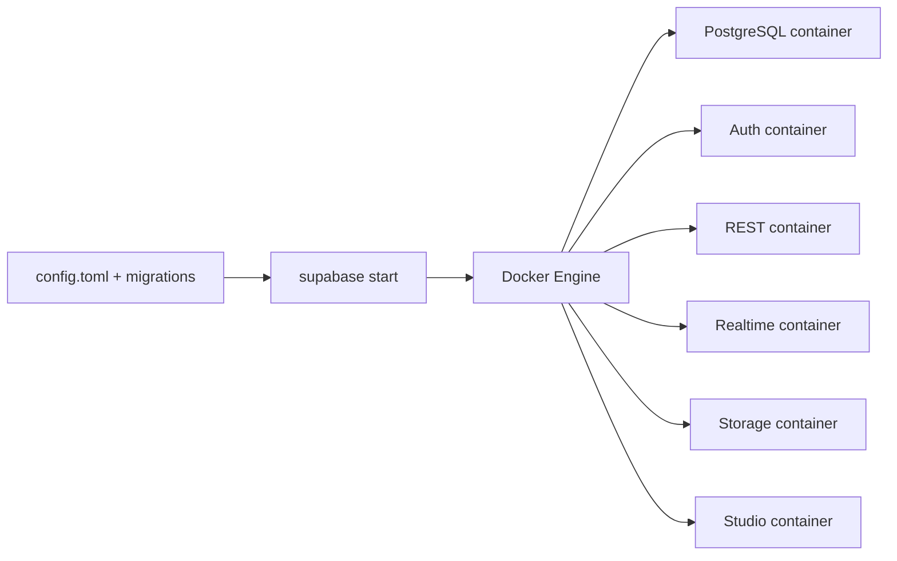

The container is not a lightweight virtual machine in the everyday sense. On Linux it is an isolated process sharing the host kernel; Docker Desktop supplies the Linux environment needed to run those containers on macOS. An image is the immutable packaged template, a container is a running instance, a volume preserves database files, and a network lets the services address each other predictably.

For NearHere, Docker enables:

- `supabase start`: run the private local stack;
- `supabase db reset`: destroy and recreate only the local database from migrations and seed data;
- repeatable migration/RLS/integration tests without touching hosted data;
- local fixed OTP and captured email without paying an external provider;
- schema-diff/catalog tooling that expects the matching Postgres image.

Docker is not required for the Expo app, iOS Simulator, TypeScript compilation, calls to hosted Supabase, or the remote migration already deployed.

### Challenge: a narrow OTP request exposed a broad configuration command

**Intent:** enable one fixed development OTP on the hosted project.

**Risk discovered:** `supabase config push` has no dry-run or field-selection flag. It pushes the generated `config.toml`, which contains many Auth, URL, email, provider, and runtime defaults. Using it for one OTP could silently change unrelated hosted settings.

**Resolution:** do not perform the broad push and do not commit the fixed hosted code. Use either a narrow hosted dashboard/Management API update or a local Docker stack. Keep `auth.sms.enable_signup = true` as the intended version-controlled development setting, while treating the actual hosted test identity as restricted operational configuration.

**Lesson:** configuration changes have a blast radius just like database migrations. Before applying one, identify whether the tool patches a field, merges a section, or replaces a whole configuration document.

### Challenge: three test-OTP representations looked plausible

**Symptom:** the first two narrow Management API requests returned HTTP 400. The initial `phone:code` value came from self-hosted environment documentation. Encoding a JSON phone-to-code object as a string also looked reasonable because the Auth server's internal configuration is a map.

**Evidence:** the hosted Management API returned its own validation contract: `sms_test_otp` must be a comma-separated list of `phone-number=code`, and each phone number must be E.164 digits without the leading `+`.

**Resolution:** send the hosted field as `phone=code`, set an explicit expiration, and keep the real development mapping out of Git. The third request returned HTTP 200.

**Lesson:** equivalent domain data can have different serialized representations at different boundaries. An internal map, a self-hosted environment variable, a TOML table, and a hosted Management API string are not interchangeable merely because they represent the same phone-to-code relationship. Preserve and test the contract at the boundary being called.

### Hosted authentication evidence

The configured fictional identity was tested directly through the public Auth endpoints. OTP request and verification both returned HTTP 200, the verification response contained a real session, and the authenticated Data API request returned exactly one profile with `needs_profile` onboarding state. Temporary files containing session tokens were deleted without printing their contents.

This proves the hosted Auth-to-database path:

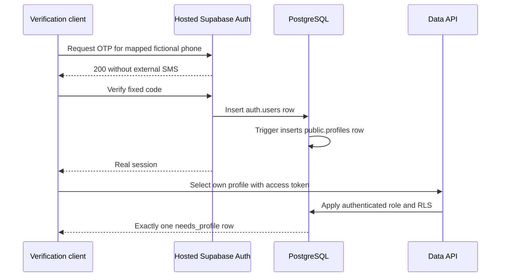

It does not prove that one user cannot read another user's profile. Session restoration was subsequently confirmed in the mobile application; cross-user authorization is a separate independent check.

## 11. Lesson 4 files introduced or changed

- `packages/contracts/user.ts` defines public profile vocabulary without auth secrets.
- `supabase/migrations/202608150001_create_profiles.sql` defines the executable schema/policies.
- `supabase/README.md` defines deployment and verification.
- `docs/system-design.md`, `data-model.md`, and `api-spec.md` explain responsibilities at different abstraction levels.

## 12. Lesson 4 interview explanation

> I designed and deployed the initial identity data boundary for a mobile application using Supabase Auth and PostgreSQL. Authentication-sensitive phone data remains in the protected Auth schema, while a one-to-one application profile is created by a minimal database trigger. I added constraints, column-level grants, and Row Level Security so authenticated users can update only permitted fields on their own profile. I verified migration history, anonymous denial, hosted fixed-OTP session issuance, trigger execution, and one owner read while keeping the remaining two-actor authorization matrix explicit.

## 13. Lesson 4 honest resume addition

- Designed a Supabase/PostgreSQL identity foundation with versioned migrations, one-to-one Auth profiles, automatic profile provisioning, constraints, least-privilege column grants, and Row Level Security policies.

# Lesson 5: Runtime-safe profile onboarding

## 1. The user journey and why it is a vertical slice

After OTP verification, NearHere must do more than show a success message. It must connect the authenticated identity to the database profile, collect the minimum public information, enforce the rule at every boundary, survive network errors, and show the result in the account UI.

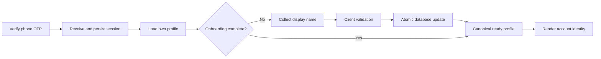

This is vertical because it crosses navigation, React state, a network adapter, runtime validation, TypeScript contracts, PostgreSQL constraints, RLS, error handling, tests, and user-visible UI.

## 2. Compile-time types versus runtime data

TypeScript checks source code before the app runs. The annotation `data: UserProfile` can help the compiler, but it cannot force an HTTP server to return that shape. Types are erased from the JavaScript bundle.

NearHere therefore uses three representations:

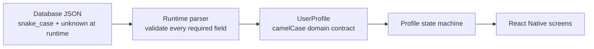

- `packages/contracts/user.ts` is provider-independent domain vocabulary.
- `lib/profile-validation.ts` treats network input as `unknown`, validates it, and maps `display_name` to `displayName`.
- `lib/profile-repository.ts` knows Supabase query syntax but returns only domain results.
- Screens and providers do not depend on PostgREST response internals.

This adapter boundary makes a future API migration smaller: the UI can keep consuming `UserProfile` even if the transport changes.

## 3. Why a profile repository exists

A repository is a small module that hides storage/transport details behind product-shaped functions. NearHere exposes `getMyProfile(userId)` and `completeMyProfile(userId, displayName)` instead of scattering `.from('profiles')` queries through screens.

The query selects explicit columns rather than `*`. Explicit selection reduces accidental exposure when a later migration adds a column. The client never inserts or upserts a profile because the database signup trigger owns creation. If a row is unexpectedly missing, the app shows a retry/support failure instead of creating data through an unauthorized fallback.

Display name and onboarding status are updated in one database statement:

```text
UPDATE profiles
SET display_name = normalized_name,
    onboarding_status = 'complete'
WHERE id = authenticated_user_id
RETURNING allowed_profile_columns
```

This is **atomic**: PostgreSQL commits both changes or neither. Setting the status first would violate the database rule that a completed profile must contain a valid display name. Returning the canonical row avoids assuming that local input equals stored truth.

## 4. The profile state machine

Several independent booleans such as `loading`, `saving`, `hasProfile`, and `hasError` can represent impossible combinations. A discriminated union gives exactly one meaningful state at a time:

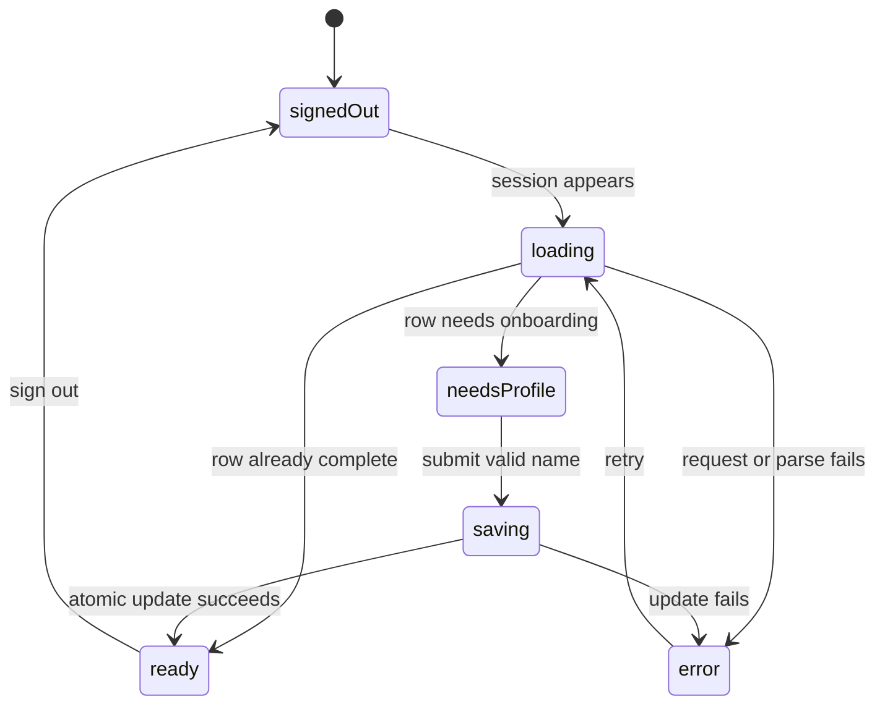

The `profile` object is unavailable in states where it is not safe to use and required in states where the UI needs it. TypeScript narrows the union after checking `state.status`, so accessing `state.profile.displayName` is legal only in the `ready` branch.

The provider also uses a monotonically increasing request ID. If user A signs out while a slow request is running, that old response cannot populate user B's state. This is a practical defense against asynchronous race conditions.

## 5. Session restoration is an application gate

AsyncStorage restoration is asynchronous. During startup, `session === null` can mean either “confirmed signed out” or “not checked yet.” Rendering protected actions immediately would briefly show the wrong account state and could open an unnecessary sign-in screen.

The root navigator therefore waits in `restoring`. A read failure becomes a visible `restoreError` with Retry rather than silently treating the user as signed out.

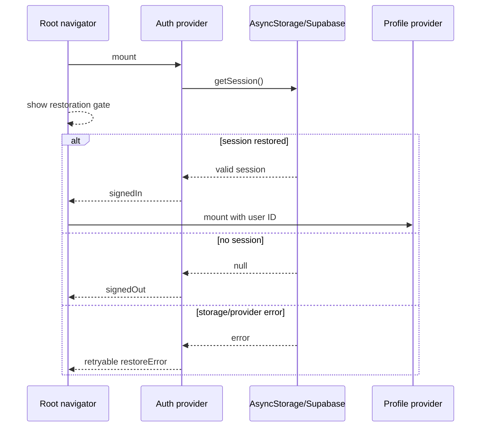

The user verified restoration by restarting the app and observing the authenticated state return. This is interaction evidence, while lint/type/bundle checks cover different failure classes.

## 6. Validation and defense in depth

The form trims the display name and checks 2–40 characters for immediate feedback. The runtime parser rechecks server data. PostgreSQL constraints remain authoritative because an attacker can bypass the UI and call the Data API directly.

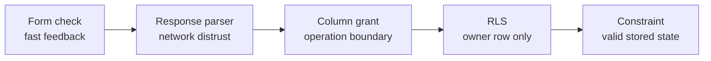

These layers are complementary, not duplicates. Each protects against a different class of failure.

## 7. Testing strategy

The local unit suite uses Node's test runner and has no new testing dependency. It verifies name boundaries, database-to-domain mapping, onboarding-state rules, and rejection of malformed data. Lint checks code-quality rules; `tsc --noEmit` checks compile-time contracts; Expo export proves Metro can create an iOS production bundle.

The hosted RLS harness under `supabase/tests/hosted` is deliberately separate. With two fictional test identities it will prove:

- anonymous requests cannot read profiles;
- each actor can read and update their own allowed fields;
- actor A cannot read or change actor B;
- protected columns, insert, and delete remain denied;
- database constraints reject invalid values;
- test mutations are restored in `finally`.

It never prints phone numbers, OTPs, access tokens, refresh tokens, or raw Auth responses. It is a manual/pre-release check rather than a per-commit CI job because hosted OTP endpoints have operational rate limits. Deleting an Auth user to prove cascade behavior is deferred to an isolated local stack or protected admin harness; the service-role credential never belongs in mobile configuration.

## 8. Challenges and resolutions

### Challenge: restoration errors looked like signed-out users

**Cause:** the original provider ignored the `getSession()` error and account UI branched only on a nullable session.

**Resolution:** introduce explicit `restoring` and `restoreError` states, gate the root navigator, and expose a retry operation.

**Lesson:** absence of data and failure to load data are different states.

### Challenge: late asynchronous results can cross account boundaries

**Cause:** promises cannot always be cancelled after a request has reached the network.

**Resolution:** increment a request identifier whenever the active user changes and ignore a response whose identifier is stale.

**Lesson:** authentication changes invalidate all user-scoped in-flight work and cached state.

### Challenge: generated TypeScript types are not runtime validation

**Cause:** compile-time types disappear and remote JSON can be malformed, stale, or unexpectedly shaped.

**Resolution:** accept `unknown` at the repository boundary and explicitly validate/map the row before it reaches React state.

**Lesson:** every external boundary needs both a compile-time representation and runtime validation.

### Current limitation: protected intent is memory-only

Join/Host intent and the pending phone number survive the continuous OTP flow but not process death in the middle of verification. Persisting them now would introduce expiry, cleanup, replay, and privacy rules before the real Join/Host operations exist. This resilience work remains deferred and must be designed before production.

## 9. Lesson 5 files introduced or changed

- `apps/mobile/lib/profile-validation.ts` validates and maps external profile JSON.
- `apps/mobile/lib/profile-repository.ts` contains explicit owner-profile queries.
- `apps/mobile/providers/profile-provider.tsx` owns the profile state machine and stale-request guard.
- `apps/mobile/app/onboarding/profile.tsx` implements minimum display-name onboarding.
- `apps/mobile/app/_layout.tsx` gates navigation during session restoration.
- `apps/mobile/app/(tabs)/me.tsx` renders profile-aware account states.
- `apps/mobile/lib/profile-validation.test.mjs` covers the runtime boundary.
- `supabase/tests/hosted/profiles-rls.mjs` contains the manual two-actor security matrix.

## 10. Verification evidence

- ESLint: passed.
- Strict TypeScript compile (`tsc --noEmit`): passed.
- Profile runtime unit tests: 6 passed, 0 failed.
- iOS production bundle export: passed with 1,469 modules.
- Hosted fixed OTP/session/profile trigger: passed earlier.
- Mobile session restoration after restart: user-confirmed.
- Display-name onboarding interaction: Actor C saved `Test Participant C` in
  the rebuilt iPhone 17 Pro Simulator; onboarding remained visible until save.
- Two-actor hosted RLS matrix: passed on 2026-09-04, covering distinct actors,
  trigger-created rows, anonymous denial, owner reads and updates, cross-user
  isolation, protected-column/insert/delete denial, constraints, and cleanup.
- Operational observation: the first OTP request received a transient HTTP 502.
  An Auth health request returned HTTP 200, and a deliberate retry completed
  the entire matrix. No security assertion was counted from the failed attempt.

## 11. Interview explanation

> I implemented a runtime-safe mobile profile onboarding slice on top of Supabase Auth and PostgreSQL. I separated provider-specific database rows from camelCase domain contracts using a repository and runtime parser, modeled loading/onboarding/saving/error behavior as a discriminated state machine, prevented stale cross-account responses with request IDs, gated navigation during asynchronous session restoration, and completed onboarding with one atomic RLS-protected update. I added unit tests, a production bundle check, and a credential-safe two-actor RLS harness.

## 12. Honest resume addition

- Built a React Native/Supabase identity and profile vertical slice with persisted phone sessions, retryable restoration, runtime-validated data adapters, atomic onboarding, owner-only RLS, stale-request protection, and layered automated verification.

# Next lesson

At the time Lesson 5 ended, the next planned slice was PostGIS activity creation/discovery. That slice is now implemented in Lesson 6; its remaining acceptance checks are listed at the end of that lesson.

# Lesson 6: The first real PostGIS activity slice

## 1. From fixtures to system-of-record data

Fixtures are hard-coded examples used to build presentation before a backend exists. They are useful when clearly labeled, but must not silently become product truth. Lesson 6 removes `prototype-activities.ts`; the map now renders the hosted database result and honestly shows an empty state when no activity exists.

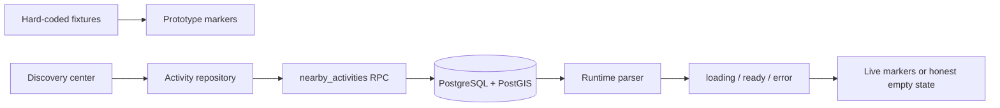

The database is the **system of record**: the authoritative durable source. React state is a temporary view that may be loading, stale, or unavailable.

## 2. Why PostGIS exists

Numeric latitude/longitude columns can store coordinates, but radius queries become awkward and inefficient at scale. PostGIS extends PostgreSQL with geographic types, distance functions, and spatial indexes.

NearHere uses `geography(Point, 4326)`: `Point` represents one coordinate; SRID 4326 means WGS84; geography distance is measured in metres. Longitude is X and latitude is Y—reversing them produces a valid-looking but wrong location. A GiST index lets compatible spatial predicates narrow candidate rows efficiently.

`ST_DWithin(public_point, query_point, radius_m)` performs the bounded radius predicate. Remaining candidates are ordered by calculated distance.

## 3. Privacy by data architecture

Hiding an exact point in the UI is not privacy. If the response contains it, an attacker can inspect network traffic or modify the app.

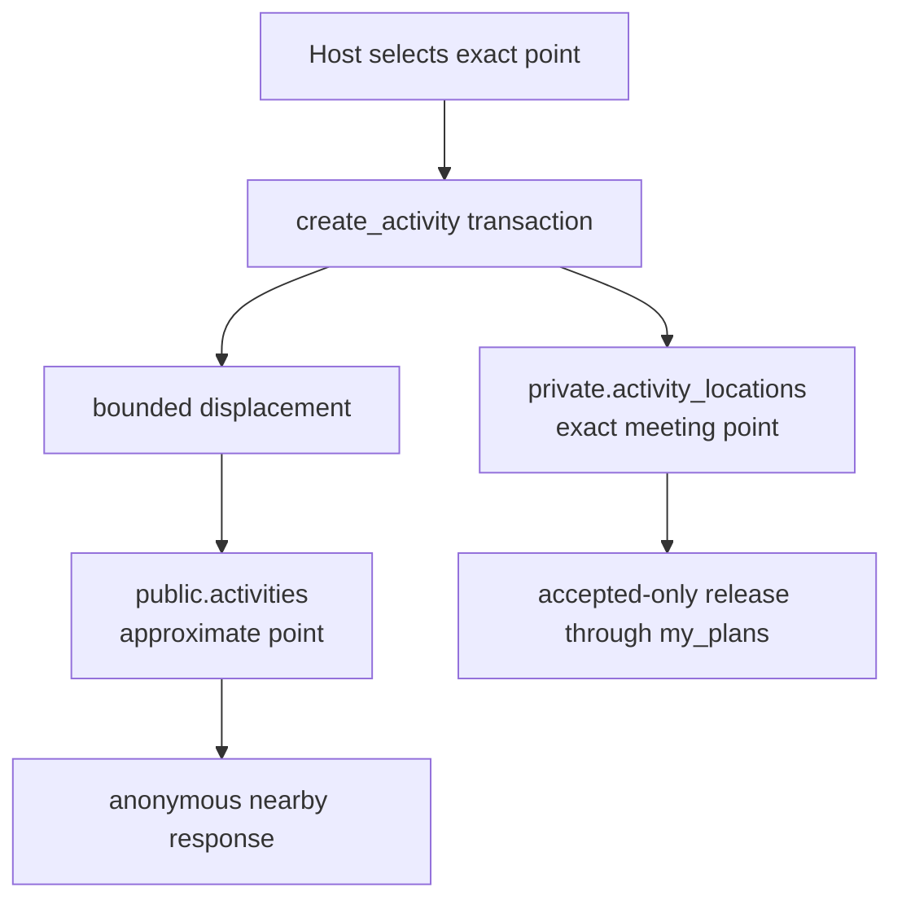

The `private` schema is not exposed through the Data API and client roles receive no grant. The public table never contains exact geometry, reducing the chance that a future `SELECT *`, generated client, or permissive policy leaks it.

Version one moves the public marker into the outer 40% of a configured 150–1,000 metre radius. This is an approximation mechanism, not formal anonymity: repeated events, sparse geography, landmarks, or descriptive text may still reveal a venue. Privacy must be evaluated with realistic local data before beta.

## 4. Transactional creation

One Host action creates a public activity, private meeting point, and accepted host membership. The function performs all three in one transaction. If any constraint or insert fails, PostgreSQL rolls back everything.

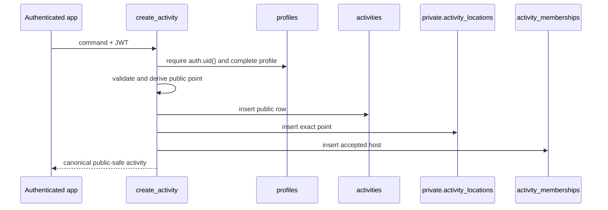

The actor comes from `auth.uid()` rather than a client-supplied host ID. A client can request creation but cannot claim another identity.

## 5. Security-definer boundary

Supabase recommends `security invoker` by default. Here, client roles intentionally have no direct table access, so narrowly scoped functions need controlled elevated access for the transaction and safe public projection.

Each definer function sets `search_path = ''`, schema-qualifies objects, validates actor/input rules, returns explicit columns, revokes default execute access, and regrants only intended roles. `create_activity` is authenticated-only. `nearby_activities` allows anonymous execution but returns no host UUID, exact point, phone, membership row, or private field.

## 6. Mobile repository and state

RPC data arrives as unknown `snake_case` JSON. `activity-validation.ts` checks enums, timestamps, coordinates, distances, capacity, and strings before mapping to camelCase contracts.

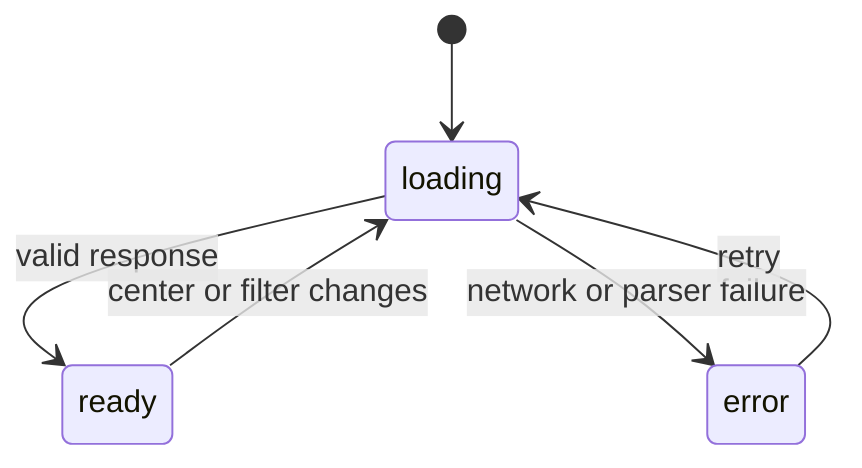

A request ID prevents a slow old center/filter result from overwriting a newer request. An empty array is `ready`, not an error.

## 7. Host form decisions

The first form supports type, bounded title/description, three start presets, one-hour duration, capacity, open/approval mode, and the selected map point. Full date/time and place editing come after end-to-end transaction acceptance.

The form explains that the selected coordinate is private and discovery receives a separately generated approximate marker within 350 metres. Client checks improve feedback; database constraints remain authoritative.

## 8. Verification evidence

```text
additive migration
  -> dry run: one pending file
  -> apply to development
  -> confirm migration history
  -> call safe anonymous RPC
  -> test invalid input
  -> attempt anonymous create and direct select
```

Observed:

- migration `202608150002` was recorded remotely;
- anonymous nearby discovery returned HTTP 200 and an empty list;
- invalid latitude returned HTTP 400 / `22023`;
- anonymous creation and direct table selection returned HTTP 401 / `42501`;
- hosted lint of NearHere-owned `public,private` schemas found no errors;
- mobile lint and strict TypeScript checks passed;
- all 11 runtime unit tests passed;
- Simulator displayed the live empty state and Host form.

The empty response does not prove successful creation, filters against rows, public-point displacement, or query-plan quality. Those require a completed test profile and deliberate development activity.

## 9. Challenges and lessons

### Empty success has limited meaning

HTTP 200 with `[]` proves routing, permission, validation, SQL execution, and serialization. It does not prove behavior against real rows. State precisely which claims each test supports.

### Safe projection without table access

Granting anonymous `SELECT` and trusting callers to request safe columns was rejected. A modified request could request every granted column. The solution is no direct table privilege plus an explicit trusted function response.

### Ambiguous distance semantics

Discovery distance means distance from the search center; creation has no search center. Public/private displacement is another number with the same unit but different meaning. `ActivitySummary` therefore has no distance; `NearbyActivitySummary` adds discovery distance only.

## 10. Interview explanation

> I implemented a privacy-aware activity slice using PostgreSQL, PostGIS, Supabase RPC, and React Native. Exact meeting geography is isolated in a non-exposed schema, while a transaction derives approximate public geography and atomically creates the activity plus host membership. Anonymous discovery uses indexed `ST_DWithin` through a least-privilege function. The mobile repository runtime-validates JSON, prevents stale-request races, and renders loading, empty, error, and success states.

## 11. Honest resume addition

- Built and deployed a PostGIS-backed mobile activity discovery/creation slice with privacy-separated geometry, transactional host membership, indexed radius queries, least-privilege RPC boundaries, runtime-validated TypeScript adapters, and native loading/error/empty states.

# Lesson 7: Capacity-safe and retry-safe Join

## 1. Why Join is a transaction, not a table update

A naive client could read `participant_count = 7`, see capacity 8, and insert itself. If two clients do this concurrently, both can observe the old count and both can accept. This is a **race condition**: individually reasonable operations produce an invalid combined result because their critical steps interleave.

The decision must happen next to authoritative membership data inside one database transaction:

```mermaid
flowchart LR
    AUTH["Derive actor from session"] --> PROFILE["Require complete profile"]
    PROFILE --> LOCK["Lock activity row"]
    LOCK --> EXIST["Check existing membership"]
    EXIST --> COUNT["Count accepted memberships"]
    COUNT --> DECIDE["accepted / pending / waitlisted"]
    DECIDE --> WRITE["Write one membership"]
    WRITE --> RETURN["Return canonical status and count"]
```

The mobile app requests a transition; it never writes `status = accepted` directly.

## 2. Row locking from first principles

`SELECT ... FOR UPDATE` acquires an exclusive row lock until the transaction ends. Another transaction that needs the same activity row waits. When it resumes, it counts after the first transaction's commit, so the last place cannot be decided twice from one stale count.

The lock is deliberately **per activity**, not global. People joining activity A do not wait for activity B. This is the smallest serialization boundary that protects the capacity invariant.

Row locking is a correctness design, not proof by itself. A second-user concurrent hosted test remains necessary to demonstrate that one final-place request is accepted and the other is waitlisted.

## 3. Outcome semantics

| Condition | Outcome | `joined_at` | Accepted-capacity effect |
| --- | --- | --- | --- |
| Approval mode | `pending` | `null` | None until future host approval |
| Open mode with room | `accepted` | Server time | Increases accepted count |
| Open mode at capacity | `waitlisted` | `null` | None |
| Existing active membership | Existing state | Unchanged | No duplicate effect |

`pending` is a request awaiting a host decision. `waitlisted` means open joining was allowed but accepted capacity was full. They are different business states even though neither consumes a place yet.

The schema already contains `rejected`, `left`, and `removed`, but Lesson 7 does not implement those commands. An enum value existing in PostgreSQL is not the same as a user journey being complete.

## 4. Natural-key idempotency

Mobile networks retry. A user can also tap again after a response is delayed. If retrying Join inserted another row or incremented a counter again, the system would corrupt capacity.

NearHere's membership primary key is `(activity_id, user_id)`: one actor has one durable membership identity per activity. `join_activity` first returns an existing `accepted`, `pending`, or `waitlisted` status. The unique key and early return make this command semantically idempotent without a client-generated key.

This is not a universal idempotency solution. A later create/payment/message command may need a supplied key, request fingerprint, stored response, expiration, and mismatch detection. Use natural identity when it completely represents “the same logical operation”; use explicit idempotency records when it does not.

## 5. Authentication, authorization, and profile gates

The server derives `auth.uid()` from the verified session. It rejects anonymous calls and requires `profiles.onboarding_status = complete`. The mobile layer mirrors those gates for UX:

```mermaid
sequenceDiagram
    actor User
    participant App
    participant Auth as Supabase Auth
    participant Profile as Profile provider
    participant Join as join_activity
    User->>App: Tap Join
    alt Signed out
        App->>App: Preserve joinActivity intent
        App->>Auth: Phone OTP
    end
    App->>Profile: Load/complete minimum profile
    Profile-->>App: ready
    App->>Join: Resume activity ID with session
    Join-->>App: accepted / pending / waitlisted
    App->>App: Refresh discovery and show exact outcome
```

Client gates are helpful but bypassable. Database authentication, execute privilege, actor derivation, profile check, lock, primary key, and transaction remain authoritative.

## 6. Mobile boundary and failure states

`activity-repository.ts` calls the RPC and maps stable server errors into user-safe messages. `activity-validation.ts` treats the response as unknown and accepts only a known membership status plus a non-negative authoritative count. The map disables the active Join control, resumes a protected intent after Auth/onboarding, refreshes nearby activity counts after success, and displays outcome-specific copy.

This layering separates concerns:

- the screen owns interaction and feedback;
- the repository owns transport/provider syntax;
- the parser owns runtime trust;
- PostgreSQL owns identity, capacity, idempotency, and durable state.

## 7. Deployment and acceptance evidence

- migration `202608150003` is present in local and hosted history;
- anonymous Join returned HTTP 401 / PostgreSQL `42501`;
- an authenticated Host activity was created and rediscovered in Simulator;
- tapping Join as that existing host returned `accepted` and kept participant count at one;
- retry semantics therefore preserved the existing host membership instead of inserting a participant duplicate;
- mobile lint, strict TypeScript, unit tests, and production bundling cover their respective static/runtime build boundaries.

The same-host path is valuable idempotency evidence but not a substitute for a second actor. Still unverified: a new participant accepted into open capacity, approval-mode `pending`, full-capacity `waitlisted`, and two simultaneous requests racing for the final place.

## 8. Challenge: idempotency without overbuilding infrastructure

**Risk:** adding a general idempotency table, request fingerprints, response replay, cleanup jobs, and API headers before the first Join could delay the vertical slice.

**Observation:** membership already has a durable natural identity and Join has no payload beyond the activity ID.

**Resolution:** use the composite primary key plus existing-state early return for Join, document its exact limits, and keep the general idempotency-record design for commands that need it.

**Lesson:** reuse a domain invariant when it provides the whole guarantee, but do not generalize a narrow guarantee into a false system-wide claim.

## 9. Interview explanation

> I implemented a capacity-safe Join command in PostgreSQL and React Native. The database derives the actor from the session, requires profile completion, and locks one activity row before evaluating membership and capacity, which serializes competing decisions without blocking unrelated activities. A composite membership key and existing-state return make retries idempotent. The mobile client preserves protected intent through OTP/onboarding, runtime-validates the RPC response, refreshes server state, and renders accepted, pending, or waitlisted outcomes. At the end of Lesson 7 I had verified anonymous denial and the existing-host retry path while keeping the second-user concurrency matrix explicitly pending; Lesson 9's 2026-08-15 A/B/C/D run subsequently closed that evidence gap.

## 10. Honest resume addition

- Built and deployed a transactional activity-Join workflow using PostgreSQL row locks, natural-key idempotency, session-derived authorization, runtime-validated TypeScript adapters, and resumable React Native authentication/profile gates.

# Lesson 8: Caller-scoped My Plans and accepted-only private details

## 1. Why a list screen is a backend/security slice

It is easy to think “Plans” means rendering cards. The screen actually asks a security-sensitive question: **which activity facts may this authenticated caller see, and which private fields may be released for each membership state?** A client-side filter is not enough because the phone is controlled by the user. The safe response must be shaped before private data crosses the network.

```mermaid
flowchart LR
    UI["Plans UI"] --> HOOK["State/lifecycle hook"]
    HOOK --> REPO["Supabase repository"]
    REPO --> RPC["my_plans read model"]
    RPC --> TABLES["Authoritative tables"]
    TABLES --> RPC
    RPC --> PARSER["Runtime validation"]
    PARSER --> HOOK
    HOOK --> UI
```

This is a vertical slice because it crosses database authorization, response shaping, shared TypeScript contracts, runtime validation, a repository adapter, React lifecycle/state, navigation/Auth intent, UI states, tests, hosted deployment, and Simulator acceptance.

## 2. Caller-scoped authorization from first principles

The mobile app does not call `my_plans(userId)`. It calls `my_plans(limit)` with its access token. Supabase validates the token, and PostgreSQL's `auth.uid()` supplies the actor identity. The query then includes `membership.user_id = actor`.

This distinction matters:

```text
Unsafe: client says userId = X -> server trusts X -> changing X may expose another account
Safe:   verified token -> server derives actor -> query scopes rows to that actor
```

Authentication answers “who is calling?” Authorization answers “which rows and fields may that caller receive?” The read model performs both the caller row filter and the field-level release decision. Anonymous execution is revoked, and the base tables remain unavailable to normal client roles.

## 3. Read models and projections

The database stores normalized facts in separate places: activities, memberships, host profiles, accepted counts, and private locations. The Plans screen should not issue five client queries and combine them. That would create extra round trips, inconsistent snapshots, and more opportunities to mishandle private data.

`my_plans` is a **read model** or **projection**: one server-side query assembles exactly the fields the screen needs. It does not duplicate the system of record. The result includes public activity facts, the caller's membership role/status, accepted participant count, and conditionally the exact meeting point.

The function returns active membership states (`pending`, `accepted`, `waitlisted`), sorts upcoming rows before ended rows, and accepts a bounded 1–100 limit. The mobile client requests 50. Cursor pagination and explicit upcoming/past sections remain future work.

## 4. Accepted-only exact location

NearHere stores approximate public geometry separately from the exact operational meeting point. The first deployed release policy is simple and auditable:

| Caller membership | Public approximate point | Exact meeting point |
| --- | --- | --- |
| No membership | Through public discovery | Never |
| `pending` | Yes | `null` |
| `waitlisted` | Yes | `null` |
| `accepted` participant | Yes | Included in My Plans |
| `accepted` host | Yes | Included in My Plans |

The conditional private join and `CASE` expressions live inside PostgreSQL. A UI lock icon is only communication; it is not protection. The mobile parser adds defense in depth by throwing if a pending/waitlisted row contains either exact coordinate or if an accepted row lacks valid coordinates.

## 5. Why TypeScript still needs runtime validation

`MyPlanSummary` helps the compiler catch mistakes while developers write code, but TypeScript types are erased when JavaScript runs. Supabase can still return malformed JSON because of a migration mismatch, server bug, stale deployment, or compromised boundary.

The Plans parser therefore treats RPC data as `unknown` and checks:

- the outer value is a list and every row is an object;
- activity kind/status/join mode and membership role/status are known values;
- timestamps parse, coordinates are finite/in range, and counts/capacity are valid;
- a host membership is accepted;
- accepted rows contain valid exact coordinates;
- pending/waitlisted rows contain `null` exact coordinates.

Only then does it map database `snake_case` keys into the app's `camelCase` contract. Compile-time types improve authoring; runtime validation protects trust boundaries; database rules remain authoritative.

## 6. React state and lifecycle

`useMyPlans` models four explicit states: `signedOut`, `loading`, `ready`, and `error`. An empty successful list is `ready`, not an error. On tab focus, a signed-in screen refreshes because Join or Host may have changed membership while the Plans tab was not visible.

During a background refresh, existing rows stay visible with a small progress indicator. A recoverable error can also retain old rows with a retry banner. This is better than replacing useful known data with a blank screen, while the UI still labels that freshness failed.

The hook increments a request identifier for every request/session transition. If an older request finishes after a newer request, its identifier no longer matches and it cannot overwrite current state. This protects against a stale-response race without adding global state infrastructure.

## 7. Signed-out protected intent

Browsing remains account-free. A signed-out Plans screen explains why an account is needed and offers “Sign in to see plans.” Pressing it stores `{ kind: 'openPlans' }` before phone Auth. After verification, the root flow consumes that intent and returns to Plans.

The distinction is intentional: the app may show the signed-out screen and remember navigation intent, but only a server-issued session can make the protected RPC succeed. Anonymous `my_plans` execution returned HTTP 401 / PostgreSQL `42501` in the hosted environment.

## 8. Deployment and Simulator evidence

Observed on 2026-08-15:

- migration `202608150005` was deployed to the hosted development project;
- hosted lint scoped to NearHere-owned `public,private` schemas reported no errors;
- anonymous `my_plans` execution was denied with HTTP 401 / PostgreSQL `42501`;
- signed-in hosted test user Anshuman opened Plans in an iPhone 17 Pro Simulator after a Metro reload;
- one real card appeared: `NearHere development walk`, `WALK`, `Hosting`, `15 Aug at 6:29 PM`, `1/8 going`, `Hosted by Anshuman`;
- the card displayed `Private meeting point unlocked` and exact development coordinate `12.9279, 77.6717`.

This originally proved only the accepted-host branch across hosted database,
RPC, mobile repository/parser/hook, and rendered UI. Subsequent 2026-08-15
evidence closes several gaps: the A/B/C/D hosted matrix proves cross-user
isolation plus pending/waitlisted privacy, while the rebuilt Simulator proves
signed-out Plans through Actor C OTP/onboarding/resume, accepted participant
Leave, and Host A approval. Pending/waitlisted participant cards and Reject
remain unaccepted in the UI.

## 9. Challenge: avoiding three meanings of “protected”

**Symptom:** the UI can show a lock, TypeScript can mark a field nullable, and PostgreSQL can conditionally omit a field; all three may be described casually as “protected.”

**Risk:** a team could mistake visual hiding or a static type for authorization and accidentally send exact coordinates to an unauthorized phone.

**Resolution:** assign each layer a precise responsibility. PostgreSQL decides disclosure before transmission. The runtime parser detects contract/privacy violations. TypeScript makes correct use easier during development. The UI explains the current state to the user.

**Lesson:** security properties must be enforced at the trusted boundary; client layers can validate and communicate them but cannot establish them.

## 10. Known gaps and next work

- Exercise pending/waitlisted participant cards and host Reject in Simulator.
- Add SQL/integration tests for invalid limits, cross-user rows, state ordering, and accepted-only geometry.
- Add cursor pagination rather than treating the first 50 plans as a permanent design.
- Separate upcoming and past/cancelled presentation.
- Add activity detail, copy/open-in-maps, removal, and cancellation actions;
  Leave and approve/reject exist; Approve is accepted, while Reject still needs
  Simulator acceptance.
- Decide retention rules for exact meeting geometry after cancellation/completion.
- Replace raw coordinate presentation with a safe useful place experience while retaining the authorization boundary.

## 11. Interview explanation

> I built a caller-scoped My Plans vertical slice across PostgreSQL and React Native. A least-privilege security-definer function derives the actor from the verified session, projects only that actor's membership rows, and releases exact private geometry only for accepted membership. The TypeScript client treats RPC JSON as unknown, rejects malformed or prematurely revealing private coordinates, prevents stale-response races, refreshes on navigation focus, and renders signed-out/loading/empty/error/populated states. I deployed the migration, verified anonymous denial, and accepted the real hosted accepted-host card in the iOS Simulator while documenting the untested second-user branches honestly.

## 12. Honest resume addition

- Built and deployed a caller-scoped mobile Plans read model with session-derived PostgreSQL authorization, accepted-member-only private-location release, runtime-validated TypeScript contracts, stale-request protection, and React Native lifecycle/error states.

# Next lesson recorded at the end of Lesson 8

The planned second-user participation work was completed by Lesson 9. The
2026-08-15 hosted A/B/C/D run now proves caller isolation, accepted, pending,
waitlisted, concurrent final-place, Leave, approval/rejection, privacy gating,
and FIFO promotion behavior. Mobile Simulator acceptance and safe
copy/directions actions remain next work.

# Engineering challenge log

This chronological log collects cross-cutting challenges that are useful beyond a single lesson. Lesson-specific sections retain the full investigation.

## 1. Choosing a native foundation without prematurely adopting native complexity

**Context:** the repository began with a static HTML/CSS concept, but the product requirement was an installable iOS and Android application.

**Decision:** use Expo and React Native to share TypeScript product code across platforms while rendering native controls. The project initially targeted Expo Go compatibility, then moved to a dedicated NearHere development build when Expo Go acquisition failed and native control became useful.

**Tradeoff:** Expo Go is fast for development but cannot load arbitrary third-party native code.

**Current state:** the development build is installed and is the normal iOS workflow. MapLibre and other native modules can be introduced deliberately without depending on Expo Go.

## 2. Custom map identity versus Expo Go compatibility

**Context:** Apple Maps worked immediately on iOS but did not provide the desired depth of custom visual styling. The choice to defer renderer migration was an earlier checkpoint, not the current implementation.

**Options considered:** retain native Apple/Google maps, configure styled Google Maps, use MapLibre, or build a custom illustrated canvas.

**Decision (updated 24 Sep 2026):** use MapLibre Native for Nearby's map-first prototype, with NearHere's local Night Arcade v1 style over OpenFreeMap vector tiles and glyphs. The authored style now has a real iPhone Simulator render (V15), and the visible app-owned attribution button plus native attribution panel have fresh visual/tap evidence (V16). Marker/cluster taps on the authored style and other screens' redesign still need their own interaction/visual acceptance. Other screens continue using native UI/repository logic independently.

**Reasoning:** changing the feature behavior and native rendering infrastructure in one slice would increase the number of possible causes for every defect.

**Unresolved work:** visual acceptance and iteration of the authored base style, production tile SLA/provider review, offline behavior, physical-device/Android/performance acceptance and map-layer accessibility remain future work. OpenFreeMap is a prototype, not a production availability promise.

## 3. Dependency audit warnings in the generated Expo tree

**Symptom:** npm reported 22 dependency audit findings after generating the Expo SDK 54 application.

**Risk:** `npm audit fix --force` can replace framework-managed packages with versions incompatible with the installed Expo SDK.

**Decision:** do not apply an indiscriminate forced upgrade. Use Expo's version-aware installer and compatibility check, then assess dependency advisories in the context of reachable application code and official framework upgrades.

**Current status:** unresolved as a dependency-review item; the application passes Expo's SDK compatibility validation. This is not equivalent to proving that every transitive dependency is vulnerability-free.

**Lesson:** security tooling produces evidence, not automatic architecture decisions. Remediation must preserve framework compatibility and consider exploitability, reachability, and supported upgrade paths.

## 4. Vendor-extension lint noise versus application defects

**Context:** the hosted database lint was run after deploying PostGIS activity functions.

**Observed symptom:** linting every schema reported static-analysis findings inside extension-owned PostGIS functions, even though NearHere did not author those functions.

**Investigation:** the same lint was scoped to the NearHere-owned `public` and `private` schemas and returned no schema errors. Anonymous black-box calls separately proved that the application RPC executed and rejected invalid input as designed.

**Resolution:** record the broad result as vendor/analyzer noise, retain the scoped clean result as application evidence, and do not edit extension internals.

**Lesson:** define ownership and scope before triaging automated findings. A tool output is evidence to classify, not proof that every named object is an application bug.

## Challenge-entry template

Future entries should use:

```text
Challenge:
User or system impact:
Observed symptom or error:
Relevant architecture:
Hypotheses considered:
Investigation and evidence:
Root cause:
Rejected fixes and why:
Final resolution:
Verification:
Remaining limitations:
Prevention or general lesson:
```

# Lesson 9: Completing the participation state machine

## 1. From buttons to durable state transitions

A “Leave” button is not merely a row deletion, and “Accept request” is not an
arbitrary status edit. Each action changes a durable membership state and may
also change capacity, private-location access, another user's waitlist state,
and what several screens are allowed to show.

A **state machine** lists valid states and the transitions allowed between
them. It makes illegal shortcuts explicit:

```mermaid
stateDiagram-v2
    [*] --> Pending: approval-mode Join
    [*] --> Accepted: open Join with capacity
    [*] --> Waitlisted: open Join when full
    Pending --> Accepted: host approves with capacity
    Pending --> Waitlisted: host approves when full
    Pending --> Rejected: host rejects
    Pending --> Left: requester withdraws
    Accepted --> Left: participant leaves
    Waitlisted --> Accepted: capacity opens
    Waitlisted --> Left: participant leaves queue
```

Migration `202608150007_manage_activity_participation.sql` implements Leave,
host approval/rejection, and the host's pending-request read model. It exists in
source at this point; it has not yet been deployed or proven against the hosted
development database.

## 2. Why one shared lock protects capacity

Capacity is not stored in a single row. The limit is on `activities`, but the
used count is derived from every accepted `activity_memberships` row. This is a
**cross-row invariant**: a rule whose truth depends on multiple records.

Without serialization, these operations can race:

```text
accepted count = 1, capacity = 2
Join reads 1 and plans to accept
Host approval reads 1 and plans to accept
Both write -> accepted count becomes 3
```

Join, Leave, and host decisions therefore lock the same activity row with
`SELECT ... FOR UPDATE`. A row lock does not make the database single-threaded.
It queues only transactions that need the same activity; operations for other
activities continue.

```mermaid
sequenceDiagram
    participant J as Join transaction
    participant R as Activity row X
    participant A as Approval transaction
    J->>R: Acquire FOR UPDATE
    A->>R: Wait
    J->>J: Recount and write outcome
    J-->>R: Commit
    R-->>A: Acquire after Join
    A->>A: Recount including Join
    A->>A: Accept or waitlist safely
```

The important engineering principle is not “use a lock everywhere.” It is
“identify the invariant, then make every writer of that invariant share one
serialization point.” A lock in Join alone would still permit approval or
promotion to violate capacity.

## 3. Atomic Leave and FIFO promotion

An accepted participant leaving creates a place. If Leave committed first and
promotion ran in a second request, the app could crash between them and strand
the queue. Migration `007` performs both changes in one transaction:

1. lock the activity and caller's membership;
2. change the participant to `left` and clear `joined_at`;
3. only for a published, non-ended activity, select the first waiter ordered by
   `(created_at, user_id)`;
4. mark at most that waiter `accepted` and set `joined_at`;
5. return the accepted count and `waitlist_promoted` flag; and
6. commit both changes together, or neither if the transaction fails.

FIFO means **first in, first out**. `created_at` expresses arrival order;
`user_id` is a stable tie-breaker when timestamps are equal. A partial index on
activity, status, creation time, and user ID helps PostgreSQL find the relevant
pending/waitlisted participant queue without scanning unrelated memberships.

Hosts cannot use participant Leave because hosting is ownership. Rejected or
removed memberships cannot relabel themselves as voluntary `left`. Pending and
waitlisted participants may withdraw without promotion because neither
consumed capacity.

## 4. Idempotency means safe retries

Mobile networks often lose responses after the server commits. The phone must
be able to retry without performing the business change twice.

| Command retry | Durable behavior |
| --- | --- |
| Join after `accepted`/`pending`/`waitlisted` | Return the existing membership |
| Leave after `left` | Return `left`, current count, and no second promotion |
| Approve after `accepted` or `waitlisted` | Return that approved outcome |
| Reject after `rejected` | Return `rejected` |
| Opposite or invalid terminal decision | Reject the transition |

This is **semantic idempotency** built from the natural membership identity and
durable state. It is not a general `Idempotency-Key` system that fingerprints
arbitrary payloads and replays stored HTTP responses. Using the smaller domain
guarantee is appropriate here, while documenting its boundary avoids a false
system-wide claim.

## 5. Authentication, authorization, and `SECURITY DEFINER`

The phone sends an access token, not a trusted user ID. Supabase verifies that
token and PostgreSQL exposes its subject as `auth.uid()`.

```text
Authentication: who is this caller?
Authorization: may this caller perform this action on this activity/request?
```

`leave_activity` derives the leaving member from `auth.uid()`. A modified app
cannot submit somebody else's ID. A host decision does accept a requester ID
because the target must be named, but independently proves that the caller from
`auth.uid()` owns the activity.

Normal client roles have no direct membership-table privileges. The functions
use `SECURITY DEFINER` so trusted, narrowly shaped server code can access those
tables on the caller's behalf. Elevated execution is constrained by:

- `search_path = ''` and fully qualified database objects;
- explicit authentication and ownership/state checks;
- explicit return columns rather than `SELECT *`;
- revoked execution for `public` and `anon`; and
- an execute grant only to `authenticated`.

The host pending-request projection returns only requester ID, display name,
and request time. It does not join or return the private activity location.
Least privilege applies to response fields as well as table grants.

## 6. Privacy-aware optimistic UI

An **optimistic update** changes the visible UI before the server responds,
then either confirms it or rolls it back. Leave is unusually privacy-sensitive:
the plan may contain the exact meeting point, so the app removes that card as
soon as the user confirms Leave.

The mobile source follows this sequence:

```mermaid
flowchart TD
    T["User confirms Leave"] --> I["Invalidate older Plans request IDs"]
    I --> O["Optimistically remove plan and exact point"]
    O --> R["Call leave_activity"]
    R -->|"Success"| F["Refetch authoritative Plans"]
    R -->|"Failure"| B["Restore plan at prior position and show error"]
```

A stale read is a response produced from an older server snapshot. Without
invalidation, a Plans request started before Leave could finish afterward and
briefly repaint the exact point. `useMyPlans` increments a request generation,
filters an in-flight leaving activity from read results, guards account changes,
and refreshes after success.

The host-request hook applies the same principle. It invalidates request reads
that began before/during a decision, removes the decided request after success,
and refreshes. Plans is also refreshed because approval changes accepted count
and may unlock the requester's exact-location access. The database remains the
source of truth; optimism is a latency/privacy technique, not authorization.

## 7. Runtime contracts at the untrusted boundary

TypeScript disappears at runtime. The repository therefore treats Supabase JSON
as unknown and checks:

- Leave returns exactly `left`, a valid participant count, and a Boolean
  promotion flag;
- a host decision returns only `accepted`, `waitlisted`, or `rejected`;
- pending-request rows have valid ID/name/timestamp fields; and
- private coordinates still obey the existing accepted-active Plans rule.

Unit tests cover these parsers. Static/unit success proves local code behavior,
not that the deployed migration behaves correctly under hosted concurrency.

## 8. Multi-actor acceptance from first principles

The production capacity minimum is two and the accepted host consumes one
place. This constrains the test fixture:

| Configured actors | What can be proven |
| --- | --- |
| A/B | Open acceptance, pending, approve/reject, Leave, caller isolation, retries |
| A/B/C | Two real sessions race for the final place; exactly one must be accepted and one waitlisted; Leave promotes the waiter |
| A/B/C/D | Two waiters exist, so the chronologically oldest waiter must be promoted first |

Two users cannot manufacture a waitlisted participant without weakening the
real capacity constraint or using a privileged backdoor. The dependency-light
hosted harness therefore keeps A/B required, makes C/D optional, and prints
honest `SKIP` lines for branches lacking enough actors. It never prints phones,
OTPs, sessions, user/activity IDs, or exact coordinates.

The C/D hosted test deliberately separates waiter creation by at least 50 ms,
which proves chronological FIFO. It does not force equal database timestamps,
so the UUID tie-break branch still needs a controlled local fixture. The runner
also cannot delete host activities through the public client boundary; every
fixture is clearly `TEST`-labelled and the runbook documents that A/B, C, and D
runs create four, five, or six activities respectively. Honest test limitations
are part of engineering evidence.

## 9. Current evidence and next gate

**Implemented locally:** shared TypeScript contracts, runtime parsers/tests,
Supabase repository methods, Plans Leave/host-request UI, stale-read protection,
and the hosted A/B/C/D harness/runbook.

**Deployed and hosted-verified on 2026-08-15:** migration `007` and its RPC
behavior. The A/B/C/D run established distinct authenticated actors; denied
anonymous and non-host operations; proved caller-scoped Plans; verified
idempotent Join, Leave, approve, and reject; kept exact locations `null` for
pending/waitlisted callers; released them for accepted/promoted callers; raced
the final place to exactly one accepted plus one waitlisted result; promoted
atomically after Leave; and selected the chronologically oldest of two waiters.

Local lint/TypeScript/unit/export checks, migration review/deployment, history
parity, scoped database lint, and hosted RPC acceptance are complete. The
rebuilt iPhone 17 Pro Simulator also verified signed-out Plans through Actor C
OTP/profile onboarding, automatic protected-intent resume, accepted exact-point
rendering, Leave confirmation, and immediate card/private-point removal to the
empty state. Signed-in Host A then opened Plans, saw one request from
`Test Participant C` for `TEST UI HOST REQUEST`, tapped Accept, and observed the
request section disappear while participant count changed from `1/2` to `2/2`.
The host's private meeting point remained displayed. This accepts host approval
and coordinated request/Plans refresh, not Reject. Pending/waitlisted participant
cards also remain unaccepted in Simulator. Equal-`created_at` UUID tie-breaking remains a
controlled-fixture test rather than observed hosted evidence.

## 10. Challenge: a protected intent raced profile onboarding

**Observed symptom:** after OTP authentication, the saved `openPlans` intent
could attempt navigation while the new account still required profile
onboarding. Session readiness, profile loading, onboarding routing, and intent
resumption are separate asynchronous events, so “signed in” alone was not a
safe signal to navigate.

**Root cause:** the intent effect checked identity/profile information but did
not also prove that Expo Router had settled back into the tabs route tree. An
effect can run between renders while onboarding still owns the screen. This is
a navigation race: individually correct events occur in an unsafe order.

**Rejected shortcuts:** an arbitrary timeout would only hide the race on one
device; consuming the intent immediately could lose the user's destination;
and skipping onboarding would violate the server's completed-profile gate.

**Resolution:** the tab root now inspects Expo Router segments and executes a
protected intent only when `segments[0] === '(tabs)'` **and** the profile is
ready. Onboarding therefore remains authoritative until save completes. Once
the app is back in the stable tabs tree, it consumes the pending Plans intent.

```mermaid
flowchart TD
    I["openPlans intent saved"] --> O{"OTP session valid?"}
    O -->|"No"| W["Wait"]
    O -->|"Yes"| P{"Profile ready?"}
    P -->|"No"| N["Keep onboarding visible"]
    P -->|"Yes"| S{"segments[0] is tabs?"}
    S -->|"No"| W
    S -->|"Yes"| C["Consume intent and open Plans"]
```

**Verification on 2026-08-15:** after rebuilding the current native app on an
iPhone 17 Pro Simulator, signed-out Plans opened Actor C phone OTP; onboarding
stayed visible; saving `Test Participant C` automatically resumed Plans. The
accepted plan showed its exact point. Leave displayed the confirmation copy,
and confirming it immediately removed the card/exact point to the empty state.

**Lesson:** route intent is a small distributed state machine. Resume only when
identity, application profile, and navigation container are all ready; a delay
is not a substitute for an explicit readiness predicate.

## 11. Interview explanation

> I completed an activity participation state machine across PostgreSQL and React Native. Join, approval, Leave, and waitlist promotion share an activity-row lock so the cross-row capacity invariant has one serialization point. Leave and FIFO promotion are atomic, command retries return durable outcomes, and security-definer RPCs derive the caller from the verified session rather than trusting client identity. In the mobile layer I remove exact meeting access optimistically on Leave, invalidate stale reads, roll back failures, runtime-validate every RPC response, and refetch server truth. I also designed a multi-actor hosted harness that races the final place and records which concurrency branches require three or four identities instead of overstating two-user coverage.

## 12. Honest resume addition

- Implemented a transactional participation state machine with PostgreSQL row
  locks, idempotent Leave/approval/rejection, deterministic FIFO waitlist
  promotion, least-privilege Supabase RPCs, privacy-aware optimistic React
  Native state, stale-response invalidation, and multi-session acceptance tests.

## Lesson 10 — Activity detail as a caller-scoped read model

An activity-detail screen is not merely a larger map card. It combines public
facts, the current caller's membership, and conditionally private operational
data. Returning a raw table row would either omit necessary context or expose
fields the caller should never receive. The database therefore produces a
purpose-built **read model**: one response shaped for this use case.

```mermaid
flowchart LR
    ID["Activity ID"] --> RPC["activity_detail"]
    JWT["Optional verified session"] --> ACTOR["auth.uid() or anonymous"]
    ACTOR --> RPC
    RPC --> PUBLIC["Public facts + approximate area"]
    RPC --> OWN["Caller's membership only"]
    OWN --> GATE{"Accepted + published + unended?"}
    GATE -->|"Yes"| EXACT["Exact meeting point"]
    GATE -->|"No"| NULL["No exact coordinates"]
```

The authorization predicate lives in PostgreSQL because hiding coordinates in
React Native would be cosmetic: a modified client can inspect every byte it
receives. The TypeScript parser repeats the rule as defense in depth and fails
closed if a malformed response tries to reveal private coordinates.

Cancellation is modeled as a command rather than a generic status update. The
database derives the host from the signed session, locks the activity row,
rejects ended or non-published activities, changes `status` and `cancelled_at`
atomically, and returns the original receipt on retry. The same row lock orders
cancellation against Join, Leave, and host decisions.

On the device, Leave and Cancel invalidate in-flight reads and remove exact
coordinates before waiting for the network. A canonical refetch follows both
success and failure. This separates two responsibilities:

- PostgreSQL decides whether access is authorized.
- React Native prevents stale authorized data from lingering or repainting.

Current evidence is intentionally limited: contracts, migration, parser, native
route, unit tests, and an export build exist locally. Deployment, the hosted
privacy/cancellation harness, and Simulator interaction remain required before
this lesson can be called verified.

## Lesson 11 — Participant moderation and the shared capacity invariant

**Problem:** a host needs to remove an accepted or waitlisted participant, but
removal cannot be a direct client table update. Removing an accepted person may
create one scarce place, which must not race Join, Leave, or waitlist promotion.

**Resolution:** `remove_activity_participant` derives the host from `auth.uid()`,
locks the same activity row used by participation commands, records `removed`,
and promotes at most one FIFO waiter atomically. A separate host-only read model
returns participant identity/status without any private meeting geometry.

**Verification:** the hosted A/B/C/D matrix passed projection scoping, non-host
denial, durable removal, retry safety, count correctness, and cleanup. The
native Activity Detail screen adds confirmation-based controls; its final
Simulator acceptance is still an open evidence item.

**Interview explanation:** “I treated removal as a capacity-affecting command,
not a UI operation. By serializing every capacity decision on the activity row,
I kept cross-row membership invariants correct without prematurely introducing
a queue or distributed lock.”

## Lesson 12 — Safety foundations before chat

**Problem:** chat multiplies abuse and privacy risk. A report or block button
that only changes local state is not a safety feature.

**Resolution:** operational reports and block relationships live in the private
schema. Authenticated RPCs derive the actor from the verified session, reject
self-targeting, and are retry-safe. Reports are intentionally not readable from
the mobile client. Before chat ships, every message read/write must enforce both
accepted membership and the block predicate.

**Verification:** the hosted safety harness passed anonymous denial,
self-report/self-block denial, idempotent report submission, and block/unblock
lifecycle on 2026-09-08.

## Lesson 13 — Durable chat before realtime chat

**Problem:** the first chat migration authorized only `role = participant`.
That looked reasonable until the hosted harness proved the activity host could
not send or read their own coordination thread.

**Resolution:** membership authorization is based on the durable invariant
`status = accepted`; the host is represented by an accepted membership row, so
one predicate covers both host and participants. Reads also exclude messages
when either actor has a private block relationship. The message table remains
private and the RPCs return an explicit safe projection.

**Verification:** the hosted chat harness passed anonymous denial,
host/participant exchange, and block-filtered reads. The native UI validates
the projection and refetches on focus. Realtime is deliberately deferred: it
can improve freshness later without changing durable authorization or storage.

**Interview explanation:** “I established PostgreSQL as the source of truth for
activity chat, tested the authorization matrix first, and kept realtime as a
replaceable delivery optimization rather than coupling correctness to a
WebSocket.”

## Lesson 21 — Accessibility preferences and request correlation

**Problem:** a feature can be functionally correct but still be difficult to
use with Reduce Motion enabled, and an asynchronous failure is hard to discuss
if every request looks identical in logs.

**Resolution:** `use-reduced-motion.ts` reads the system preference and lets a
screen remove decorative transitions without changing information or action
semantics. `request-context.ts` creates short client correlation IDs and logs
only operation names and outcomes in development. These IDs are intentionally
not secrets and never include phones, tokens, coordinates, or message bodies.

**Verification:** lint, TypeScript, unit tests, and iOS export passed after the
slice. Simulator evidence now includes the operator denial state; the full
VoiceOver/TalkBack, Dynamic Type, contrast, and physical-device audit remains
open because those require device-level interaction.

**Interview explanation:** “I treated accessibility and diagnosability as
cross-cutting requirements. Reduce Motion changes presentation only, while
correlation IDs make async client behavior discussable without leaking user
data.”

## Startup and resume lesson — code is not startup validation

NearHere is resume-quality because its claims can be tied to migrations,
contracts, hosted tests, and native acceptance—not because it has a large list
of screens. Startup success requires a separate proof: repeat participation in
one local community. The project therefore distinguishes an engineering MVP,
a closed beta, local liquidity, retention, and a repeatable neighborhood launch
playbook. See [`startup-launch-and-resume-plan.md`](startup-launch-and-resume-plan.md)
for the operating metrics, launch gates, and honest resume language.

## Lesson 22 — Presentation changes must preserve the privacy contract

The Nearby screen now supports Map and List modes. This is intentionally a
presentation change, not a second discovery API: both modes consume the same
`nearby_activities` repository result. Keeping one data contract prevents the
list from accidentally exposing fields that the map projection did not show.

The Activity Detail screen also invalidates its exact meeting point immediately
when a participant leaves, a host cancels, or a participant blocks the host.
That small client-side step is defense in depth: the database remains the
authority, while the UI stops displaying a now-unauthorized value during the
network round trip. The general pattern is **invalidate sensitive local state
before a revocation request, then refresh from the server**.

Verification separates layers: TypeScript/lint proves the code is structurally
valid, unit tests prove parsers and state contracts, the iOS export proves the
bundle, and Simulator accessibility inspection proves the Map/List control and
list empty state are actually reachable.

## Lesson 23 — A structured error is a product contract

An error is not just a string. A string helps one person in one moment, but it
cannot reliably drive retry behavior, metrics, or support. NearHere's first
shared `AppError` has four fields:

```ts
type AppError = {
  code: 'rate_limited' | 'network_failure' | 'invalid_response' | /* ... */;
  message: string;
  retryable: boolean;
  requestId?: string;
};
```

The `message` is deliberately safe for a user to see. The stable `code` lets
the application distinguish a temporary network failure from an invalid server
response without parsing English copy. `retryable` helps a future button or
automatic retry policy make an intentional decision. `requestId` correlates a
client action with sanitized operational logs. None of these fields may contain
phone numbers, OTPs, sessions, exact meeting points, or chat text.

The first adopter is `blockActivityHost`, because blocking is a privacy
revocation. The existing UI continues to use the safe message, while the
underlying result now makes future metrics and support tracing possible. This
is an incremental migration pattern: add a compatible contract, prove it with a
unit test, then apply it operation by operation rather than changing every
screen in one risky commit.

## Lesson 24 — Read and write projections must agree

The chat screen validates one `ActivityMessage` contract whether a message
comes from history or from the send operation. During the contract audit, the
history RPC returned `author_display_name`, while `send_activity_message` did
not. The database write could succeed but the mobile parser would reject its
receipt, leaving the user with a confusing apparent send failure.

The fix is a new migration rather than editing old database history. The new
function inserts the message and joins the sender profile before returning a
write receipt with the same fields as the history projection. The hosted chat
harness now asserts this field explicitly. This is a useful systems lesson:
runtime validation catches mismatched boundaries that TypeScript alone cannot
see, because TypeScript types do not change what PostgreSQL actually returns.

## Lesson 25 — Realtime delivery needs deduplication

One user action can produce two client observations: the send RPC returns a
receipt immediately, while a Realtime notification asks the client to refetch
authoritative history. If both paths append blindly, the same durable message
appears twice. `appendActivityMessage` treats the database message ID as the
identity key, replaces any existing value with that ID, then sorts by the same
`created_at, id` ordering as the SQL read.

The history refresh still replaces the full message list. That matters for
block changes, because merging an old local list into a newly authorized server
projection could retain a message the caller should no longer see. The rule is:
deduplicate optimistic local receipts, but let an authorized server read define
the complete visible set.

## Lesson 26 — Safety operations need recovery, not just closure

A report can be resolved or dismissed with the information available today, then
need attention again tomorrow. Hiding terminal reports from the only operator
screen creates a practical dead end: the database preserves history, but the
operator cannot recover the work item.

The new `review_safety_report` transition explicitly allows `open` as a reopen
decision. It records the reviewing operator and timestamp, clears stale
resolution text, and activates the existing database audit trigger. The native
operator console can now filter every durable status and exposes Reopen only
for resolved or dismissed reports. This is not a client-only toggle. The
operator allowlist, state transition, and immutable audit event remain enforced
inside PostgreSQL.

## Lesson 27 — View grouping is a client concern, access is not

Plans receives one caller-scoped list from `my_plans`. `partitionPlans` then
groups it locally into active upcoming plans and inactive history. This is a
presentation decision: it improves scanning without creating a second database
endpoint or changing who can receive an exact meeting point.

The utility deliberately receives `now` as an argument for tests. Production
uses the current time by default, while a unit test supplies a fixed timestamp
to prove ordering and terminal-state classification deterministically. This is
a small example of dependency injection: pass a changing external dependency
(the clock) into pure logic so it can be tested without relying on the machine
clock.

## Lesson 28 — A directions button is a platform handoff, not a location API

NearHere already receives an exact coordinate only when the database decides
the current caller may see it. The app should not duplicate that authorization
decision just to open a map. `walkingDirectionsUrl` is a small pure function:
given an approved coordinate and platform, it produces the deep link for that
platform's maps application. iOS uses Apple Maps; Android uses a standard
`geo:` intent URI.

Keeping URL construction outside a screen gives us a unit-testable boundary:
tests prove the exact coordinate and walking-mode parameter emitted for each
platform without launching Maps. The Plans card renders the action only when
`exactMeetingLocation` exists and the activity is still active. Activity Detail
uses the same helper. This is defence in depth for UX, not the security boundary:
the server remains responsible for withholding the exact location from people
who are pending, waitlisted, removed, or viewing a finished activity.

## Lesson 29 — Sensitive failures need safe observability

A report can contain sensitive free text, so an error path must never log the
report body, coordinates, phone numbers, or provider error object. The report
repository now creates a short request ID before it calls the RPC and logs only
that ID, an operation name, and an outcome in development. The UI receives a
stable `AppError` instead of an unfiltered database message.

The error code separates an actionable rate limit from a temporary network
failure and a non-retryable permission failure. That distinction matters later
for analytics and retry UI, while the current screen can safely render the
human-readable message. This is an incremental migration pattern: introduce a
small contract at a high-risk boundary, verify it, then adopt it operation by
operation rather than rewriting every repository result at once.

## Lesson 30 — End-to-end proof has layers

NearHere’s hosted harnesses are not mock tests. They use the same publishable
key and public RPC surface as the mobile app, sign in four fictional users, and
assert what each caller can observe. That is why they can prove difficult
properties such as FIFO waitlist promotion, row-lock serialization of the last
place, exact-location redaction, and non-operator denial. A green UI alone
cannot prove any of those database guarantees.

The native Simulator then proves a different thing: the application turns an
authorized server projection into a usable screen. In this acceptance run, a
host and accepted participant completed phone OTP, saw their own Plans, opened
Activity Detail, saw the correct role-specific controls, and handed off a
private accepted coordinate to Apple Maps. The app never decided who deserved a
coordinate; it rendered the coordinate only when the server supplied it.

The first consecutive harness attempt hit HTTP 429 from Auth. That was useful
operational evidence: authentication is an external service with its own rate
limit. We recorded the failed attempt, waited for the cooldown, and ran the
matrices in a paced sequence. A professional test report distinguishes that
temporary dependency limit from an application defect and records both the
failure and the successful rerun.

## Lesson 31 — Why a Debug iPhone app needs Metro

The native iOS project contains Objective-C/Swift code, but most NearHere UI
and product behavior is JavaScript/TypeScript. In a Debug physical-device build,
React Native loads that JavaScript from Metro, the development server running on
the Mac. During the native build, React Native writes the Mac’s LAN address into
the app’s generated `ip.txt` file. The iPhone reads it to find Metro.

When the Mac changed network address, the installed build still contained the
old address. The app could be installed, trusted, and launched, yet appear not
to start because its native shell could not fetch the JavaScript bundle. We
proved the diagnosis by comparing the generated `ip.txt` with the current LAN
address and checking Metro’s iOS bundle endpoint. A clean rebuild regenerated
the file; the reinstalled app then pointed to the live server.

This illustrates a practical distinction interviewers care about: build,
install, launch, and application readiness are separate states. Debug builds
need developer infrastructure. Release builds package the JavaScript bundle,
so TestFlight users do not need your Mac or Metro.

## Lesson 32 — A usable control is more than a visible control

The host form previously stored `startsInMinutes = 60` and converted it into a
timestamp only when the user pressed Publish. That works for shortcuts, but it
cannot express “Friday at 6:30 PM.” The new screen keeps one canonical
`startsAt: Date`. The three shortcuts and the native custom picker both update
that same state. At publish, the app rejects a past time and sends ISO
timestamps to the existing transactional `create_activity` RPC.

```
quick shortcut ─┐
                ├──> startsAt: Date ──> future check ──> ISO string ──> RPC
native picker ──┘
```

This is a state-design principle: multiple controls should converge on one
value instead of having separate publishing branches. The pure
`activity-time.ts` helper contains clock arithmetic; its unit test supplies a
fixed `now`, making “30 minutes from now” deterministic without rendering
native UI.

The meeting-point screen shows a map where the host can search a place or move
the map under a fixed pin. A small local `MeetingPointDraft` bridges the picker
modal back to the create form. It is not the product database and is cleared as
soon as the form consumes it. Publish sends the coordinate to the existing
database transaction, which keeps exact and public locations separate:

```
host chooses exact pin
        │ short-lived local draft
        ▼
Create form ──> create_activity transaction
                       ├── private.activity_locations: exact pin
                       └── public.activities: displaced safe marker
```

The sign-in issue is why mobile UI must be tested as interaction, not merely
compiled. Numeric keyboards often lack a Return key. The screen listens for
keyboard height and places an explicit floating Done button immediately above
the keyboard; `KeyboardAvoidingView` lifts content; and a scroll view with
`keyboardDismissMode="interactive"` lets a user drag the keyboard down. These
are complementary: explicit action, layout avoidance, and natural gesture.
Simulator and physical-device checks must still prove their real dimensions and
touch behavior.

Finally, the discovery list no longer repeats a large selected-map card over
the rows it is meant to help users compare. List mode reserves space for the
fixed header/filter controls and lets the list remain the primary information
surface; map mode retains a shorter card because map pins otherwise lack useful
context. This is not just visual polish—it makes the core task, finding and
joining an activity, possible on a small screen.

## Lesson 34 — From Apple MapKit to clustered native vector maps

The old Nearby screen used `react-native-maps`. On iOS its default provider
draws Apple's basemap. That gives a useful map quickly but gives NearHere limited
control over geography colors, labels, and built-in point-of-interest styling.
The visual request—dark neighborhood geography with large people as activity
markers—therefore changes the renderer, not just a React Native button color.

The map has four independent inputs:

```mermaid
flowchart LR
  Tiles[OpenFreeMap vector tiles] --> Renderer[MapLibre Native renderer]
  Style[Map style JSON: layers and colors] --> Renderer
  RPC[nearby_activities_with_avatars] --> Validated[Runtime-validated public activities]
  Validated --> GeoJSON[GeoJSON FeatureCollection]
  Catalog[Bundled v1 avatar catalog] --> Sprites[Symbol image registry]
  GeoJSON --> Renderer
  Sprites --> Renderer
  Renderer --> Screen[Pan/zoom map + React Native selection card]
```

* **Renderer** is the native software that draws and interacts with the map. Here
  it is MapLibre Native through its React Native package.
* **Tiles** are chunked geography for the current viewport. Panning requests
  different tile coordinates. The prototype uses OpenFreeMap.
* **Style** instructs how to paint land, parks, roads, labels and water. Nearby
  now imports NearHere's validated `assets/maps/nearhere-night-arcade-v1.json`;
  its visual acceptance is still waiting for Simulator review.
* **Overlay data** is NearHere's GeoJSON. It contains privacy-safe public
  activity points; exact meeting coordinates do not belong in a map source.
* **Sprite** is a bundled avatar image registered by `Images`, then selected by a
  `SymbolLayer` from an allowlisted `avatarIcon` feature property.

### Coordinate order: a practical source of map bugs

The app's normal region shape is `{ latitude, longitude }`, which is readable and
harder to mix up. GeoJSON uses `[longitude, latitude]`. Bellandur is roughly
`[77.6739, 12.9283]`; reversing the pair puts the point far outside the intended
neighborhood. The map feature builder performs the conversion once at the
renderer boundary; domain/repository records keep named fields.

### Why clusters solve the crowded screenshot

Twelve full-body characters can overlap when their approximate areas are nearby.
Randomly offsetting coordinates would lie about location and could imply
precision the privacy radius does not support. Instead MapLibre's `GeoJSONSource`
groups screen-near points at each zoom. A cluster is a derived visual aggregate,
not a database row; it displays its count and asks the camera to zoom to the
engine-computed expansion zoom. At close zoom, a `SymbolLayer` draws individual
avatar images. Selecting a feature sets the existing `selectedId` state and
opens the same React Native card/join flow.

```text
server summaries (public point + small host avatar config)
       │ validate/parse once
       ▼
FeatureCollection (coordinates, activity ID, local sprite key)
       │ GeoJSONSource + clusterRadius
       ├── far zoom → cluster circle + count
       └── close zoom → symbol sprite → selectedId → existing activity card
```

An accessibility caveat remains: native style-layer images are not ordinary
React Native `Image` elements. The map layer needs accessible selection feedback;
Browse must remain a full alternative with readable activity names. Verify
VoiceOver rather than assuming visual symbols are accessible controls.

### Typed assets and the TypeScript error we fixed

`lib/avatar-catalog.ts` uses literal `require('../assets/avatars/v1/v1-01.png')`
calls. Metro can statically discover these resources, package them into the app,
and make them available offline. A dynamic string path is not a dependable Metro
asset contract. Stable IDs and order are part of persisted presentation
behavior.

The first TypeScript compile failed when the catalog used broad React Native
`ImageSourcePropType`. MapLibre `Images` accepts an image-asset require, not every
possible URI/remote/packaged source variant. We narrowed the catalog to
`ImageRequireSource`, matching its real invariant. We did not hide the mismatch
with `any` or a cast. This is useful practical TypeScript: types describe which
values truly occur, while library prop types document a runtime boundary.

### Privacy and provider boundary

The SQL wrapper starts from the existing block-aware `nearby_activities`
result and joins only those activity IDs to profiles. Migration 230002 briefly
returned the full `avatar_config`; review caught that over-broad field before it
was treated as acceptable. Migration 230003 constrained it to `version` and
UUID `seed`. Migration 230004 now also emits only one of six hard-coded avatar
IDs. The deployed anonymous RPC smoke returned 13 rows and 13 allowlisted
objects. Full actor/block filtering and a saved custom choice still need further
acceptance.

OpenFreeMap's official site advertises a no-key free public service. Its current
terms are as-is, do not guarantee availability, can change, and mention possible
Cloudflare CDN processing. This is useful for a prototype, not a production
availability commitment. Tile requests reveal the viewport tiles needed plus
ordinary network metadata. Never encode a private meeting point, phone number,
auth token or identity in a tile URL. Keep provider attribution and show a
truthful failure state if tiles cannot load.

### Verification and remaining uncertainty

After replacing the map source, 58 unit tests passed, including parser fallback
for missing/malformed avatar config; TypeScript and lint passed; Expo config
reported the MapLibre plugin and new architecture. A later native iOS build,
install, real tile rendering, cluster expansion and marker selection passed in
the iPhone 17 Pro Simulator. This distinguishes JavaScript compilation, native
build, app launch, tile response, clustering, hosted RPC parity and
physical-device acceptance.

### Interview explanation

> “I replaced the discovery basemap behind an Expo native boundary with MapLibre,
> represented safe activity summaries as GeoJSON, added screen-space clustering
> to avoid overlapping markers without falsifying coordinates, and mapped
> persistent account avatar seeds to statically bundled sprites. I checked
> coordinate ordering and kept joining/authorization in the existing repository
> and database contract. I distinguished TypeScript/export success from the
> native iOS and hosted acceptance still required.”

Resume claims should wait until simulator and hosted proof are complete. Use
measurable evidence rather than unsourced adjectives or performance claims.

## Lesson 35 - A profile avatar picker without changing identity

The account is the durable person record; the art is a presentation choice.
NearHere therefore stores two distinct values:

```text
profiles.avatar_config
  version   -> which interpretation/schema this JSON uses
  seed      -> random UUID assigned by Postgres when profile is created
  avatarId  -> one allowlisted visual preset chosen by the account owner
```

The seed is not a password, identity proof, or location. Initially it maps an
account into the six-character catalog. The user can then choose another
character by setting `avatarId`; the seed remains unchanged. The marker, Browse
row and Me profile render through the same `HostAvatar` component and catalog,
so a selection cannot drift into different art in different parts of the app.

### Save and render data flow

```mermaid
sequenceDiagram
  participant UI as Profile editor
  participant State as ProfileProvider
  participant Repo as Profile repository
  participant DB as Supabase profiles
  participant RPC as Nearby avatar RPC
  UI->>State: save display name + catalog ID
  State->>Repo: include current account ID and preserved seed
  Repo->>DB: UPDATE own profile row
  DB-->>Repo: updated private profile
  Repo-->>State: validate and store profile
  State-->>UI: show saved character
  RPC->>DB: read host profiles for visible activities
  DB-->>RPC: allowlist version, valid seed, valid catalog ID
  RPC-->>UI: activity row + bounded avatar config
```

1. `app/onboarding/profile.tsx` loads the authenticated `UserProfile` from the
   provider and derives a default catalog ID from the seed if no choice exists.
2. The six `Pressable` controls expose radio semantics (`accessibilityRole`,
   `accessibilityState.checked`). Selection is local screen state until Save.
3. `validateDisplayName` enforces the existing 2-40 character boundary. The
   selected value is typed as `AvatarCatalogId`, a union of six string literals.
4. `ProfileProvider.completeProfile` binds the asynchronous save to the current
   signed-in account and uses its request generation to ignore a stale response
   after sign-out/account change.
5. `completeMyProfile` preserves the existing seed and updates only the current
   user's profile row. Supabase Row Level Security remains the server's owner
   boundary; hiding a button is not authorization.
6. The profile parser strips unknown JSON keys before data reaches application
   state. The public discovery RPC separately reconstructs JSON from a strict
   SQL allowlist. These are two independent validation boundaries.
7. After updating the profile, the map refresh path must return the selected
   `avatarId`; the `SymbolLayer` chooses a bundled local sprite using that ID.

### One failed approach and the lesson

The first implementation imported a runtime allowlist function from a shared
TypeScript-only package. Expo/TypeScript could type-check it, but Node's native
test runner could not resolve the extensionless `.ts` runtime module and three
tests failed with `ERR_MODULE_NOT_FOUND`. The error was module resolution, not
bad avatar validation. The runtime allowlist now lives in the mobile domain
helper; shared contracts retain a type-only ID definition. Re-running the
suite produced 61 passing tests, TypeScript passed, and lint was cleaned of
duplicate imports. This is a useful reminder: a module can be valid for Metro
and still be invalid in Node tests. Test the actual runtime that owns each file.

### What is verified and what is not

Migration 230004 is deployed and remote/local histories match. The anonymous
RPC returns 13/13 existing demo rows with only `seed` and `version`; none of
those dev accounts has saved an `avatarId` yet. Unit tests cover known and
unknown IDs, seed preservation logic, and stripping arbitrary JSON keys. The
profile editor has not yet been touched in Simulator because the Mac is locked
at this checkpoint. Do not say that account save/reload or map consistency has
passed until an authenticated Simulator run proves it.

### Interview explanation

> “I implemented preset avatar selection while preserving account identity. I
> modeled the stable server-generated seed separately from the user-selected
> catalog ID, validated that ID against a finite type and runtime allowlist,
> kept the update behind own-row RLS, and reconstructed public RPC JSON rather
> than exposing arbitrary profile JSON. I tested parser boundaries, typechecked
> the app, and kept Simulator acceptance as a separate explicit gate.”

## Lesson 36 - Carry a design system across real product states

A dark palette is not “turn every white surface black.” Each color needs a
semantic job. In `constants/design-tokens.ts`, `canvas` is the screen behind
content, `surface` is a card or sheet, `raised` is an interactive field,
`text` is the primary readable foreground, `mutedText` is secondary content,
`accent` is the main focus/action, and `onAccent` is the text that must contrast
with the lime button. A semantic name lets us change the design without hunting
for the meaning of an arbitrary hex value in each screen.

This slice applies those roles to Plans, Host creation, Activity Detail and the
two map-picker overlays:

```text
design tokens
   ├── Plans: upcoming/history, empty/loading/error, locked/unlocked point,
   │          requester character, approve/reject/leave/directions
   ├── Host: category, text fields, custom time picker, location summary,
   │         capacity/join-mode controls, publish action
   ├── Detail: membership, exact-location privacy, chat, safety and actions
   └── Pickers: search, selected-area/pin state, errors and confirmation
```

The important product-engineering rule is that a visual refactor must preserve
state meaning. For example, the locked exact-location panel is not just a gray
box: it represents an authorization decision. The accepted point remains
visible only if the existing Plans read model supplies it. Likewise, Approve
and Decline still call the same host-authorized operation; changing a lime
button does not move authorization into the client.

In `app/(tabs)/plans.tsx`, `partitionPlans` still separates upcoming from history.
Each `PlanCard` still derives `membershipLabel`, whether the activity is
inactive, and whether `exactMeetingLocation` exists. The style change makes the
same state distinctions legible on a charcoal surface. Host request cards now
render the same bundled character family as the map. Their seed is derived from
the host-only requester ID because that projection does not yet include the
user-selected public avatar choice; do not mistake that fallback for persisted
choice parity.

In `app/host/create.tsx`, the quick start choices, native date/time modal,
capacity control, open/approval toggle and meeting-point route are unchanged.
The draft is still local until the user publishes. On publish, `createActivity`
and the database transaction remain the authority for whether an activity
exists. This is a useful separation of concerns: component styles own
presentation; React state owns the local draft; the repository owns the
request/response boundary; PostgreSQL owns durable invariants.

The same boundary matters especially in `app/activity/[id].tsx`. Membership
state, accepted-only exact meeting-point data, host cancellation and participant
removal, and accepted-member chat are supplied or authorized by the existing
repositories and server policies. The recolor changes the visual state roles,
not the data needed to decide whether an action or coordinate is available.
Success and error surfaces now use semantic success/danger tokens; the cancel,
leave, report and block paths remain distinct actions with their original
confirmation and request logic.

`app/location-picker.tsx` and `app/host/meeting-point.tsx` receive the same
canvas/surface/text/accent tokens for their controls and overlays. The base map
is still `react-native-maps`, so this change does not claim that its provider's
street tiles have become NearHere's custom vector art. That requires a separate
map style/source decision and visual validation.

Verification after the Activity Detail and picker overlay changes: **61 unit
tests pass**, `npx tsc --noEmit` passes, Expo lint passes, and the iOS JavaScript
bundle exports at 5.11 MB. `git diff --check` passes. These checks catch syntax,
domain/parser regressions and bundle resolution problems. They cannot prove
that a 390-point iPhone viewport has no clipped content, that the native date
picker/map appearance is harmonious, or that contrast feels good in hand. The
Mac lock prevented Simulator inspection, so treat these screens as implemented
but not visually accepted. The precise next run is: unlock Mac, exercise Plans
with accepted and pending/inactive actor state, open Host creation and test the
keyboard/date picker, open Activity Detail and both map pickers, then capture
screenshots without touching the 13 demo activities.

### Interview explanation

> “I migrated secondary native flows onto semantic design tokens without
> changing their business behavior. I preserved the distinction between
> screen-draft state, server-confirmed membership and meeting-point data, and
> database-enforced permissions. Unit, type, lint and bundle checks passed; I
> did not overstate them as visual or physical-device acceptance.”

## Lesson 37 - Own the map's look without pretending to own its data

A map on a phone is assembled from four distinct things. Keeping them separate
is important both for design and for privacy:

```text
NearHere's Style JSON ── says how to draw features
OpenFreeMap TileJSON ─── points to vector geography and font glyphs
MapLibre Native ──────── renders layers and handles pan/zoom
NearHere's GeoJSON ───── adds public-safe activity points and character sprites
```

The authored file is `apps/mobile/assets/maps/nearhere-night-arcade-v1.json`.
It is a MapLibre Style Specification v8 document. Its `sources.openmaptiles`
entry points at OpenFreeMap's vector TileJSON; the `glyphs` URL supplies the
font shapes needed to paint map labels. Its ordered `layers` select source
layers such as `water`, `landuse`, `transportation`, `building`, and `place`,
then give them our colors, widths, label rules and filters. The feature's source
is still OpenStreetMap-derived geography. A style changes how that geography
looks; it does not create, own, or update the geography.

The rendered sequence is useful to remember: background first; land cover and
parks; water and waterways; buildings; roads; labels; then NearHere's activity
clusters, selected-marker halo, avatar image and React Native detail sheet.
That order is what lets the map stay quiet while user-created activities carry
the brighter color and personality. The avatar markers are not tile labels:
they come from the app's separate privacy-safe GeoJSON projection.

`@maplibre/maplibre-gl-style-spec` validates the full JSON against the renderer's
style schema. A small Node test also guards the source URL, attribution, required
layer IDs, source references and uniqueness of layer IDs. The TS screen imports
JSON, whose literal `version: 8` is widened by TypeScript to `number`, so it
casts at the MapLibre component boundary after validation. That is a narrow,
documented trust boundary; it is not a general practice of silencing type errors.

Attribution is part of the product, not optional decoration. OpenMapTiles' style
license requires visible OpenMapTiles and OpenStreetMap credit for a browsable
map; the source attribution includes OpenFreeMap, OpenMapTiles and OSM, and the
Nearby map keeps MapLibre's attribution control enabled. The style specification
explains `sources` and ordered `layers` in its [official guide](https://maplibre.org/maplibre-style-spec/)
and [layer reference](https://maplibre.org/maplibre-style-spec/layers/).
OpenFreeMap currently says its public service is free but provided as-is, with
no availability warranty and possible discontinuation in its [Terms of
Service](https://openfreemap.org/tos/); OpenMapTiles explains the visual-style
license and required credit in its [style license](https://github.com/hyperknot/openfreemap-styles/blob/main/styles/dark/LICENSE.md).
Therefore, NearHere now owns the visual rules, but does not yet own tile uptime
or the tile endpoint. Tile requests also reveal which map tiles a device views;
that is different from sending the user's exact meeting-point coordinate, which
does not enter this map style or its public activity source.

**Evidence boundary:** the custom style validates and the iOS JavaScript bundle
exports. The Simulator rendered it in [V15](screenshots/night-arcade-maplibre-authored-style-simulator-20260924.png);
V14 depicts the earlier stock style. [V16](screenshots/night-arcade-maplibre-attribution-simulator-20260924.png)
is the newer capture: the map-owned credit line is visible, and tapping it
opened MapLibre Native's attribution panel. Its accessibility tree exposed
OpenFreeMap, OpenMapTiles and OpenStreetMap. This teaches an important test
distinction: a screenshot proves presentation; a successful button action plus
the resulting accessible panel proves that one interaction. It still does not
prove the separate, map-rendered avatar and cluster hit areas work on the new
style. Simulator does not expose those overlay targets in its accessibility
tree, and direct coordinate automation returned `noWindowsAvailable`; treat
those map interactions as **not yet verified**, not as a product failure or a
pass. Keep the 13 demo activities intact. Physical-device, Android, offline,
style-load failure, performance and accessibility tests stay separate.

#### Why the credit is both visible and tappable

The map's data source carries attribution metadata, and MapLibre can expose a
native attribution panel from that metadata. However, a correct credit hidden
behind an unfamiliar vendor icon is hard for people to discover. NearHere now
has a small visible line beside the privacy note and makes that affordance open
the native panel. The duplicated roles are deliberate: persistent short-form
credit provides immediate context; the native panel provides full provider
details and links. In the live Simulator check, the accessibility tree listed
MapLibre Native, OpenFreeMap, OpenMapTiles, “Data From,” and OpenStreetMap.

This is a useful engineering pattern: keep source-of-truth metadata in the map
style, then provide a clearly discoverable app control that invokes the
renderer’s attribution UI rather than hand-building a second, potentially
incomplete list. The regression test checks that required attribution remains
in the style; Simulator evidence separately checks discoverability and runtime
behavior. Neither test alone replaces the other.

#### Make the selected character readable without turning the map into a pin field

The map's GeoJSON source clusters points until the camera zoom passes its
cluster threshold. Once an activity is rendered as an individual symbol, the
avatar image remains the symbol rather than a native map pin. In
`apps/mobile/app/(tabs)/index.tsx`, the `activity-avatars` layer now gives
ordinary avatars icon-size `0.11` and the selected activity `0.15`; the
selection halo remains a separate circle layer. The comparison in [V23](screenshots/night-arcade-selected-avatar-simulator-20260924.png)
was inspected after Fast Refresh. Selecting through the Browse list shows that
the size expression and halo render as expected, but does **not** test tapping
the image itself; keep those acceptance claims distinct.

In MapLibre, `icon-size` is a style expression, so it can depend on a feature
property such as `activityId` and the current selected-id state. The equality
expression selects one of two visual scales. This is a presentation-only state:
it changes no coordinates, source feature, cluster threshold, or server data.
The trade-off is map density—bigger symbols improve character recognition but
can overlap nearby individual points. Keeping clustering at neighborhood zooms,
preserving Browse as an accessible list, and testing at multiple zoom levels
are the guardrails. V23 is only one selected-marker layout at one Simulator
viewport; dense-area and physical-device overlap tests are still required.

### Interview explanation

> “I authored and schema-validated a local MapLibre vector style while keeping
> the tile provider, renderer, and app overlay as separate system components.
> The style changes presentation only; public-safe GeoJSON still contains the
> approximate activity marker, not private meeting geometry. I preserved
> required provider/data attribution and explicitly tracked external map uptime
> and viewport-data exposure as production risks.”

## Lesson 38 — A draft is not a write: trace UI state to persistence

The Simulator walkthrough deliberately opened host creation, date/time, and
meeting-point search, then cancelled before publishing. This illustrates a
system boundary worth being able to explain in an interview:

```text
Tap a control
   ↓
React component state changes (draft title, time, selected point)
   ↓
User reviews the composed activity
   ↓
Explicit Publish action calls the repository/API
   ↓
Server validates permissions and invariants
   ↓
Database commits a durable activity row
```

Until the Publish request succeeds, the draft is local transient state—not an
activity visible to other users. A search result similarly only proposes a
place. “Use this meeting point” is a separate confirmation in the picker; we
tested a Bellandur Lake result, saw the map recenter, then closed without using
it. Manual-area search was tested the same way and closed without “Use this
area.” This is why the 12 demonstration activities remained untouched.

Do not confuse **input validation**, **request success**, and **durability**:

- A date/time modal opening proves navigation/presentation, not that a custom
  date was changed or accepted. The native wheel was not reachable through the
  Simulator accessibility tree in this run.
- A geocoder returning a result proves the search request path returned data,
  not that the place has been stored as a user's discovery area or an activity's
  exact point.
- Seeing an activity in a remote-backed list after a successful create would
  be stronger persistence evidence; refreshing or relaunching and seeing it
  again would test durability across client lifetimes.

This model applies throughout NearHere: filter chips change view state;
selecting a Browse row drives the map's selected-activity state; accepting a
join request is a repository/API operation; and PostgreSQL remains the durable
authority. When a bug report says “it changed,” ask *which state changed, where
does it live, and what evidence shows it survived a refresh?*

## 24 September 2026 — Owner-scoped fixture identity and reusable host avatars

### Lesson A: “Not on the map” is not proof that an activity does not exist

The original test-activity seeder used nearby discovery to decide what to
create. Discovery is intentionally filtered by map radius, row limit and blocks,
so an existing fixture could be invisible to one query and get duplicated.
Instead, each fictional actor reads their own caller-scoped Plans list and the
script considers only rows where that actor is the host:

```text
fictional actor token
        │
        ▼
my_plans(limit=100) ── too many rows? ── yes ──> stop safely
        │ no
        ▼
own host-role rows → stable [NEARHERE_DEMO_V1:n] markers
        ├── one owner per slot → preserve/reuse
        └── ambiguous slot → stop; change nothing
```

This is an example of *reconciliation*: compare the intended state to durable
server state before trying another write. A local exclusive lock also avoids
two copies racing on one Mac. It is not a distributed lock; multi-machine
uniqueness would require a database design. The checks live in
`supabase/tests/hosted/demo-activities.mjs`, with deterministic cases in
`demo-activities.test.mjs`. During the initial audit the actor values were not
available, so that baseline attempt did not call the seeder. The later P01 run
used the already-configured fictional actors: two consecutive runs each retained
all 12 slots with zero creates, and a same-Mac concurrent invocation was rejected
by the local exclusive lock. No existing activity was modified or deleted.

### Lesson B: keep data authority in the existing read model

The UI wanted a host character on detail and Plans, but `profiles` is private
and detail also carries a private meeting point. Reading profile rows directly
from the client would couple presentation to sensitive storage and tempt an RLS
broadening. The additive wrappers instead compose around the already-authorized
read models:

```text
mobile repository
   ├── activity_detail_with_avatar ──> activity_detail(p_activity_id)
   │                                  └─ existing caller/block/location rules
   └── my_plans_with_avatars ───────> my_plans(p_limit)
                                      └─ existing caller/plan/location rules
                 + allowlisted avatar version, seed, catalog ID
                 ▼
      runtime parser discards unknown fields → same bundled HostAvatar
```

Migration `202609240001_activity_host_avatar_projection.sql` uses new RPC
names so older app versions keep working. The wrappers append only `version: 1`,
a validated UUID seed and/or one known catalog ID; the full avatar JSON never
leaves profile storage. Crucially, the wrapper calls `activity_detail` or
`my_plans` for the actual rows instead of recreating the location authorization
logic. The avatar itself is presentation, not verified identity.

The runtime boundary is defended twice: the SQL allowlist limits what the server
returns, and `parseHostAvatarConfig` in `apps/mobile/lib/activity-validation.ts`
accepts only the known fields. This is defense in depth. Unknown JSON keys are
discarded instead of becoming accidental public API. Activity Detail and Plans
now consume the same configured identity as the map; a missing legacy config
falls back to deterministic local art and does not block viewing.

Verification this iteration: 73 unit tests passed, TypeScript and Expo lint
passed, the migration was applied to the linked development project, and
anonymous hosted smoke checked three activities with membership and exact
coordinates remaining null. Authenticated role/block matrix and Simulator visual
review are still unverified. A passing anonymous smoke is not enough to claim
private authorization acceptance.

**Interview framing:** “I evolved an existing caller-scoped Supabase read model
with additive RPC wrappers to expose a minimal avatar projection. I kept exact
location authorization in the existing functions, applied SQL and runtime
allowlists, and added an anonymous negative-privacy smoke test. The signed-in
role matrix remains an explicit acceptance gate.”

**Exercise:** trace the mobile `getActivityDetail` call into the new RPC, then
identify the exact base function that decides whether `exact_latitude` can be
non-null. Explain why duplicating that SQL in the avatar wrapper is riskier.

### Lesson B2: test privacy across every read path, not just the screen you see

The new `activity_detail_with_avatar` wrapper preserved the old Detail rules,
but a hosted block test found that the old `my_plans` RPC returned an accepted
participant's exact meeting point even after a host/participant block. The
screen could therefore be visually correct while its other backend read path
still exposed private data. The test compared old and new wrappers field by
field, then checked the new avatar projection separately.

The intended boundary is asymmetric by ownership: either direction of block
removes exact meeting-point access from the affected participant, while the host
retains access to the point they provided. Migration
`202609240002_my_plans_respects_blocks.sql` copies the current Plans read model
and adds the same symmetric block predicate to both exact-coordinate CASE
expressions. It leaves membership, history, ordering and host access unchanged.
The avatar wrapper still calls the base function, so it inherits the fix rather
than implementing a second policy.

The hosted test first failed against the real project, pinpointing the leak;
after the migration, two block directions passed in both Detail and Plans. The
four-actor participation suite then passed pending, accepted, waitlisted,
promotion, rejection and removal using the avatar-enriched Plans wrapper. The
detail harness also covered anonymous/outsider, host, accepted, cancelled and
left states. Both harnesses restore the four test profiles; purpose-labelled
`TEST` activities remain in the development project by design and are never
deleted by cleanup.

**Engineering lesson:** a new API wrapper can only preserve guarantees that its
base API actually has. Compare the *entire* allowed response across old and new
read models, test the same actor state through every screen/API that serves the
data, and distinguish “host owns the exact point” from “participant is still
authorized to see it.”

**Exercise:** imagine a block is created while a Plans screen remains open.
Which server response must change, how should the client refresh it, and why
must the UI never use a cached accepted-plan coordinate as permission?

### Lesson C: make the native map a renderer, not the whole screen

The Nearby screen previously owned data conversion, camera refs, MapLibre
layers, selection state, and all surrounding controls. That makes every visual
change harder to reason about. P03 now separates a pure feature builder from the
native adapter:

```text
caller-scoped public NearbyActivitySummary[]
                 │
                 ▼
buildActivityMapFeatures()  (pure TypeScript; no network or native UI)
                 │ GeoJSON [longitude, latitude] + catalog sprite ID
                 ▼
ActivityMap adapter (MapLibre native renderer + camera/layers)
                 │ IDs and tap callbacks only
                 ▼
Nearby screen (auth, discovery state, Browse card and join action)
```

The coordinate ordering is important: the app contract uses named
`latitude/longitude`, but GeoJSON requires `[longitude, latitude]`. A point that
looks numerically valid can still be wrong if swapped. The utility tests use
Bengaluru's `[77.6739, 12.9283]` sentinel, malformed coordinates, duplicate IDs,
empty collections, invalid avatar data and detail-shaped records containing
exact-point fields. Invalid data is omitted; it is never “fixed” by moving a
person/activity on the map.

`apps/mobile/components/map/activity-map.tsx` owns MapLibre `Map`, `Camera`,
sprite registry, clustered GeoJSON source and layers. Its typed props are
data-in/callbacks-out. It cannot authenticate, fetch a profile, join an event or
write to Supabase. A small imperative handle exists only for camera movement and
provider attribution, which lets the parent retain product behavior without
owning native refs. The selected halo layer remains mounted with an empty filter
instead of being conditionally removed; MapLibre previously reported “id cannot
be changed” when conditional rendering shifted native identities.

After this change, **79 local tests pass**, TypeScript/lint and iOS export pass.
Simulator Fast Refresh showed the authored map and Browse-list selection still
worked. The adapter measures viewport and dock heights, then applies bounded
camera bottom padding so Browse-selected features remain visible above the
overlay. Two runtime failures taught the timing boundary: native layout data may
arrive null, and imperative camera commands must wait until MapLibre reports its
map ready. Null-safe layout reading plus a ready guard fixed both; the app was
rechecked in Simulator. Attribution still opens its provider credits. Direct
avatar taps, cluster expansion and empty-map deselection now also work; cluster
zoom uses the same overlay padding. This proves core map interaction in one
Simulator, not large-data performance, accessibility or measured 60 fps. Those
need separate tests and physical-device profiling.

**Exercise:** with the map on screen, trace one activity from its public summary
through `buildActivityMapFeatures` to `GeoJSONSource`. Point to the exact line
where `[lat, lon]` becomes `[lon, lat]`, then explain why a private point must
never be accepted by this renderer.

### Lesson D: keyboard geometry is part of the screen layout

**User problem:** on Phone/OTP, the keyboard covered the action. A field could
accept text, but the user could not see how to complete the task. This is not
just a “keyboard setting”; it is a layout contract between the native keyboard,
the scrollable form and the primary action.

The first implementation put the action inside the `ScrollView`. Simulator
showed it being covered. Moving it into a normal footer still failed because
the iOS software keyboard overlaid the window without shrinking the React Native
layout. An `InputAccessoryView` experiment reserved an empty bar for this phone-
pad keyboard, so it was abandoned rather than reported as successful.

The current flow in `apps/mobile/app/auth/phone.tsx` and
`apps/mobile/app/auth/verify.tsx` is:

```text
keyboardWillShow / keyboardDidShow
             │ native endCoordinates.height
             ▼
      keyboardHeight state
        ┌────┴──────────────┐
        ▼                   ▼
ScrollView adds temporary   iOS footer moves to a point
bottom scroll space         above the keyboard frame
and scrolls to end          ├── Primary action
                            └── Done → Keyboard.dismiss()
             │
             ▼
keyboardWillHide / keyboardDidHide → height 0 → footer returns to normal flow
```

`keyboardHeight` is a transient UI measurement, not persisted app state. The
short delay lets React Native apply the updated scroll content size before
calling `scrollToEnd`; without that ordering, scrolling can target the old
content height. On iOS, the action footer is positioned using the measured
keyboard height. Android remains on its native resize path and is explicitly
not accepted by this Simulator check. The scroll view keeps
`keyboardShouldPersistTaps="handled"`, so pressing Send while the keypad is up
reaches the button instead of dismissing the keyboard first.

Simulator acceptance used only the incomplete country prefix `+91`: Send stayed
visible and tappable, produced the local validation error, and made no network
request. Done dismissed the keypad and returned the normal footer. On OTP, the
same action row was visible; that screen was opened without a pending phone, so
the action correctly stayed disabled. A successful sign-in needs the fictional
provider mapping and must not be inferred from this layout test.

**Interview framing:** “I reproduced a native keyboard occlusion in Simulator,
then separated the scrollable form from its action footer. Because iOS overlays
the keyboard without shrinking the view in this configuration, I used the
reported keyboard frame to reposition the action and expanded scroll range so
the focused field remains accessible. I tested invalid input locally without
triggering an SMS. Android and physical-device behavior remain separate gates.”

**Exercise:** explain why `keyboardShouldPersistTaps` alone did not solve this
bug. Then trace `keyboardHeight` from `Keyboard.addListener` to the footer's
`bottom` style and the scroll content's temporary bottom padding. What would go
wrong if measured height were applied twice by both a resize behavior and an
absolute footer?

### Lesson E: permission, map center and the current-location dot are different state

Location APIs answer several separate questions. iOS can allow permission but
still have no fresh GPS fix; GPS can be denied after a last-known point was
shown; and a person can choose a manual discovery area without sharing device
location. Combining these into a single “location” boolean makes the map lie.

```text
manual area saved? ── yes ──> selected map region = manual area
       │ no
       ▼
permission + services + fix ── success ──> region = device fix; show blue dot
       │ denied / unavailable
       └─────────────────────────────────> keep region; hide stale blue dot;
                                            offer Settings or Choose area
```

`useNearbyLocation` now tracks the map's `region/source` separately from the
optional `deviceLocation` marker. Applying a manual choice hides the blue dot.
A failed device refresh clears the current-device marker but does not overwrite
the user's chosen map center. If the previous region was only from device GPS,
the label changes to “Last known area”; if it was manual, its selected label
stays unchanged. The `sourceRef` is updated alongside React state so the async
location callback can make that display decision without adding `source` as a
callback dependency and accidentally restarting initialization GPS whenever a
render changes the source.

In Simulator, access was revoked after a location had been visible. The failure
card offered Settings and Choose area. A public landmark result was selected and
confirmed; it stayed on the map after a further denied GPS request, while the
old blue dot disappeared. Permission and the initial device-centered state were
restored. This test proves the denied/manual fallback only; physical GPS, no-fix,
cached-fix and Android are distinct acceptance gates.

**Exercise:** why should disabling location permission not erase a manual area?
What information would you add to distinguish “last known location” from a
fresh device fix without publishing either one to other people?

### P04 Host form: a map center is not consent to an exact meeting point

The Nearby screen needs a center to show the map. That does not mean the user
has selected a private rendezvous point. They are different pieces of state:

```text
Nearby camera center (approximate discovery context)
                    │ opens picker at a useful starting view
                    ▼
Map pin/search result (draft only)
                    │ host explicitly presses “Use this meeting point”
                    ▼
Host form meetingPoint (confirmed private choice)
                    │ form validates all fields
                    ▼
createActivity request (only after Publish)
```

In `apps/mobile/app/host/create.tsx`, `meetingPoint` is nullable and starts as
`null`. The coordinates in the Host route parameters are used only to build the
meeting-point picker's initial camera params. When the picker returns, its local
draft is read and cleared; before Publish this is still just an unsent form
draft. The publish handler validates title, description length, the confirmed
meeting point, and future start time before calling `createActivity`.
The Host card limits the long provider address to two display lines; it does not
rewrite the selected label stored in the local draft.

This ordering is a privacy control and a good general UI rule: do not silently
convert context (current map center, device GPS, current profile) into an
explicit user decision. Make the decision visible, cancellable, and validated.
Simulator evidence for the empty state and local validation is V24 in
`docs/visual-evidence.md`; V28 shows a public search result returning to the
form with a compact preview. Custom date/time has two modes, but the iOS spinner's
open state is not proof of successful wheel selection; test selection and the
future-time boundary separately.

**Exercise:** if a user opens the picker, moves its map, and presses Close, which
state should change: the Nearby camera, the Host form, both, or neither? Explain
why the explicit Use button changes the answer.

### P04 Start time: date values, rounding, and test boundaries

`apps/mobile/lib/activity-time.ts` keeps time rules outside the screen. A
JavaScript `Date` stores an instant (milliseconds since the Unix epoch); it is
not a formatted string and has no inherent “local timezone” label. The UI formats
it for people, while the create request serializes it with `toISOString()` for
the server.

```text
quick preset (30 / 60 / 1,440 minutes)
    → add offset to current instant
    → round UP to the next whole minute
    → show localized label
    → reject unless strictly later than now
    → serialize as ISO-8601 UTC for createActivity
```

The rounding expression is `Math.ceil((now + offset) / 60_000) * 60_000`.
Rounding upward means a preset can be up to 59.999 seconds longer than its named
offset; it must never accidentally become shorter because milliseconds were
discarded. `isFutureStart` uses strict `>` rather than `>=`, so a time equal to
the current instant is invalid. The two added tests lock down the visible
30-minute/one-hour/Tomorrow contract and verify the hour/day arithmetic at a
non-zero second offset.

The native custom picker calls `updateStart(event, nextValue)`. Dismissal and a
missing value are ignored; iOS retains the sheet until Done, while Android
closes its native picker after a selection. The native date/time wheel opens and
its Date/Time tabs switch in Simulator, but the current UI automation bridge
cannot alter a wheel value. Therefore unit proof of the math and Simulator proof
of the sheet opening are separate from physical-device proof of an actual
custom time selection. Do not claim the whole custom-time journey passed yet.

**Exercise:** why should the app validate future time both in the UI and on the
server? What timezone mistakes could occur if it stored a string like “6:30 PM”
instead of an ISO instant?

### Reliability lesson: command idempotency and reconnect state

**Problem:** an activity publish can succeed on the server while the phone loses
the response. A second tap must return the first activity, not create another
private meeting point. Chat has the inverse problem: a subscription can recover
and later fail again, so the fallback poller must restart exactly once.

**Design:** `activity-creation.ts` maps a serialized Host draft to a stable
request ID. Migration `202610010001_create_activity_idempotency.sql` stores the
ID under the authenticated host, hashes the draft, locks the row during creation,
and returns the existing receipt on a retry. The hash prevents a changed form
from accidentally reusing an old command. `chat-connection.ts` is a small state
machine: `SUBSCRIBED` means live and stops/unsets polling; failed states mean
polling and start it only if no timer exists.

**Concept:** an idempotent operation has the same durable result when repeated.
It is different from a client-side disabled button because the database sees
requests from retries, app restarts and two network paths. A state machine names
allowed transitions so asynchronous callback order is reviewed rather than
guessed.

**Verification:** 96 local tests include unchanged-draft retry, changed-draft
rotation, repeated chat failure and failure → recovery → failure. The migration
was applied to the linked development database. This has not yet been proven by
a hosted fictional actor or a native host retry, so it is not release evidence.

**Interview explanation:** “I separated UX deduplication from command
idempotency. The phone keeps a request key per unchanged draft; Postgres enforces
the host-scoped uniqueness and returns the original receipt after a lost
response. I also modelled Realtime fallback as explicit transitions so a stale
timer handle cannot suppress a later recovery poll.”

**Exercise:** list three draft fields that must be part of the payload hash and
explain why omitting the private point would create the wrong safety behavior.

## Lesson 36 — Compose a profile crop from licensed sprite layers

**Problem:** an open-source sprite pack may advertise “faces,” but its files may
only be eyes, brows, nose, and mouth. A raw crop can omit skin/hair or bring a
sample-sheet background into the product.

**Prototype:** the CC0 Kenney pack's transparent head, hair, and face-feature
PNGs are copied to
[`docs/design-concepts/kenney-avatar-prototype/assets`](design-concepts/kenney-avatar-prototype/assets).
[`render-preview.swift`](design-concepts/kenney-avatar-prototype/render-preview.swift)
composites four 256 px circular portrait crops. It is a standalone preview, not
part of runtime React Native code. The source license is kept next to the assets.

**Concept:** compositing means drawing transparent layers in a deliberate order.
Order and offsets are part of the asset contract: incorrect order can cover the
eyes; incorrect anchors can create gaps or clip hair. The portrait can only
become the account's visual identity after the same stable catalog choice is
projected consistently to every surface, including the map.

**Verification:** regenerated the preview with Swift/AppKit and visually
inspected it. This verifies these four document-size crops only. It does not
verify mobile rendering, accessibility, all possible combinations, or MapLibre.
No app data or saved avatars changed.

**Interview explanation:** “I treated sprite artwork as versioned input data. I
kept its CC0 notice, composed a small deterministic proof, corrected a visible
layer-order defect, and kept the prototype out of production until mobile and
map parity can be proven.”

**Exercise:** if a profile icon and map marker use different renderers, what
could make the same user appear to have two different avatars? How could one
catalog resolver prevent that?
