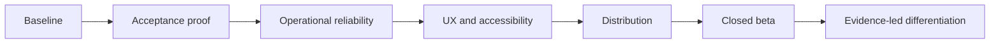

# NearHere execution plan

This is the dependency-ordered plan from development MVP to a closed
neighborhood beta. “Implemented” means source exists; “accepted” means the
behavior has been observed through the stated evidence layer. The distinction
keeps resume and launch claims honest.

## 1. Baseline and repository hygiene

Status: in progress.

1. Run lint, TypeScript, unit tests, iOS export, and native build.
2. Inspect migration parity through the linked Supabase CLI when available.
3. Keep unrelated user edits outside feature commits. The current uncommitted
   migration change is a blank line and is intentionally preserved.
4. Record each environment limitation rather than mistaking it for a product
   failure.

Exit: every baseline result is recorded with its evidence and scope.

## 2. Participation and privacy acceptance

Status: source and hosted database tests are complete; authenticated Simulator
proof remains.

1. Re-run profile, participation, detail/cancellation, chat, and safety hosted
   harnesses using fictional development actors only.
2. In Simulator, prove pending, rejection, waitlist, promotion, cancellation,
   ended, participant removal, directions, report, block, and chat states.
3. For every access revocation, verify both the server response has no exact
   point and the client clears cached local state before refresh.
4. Capture privacy-safe screenshots and add them to `visual-evidence.md`.

Exit: hosted authorization evidence and native interaction evidence exist for
each durable membership state.

## 3. Operational reliability

Status: chat uses an authorized RPC read path, a managed Realtime refresh
signal, and a 15-second fallback poll.

1. Verify subscription authorization and reconnect behavior with two actors.
2. Add deterministic message merge/deduplication tests where needed.
3. Introduce one structured application-error contract with stable codes,
retryability, and sanitized request correlation.
4. Add crash reporting, metrics, and product analytics only after choosing a
provider and defining a privacy-safe event schema.

Exit: failed writes can be diagnosed without collecting OTPs, tokens, chat
bodies, or exact locations.

## 4. Product quality

1. Extract reusable mobile UI primitives for actions, banners, status labels,
loading states, and activity rows.
2. Refine Nearby, Activity Detail, Host, Plans, and Me in that order.
3. Add Plans pagination/upcoming/past sections only after measuring real list
sizes and navigation needs.
4. Test VoiceOver, Dynamic Type, contrast, Reduce Motion, focus order, and
map/list equivalence.

Exit: every user-facing screen has loading, empty, error, unavailable, and
success states that remain understandable without color or map interaction.

## 5. Device and distribution readiness

1. Test critical flows on a physical iPhone and an Android device.
2. Configure release environments, crash reporting, privacy text, and store
metadata.
3. Set up TestFlight and Android internal testing.
4. Add push notifications for safety-appropriate events only; never put exact
meeting coordinates in a notification payload.

Exit: invited testers can install a release build without Xcode and complete
the core loop safely.

## 6. Closed beta and measured scale

1. Start with a single neighborhood and 3–5 anchor hosts.
2. Track activation, browse-to-detail, join, host completion, fill,
attendance, repeat participation, repeat hosting, and safety signals.
3. Review metrics and user interviews weekly before expanding geography or
categories.
4. Defer avatars, custom maps, recommendations, payments, Redis, and custom
WebSockets until beta evidence identifies a concrete need.

Exit: repeat participation and host supply demonstrate local liquidity.

## External decision gates

The following require the product owner or account holder: fictional test actor
credentials/Simulator sign-in, physical devices, Apple and Android developer
accounts, a crash/analytics provider, real SMS delivery, legal/privacy review,
and beta participant recruitment. Everything else proceeds autonomously.

