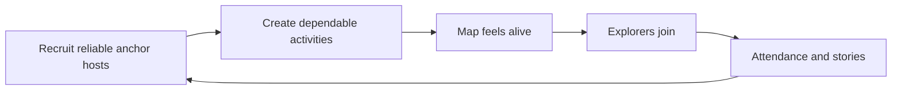
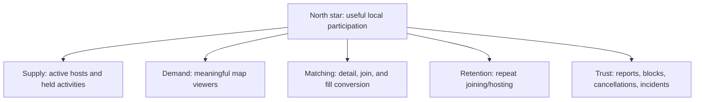

# NearHere Go-to-Market Plan

Status: **hypotheses requiring validation**. The system can distribute software globally, but the product becomes valuable only when local supply and demand overlap.

## Beachhead strategy

Choose one dense, socially active neighborhood or district with walkable venues, parks, campuses, and existing community organizers. “One city” is often too broad for a map network; density must be evaluated at the neighborhood and time-window level.

## Supply before scale

- Interview and recruit 20–30 potential anchor hosts; treat the number as a hypothesis until conversion is measured.
- Begin with a few repeatable, low-logistics categories such as walks, pickup sport, coffee, study, coworking, and creative sessions.
- Provide templates, moderation support, clear cancellation tools, and recognition.
- Track scheduled activities, actually held activities, attendance, cancellations, reports, and repeat hosting.

## Demand loop

- Invite-based neighborhood launch with a clear reason to open the map now.
- Venue QR cards only where current activity density makes the landing experience useful.
- Local content demonstrating real activities, with participant consent.
- Referral credit/reward tied to meaningful activation or attendance rather than empty registration.
- Browse-before-account reduces top-of-funnel friction; phone auth appears at commitment.

## Launch gates

Do not broaden geography merely because the app is technically deployable. Expand when:

- A meaningful share of target time windows contain trustworthy activities.
- Host cancellation/no-show and report rates are within an explicitly chosen threshold.
- Join conversion, attendance proxy, and repeat use show value.
- Moderation and incident response can support the larger area.
- Infrastructure measurements—not guesses—show adequate reliability and cost.

## Metric tree

Instrument funnel definitions before interpreting them. A “join” is not attendance, a signup is not activation, and an app open in an empty neighborhood is not delivered value.

## Monetization hypotheses

- Paid host tools after hosts demonstrate repeat value and willingness to pay
- Clearly labeled local venue promotion with user control
- Ticketed/paid activities only after trust, refunds, disputes, tax/compliance, and marketplace operations are understood

Payments are not first-release scope because they expand product, legal, operational, and support responsibilities far beyond adding a checkout endpoint.
