# NearHere App Store T-pass: implementation and verification handoff

**1 October audit:** Read [current completion status and ordered slices](completion-audit-20261001.md)
alongside this specification. Fresh checks pass 91 tests/typecheck/lint/diff.
Chat reconnect polling and retry-safe activity publication were implemented and
unit-verified on 1 October. See [the current completion audit](completion-audit-20261001.md)
for remaining hosted and device gates.
The dated baseline and pass records below remain historical.

Prepared 30 September 2026 for a smaller execution model. **This is an audit and
plan, not a claim that NearHere is production-ready or submitted.** A “T-pass”
here means a *testable pass*: one bounded change, its negative cases, proof, and
handoff. Read this entire file before editing. Current source and Git outrank
dated documents. Update this file after each pass.

## Release target, not an infinite feature list

Target **free, native iPhone and iPad V1**: browse a populated activity map without an
account; use phone OTP to create an account; host with an explicitly selected
private meeting point; join/request/waitlist/leave; manage plans; coordinate in
accepted-member chat; report/block; edit a persistent character/profile. The
public pin remains approximate; the exact point is server-authorized. The app
must not show demo activities as real neighborhood supply.

Do **not** make arbitrary 3D clothing, payments, direct messages, complex
recommendations, recurring events, Redis, custom WebSockets, or continuous
presence release dependencies. P07 (bounded two-look wardrobe) and P08 (true
3D) in `premium-profile-avatar-spec.md` remain separate gated product work; do
not advertise either until it exists and passes real-device tests. A coherent
2D character system is sufficient for V1. Likewise push notifications are not
required to submit a *free core V1* if no UI/copy promises them; accepted-member
chat and refresh must still be tested. Do not silently delete the roadmap.

**Today's achievable target** may be a tested candidate or TestFlight build,
depending on access and findings. Apple account setup, real SMS provisioning,
legal/support decisions, signed-device testing, App Review and real moderation
cannot be truthfully completed by local code alone. Never report “App Store
ready” from TypeScript, Simulator, EAS upload, or TestFlight alone.

```mermaid
flowchart LR
  T0[Baseline] --> T1[Scope + release contract]
  T1 --> T2[Safety + account deletion]
  T2 --> T3[Production services]
  T3 --> T4[Functional closure]
  T4 --> T5[Visual + accessibility]
  T5 --> T6[Operations + security]
  T6 --> T7[Signed build]
  T7 --> T8[TestFlight + physical device]
  T8 --> T9[Store submission]
```

Independent documentation/test work can proceed while a provider gate blocks
another pass. Never weaken a backend permission to make a client test pass.

## Current evidence, as audited today

| Area | Source/evidence | State and gap |
| --- | --- | --- |
| App architecture | `apps/mobile` Expo SDK 54 / RN 0.81.5; Supabase/PostGIS; 30 SQL migrations | Native app exists; not a signed release. |
| Core map/activity | `app/(tabs)/index.tsx`, map adapter/style, host/detail/Plans routes | Implemented. Map, auth, some host and profile states have partial Simulator evidence; full role/device matrix is open. |
| Safety | `202609080001` through `202609090009` migrations, operator route | Report/block, operator review, audit and rate limits exist. Objectionable-content filtering, public support contact and a complete moderation process are not evidenced. |
| Host self-join | `202609300001_prevent_host_self_join.sql`, `f6b585d` | Fixed in server/client; keep regression in the release suite. Do not infer all other participation states pass on device. |
| Profile/character | Six v1 sprites; owner details/revision migration `202609280001` | Owner editing and assigned character exist. Public bio/host-card moderation gate and wardrobe/3D do not. |
| Local checks | 30 Sep rerun from current dirty tree | 88/88 unit tests; `tsc --noEmit` and Expo lint pass. These do not prove native/device behavior. |
| Backend | Linked development project `gmgtugbvnvhdmfuoifcc`; prior hosted harness evidence | Test-OTP development setup, not a separate verified production backend or real SMS. Do not print credentials. |
| Release packaging | `apps/mobile/app.json`; no `eas.json` or CI found | `supportsTablet: true`; bundle ID is present. Starter-looking icon and splash were visually inspected. No signed production artifact, TestFlight, store metadata or submission evidence. |
| Worktree | Branch `leda/initial-product-foundation`, HEAD `f6b585d` | Many inherited modified/untracked files, including mobile, docs and migrations; two legacy web files deleted. Preserve all. |

### T0 execution record — 30 September 2026

- Branch/HEAD: `leda/initial-product-foundation` / `f6b585d`.
- Worktree at inspection: 33 tracked modified/deleted paths and 35 untracked
  paths. No cleanup or staging was done; all were preserved.
- `npm run test:unit`: **88 passed, 0 failed**. Node emitted a non-failing
  `MODULE_TYPELESS_PACKAGE_JSON` warning for `safety-validation.ts`.
- `npx tsc --noEmit`: passed. `npm run lint`: passed. `git diff --check`: passed.
- `xcodebuild -version`: Xcode **26.6**, build `17F113`.
- `npx supabase migration list --linked`: read-only call succeeded; **30 local
  and 30 remote migration IDs match**, including `202609300001`. No migration was
  applied. This confirms the linked dev project ledger only, not production.
- No fresh Simulator screenshot or runtime flow was captured in T0. Existing
  dated evidence remains historical and must not be relabelled as today's.
- Next: T1 release contract and owner-controlled environment topology. T2/T3
  work can proceed locally in parallel only where it does not assume owner/legal
  decisions or production credentials.

The 24 September `premium-product-execution.md` and `night-arcade-status.md`
contain older counts and incomplete ledger states. Their design/privacy rules
still matter, but do not copy their baseline as a current result. The 12 V2
fictional activities are development visual fixtures and eventually expire.
Never cancel/delete/rename them merely to refresh a screenshot. For release,
use separately labelled reviewer/demo access and real voluntary pilot supply.

### Pass ledger

| Pass | State | Evidence / next gate |
| --- | --- | --- |
| T0 baseline | `code_verified` | 88 tests, type/lint/diff pass; 30/30 linked development migrations match; no Simulator rerun. |
| T1 release contract | `in_progress` | Draft at `docs/release/v1-scope.md`; India and iPhone+iPad confirmed. Adults+teens requested; age/guardian path is a release gate. Support/privacy setup deferred until pre-submission. |
| T2 safety/privacy | `in_progress` | Source audit and privacy data inventory are recorded; deletion retention and teen-consent policy are unresolved. No safety code changed. |
| T3 production services | `not_started` | Dev setup only; provider and production project decisions needed. |
| T4 core acceptance | `in_progress` | Browse exposed 11 demo fixtures; Coffee filtered to two; selecting a row returned to the map. Owner card showed Manage activity, not Join. Participant/location/privacy/device matrix still open. |
| T5 visual/accessibility | `in_progress` | Dark map-first style compared with the approved concept. A privacy-safe selected-marker label and density guard are implemented and covered by unit tests. Simulator confirmed the label yields in a dense view; marker edge clipping, accessibility, iPad and physical-device checks remain open. |
| T6–T9 | `not_started` | Follow sequence below. |

### 1 October reliability implementation update

- Migration `202610010001_create_activity_idempotency.sql` is applied to the
  linked development project. It adds `create_activity_idempotent`, which locks
  a host/request-ID row, binds it to a canonical draft hash, and returns the
  original receipt on a same-draft retry. The mobile Host route now uses it.
- Activity Detail chat now clears and unsets its polling timer after Realtime
  recovery, allowing a later disconnect to restart fallback polling. New pure
  tests cover the lifecycle.
- Local checks: 96 tests pass; TypeScript, Expo lint, hosted-harness syntax and
  diff check pass. A hosted harness case for same-key retry/changed-draft denial
  is implemented but cannot run without the fictional actor variables.
- The paired iPhone was unavailable in the 1 October device inventory, so no
  physical build was attempted. Provisioning/profile and hardware acceptance
  remain separate gates.

### T1/T2 audit update — 30 September 2026

- Owner selected **India**, **iPhone and iPad**, and asked for **adults and
  teens**. Their minimum age/guardian-flow decision is deferred. The plan keeps
  under-18 onboarding disabled for any release until its rules and consent
  process are resolved; current fictional development actors are unaffected.
- Owner said domain and support-contact setup can wait. No purchase or mailbox
  is needed for local development. A real monitored support contact and public
  policy URL must be in place before submission.
- Source-backed data map: [privacy-data-inventory.md](../release/privacy-data-inventory.md).
  It identifies local AsyncStorage map area/private-pin drafts, the device
  location center sent to Supabase for discovery, public Nominatim place-search
  text, map tile requests, private server meeting points, memberships/chat,
  safety/audit records and unknown provider retention.
- Legal research source: India’s DPDP Act defines a child as under 18; Section 9
  addresses verifiable parent/guardian consent. The 2025 Rules set phased dates
  for operational requirements. This is a release planning flag, not legal
  advice; recheck with qualified counsel before enabling teen accounts.

### T4 local Simulator probe — 30 September 2026

- The booted iPhone 17 Pro (iOS 26.5) has NearHere installed and opens to the
  map. Accessibility labels expose “Activity areas, not live locations,” map
  center, browse/filter, host, profile and map-help controls.
- Non-destructive Browse navigation opened the “Explore nearby” sheet. Its
  accessibility tree exposed **11 individually named, explicitly Demo-labelled
  activities** and the All/Walks/Coffee/Sports filters. No activity was joined,
  edited, hosted, or cancelled. This confirms the current development fixture
  set remains available in Browse; it is not evidence of real community supply.
- Coffee filter selected and converged to exactly two named results: “Demo ·
  Coffee and conversation” and “Demo · Chai after work.” Selecting the former
  returned to the map and selected that activity. Its owner-specific card said
  “You are hosting” and exposed **Manage activity**, not Join. This is a
  Simulator spot-check of the host self-join guard and Browse → filter → map
  selection path; it is not a substitute for the hosted concurrency/auth matrix.
- Plans opened for the current signed-in development account and exposed
  upcoming and past records, including the existing test fixtures. The
  accessibility tree contained 46 activity “View” actions, below the current
  50-row RPC cap; this does **not** prove pagination or behavior above 50. Me
  exposed profile editing, upcoming plans and Sign out. No account-deletion
  entry was visible, confirming the T2 App Review gap in the actual UI. No data
  was edited, joined, left, or deleted.
- A macOS capture-transport error occurred once during the probe. A direct
  Simulator screenshot then succeeded and records the populated Browse screen
  and selected-map state:
  [`Browse`](../screenshots/app-store-t4-browse-20260930.png) and
  [`selected host activity`](../screenshots/app-store-t4-selected-20260930.png).
  The earlier tiny-canvas capture at
  [`app-store-t4-home-20260930.png`](../screenshots/app-store-t4-home-20260930.png)
  is diagnostic only and is not accepted as visual-design evidence.
- Visual follow-up: the selected-map capture shows two avatar pins partly
  clipped by the left viewport edge. Record this for T5: confirm whether the
  intended behavior is edge-clamping or a deliberate partial off-screen cue,
  then test after the map pan/marker layout change. Do not move/remove fixtures
  just to improve the screenshot.
- T4 is **partially verified in Simulator**. Location-permission transitions,
  keyboard behavior, private-point authorization, participant join states,
  accessibility with VoiceOver/larger text, iPad and physical-device behavior
  remain open. A simulator screenshot does not prove these.

### T5 visual comparison and selected-marker label slice — 30 September 2026

- Reference: [`night-arcade.png`](../design-concepts/night-arcade.png). Live
  captures: [Browse](../screenshots/app-store-t4-browse-20260930.png) and
  [map with selected host activity](../screenshots/app-store-t4-selected-20260930.png).
- **Already aligned:** native dark map-first screen, charcoal surfaces,
  high-contrast lime primary action, custom MapLibre street style, persistent
  2D host characters, and a single contextual selected-activity card. This is
  closer to the chosen dark/game-like direction than the older cream/orange
  screenshots; do not roll those colors back in.
- **Still visibly different:** reference characters are large, fully framed,
  varied scene sprites with ground shadows and compact activity labels. Live
  map uses smaller pedestal avatars without a consistently visible activity
  pill, and markers can be partly clipped at the viewport's left edge. The reference also
  uses a larger image-led activity card; live detail emphasizes title, start,
  distance, capacity and an owner-sensitive action.
- Keep the live screen's simpler map-first/minimal control hierarchy; do not add
  the reference's four-tab navigation, inbox, or new surfaces as decorative
  copies. The owner card correctly says “Manage activity” rather than Join.
- Implementation slice: `activity-map-features.ts` derives a compact label from
  the canonical activity category and already-public approximate distance. It
  never uses user-authored titles or coordinates. `shouldShowSelectedMapLabel`
  applies a 250 m Haversine-distance separation guard around the selected public
  point; in dense neighborhoods it suppresses the optional label because the
  full-body avatar artwork is taller than MapLibre's text collision footprint.
  The MapLibre symbol layer only targets the selected unclustered feature at
  zoom 12+, yields to avatar placement, and uses a contrast halo. The selected
  marker's accent halo is now independent of optional label visibility, so a
  dense map suppresses text without erasing the selected-state cue. This keeps
  the overview quiet and preserves avatar visibility/hit targets.
- Regression coverage checks category + rounded distance labels, title
  non-disclosure, invalid-distance fallback, isolated/nearby label eligibility,
  and missing selection. Local suite: **90 passed, 0 failed**; TypeScript and
  Expo lint passed; `git diff --check` passed. Node printed non-failing
  `MODULE_TYPELESS_PACKAGE_JSON` warnings for existing `.ts` test imports. No
  database/API, activity, or avatar identity was changed.
- Fresh iPhone 17 Pro Simulator view:
  [`selected label suppressed in a dense neighborhood`](../screenshots/app-store-t5-selected-label-suppression-20260930.png).
  No text overlaps the visible avatar art. The map still shows a character
  partially cut at the left viewport edge, so edge treatment remains unresolved.
  The label itself was not visibly rendered on an isolated marker in this
  capture; this is evidence for the suppression behavior, not acceptance of the
  positive-render state.
- Earlier `app-store-t5-labels-*` screenshots record discarded visual
  iterations, including an overlap-prone first pass and stale/splash captures.
  Keep them as diagnostic history, not final acceptance evidence; the
  suppression capture above is the current truthful result.
- Follow-up attempt selected the existing farther-from-viewer activity “Demo ·
  Sketch the neighbourhood” (766 m away) without joining. Its selected map view
  still had nearby avatar points/clusters, so the label remained suppressed.
  This confirms that *distance from the viewer* is not the same as *spacing
  between map markers*; it did not produce the isolated positive-render case.
  See [`candidate selection`](../screenshots/app-store-t5-selected-isolated-label-20260930.png).
  The screenshot filename records the test intent, not a verified isolated
  state.
- A source review caught and corrected a coupling where the spacing guard also
  removed the selected-marker halo. The halo filter now always tracks the
  selected unclustered feature; the spacing guard gates only the optional text
  layer. Post-correction gate: **90/90 unit tests, TypeScript, Expo lint and
  `git diff --check` pass**. Unit test runner still emits non-failing Node
  `MODULE_TYPELESS_PACKAGE_JSON` warnings for `.ts` test imports. The screenshot
  evidence above predates this halo-only correction; visual confirmation of the
  independent halo remains outstanding because the Simulator UI bridge became
  unavailable during the final verification.
- Next visual slices: (1) reproduce edge clipping and decide whether natural
  map-edge cropping is acceptable or selected markers need camera inset; (2)
  prove a single isolated label renders in Simulator; (3) compare catalog sprite
  scale/cropping against source art without reassigning identities; (4) inspect
  profile/host/detail screens; (5) test VoiceOver, larger text, iPad and physical
  safe areas. Do not replace avatars until the catalog treatment is understood.
- This is a partial T5 implementation, not T5 acceptance.

## Operating instructions for Luna (copy this into the next turn)

> Continue NearHere using `docs/handoffs/app-store-t-pass-20260930.md`. Read root
> `AGENTS.md`, mobile `AGENTS.md`, this entire plan, current `git status`, then
> inspect exact files for the first unfinished pass. Work one T-pass at a time;
> implement the smallest safe slice, test positive and negative paths, update
> this plan plus the relevant teaching/testing docs, and continue to the next
> eligible pass. Preserve every inherited edit and demo activity. Distinguish
> code, hosted, Simulator, physical-device, signed-build and App Review evidence.
> Never assume a proposed RPC/file already exists; search first. Do not invent
> credentials, legal policy, real-user data, test results or store approval.
> Stop a dependent task for missing authority/provider/owner decisions, but
> continue independent safe tasks. Hand back an exact blocker packet when no
> eligible work remains. Do not submit the app or create public users/events
> without the owner's explicit release decision.

Use this per-pass record: `pass | changed files | old behavior | new behavior |
tests + exact results | hosted deployment | Simulator | physical device |
privacy/safety review | screenshots (redacted) | remaining blocker | next pass`.
States: `not_started`, `in_progress`, `code_verified`, `hosted_verified`,
`simulator_verified`, `device_verified`, `signed_build_verified`, `accepted`,
`blocked`. A pass may need multiple states. “Not run” is never “passed.”

### T0 — Freeze a truthful baseline and protect the worktree

1. Read `docs/handoffs/night-arcade-status.md`,
   `premium-product-execution.md`, `premium-profile-avatar-spec.md`,
   `premium-community-roadmap.md`, `docs/phase-3-acceptance-runbook.md`, and
   `supabase/tests/hosted/README.md` as needed. `apps/mobile/AGENTS.md` requires
   checking exact Expo SDK 54 docs before mobile edits.
2. Save `git status --short`, branch/HEAD, changed-file inventory and provenance
   in the log. Do not clean, reset, broad-stage, overwrite `.env`, or rebase.
3. Rerun `npm run test:unit`, `npx tsc --noEmit`, `npm run lint` from `apps/mobile`;
   `git diff --check` at root. Use `distill` for verbose output as instructed,
   but inspect bounded raw failures. `npx expo-doctor` and dependency audit are
   advisory, not automatic upgrade authorization. Record exact versions/results.
4. Inspect remote migration ledger read-only before any migration. Dev and
   production must be named separately. Never push a whole pending directory
   without reviewing each migration and target project.

Exit: reproducible baseline and a worktree-safe next patch. Current check above
is 88 tests/type/lint, **not** native acceptance.

### T1 — Pin down the V1 contract and release topology

1. Write one-page `docs/release/v1-scope.md`: V1 behavior, non-goals, launch
   country/age audience, whether iPad is actually supported, account-required
   actions, approximate-vs-private map promise, reviewer access and truth in copy.
2. Inspect `apps/mobile/app.json`: if iPad is not a tested target, change
   `supportsTablet` only after owner agrees to iPhone-first scope. Otherwise
   include iPad layouts/screenshots/accessibility in T5/T8. Do not claim iPad
   support because the manifest says `true`.
3. Inventory every user-visible claim against source: `auth/phone.tsx` still
   mentions an unconfigured SMS provider in a setup card, and any “verified
   host,” push, attendance, AI, paid feature or 3D wording needs evidence.
4. Decide single source of truth for environments: development, staging if
   needed, and production Supabase URLs/keys only via approved build variables;
   publishable key is client-safe, service-role/DB credentials never are.

Exit: no marketing promise exceeds a working release feature. Owner decisions:
launch territory/audience, iPhone-only vs iPad, support identity/contact.

### T2 — Close App Review safety and privacy blockers

**T2a Account deletion.** Current Me screen only offers sign-out; there is no
in-app deletion flow. `profiles.id` cascades from Auth, but
`activities.host_user_id` restricts profile deletion; other memberships/chat/
reports/audit have their own retention implications. Therefore *do not* add a
client-side `deleteUser()` call or a broad cascading SQL change.

Initial local migration inventory (30 files) confirms: `profiles.id` cascades
from `auth.users`; hosted activities restrict profile deletion; activity
memberships and chat author rows cascade from profile; safety reports and blocks
also cascade; rate-limit rows cascade; safety-audit and operational actor/subject
references use `ON DELETE SET NULL`; report-to-audit links set null. This is a
first-order map from migration source, not yet a live database catalog proof.
Before implementing deletion, inspect all later overrides and query the target
database's constraints. The current FK choices can erase report/block/message
records, so a retention/anonymization design must account for them explicitly.

1. Map every Auth/profile FK, activity/chat/report/block/audit/operational row and
   provider log. Draft owner-approved retention/erasure policy, including hosted
   events with other participants: cancel/transfer/anonymize/delete policy must
   be explicit. Avoid deleting other people's chat or safety evidence blindly.
2. Implement an authenticated, recently reverified **request deletion** route
   in Me/Settings. Server-side process records request/status, prevents replay,
   revokes session/hosting as policy says, performs scoped deletion/anonymization
   safely, gives a receipt/timeframe, and exposes status/help. Only privileged
   server code may delete an Auth identity. If manual completion is chosen,
   Apple still requires in-app initiation and a real process—not just email.
3. Migration: additive request table/function, least-privilege grants/RLS,
   immutable operator evidence only if retention policy allows. Test anon,
   another user, retry, pending host event, accepted attendees, cancellation,
   FK failures, completed deletion and stale cached private point. Destructive
   tests use disposable fictional accounts only after an explicit safe target.

For implementation, verify the current Supabase server-only contract for
[`auth.admin.deleteUser`](https://supabase.com/docs/reference/javascript/auth-admin-deleteuser):
it requires a privileged key and must never run in the mobile app. A protected
server function must derive the account from the caller's verified session,
apply the retention policy, and handle retries. Supabase documents that access
tokens are stateless and may remain usable until expiry after deletion, so the
design must test local sign-out/private-state clearing and backend authorization
after deletion; do not promise instant token revocation without proving it.

**T2b User-generated content.** Activity title/description, profile bio and
chat are UGC. Existing report/block/operator pieces are necessary but not the
whole policy. Add a server-enforced objectionable-content filter before posting
to public or chat surfaces, with conservative rejection/review, Unicode/bypass
tests, safe retry UX, and an operator takedown flow. Do not silently expose
public bios until profile-content reporting/moderation is complete. Add report
entry points for chat/profile content as needed; audit operator access and
response SLA. Define actual moderation owner and escalation for offline harm.
Test an abusive post never appears in anonymous discovery or a push payload.

Current source audit: `activities` enforces title 3–80 and description <=1000
characters; `send_activity_message` enforces trimmed body length 1–1000.
Profile editing validates bio/city lengths, and public bio remains disabled.
These are shape/length constraints, not objectionable-content filtering.
`report_safety_issue` accepts a user or activity target; Activity Detail exposes
Report activity and Block host. No report action for a chat message/profile card
was found in the searched mobile routes. `activity_messages` stores message text
and has a caller-authorized read RPC, but the inspected send function has no
content-filter check. Recheck all later migration overrides before changing it.

**T2c User information.** Provide real hosted Privacy Policy and Support URLs,
visible in app and App Store Connect; explain phone, location, approximate pin,
private point, chat, moderation, third parties, retention and deletion. Terms/
community rules and emergency disclaimer should match the real service. Owner
must approve legal wording/contact; engineer should not invent policy promises.
The engineering source inventory is
[privacy-data-inventory.md](../release/privacy-data-inventory.md). It is not a
publishable privacy policy. The owner said contact/domain setup can wait; it is
not a blocker for local implementation, but a real public URL and monitored
contact remain a submission gate.

India audience note: the owner requested adults and teens. The Digital Personal
Data Protection Act defines a child as under 18 and Section 9 addresses
verifiable parent/guardian consent. The 2025 Rules set staged commencement for
the relevant operational rules; verify timing and applicability again with
qualified counsel before launch. Until then, keep the minimum age and minor
onboarding unresolved in the release contract and do not enable under-18
accounts based on a guessed age flow. Sources: [MeitY DPDP Act](https://www.meity.gov.in/static/uploads/2024/02/Digital-Personal-Data-Protection-Act-2023-1.pdf),
[2025 Rules Gazette](https://www.meity.gov.in/static/uploads/2025/11/53450e6e5dc0bfa85ebd78686cadad39.pdf).

Exit: deletion can be initiated in app and safely fulfilled; UGC filtering,
report/block, reachable contact and moderation response are demonstrated. Apple
[account deletion](https://developer.apple.com/support/offering-account-deletion-in-your-app/),
[UGC rule 1.2](https://developer.apple.com/app-store/review/guidelines/), and
[privacy rule 5.1.1](https://developer.apple.com/app-store/review/guidelines/)
are the relevant current rules (checked 30 Sep 2026).

### T3 — Replace development dependencies with production-capable services

1. Real SMS: choose/provision a supported Supabase SMS provider, configure
   regional sender/compliance and anti-abuse budget, test a real non-test number
   on a physical iPhone, resend/rate-limit/recovery, then remove development
   test mapping from **production**. Keep test actors only in dev. Correct stale
   setup copy in `auth/phone.tsx`; never ship a fake successful OTP path.
2. Production database: create owner-controlled project, backup/restore and
   access policy, review/migrate all 30 existing SQL files in order, verify
   RLS/function grants and secrets, then run disposable actor harnesses.
   Hosted harnesses write fixtures; read their README first. Do not point a dev
   build at production accidentally. Add environment banner/debug separation.
3. Map tiles: `assets/maps/nearhere-night-arcade-v1.json` references OpenFreeMap
   TileJSON/fonts. Choose permitted production usage/availability/fallback and
   attribution. `lib/place-search.ts` calls the public Nominatim endpoint from
   every device. Its per-process 1.1s delay is **not a global rate limit**.
   Search is submit-triggered (not autocomplete), but public Nominatim demands
   low aggregate use, app identification, attribution and switchability; choose
   a production-capable geocoder or a cache/proxy with enforced global limits.
   Preserve manual map pin when search fails. Do not put confidential text in
   public search queries. See [Nominatim policy](https://operations.osmfoundation.org/policies/nominatim/).
4. Test provider outages: no tiles, no geocoder, no SMS, Supabase timeout,
   offline/reconnect. Map must fail visibly with Browse/manual fallback; private
   data must not leak via a public cache or third-party query.

Exit: production-configured services, documented costs/quotas, fallback and
monitoring; owner supplies provider/project authority. A free dev project is
not a production uptime commitment.

### T4 — Finish and verify the core feature state machine

Read exact contracts, then change smallest layer in order: `packages/contracts`
→ SQL/RPC → `apps/mobile/lib/*repository*` and validators → hooks/providers →
screens. Add a failing regression before a behavioral fix. Never change public
geometry or membership authority on the client alone.

1. Auth/profile: anonymous browse, test and real OTP, expired/wrong code,
   resend, keyboard, interrupted onboarding, same persistent avatar, owner edit
   conflict, relaunch, A→B→A account switch; stale A data never paints B.
2. Location: permission allowed/denied/services off/no fix/cached fix/return
   from Settings, manual search and pin, startup selection, privacy. Resolve the
   reported physical-iPhone “location unavailable” with an actual device trace,
   not a Simulator assumption.
3. Host: category/title/description, 30m/1h/tomorrow/custom local date and time
   (including DST/past), explicit private point search/pin/Cancel/Done,
   capacity/joining mode, publish double press/server retry, edit/cancel/end.
   Current UI duplicate-press guard is **not** server idempotency. Do not accept
   a picker merely because it opened: change and commit a value on device.
4. Participation: open join, approval pending→accept/reject, full→waitlist→FIFO
   promotion, leave, remove, cancel/end, blocked host/member, concurrent last
   seat, host cannot self-join (regression). At each transition verify Plans,
   detail, chat and exact-point redaction in an already-open screen.
5. Realtime/chat: authorized history/send, background/resume, reconnect,
   account switch, block/leave while open; polling fallback and message dedupe.
   No notification/push delivery claim unless E01 is separately implemented.
6. Add missing unit/contract/hosted tests and bounded pagination if real
   activity volumes reveal truncation. Do not use first-50 Plans as total counts.

Exit: all role/state cases recorded in `docs/phase-3-acceptance-runbook.md`
with test identities and sanitized evidence. Hosted proof and Simulator proof
remain separately labelled.

### T5 — Premium visual quality and accessibility

1. Compare real NearHere screens to the approved `docs/design-concepts/night-arcade.png`:
   map dominance, large visible character, profile hierarchy, restrained lime
   action, legible labels, no cream/orange/violet leakage. Use real data, not
   fabricated biographies or photos. Existing 2D sprites are acceptable V1.
2. Replace starter-looking `assets/images/icon.png`, `splash-icon.png` and
   Android adaptive assets with licensed/original NearHere branding; inspect
   at icon size and in a signed launch. Keep map/vendor attribution visible.
3. Test small and large iPhones, keyboard, safe areas, long names, maximum
   Dynamic Type, VoiceOver ordering/actions, reduced motion, contrast, and
   map-marker accessible alternative (Browse). If iPad remains enabled, test
   real iPad layout and store screenshots. Never shrink accessibility text to
   match a concept image.
4. 12/50/200 synthetic public points locally and real dev fixtures: pan/tap/
   cluster/selection, frame/memory and offline style. Preserve the 12 marked
   development activities. Make screenshots safe: no OTP, phone, token, exact
   meeting point or test-user personal data.

Exit: visual QA sheet plus screenshots for every release screen/state, actual
VoiceOver and physical-device evidence. This is a product gate, not a lint gate.

### T6 — Security, operations and review reliability

1. Threat-model anonymous discovery, exact-point RPCs, Auth/session storage,
   public avatar/profile projections, report/operator functions and account
   switch. Run Supabase security advisors/schema lint and explicit anon/owner/
   outsider/blocked tests. Review `security definer`, `search_path`, grants,
   rate-limit exhaustion and error redaction. Do not print service-role secrets.
2. Add minimal crash/error reporting or an equivalent owned incident channel
   with redaction: no phone, OTP, token, free-text chat/bio or exact coordinates.
   Add health checks, alerts for SMS/tiles/backend failure, backup-restore
   rehearsal and a moderation/support runbook. Observability DB events already
   exist; they are not a crash service or paging SLA.
3. Dependency audit: reproduce findings, classify reachable production risk,
   patch safe updates, retest native integration; do not blind-upgrade Expo/
   MapLibre on an audit warning. Add CI for pure tests/type/lint/format or diff
   check, with no real hosted credentials in PR builds. Hosted harnesses run
   separately against disposable dev/staging actors.
4. Privacy inventory for App Store questionnaire: data collected, third-party
   processing, retention and deletion; verify against installed SDKs and live
   backend. Record reviewer test account with non-expiring access but no real
   personal data, as Apple requires full review access.

Exit: no known critical privacy/security bug, repeatable incident and restore
runbooks, build provenance and a truthful App Privacy answer set.

### T7 — Build a signed release candidate

1. Inspect the installed Expo SDK 54 and current EAS docs before adding
   `apps/mobile/eas.json`. Define development/preview/production profiles,
   production env binding, immutable runtime/version/build-number policy and
   store bundle identifier. Native plugins (MapLibre/location/picker) require a
   real native build; an Expo JS export is insufficient.
2. Confirm Apple Developer membership, App Store Connect app record, certificates
   and provisioning under the owner's account. Use Xcode 26 or later with iOS 26
   SDK or later for uploads as of 30 Sep 2026. Current local Xcode reports 26.6;
   verify the actual cloud/local builder too.
3. Build a production `.ipa`, inspect startup/crashes/permissions/entitlements,
   native symbols and env endpoints; no test OTP or developer banner in the
   binary. Bump build number for each upload. Keep release notes/change log.

Exit: a traceable **signed** artifact. An EAS upload is not App Review approval.
See [Expo iOS submission](https://docs.expo.dev/submit/ios/) and
[Apple SDK requirements](https://developer.apple.com/news/upcoming-requirements/).

### T8 — TestFlight and physical-device acceptance

1. Upload the signed artifact to TestFlight with explicit owner authorization.
   Test on the user's one iPhone; use separate Simulator sessions/disposable
   fictional actors for multi-user state, and at least one real SMS flow on the
   physical phone. One physical phone is sufficient for GPS/keyboard/performance
   hardware checks but does **not** prove multi-device push or concurrency.
2. Repeat T4/T5 critical flows using the **release** backend/build, not Metro:
   fresh install, location prompt/manual fallback, OTP, onboarding, host,
   outsider join, approve/waitlist/reject, exact-point authorization, chat,
   leave/block/cancel, sign-out/account switch, deletion request. Test app kill,
   offline, low memory and reinstall. Record defects and rerun after fixes.
3. Ask invited testers for consented observations; never count synthetic demo
   actors as community adoption. Resolve high-severity bugs before wider beta.

Exit: signed-build device matrix with actual dates/build IDs, crash-free smoke,
and owner acceptance. TestFlight processing/review is external.

### T9 — App Store Connect package and submission

1. Owner supplies legal app name, subtitle, territories, age/audience,
   support/privacy URLs, moderation contact and release policy. Prepare truthful
   screenshots of the **real signed build**, description, keywords, age rating,
   privacy answers, export/compliance answers, review notes and demo/reviewer
   access. Do not claim fictional demo events are live community supply.
2. Check current App Review rules again at submission. Submit only after owner
   approves the exact build/metadata and T2–T8 exit gates. Respond to reviewer
   issues with evidence and a patch build; approval timing is Apple's decision.
3. After approval, monitor incidents/reports, SMS and map quotas, onboarding,
   host supply and first accepted join. Use actual aggregate data, not invented
   traction. Gradual launch in one chosen neighborhood with willing hosts.

Exit: App Store status actually shows approved/live, with operational coverage.

## Owner inputs that code cannot invent

| Decision/access | Why it blocks |
| --- | --- |
| Apple Developer/App Store Connect ownership and submission approval | Signing, TestFlight, metadata and publication. |
| Production Supabase + real SMS provider/budget/compliance | Real users cannot sign in with fictional test OTP. |
| Production tile/geocoder provider, quotas and billing approval | Current public endpoints are prototype dependencies. |
| Legal privacy/retention/deletion/community rules and support contact | Account deletion, data disclosures and UGC operations. |
| Launch country, adult/minor audience, iPhone-only vs iPad | Age/privacy obligations and test/screenshot scope. |
| Moderation owner and response hours; first real pilot hosts | Safety operations and honest map supply. |

Do not wait on every input before doing local tests, safety design or visual
polish. Do not simulate an answer to one of these decisions.

## Anti-hallucination checks for each layer

- **Search before import or migration.** Proposed names in old plans are not
  deployed contracts. Use `rg` and read current SQL plus later overrides.
- **Do not broaden RLS to fix UI.** Test anon, owner, accepted, pending,
  waitlisted, outsider and both block directions for every private projection.
- **Do not equate test activities with launch content.** Dev fixtures stay for
  design; production requires real willing hosts and review demo access.
- **Do not equate a UI guard with idempotency.** The database owns capacity,
  membership, exact-location release and durable event transitions.
- **Do not call polling push.** Realtime refresh is not APNs delivery.
- **Do not call sprites 3D.** P07/P08 need art, compatible assets, native proof.
- **Do not claim a release from `expo export`.** Native signed build, TestFlight,
  physical device and App Review are different gates.
- **Preserve inherited changes.** Stage exact files only after diff review;
  migrations/credentials/publication require target verification.

## Teaching artifact after every pass

Update `docs/engineering-learning-guide.md` and the relevant focused guide:
user problem → data/control-flow Mermaid diagram → exact files/functions →
concept (API/state/runtime/auth/cache etc.) → trade-off → failed case → fix →
tests at each evidence layer → one interview explanation → one small exercise
the owner can reproduce. Link from `docs/README.md`; update `docs/testing-status.md`
with actual results, never retroactively rewrite a dated result. After T2/T3,
update `docs/system-design.md`, `data-model.md` and `api-spec.md` for changed
trust boundaries and endpoints. Screenshots require captions and redaction.

## Hand-back to the stronger model

When Luna finishes or is blocked, send: current HEAD/worktree status; each
T-pass state; exact changed files; migrations created/deployed and target;
local/hosted/Simulator/device/signed test results; sanitized errors; screenshots;
provider/owner decisions still needed; privacy risks; and the **single next
safe action**. The stronger model should independently verify code, tests,
authorizations, App Store compliance and real-device claims before submission.
