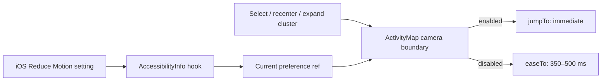
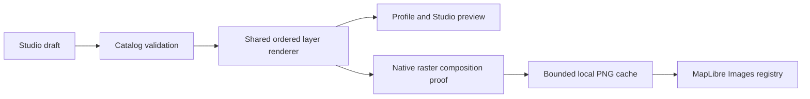

# NearHere: day/night maps, Avatar Studio and account identity

Prepared 2 October 2026. **Implementation handoff, not completed features.**
User requested detailed planning for a lighter model before execution.

## Start here on “continue”

This is the active plan for the newly requested theme/avatar/auth work. It takes
priority over conflicting visual and wardrobe scope in the older P00–P10 plan.
Existing privacy, fixture-preservation and release gates still apply. The
App Store T-pass remains the release checklist; this feature plan does not
establish launch readiness.

1. Read root AGENTS.md, this entire guide and the latest entry in
   `night-arcade-status.md`. Inspect Git status and the relevant existing diffs.
2. Start at D00. Work one ticket at a time; mark actual evidence after each.
3. Before mobile edits, read apps/mobile/AGENTS.md and exact Expo SDK54 docs.
4. Preserve all existing edits and development activities, including work from
   earlier sessions. Never recreate the database or wipe fixtures for screenshots.
5. If an external provider blocks one track, continue the independent theme or
   avatar track. Do not fabricate provider success or silently replace a feature.
6. No automatic delegation. Keep work sequential and economical unless requested.

### Verified source baseline in this planning turn

| Area | What exists | What this plan must add |
| --- | --- | --- |
| Theme | Static `colors` export; app.json forces dark; light StatusBar | Reactive day/night/system preference across all screens |
| Maps | Two adapters import `nearhere-night-arcade-v1.json` | Shared style factory, daylight palette, restrained motion |
| Avatars | Six PNGs and six `v1-01`…`v1-06` IDs | Original modular sprite artwork and a dedicated editor |
| Avatar identity | Persistent seed; frozen hash; v1 public projections | Versioned custom configuration and compatible old-client fallback |
| Auth | Phone request/verify in AuthProvider; persisted Supabase session | Email code, Google, Apple, connected-account management |
| Profile | Name/bio/city/interests, revision-checked RPC | Unique username and separate appearance save |
| Search | Nominatim default; Google adapter staged | Keep search independent of rendering; no billing setup in this scope |

Initial D00 inspection (2 Oct continuation): branch `leda/initial-product-foundation`,
HEAD `f6b585d`; the worktree has many inherited app, documentation, SQL, test,
asset and deleted legacy-web changes. No baseline diff has been staged or reset.
Existing dependency versions match the package values listed below. At the
start of the 2 Oct implementation continuation, unit tests were run and passed
(98/98), Expo lint passed, and TypeScript initially failed because the ignored
`.expo/types/router.d.ts` still described the route tree before
`app/settings/appearance.tsx` was added. Expo SDK 54 generates those declarations
when its development server starts; running `npx expo start --clear --localhost`
regenerated the ignored file, and `npx tsc --noEmit` then passed without editing
generated declarations, suppressing errors, or adding casts. Metro was stopped
after the refresh. This fixes the stale generated-route-type issue; it does not
prove the appearance screen in Simulator. No baseline screenshots/device IDs
were captured. The D00 visual/device capture portion therefore remains open.
No live Auth settings were inspected and no migration/deployment occurred.
Two recently generated characters are **unaccepted drafts**: they look too
similar to the previous human figures and appeared to have opaque/glowing
backgrounds. Their alpha channels have not been programmatically verified.
The background-removal call was interrupted. Do not use these as approved sprites.

### D00 capture checklist — continuation update

- Before type refresh: 98 unit tests passed, Expo lint passed, TypeScript failed
  only at the newly added appearance href because generated types were stale.
  After starting SDK54 Metro: TypeScript passed. A second unit run including
  generated-map-style tests passed: 99/99. Three pure theme-preference tests
  were then added, bringing the latest suite to 102/102. TypeScript and Expo
  lint passed after extracting testable cores. `git diff --check` passed.
- Fresh privacy-safe app screenshots and device/build identifiers: not captured;
  the booted Simulator was displaying a private meeting-point selection, so no
  image was retained as evidence.
- Existing source inventory and dirty paths: inspected; preserved in place.
- Package versions: Expo 54.0.35, React Native 0.81.5, React 19.1.0,
  MapLibre React Native 11.4.0 range, AsyncStorage 2.2.0.
- Existing activities: not queried or changed during D00.
- Expo typed routes reference: https://docs.expo.dev/router/reference/typed-routes/.
  SDK54 regenerated `.expo/types/router.d.ts` on dev-server startup; never hand
  edit this ignored generated declaration.

## Product decisions

- A playful activity map, with avatars anchored at approximate event locations.
  Never imply that host sprites show someone's live GPS or current attendance.
- Two coherent themes: **Daylight Playground** and **Night Arcade**. Choose
  System / Light / Dark in Appearance; System is the new default. Existing users
  without a saved preference may initially follow the device. No GPS/sun tracking.
- **Avatar Studio** is a separate full-screen route with its own draft and save.
  It is a component-based 2D character builder, with body/skin, hair, outfit,
  shoes, expression and accessory choices. Full 3D is a later independent project.
- Art direction: original compact neighborhood characters, large expressive head,
  short adult-styled body, clean cel shading, distinctive clothing silhouettes.
  No antenna/alien mascot treatment, brand assets, realistic portraits or emoji.
- “Unique sprite” means a stable personalized combination for each account.
  Two people may intentionally pick the same look. Never promise global visual
  uniqueness from a finite catalog. Usernames, however, are database-unique.
- Launch identity choices: phone code, email code, Google, and Apple on iOS.
  “Gmail” is Continue with Google; do not request Gmail inbox scopes.
- Instagram is a feasibility-gated request, not an implemented login provider.
  A manually entered Instagram profile link is a separate optional later feature,
  labelled unverified; it does not authenticate an account.

## Research and design synthesis

Read these primary sources again when implementing provider-dependent features;
their APIs and requirements can change. Links were researched 2 October 2026.

| Source | Finding and NearHere decision |
| --- | --- |
| [Snap Actionmoji](https://help.snapchat.com/hc/en-gb/articles/7012324804628-How-do-I-use-Bitmoji-on-the-Snap-Map-and-what-is-Actionmoji) | Characters/poses convey context. Use explicit activity category and selection, without inferring movement or presence. |
| [Reddit avatar art guide](https://www.redditstatic.com/marketplace-assets/v1/materials/creators/2022-11-07/Avatar_Art_Style_Guide_For_Creators.pdf) | Modular appearance is the interaction reference. Create our own artwork and catalog; no Reddit assets or collectible economy. |
| [Pokémon GO visual refresh](https://pokemongo.com/rediscovergo) | Environmental styling supports exploration. Use legible parks, water and roads with a character-led hierarchy. No fabricated venues or game landmarks. |
| [MapLibre transitions](https://maplibre.org/maplibre-style-spec/transition/) and [native style support](https://maplibre.org/maplibre-native/ios/latest/documentation/maplibre-native-for-ios/for_style_authors/) | Native support must be checked per property. Do not paste MapLibre GL JS animation examples into RN. |
| [MapLibre Images](https://maplibre.org/maplibre-react-native/docs/components/images/) | Images can be registered as native assets or image sources. Runtime composed local sprite support still needs an installed-version native proof. |
| [Supabase social login](https://supabase.com/docs/guides/auth/social-login) and [Google](https://supabase.com/docs/guides/auth/social-login/auth-google) | Configure providers independently. Google identity is separate from Maps/Places billing and keys. |
| [Email OTP](https://supabase.com/docs/guides/auth/auth-email-passwordless) and [SMTP](https://supabase.com/docs/guides/auth/auth-smtp) | Use email codes. Default email delivery is restricted; production needs configured mail delivery. |
| [Identity linking](https://supabase.com/docs/guides/auth/auth-identity-linking) | Multiple providers must attach to the same auth identity through supported flows. Never merge accounts by name or client-supplied email. |
| [Meta's Instagram API collection](https://www.postman.com/meta/instagram/documentation/6yqw8pt/instagram-api?entity=request-23987686-ab559ffb-8e2c-4b0a-b43a-5737b6d2f672) | Current platform targets professional accounts. General consumer sign-in suitability remains unverified. Direct Meta documentation returned HTTP429 in this research. |
| [Apple review guidelines §4.8](https://developer.apple.com/app-store/review/guidelines/#sign-in-with-apple) | Plan Apple alongside Google for iOS. Recheck the equivalent-login requirements/exceptions before release. |
| [Expo SDK54 AppleAuthentication](https://docs.expo.dev/versions/v54.0.0/sdk/apple-authentication/) and [OAuth](https://docs.expo.dev/guides/authentication/) | Native capabilities and OAuth redirects require development builds and exact platform setup. |

Design alternatives considered: a dense neon game map reduces readability; a
plain road atlas loses the social identity; a soft illustrated neighborhood map
balances both. Select the third: quieter geography, expressive characters,
minimal controls and a compact selected-event card. “Animatic” is interpreted as
an illustrated map with purposeful motion, not continuous animated geography.

## Execution order and tracking

| Ticket | Deliverable | Dependencies | Initial state |
| --- | --- | --- | --- |
| D00 | Baseline and visual acceptance brief | None | automated_baseline_verified; visual capture open |
| D01 | Theme provider and complete screen migration | D00 | source_migrated; theme-switch/device acceptance open |
| D02 | Day/night illustrated map styles | D01 | code_and_style_spec_verified; native visual/runtime gate open |
| D03 | Selection/camera motion and performance | D02 | code_in_progress; Simulator Reduce Motion/performance acceptance open |
| U01 | Unique username contract and database command | D00 | code_in_progress; disposable PostgreSQL/hosted acceptance open |
| U02 | Username onboarding/editing/projections | U01 | not_started |
| A01 | Modular artwork proof | D00 | in_progress_style_anchor_and_kenney_portrait_crop; app catalog/alignment/visual approval open |
| A02 | Shared compositor and map image proof | A01 | not_started |
| A03 | Versioned avatar persistence and projections | A02 | not_started |
| A04 | Separate Avatar Studio and catalog expansion | A03, D01 | not_started |
| I01 | Auth method chooser and email OTP | D00 | not_started |
| I02 | Google and Apple authentication | I01 | not_started |
| I03 | Connected accounts, recovery and Instagram decision | I02 | not_started |
| Q01 | Cumulative integration/device acceptance | All applicable tickets | not_started |

Suggested sequential execution: D00 → D01 → D02 → D03 → U01 → U02 → A01 →
A02 → A03 → A04 → I01 → I02 → I03 → Q01. If artwork or providers block a
dependent ticket, move to the independent next track and log the blocker.
Use not_started/in_progress/code_verified/hosted_verified/simulator_verified/
device_verified/accepted/blocked with separate evidence columns. A passing
typecheck never means visual acceptance or successful provider authentication.

## D00 — reproducible starting point

1. Record branch, HEAD, dirty paths, package versions and relevant existing diff.
   Preserve deleted legacy web files and all unrelated edits as found.
2. Inspect `app/_layout.tsx`, `app/(tabs)/index.tsx`, `app/(tabs)/me.tsx`,
   `constants/design-tokens.ts`, both map adapters, profile editor/provider,
   avatar contracts/resolvers and latest avatar/profile migrations.
3. Run current unit suite/typecheck/lint. Record failures before making changes.
   `command -v distill` first; if unavailable use bounded raw logs. Security and
   migration errors must be inspected exactly, never only as lossy summaries.
4. Capture existing map/profile/auth on a public test area. Note device, build,
   appearance and content state. Do not capture exact private meeting points.
5. Write visual acceptance checklist: map dominant, controls reachable, one
   selected card, readable avatars at 64–96pt, full character at 240–280pt,
   portrait/landscape iPad, large text, light/dark and reduced motion.

## D01 — reactive themes across the app

### 2 October continuation implementation state

Added `lib/theme.ts`, `providers/theme-provider.tsx`, and
`app/settings/appearance.tsx`. Root wraps Auth in the theme provider, StatusBar
follows resolved mode, `app.json` now requests automatic interface appearance,
and Me exposes Appearance while signed in or signed out. Preference is persisted
under `nearhere.appearance.v1`; writes are serialized, a tap before hydration
wins over the storage result, and storage read/write failure does not block UI.
Both maps now derive a day/night style through `lib/map-style.ts`, preserving
source/layer IDs, geometry and attribution while remapping reviewed cartography
colors. The recoloring is now isolated in pure `lib/map-style-core.mjs`, which
the Metro wrapper consumes and Node tests can import without resolving Expo's
`@/` alias. Generated day and night styles both pass MapLibre style-spec checks;
the test asserts stable sources/layer IDs and night baseline preservation. The
current 102-test suite, TypeScript, Expo lint and diff check pass. Theme tests
cover device light/dark fallback, explicit overrides and invalid saved values.
Shared Button and Field controls, tab bar, Nearby/map overlays and filters,
Phone/OTP, Me/profile, profile onboarding, Plans/cards/requests, Activity Detail,
Host/create, both location pickers, map selection pin and operator console now
create styles from the active palette. Fixed inline UI colors in these flows were
replaced by palette roles where appropriate. This screen migration is now
implemented in source, but it remains **unaccepted** pending app export and
Simulator review of all flows in Daylight/Night Arcade/System and large text.
No
Simulator route-switch/relaunch visual acceptance or physical-device
verification was run. Do not tell the user the feature is fully working until
gates pass.

Existing failure to avoid: `StyleSheet.create` at module scope freezes imported
color strings. Mutating `colors`, or calling a hook only in RootLayout, will not
update those styles. Do not claim day mode after changing only the map JSON.

Proposed files: `lib/theme.ts` (pure palettes/resolver),
`providers/theme-provider.tsx`, `hooks/use-themed-styles.ts`,
`app/settings/appearance.tsx`. Names are proposals; check for collisions first.

1. Keep spacing/type/radii static. Extract typed palettes with identical semantic
   keys: canvas/surface/raised/text/mutedText/subtleText/accent/onAccent/border/
   danger/success/warningSurface/mapPin plus any contrast roles justified by UI.
2. Day starting palette: canvas #F3F5EE, surface #FFFFFF, raised #E5EBDD,
   text #19251E, mutedText #4D6154, accent #D4F76A, onAccent #182013,
   border #CBD5C7, mapPin #C64120. These are design hypotheses; measure contrast.
   Lime cannot serve as small text on white: add an accentText dark green role.
3. Provider owns `preference: system|light|dark`, resolved mode and palette;
   resolve system changes reactively. Persist only preference in AsyncStorage
   under a versioned key. Serialize writes so rapid toggles cannot restore old
   values. Unknown storage value falls back to System; read failure is recoverable.
4. Mount above authentication so signed-out screens share the theme. Hydrate
   without a white flash; never reset auth/navigation/forms on theme change.
5. Convert styles to `makeStyles(palette)` memoized by palette, with `useTheme`
   inside components. Pass semantic colors to icons and MapLibre paint. Audit
   hardcoded text/background/keyboard colors. Leave genuine artwork colors alone.
6. Migrate shared Button/Field, RootLayout/navigation/tabs, Nearby/Browse,
   Phone/OTP, Me/profile, Host/date picker, both location pickers, Detail/chat,
   Plans, operator, errors and empty states. Native alerts follow appearance.
7. Set app `userInterfaceStyle` automatic, synchronize explicit app preference
   with supported RN Appearance API after checking RN0.81 typings. Switch
   StatusBar and date-picker themeVariant. Verify startup/splash limitations;
   native configuration changes require rebuilds.
8. Appearance is accessible from Me; a signed-out route must also reach it.
   Show three labelled choices with selected state, no extra floating map button.

Acceptance: preference survives relaunch; System responds while open; typing,
map camera/selection and sessions survive switching. Normal text ≥4.5:1,
meaningful controls ≥3:1. Test storage race/failure and semantic pairs, then
inspect every screen with long content in both modes. Reject partial conversion.
The listed consumers have now been migrated to palette-driven styles, including
plans, auth, hosting, detail, onboarding, operator, shared controls and both
pickers. The remaining D01 work is runtime/theme-switch acceptance, not another
source-only screen migration.

## D02 — illustrated map rendering

### 2 October continuation implementation state

`lib/map-style-core.mjs` applies the reviewed cartographic color mapping to a
deep clone of the original style; it never edits the source asset. The Expo
adapter in `lib/map-style.ts` supplies the imported JSON to that core and returns
the resulting style to both map components. Node tests validate generated styles
using `@maplibre/maplibre-gl-style-spec`, ensure source URLs/attribution and
layer IDs stay unchanged, and assert that Night Arcade remains byte-structure
equivalent at the layer level. Both generated variants passed. Native style
reload, marker retention, attribution display and light-mode visual contrast
remain unverified in Simulator; building tiles/geometry were not modified.

1. Add proposed `lib/map-style.ts`: build styles from shared geometry/layers and
   light/dark cartography tokens. Preserve original v1 JSON as baseline initially.
   Avoid duplicated layers that drift between themes. Validate both v8 styles.
2. Retain OpenFreeMap/OpenMapTiles/OSM source attribution and real geometry.
   Day: muted sage land, pale blue water, darker park interiors, light roads with
   subtle casing, low-contrast buildings. Night: charcoal land, deep blue water,
   warm pale labels, restrained green parks. Water/road/park labels stay readable.
3. Add zoom-dependent road hierarchy and building detail. Optional low building
   extrusions only after actual source height fields and native support are
   verified; absent heights remain flat. No guessed field or fake 3D buildings.
4. Connect ActivityMap and SelectionMap to the same resolved theme/style.
   Keep picker flat/north-up for precision. Do not move the coordinate under its
   pin during a theme switch. Theme-aware pin outline is visible on water/parks.
5. Keep stable source/layer/image IDs. Test style reload with selected avatar,
   clusters, camera, registered images and attribution; restore native readiness
   carefully without requesting new GPS or changing user's viewport intent.
6. Review day/night captures at street and neighborhood zoom with 12 persistent
   fixtures. New art/map reference concepts are design proposals, not app proof.

Accept only if both map adapters work after repeated switches with no missing
sprites, detached camera refs or selection reset. Search provider is unchanged.

## D03 — purposeful motion

- `hooks/use-reduced-motion.ts` listens to `AccessibilityInfo` and reports both
  the initial OS preference and later changes. The map component is the camera
  boundary, so its imperative `easeTo`, region recenter, and cluster-expansion
  commands all read one current preference ref. `lib/activity-map-features.ts`
  contains the pure `cameraMotionDuration` policy: reduced motion, invalid, or
  non-positive durations become 0 (immediate); ordinary durations are rounded
  and capped at 1,200ms. Current app transitions request 350–500ms.
- Unit tests cover immediate/reduced behavior, preserved normal durations,
  malformed/negative input and the safety cap. This tests the policy, not whether
  the native OS accessibility preference reaches MapLibre in Simulator.
- MapLibre React Native's versioned camera API provides `jumpTo` for an
  immediate update and `easeTo` for timed movement. The installed 11.4.x source
  implements `jumpTo` as a zero-duration camera stop, so the map boundary uses
  `jumpTo` for Reduce Motion rather than assuming that `easeTo({duration: 0})`
  is interpreted identically on every native platform. Do not substitute web
  MapLibre animation APIs. [Camera API](https://maplibre.org/maplibre-react-native/docs/components/camera/)
- Use current camera ease for selection/cluster expansion; 250–450ms is a starting
  target. Reduce Motion uses immediate motion; non-spatial selection feedback
  remains unchanged.
- Selected marker gets one brief scale/halo response. Unselected markers stay
  still. Never run one JS timer/3D canvas/animation loop per avatar.
- Use installed Reanimated for UI preview/card transitions; map layer transitions
  only where supported. A CSS animation or GL JS requestAnimationFrame sample
  does not implement a native MapLibre animation.
- Pause optional motion on blur/background, respond to Reduce Motion changes,
  and preserve accessible Browse alternatives and loading/retry states.
- Measure local synthetic 12/50/200 points, dense clusters and repeated style
  switches without creating hosted activities. Record device/build/method,
  memory and responsiveness; do not invent FPS. Target no sustained <30fps on
  reference phone, then tune from actual profiling.

### 3 October implementation note

Implemented the shared duration policy and routed all map camera transitions
through it, including the Nearby screen's imperative recenter/selection API,
the internal center/overlay adjustment and cluster expansion. Kept existing
350/450/500ms motion for users without Reduce Motion; no per-avatar loops or
new dependencies were introduced. Added deterministic tests. The available
Simulator CLI reports no Reduce Motion control, and this machine lacks the
Simulator GUI app, so the OS-to-native preference path and visual transition
remain unverified until the Simulator app is repaired or a physical device is
used. TypeScript, lint and all 103 unit tests passed; `git diff --check` passed.
The fresh Release iOS Simulator build succeeded, installed to iPhone 17 Pro
Simulator (iOS 26.5), and launched as `com.nearhere.app`. That proves build and
startup only; visual acceptance, OS preference delivery, camera behavior and
12/50/200-point profiling remain open. Do not mark D03 accepted from the unit
test or successful app launch.

Implementation mental model:



The ref matters because `useImperativeHandle` exposes a camera method that may
outlive the render that created it. Reading a mutable ref lets that retained
method observe the newest accessibility preference without rebuilding map state
or losing the selected activity. The timing policy is pure and separately
unit-tested; the hook and native camera call still need device acceptance.

## U01 — unique usernames

Display name is decorative and may repeat. Username identifies a public account
label; internal ownership always remains `auth.users.id`.

### 3 October implementation in progress

Added forward-only migration `202610030001_username_claim.sql`, nullable
`profiles.username`, a C-collation ASCII CHECK and partial unique index. The
authenticated `claim_my_username(p_username, p_expected_revision)` RPC derives
the owner from `auth.uid()`, row-locks only that profile, checks the current
revision, applies normalization/reserved-name rules, and writes through the
existing revision trigger. It maps collisions to a stable `P0001` conflict.
`UPDATE(username)` remains revoked; direct legacy `update_my_profile_v2` edits
cannot claim or rename a handle. Same-name retry is idempotent; choosing another
name after the first claim is intentionally rejected for this first version.

Added the typed `ClaimMyUsernameRequest`, owner-profile `username` field,
repository RPC adapter, canonical validator and strict response parsing. This
is not yet wired to onboarding/profile UI (U02). During staged deployment, an
owner-profile read retries the old column list only for a server response that
specifically reports the new column missing; older composite RPC rows parse as
`username: null`. Other API errors do not silently fall back. The username
claim returns a clear unavailable result if the additive RPC is not deployed.
The current local gate is 107 passing unit tests, TypeScript, Expo lint, and
`git diff --check`; the unit suite includes input/parser cases and **static SQL
contract guards**. Those guards inspect source text and do not execute PostgreSQL. Docker is
installed but its daemon is unavailable in this environment. No hosted migration
was applied, and existing fixed-OTP accounts were deliberately not used: their
first usernames cannot be changed or cleared. U01 still requires an actual
database run in a disposable local stack or new disposable actors, including
two concurrent claims for one handle, plus migration/schema-cache verification.
Do not mark the DB command hosted-verified from the current tests.

Chosen first rules: lowercase ASCII `[a-z][a-z0-9_]{2,19}` (3–20 characters).
Trim and lowercase input; show canonical preview. Unicode remains allowed in
display names. Reserve administrative/system words with a reviewed denylist.

1. Add nullable `profiles.username` in a forward-only migration, CHECK canonical
   syntax and a UNIQUE constraint/index. Existing accounts remain valid with null.
   Never backfill from email/phone/name or change everyone's onboarding status.
2. Add a narrow `claim_my_username(p_username, p_expected_revision)` command:
   authenticate; validate; row-lock own profile; check revision; reject reserved
   name; update username/revision atomically. Catch unique violation into a
   stable conflict result. Client availability hints cannot reserve a name.
3. Inspect existing column UPDATE grants and triggers. Revoke any new direct
   write path that could bypass the command. Use empty search_path on definer
   functions, fully qualified objects, no caller-supplied owner ID.
4. First release username is immutable once claimed. Treat rename/cooldown/
   tombstones as a later explicit ticket, not an untested implementation detail.
5. Optional authenticated availability RPC returns only available/unavailable,
   rate-limited; never returns profile or account existence details. A stale
   availability result must not overwrite a newer query. Final save is authority.
6. Test two users concurrently claiming the same normalized name: exactly one
   wins. Also invalid length/Unicode/case/reserved/foreign caller/stale revision/
   unauthenticated/null old account. Test against disposable actors only.

## U02 — username UI and bounded projections

1. Extend `packages/contracts/user.ts`, runtime parser, PROFILE_COLUMNS and
   provider state. Preserve null on legacy accounts and existing session scopes.
2. New onboarding offers name and username, then optional Avatar Studio. Existing
   accounts receive a non-blocking claim prompt; do not lock old hosts out.
3. Show @username with display name on Me, activity-scoped host cards and relevant
   event views. Avoid cluttering every map marker with text.
4. Add username to explicit authorized host projections (same block/privacy
   predicates). Do not make `profiles` publicly selectable or add public profile
   enumeration/search as a side effect. No contact data in projections.
5. Test public/profile-off behavior, both block directions, account switching,
   offline save, taken-after-hint race and relaunch. Document profile discovery
   as a separate product feature if requested later.

## A01 — original modular sprite art proof

This supersedes the old P07 restriction to two complete looks per human figure.
The proof is now **one original body with interchangeable aligned layers**.
Keep the old six avatars available. Do not generate 50 unrelated flat portraits
and call that a custom avatar maker.

1. Create a visual brief/contact sheet before expanding art. Inspect current
   design references, but the user's latest request favors compact sprites over
   the earlier tall realistic characters. Use imagegen skill for raster art.
2. Define a 512×512 transparent canvas, fixed frontal three-quarter pose, feet
   baseline and named anchors. Keep head about 35–40% of total figure height.
   Specify exact anchors in the accepted manifest; do not assume independently
   generated layers align merely because dimensions match.
3. Proof parts: one body, two skin treatments, two hair shapes, two tops, one
   bottom, one shoe pair, neutral/smile face and one optional accessory.
   Define layer order: rear hair/accessory → body → bottom → shoes → top →
   face → front hair → front accessory. Define occlusion/compatibility explicitly.
4. For each asset record immutable ID, slot, dimensions, anchor, compatible
   bodies, provenance/license, byte size and checksum. Use consistent filenames
   and literal asset imports; never arbitrary runtime require paths.
5. Verify actual PNG alpha numerically and view over both light and dark. A black
   preview alone does not prove opacity; test alpha first. Reject baked glows,
   mismatched outlines, cropped feet and clothing/skin gaps at 64px and 280px.
6. If generated layers fail alignment, stop expanding art. Produce a precise
   illustrator brief and retain a disabled local proof; do not substitute an
   inferior shipping avatar. Approved assets can be commissioned later if needed.

Target expansion only after proof: 3 compatible body silhouettes, 8 skin choices,
8 hair shapes, 6 hair colors, 10 tops, 6 bottoms, 6 shoes, 6 expressions and 8
accessories including none. These are targets, not already available assets or
guaranteed valid combination counts. No paid/gender-locked items.

### 3 October style anchor — draft, not a shipped avatar

Using the built-in image-generation tool, I made two initial attempts that
remained too human-proportioned and too close to v1-01. I rejected them rather
than treating the repeated style as an avatar system. A third clean-generation
prompt produced [this original character proof](../design-concepts/avatar-modular-style-proof-20261003.png):
compact adult streetwear, bold cel-shaded forms, a readable face, and no extra
props. The PNG is 1254×1254, has an alpha channel, and pixel inspection reports
1,188,852 fully transparent pixels, 382,638 partially transparent pixels, and
transparent corners. A 64×64 downsample retains a recognizable full-body
silhouette. It is a promising **style anchor only**: it is one pre-rendered
character, not aligned body/hair/clothing layers, and it is not wired into the
app or avatar catalog. Do not count it as the custom maker being implemented.

Reproduction prompt: “Create one original adult community member in a neutral
front three-quarter pose on a transparent square canvas. Use compact readable
game proportions, a large expressive face, bold clean contours and simple
cel-shaded color blocks. Dress them in a forest-green jacket, cream shirt,
muted-rust trousers and pale sneakers. Show the full figure with no props,
scenery, text, logos, ground or cast shadow; keep all extremities inside the
canvas and make the silhouette legible at 64 pixels.” Built-in ImageGen was used;
no external API key or generated-image service was added to the app.

Challenge and adjustment: “transparent 3D character” drifted back toward the
existing tall, realistic art. The useful correction was to specify compact
proportions, fewer broad cel-shaded shapes, no accessories, and small-map
readability. Before this proof can become a production asset, A01 must still
establish documented anchors/layer order, generate independent replaceable
parts against the same coordinate template, check edge halos and overlay
registration, and confirm appearance in both themes. Its canvas is larger than
the 512×512 target; do not silently downscale and call composition solved.

### 3 October — CC0 Kenney sprite-crop exploration (prototype only)

The user approved trying the open-source Kenney Modular Characters pack and
suggested cropping it for profile use. I downloaded the creator-hosted
`kenney_modular-characters.zip` from
[Kenney's Modular Characters page](https://kenney.nl/assets/modular-characters).
The archive's own `license.txt` identifies Kenney Vleugels and CC0: commercial
use and modification are allowed; attribution is optional. The archive has 521
entries and is about 1.9 MB compressed. I copied only the four head tints, four
facial-feature compositions and four hair sprites used by this prototype; their
original CC0 license is preserved alongside them.

The result is [a four-look circular portrait crop proof](../design-concepts/kenney-avatar-prototype/kenney-profile-crops-prototype.png).
The repeatable renderer is
[`render-preview.swift`](../design-concepts/kenney-avatar-prototype/render-preview.swift).
It layers transparent PNGs into a 256 px circle on a Night Arcade surface. The
face images are facial features only, not full portraits; the proof composites
them over a tint-specific head and hair rather than cropping the pack's blue
watermarked sample. The crop makes the eyes/face useful at profile-icon size.

The first pass put hair over the face and obscured brows; visual inspection
showed this layer order was wrong for these particular sprites. The corrected
pass puts hair behind the head, shifts it slightly upward to expose the crown,
then draws the facial features above both. This proves a small layered profile
crop is technically feasible; it does not yet prove that all hairstyles, tints
and expressions align, or that hair/face choices form a coherent original NearHere
identity system. The pack's 2014 flat/vector game style is simpler than the
approved cel-shaded full-body concept, so treat it as a candidate ingredient,
not an automatic replacement for the existing six avatars.

No app code, avatar IDs, profile rows, hosted data, activities or map markers
were changed. We should keep one stable character rendering consistently in
Me, onboarding, map, detail and Plans; putting a portrait only in Profile would
make the same person look like two identities. A01 therefore remains open for
full-body/map-size tests and user visual acceptance. A02 still needs an
app-supported composition/raster path and MapLibre image proof before this art
can be wired into saved identities. Detailed source, composition, and risk notes
are in the prototype [README](../design-concepts/kenney-avatar-prototype/README.md).

## A02 — compositor and map sprite proof

Proposed directory: `components/avatar/` for renderer/controls;
`lib/avatar/` for catalog/validation/resolver/cache; `assets/avatars/v3/` for art.
Use v3 for the modular schema to avoid confusion with the older planned v2 looks.



1. Pure resolver maps valid IDs to ordered bundled assets. Same resolver powers
   Studio, Me, cards and map composition. Renderer accepts no arbitrary URL/path.
2. First use layered Expo Image components for preview. Check installed APIs;
   choose a supported native snapshot/compositing dependency only after its
   Expo54/RN0.81/new-architecture compatibility and local-file output are verified.
   Do not install both Skia and view-shot speculatively. Record chosen rationale.
3. Prove one transparent composite at 256px loads into MapLibre Images in a real
   development build. Also test two composites and style reload. Typecheck alone
   cannot prove native snapshot alpha or file-URI image registration.
4. Cache key = canonical ordered appearance IDs + catalog version + renderer
   version + output size. Exclude theme, username and account ID; identical looks
   may share art. No identity inferred from photos, phone or email.
5. Compose asynchronously off the gesture path, max two queued jobs; deduplicate
   keys; visible-first queue; ignore stale results after draft/account changes.
   Missing/offline/capture failure uses the saved v1 fallback until ready.
6. Bound both disk and native image memory (initial targets: 20MB disk / 64 active
   sprites, tune after measurement). Release unused registrations safely; do
   not unregister images still referenced by visible features. 256px RGBA costs
   ~256KiB decoded per image regardless of compressed PNG bytes.
7. Persist only validated config, not user-uploaded rendered images. Each client
   can reproduce art from the bundled catalog. This avoids a server renderer in
   the first release. If native composition fails, a trusted render worker is a
   separate infrastructure decision, not a silently invented Edge Function API.

Accept: equivalent config produces matching art across profile/map, cold/offline
startup works from bundled layers, cache recovery works, and 50/200-feature map
does not schedule unbounded rendering. No per-frame raster composition.

## A03 — avatar data and compatibility

Proposed shape, not an existing exported type:

```ts
type AvatarV3 = {
  version: 3;
  seed: string; // retain existing server-issued UUID
  catalogVersion: 1;
  bodyId: BodyId; skinId: SkinId;
  hairId: HairId; hairColorId: HairColorId;
  topId: TopId; bottomId: BottomId; shoesId: ShoesId;
  expressionId: ExpressionId; accessoryId: AccessoryId;
  fallbackAvatarId: AvatarCatalogId;
};
```

1. Generate finite TypeScript unions and SQL catalog data from one checked-in
   manifest through a deterministic build script. Validate unknown IDs, keys,
   types, versions, slot/body compatibility and byte limits on both boundaries.
   Remove the open `[key:string]:unknown` from accepted profile config types.
2. Add `save_my_avatar_v3(p_expected_revision, p_appearance)` with authenticated
   row lock, immutable seed, bounded validation and revision conflict. Validate
   every slot server-side; no arbitrary object accepted just because it is JSON.
3. Existing `update_my_profile_v2` writes version1 during name/avatar saves.
   Prevent an old client downgrading v3 unexpectedly: reject its avatar write
   against v3 with a stable update-required result, while preserving a separate
   supported metadata update path. Test old-client writes as well as reads.
4. Keep legacy nearby/detail/Plans RPC output v1 via fallback projection for v3
   profiles. Add new explicitly versioned wrappers for v3/username clients;
   preserve every underlying block/participation/exact-point authorization rule.
   Do not reuse an old response signature with incompatible JSON silently.
5. New clients parse v1 and v3; unknown catalog/version displays safe fallback
   without overwriting saved data. Freeze v1 hash/order/modulus forever.
6. Existing users migrate only on explicit Studio save. New accounts get a valid
   randomized appearance once, generated server-side from the catalog without
   inferred identity. Introduce this default only after all deployed readers have
   fallback behavior. Keep trigger work lightweight; no network or rendering there.
7. Deploy reviewed additive migration/projections first, run hosted privacy and
   invalid-config tests, then switch clients behind a feature flag. Rollback is
   client flag off with readable stored v3 data; do not destructively revert rows.

## A04 — separate Avatar Studio

Route proposal: `app/avatar-studio.tsx`, opened from Me → Customize and optional
onboarding. Full screen on phone; preview and controls side by side on iPad.

1. Load current appearance into an account-scoped draft. Large preview at top;
   accessible tabs for Body, Hair, Face, Outfit, Shoes, Accessories. Outfit has
   real top/bottom controls, not nonfunctional future buttons.
2. Every item has label, selected check and compatible-state explanation.
   Skin/body options are user choices. Never infer gender from name or provider.
3. Randomize updates draft using valid combinations; Reset restores saved draft;
   Cancel discards. Confirm navigation only when an unsaved draft would be lost.
4. Save is guarded against duplicate presses, locks draft during request, shows
   inline error, retains unsaved draft on failure and resolves revision conflict
   through reload without automatic overwrite. Public sprite changes on success.
5. Allow appearance save even when username already exists; these are separate
   tasks. Profile metadata save must not accidentally reset avatar customization.
6. Expand the catalog only after A01–A03 pass. Show a coherent subset initially;
   do not market unfinished controls. Keep six legacy choices accessible.
7. Test save/cancel/randomize/relaunch/offline/account-switch during capture/save,
   missing asset, unknown version and parity across Me/map/Detail/Plans/Browse.

## I01 — auth chooser and email codes

1. Refactor phone-specific errors/pending state in `providers/auth-provider.tsx`
   into a discriminated challenge: `{kind:'phone', destination}` or
   `{kind:'email', destination}`. Preserve phone APIs or migrate callers together.
   Keep one provider/session owner and current protected host/join intent.
2. Add `/auth/index` method chooser. Only show configured and tested provider
   choices. Existing phone OTP remains available during rollout.
3. Email address → `signInWithOtp({email,...})` → code verification with email
   OTP type, confirmed against installed Supabase typings. Configure email
   template to send token, not silently switch to a magic link.
4. Handle resend cooldown, change address, expired/wrong/replayed code, delivery
   errors, offline, restoration and sign-out while request pending. Never log
   codes, email addresses, redirect URLs containing credentials or access tokens.
5. Signup/signin share provider flow; first session loads existing profile or
   database-created profile. Do not demand a phone from Google/email/Apple users.
   Update product copy and onboarding guards that assume phone-only identity.
6. Configure SMTP only with actual owner-provided account/domain credentials.
   Supabase default mail is not proof ordinary users can receive codes. Production
   SMS and production email are separate provider gates; never promise free SMS.

## I02 — Google and Apple

Google first implementation: supported Supabase browser OAuth with PKCE.

1. Inspect `lib/supabase.ts` (currently detectSessionInUrl false and no explicit
   PKCE setting). Add flowType deliberately and check existing session restore.
2. Configure Google consent/client and Supabase provider. Use provider identity
   scopes only. Google redirects to Supabase callback; Supabase redirects to the
   exact app callback. Document both URLs and allowlists from actual config.
3. Use Expo WebBrowser supported auth-session flow and a single callback owner.
   Validate callback scheme/path, handle code/error/cancel, exchange once with
   persisted PKCE verifier. Cover cold start, warm link, duplicate callback and
   state/verifier mismatch; never accept arbitrary token-bearing links.
4. Keep protected intent in controlled app state, never execute arbitrary redirect
   URLs as app commands. Cancellation returns to chooser without signing out.
5. Test real owned test accounts once credentials are configured; a mocked
   callback is only local flow evidence.

Apple iOS: read Expo54 AppleAuthentication and Supabase Apple setup; install
SDK-matched dependency, configure entitlement/provider and rebuild.

6. Use native Apple identity-token flow with correctly hashed/raw nonce handling
   per official docs. Validate cancellation separately from failure. Save optional
   supplied name only when appropriate; Apple may return it only on first consent.
7. Support private relay email, missing name and returning users. Do not use
   Apple email as a primary key. Test credential revocation/session recovery.
8. Recheck branded button guidance and §4.8 at release. Android can retain other
   providers; do not claim native Apple module works on unsupported platforms.

## I03 — connected accounts and Instagram gate

1. Under Account → Sign-in methods, list only identities returned by Supabase.
   Connecting requires an existing session and the supported linking API, not
   calling ordinary sign-in and hoping it attaches to the current account.
2. Verify same auth UUID before/after linking; profile, username, avatar, plans
   and ownership must survive. Test email/Google and phone/Google, Apple relay,
   provider-already-used, cancellation, concurrent linking and session expiry.
3. Automatic verified-email linking behavior is provider-dependent. Do not
   implement your own email-based merge or reassign activity ownership.
   Existing duplicate accounts require a separately reviewed recovery workflow.
4. Do not allow removal of the last usable sign-in method. Offer unlink only
   after the supported API/reauthentication and recovery behavior are proven.
5. Instagram investigation: re-read Meta docs and Supabase provider list. Record
   consumer-account support, auth scope/use case, review requirements and native
   integration. If unavailable, keep Instagram login absent and explain the gate.
   Do not invent `provider:'instagram'`, scrape passwords, or rename Facebook
   login to Instagram. Optional profile link is not a substitute silently added.

## Q01 — acceptance, teaching and handback

Run appropriate checks after each slice; run the full suite once after integration.
From apps/mobile: `npm run test:unit`, `npx tsc --noEmit`, `npm run lint`;
from root: `git diff --check`. Use temporary export output outside tracked source.
Native dependency/config changes require a native rebuild. Preserve raw security
failures and review hosted harness behavior before running any fixture writes.

Minimum acceptance:

| Surface | Cases |
| --- | --- |
| Themes | System/light/dark, restart, rapid switch, open keyboard/date/map, iPad |
| Maps | Style reload, zoom/cluster/select/dismiss, offline retry, exact picker anchor |
| Sprites | Alpha, alignment, all allowed slots, invalid combo, cache eviction/failure |
| Persistence | v1/v3/unknown reads, old writes, revision conflicts, logout mid-save |
| Usernames | Canonicalization, reserved values, two-account race, null legacy profile |
| Auth | Each configured provider new/returning, cancel, expiry, callback replay, restoration |
| Privacy | Anonymous/host/pending/accepted/waitlist/removed, symmetric blocks, exact-point denial |
| Accessibility | VoiceOver, large text, 44pt controls, non-color selection, reduced motion |
| Hardware | iPhone gestures/GPS/lifecycle; iPad layout; measured map memory/responsiveness |

After each ticket update night-arcade-status and testing-status with exact paths,
checks, failures, fixes, screenshots and next action. Add a learning lesson:
user problem → flow diagram → owning files → concept → implementation → failure
and fix → evidence → interview explanation → one exercise. Link from README and
engineering-learning-guide. Keep proposed design images separate from screenshots.

Example interview ownership: explain why a unique DB constraint resolves a
username race; why static styles defeat theme switching; why sprite composition
is cached by appearance rather than account; why OAuth linking differs from
sign-in; why a v3 avatar needs an old-client fallback. Do not claim ownership or
performance measurements the user has not learned or verified.

### Stop and escalation packet

External inputs may include SMTP sender/domain, Google OAuth consent/client,
Apple capability, real SMS provider and artwork production if the layer proof
fails. No such credentials have been assumed present. Use existing authorized
development setup where available; never enable purchases or production releases
as an incidental step. These gates do not block unrelated local work.

When blocked, record ticket, exact sanitized failure, two distinct attempts,
source/SDK evidence, smallest missing input, independent work continued, and
precise resume command. Repeated unchanged failures do not justify retry loops.

### Copy-paste continuation prompt

> Continue docs/handoffs/daylight-avatar-identity-20261002.md from D00 (or the
> first unfinished ticket in its current ledger). Verify source and existing
> changes first. Implement and test each dependency in order, preserve test
> activities, update detailed teaching docs and actual evidence, and continue
> independent work when a provider/art gate blocks another track. Never report
> a concept, stub, test mock or configured button as a working native feature.
