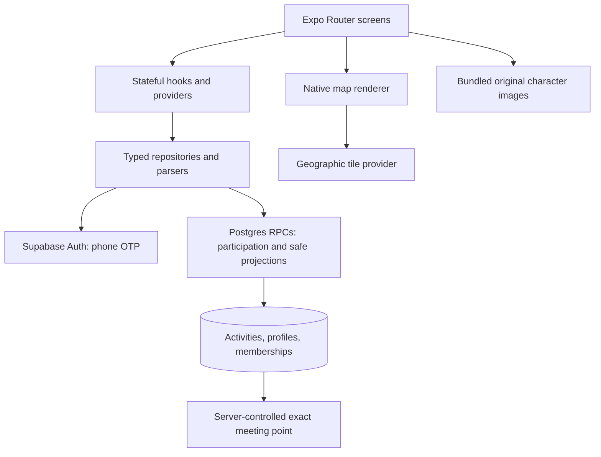
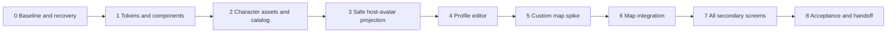

# Night Arcade implementation playbook

**Scope update, 24 September:** [Premium product execution](premium-product-execution.md)
is now the master continuation plan. This file remains baseline technical
guidance; its initial no-wardrobe scope is superseded by the staged, gated
profile/wardrobe specification. Never interpret that expansion as permission to
buy assets, weaken privacy, publish or charge users without the required gates.

Owner: the current implementation agent. Planner handoff: 23 September 2026.
User requested planning first, then a lighter model will execute on **continue**.
No prompt or document can guarantee a model never hallucinates. This playbook
reduces the risk by requiring source inspection, small diffs and observable gates.

24 September audit: [verified progress and omissions](night-arcade-plan-audit-20260924.md).
Treat the numbered steps below as requirements, not evidence that they passed.

## 0. How to resume without repeating work

1. Read `night-arcade-status.md` in this directory. It names the next ticket.
2. Read this entire playbook and `../design-concepts/design-review.md`.
3. Inspect `../design-concepts/night-arcade.png` using the image viewer.
4. Read repository instructions and mobile `AGENTS.md`. Use exact SDK 54 docs.
5. Check `git status --short`, current branch/HEAD, relevant source and migration
   parity. A checkpoint is evidence from a time, not permission to assume no drift.
6. Open only the current ticket's source files. Do not scan all historical logs.
7. Write a short commentary: current ticket, intended result, what will verify it.
8. Implement one ticket, run its gates, record evidence, make a scoped commit,
   then proceed. Use explicit file allowlists, never broad staging.
9. When context is low, update the status file **before** compaction. Include
   commands/process IDs, files changed, failures and next exact action. The next
   turn resumes from that file, not a reconstructed story.

### Scope and authority

Continue routine implementation/testing/docs autonomously. Stop for a provider
payment/account/credential choice, destructive change, real personal-data use,
physical-device action requiring the user, or an unresolved blocker. Do not ask
the user to approve every colour, component or test. Do not silently change
requirements to get a green result. No production launch, paid subscription,
database reset, RLS weakening, full SDK upgrade, or custom 3D engine is authorised
by this design request. No additional background automation is required.

The user requested high-level planning with Astra and execution with a cheaper
model. The user controls switching. Do not claim to have changed the current
model, create a separate task, or spawn agents just to simulate a model switch.

## 1. Verified architecture and where to work



- `apps/mobile/package.json`: Expo ~54.0.35, React 19.1, RN 0.81.5,
  `react-native-maps` 1.20.1, `expo-image` ~3.0.11 already installed.
- `apps/mobile/app.json`: new architecture true; global style dark;
  scheme `nearhere`, bundle `com.nearhere.app`; existing location/date picker plugins.
- No root package.json. Run mobile tools **inside apps/mobile**.
- `app/(tabs)/index.tsx`: map, selection, Browse modal, filters, join/auth intent.
- `app/(tabs)/me.tsx`: account identity, persisted character, Edit profile action.
- `app/(tabs)/plans.tsx`: personal plans and host actions; preserve all states.
- `app/activity/[id].tsx`: detail, privacy, chat, participation and safety actions.
- `app/host/create.tsx`: kind/title/description/time/capacity/join mode/publish.
- `app/host/meeting-point.tsx`: private point search/map selection.
- `app/location-picker.tsx`: manual discovery area search; NOT private meeting point.
- `app/auth/phone.tsx`, `verify.tsx`: phone OTP and keyboard handling.
- `app/onboarding/profile.tsx`: initial name; do not misuse its completion logic
  as a generic editor without checking navigation/pending intents.
- `hooks/use-nearby-location.ts`: selected region, permission/fix state.
- `lib/device-location.ts`: injectable location resolver added at handoff.
- `providers/profile-provider.tsx`: own profile, refresh, stale-request guards.
- `lib/profile-repository.ts`: own read and initial complete-profile update.
- `lib/activity-repository.ts`: existing domain operations; reuse them.
- `lib/activity-validation.ts`: runtime boundary for untrusted backend rows.
- `packages/contracts/{activity,user}.ts`: shared TypeScript contracts.
- `components/host-avatar.tsx`: bundled catalog renderer for map, Browse and Me.
- `lib/avatar-identity.ts`: reads the persisted v1 seed; legacy fallback.
- `supabase/migrations/202609090004_block_aware_consumers.sql`: current discovery
  function and its symmetric block checks. Read this before adding projections.
- `supabase/migrations/202609230001_assigned_avatars.sql`: already deployed at
  handoff; don't reassign avatars or edit this applied migration casually.

### Contracts to preserve, regardless of redesign

1. Browsing is anonymous. Hosting/joining requires authenticated complete profile.
2. Public map uses `publicLocation`, never device GPS or exact meeting coordinates.
3. Exact point is returned only by the authorised server detail path; do not infer
   it from the public point or put it in map labels, assets, logs or analytics.
4. Capacity and membership transitions stay server-controlled. No UI count + 1
   as authoritative join success; consume the server receipt.
5. Pending/waitlisted/rejected/left/removed/cancelled/ended are distinct states.
6. Activity chat is accepted-member-only and block-aware. Do not add DMs.
7. Safety/operator functions and denied states must remain reachable.
8. No API service-role key or management token in the mobile bundle or Git.
9. No destructive demo reset. No user phone/name in committed screenshots/logs.
10. Random avatar appearance is decoration, not verified identity or real likeness.

## 2. Sequencing and dependencies



If production map credentials block ticket 5, continue profile/forms/acceptance
with the current native map behind an explicit fallback. Do not claim custom
map completion. Record the blocker and ask for only the missing provider choice.

## Ticket 0 — Stabilise the starting point

Goal: a populated development map, reliable evidence and recoverable location.

Steps:

1. Verify checkpoint files and preserve unrelated migration edit.
2. Run mobile unit tests, TypeScript and lint with the commands in section 5.
3. Confirm hosted migration `202609230001` exists. It only sets a JSON default and
   backfills empty configs. No broad auth configuration push is needed.
4. Use `supabase/tests/hosted/demo-activities.mjs`. It expects existing complete
   fictional accounts in a JSON `DEV_DEMO_ACTORS` env value containing phone/otp
   pairs, plus the existing public Supabase env vars. Do not commit the values.
   It is hard-locked to the development project and only creates missing live
   slots. It never deletes, cancels or renames profiles. See status for evidence.
5. Improve fixture idempotency before unattended concurrent use: current detection
   uses caller-visible discovery, limit 100. Blocks or too many nearby rows can
   hide a matching slot. Read own hosted activities with verified RLS or maintain
   an ignored ID manifest with revalidation; never solve this by unblocking users
   or using service-role access in mobile. Keep one seeder run at a time until fixed.
6. Fixtures are around public Bellandur coordinates 12.9283, 77.6739. Set Simulator
   GPS there or manually select that area. Do not move the real user's location.
7. Finish UI acceptance of `resolveDeviceLocation`: services disabled, denied,
   current fix, cached fix, absent fix timeout, retry, manual fallback.
8. Inspect asynchronous races in the hook. In particular: a saved manual area can
   be read while a fresh device request is clearing storage; returning to focus
   can restore stale manual state. Use a shared request generation for both read
   and GPS paths, serialize/preserve manual writes, and test stale-result rejection.
   Do not let initialization overwrite a later explicit area choice.
9. Current timer bounds the current-fix step, not every native API. If a native
   service/permission/cache call actually hangs, reproduce then bound the full
   workflow without timing out an actively displayed permission prompt arbitrarily.
10. A focused AppState recovery path now retries denied/error states on foreground
    without overriding a manual area. Verify it in native Settings; do not add a
    second permission loop. The audit fixed a separate stale startup-read race.

Pass: 12 populated demo slots visible through relevant actor/anonymous views,
second run retains rather than duplicates, selected area labels remain truthful,
location errors offer retry/settings/manual choice, and no physical-device claim.

## Ticket 1 — One semantic theme and small shared controls

Create `apps/mobile/constants/design-tokens.ts` (new; confirm no conflicting file)
from the design-review token table. Semantic means role-based names such as
`colors.surface`, not scattered `purpleButton` or copied hex strings.

1. Add tokens for colours, typography, spacing, radii and minimum touch size.
2. Build minimal reusable Screen/Sheet, Button, Field and SectionLabel components
   under `components/ui/`. Inspect existing files before naming new ones.
3. Button supports primary/secondary/destructive, disabled, loading, label and
   accessibility. Never allow repeated submit while pending.
4. Field supports label, value, error, keyboard, focus, helper copy, accessibility.
   Do not wrap inputs in a parent touch handler that steals map/scroll gestures.
5. Explicit dark UI first. Update global/native theme and StatusBar consistently;
   test native date picker, keyboard, alerts, headers, tab bar and splash. Changing
   native config may require rebuilding; Metro refresh alone does not prove it.
6. Measure contrast for real foreground/background pairs. Normal text 4.5:1,
   large text and meaningful UI boundaries 3:1 are acceptance targets. Lime uses
   dark text. Error states have words/icons, not colour alone.

Pass: actual Phone/Auth + one Profile screen demonstrate shared controls;
large text and keyboard do not hide primary actions. No one-off hardcoded theme
is added to every screen. Remaining screens intentionally migrate in ticket 7.

## Ticket 2 — Character catalog, not a 3D engine

This is the largest risk of the result looking unlike the reference. Do not
substitute emoji, circles with eyes, remote random portrait URLs, or CSS people.

1. Use the image-generation skill; read its full instructions. Reference the
   chosen concept for art direction, not as a sprite sheet to crop blindly.
2. Produce one original full-body character first: transparent background, soft
   matte streetwear figurine, front three-quarter pose, readable silhouette,
   subtle grounded feet, no text/logo, simple face and clothing. No Reddit/Pokémon
   copying. Validate the asset at 64–96 point map size and 220–280 profile size.
3. Then produce five coherent variations: diverse skin tones, hairstyles, outfits
   and accessories without stereotypes. Consistent framing, camera and lighting.
   Transparency must be real alpha, not a checkerboard image. Inspect every file.
4. Save artwork under `apps/mobile/assets/avatars/v1/`; keep a source/license/
   generation-provenance note. Optimise using approved image tooling, measure
   pixel size and bytes, and inspect after compression. Proposed budget <=4 MB
   total six-character catalog; revise consciously if quality requires it.
5. Create a fixed catalog module with stable IDs `v1-01`…`v1-06` and literal static
   `require(...)` imports. Metro cannot reliably bundle arbitrary dynamic paths.
6. Freeze the seed-to-index hash and catalog order. Adding future artwork must
   not reassign old seeds: version the catalog instead of changing modulus/order.
7. Renderer uses `expo-image` (already installed), `contain`, fixed layout bounds,
   no remote fetch, accessible label at parent. Decorative avatar not read twice.
8. Build a grid preview solely for dev evidence if useful; don't ship a debug
   route exposing controls or data in release.

Pass: six local assets render on dark background without boxes/clipping; same
seed always produces same character offline/relaunch; no privacy inference;
test catalog uniqueness, known seed mapping, malformed config and unknown IDs.

## Ticket 3 — Public host avatar without exposing private profiles

Own-profile seed assignment and discovery's bounded host-avatar projection are
implemented and deployed through migration 230004. The API is
`nearby_activities_with_avatars`. Detail identity (step 7) is still missing.
The following steps describe requirements to preserve, not work to duplicate.

1. Read current `nearby_activities` SQL and table columns. Match all argument
   names/defaults/types and original return columns exactly; add only a bounded
   public `host_avatar_config` projection. Shared contract field can be optional
   `hostAvatarConfig` to keep older create/detail receipts parseable.
2. Prefer an additive wrapper over changing an existing function's return type.
   PostgreSQL `CREATE OR REPLACE` cannot change its table return shape. Do not
   drop the old RPC and break existing clients/grants.
3. Wrapper calls existing block-aware discovery with the caller's auth context,
   then joins the returned activity IDs to activities/profiles for avatar data.
   Retain distance/start/id ordering and the original radius/limit constraints.
4. Return only version, valid UUID seed and (if implemented) catalog item ID.
   Do not return raw `avatar_config`, interests, phone, private coordinates,
   arbitrary user-supplied JSON, or full profile rows. Apply fallback for malformed
   legacy data. Security definer uses `search_path=''` and fully-qualified names.
5. Explicitly revoke default PUBLIC execute and grant only the required anon and
   authenticated roles. Keep profiles RLS unchanged. Validate actual grants.
6. Add parser tests and repository call. Deploy SQL before switching the caller.
   If temporary fallback is needed, only fall back on verified missing-function
   error, not generic auth/network failures that should remain visible.
7. Detail consistency: add an equivalently authorised detail projection or extend
   with a versioned wrapper over `activity_detail` after inspecting its complete
   shape. Never implement a simpler detail query that bypasses exact-point rules.
8. Hosted verification: anonymous/own/other actor read, symmetric block filtering,
   no extra sensitive columns, malformed config fallback, map/profile same avatar,
   existing participant privacy matrix still passes.

Pass: host appearance is stable after rename, same on map/detail/profile, and
public clients cannot retrieve private profile fields or exact meeting points.

## Ticket 4 — Real profile, editable identity

Design: large character preview, display name, six fixed character options, and
account actions. No fabricated @handle, neighbourhood/bio/counts unless a real
schema + authorised read/write path is deliberately added. Current implementation
is in `app/onboarding/profile.tsx`; existing profiles use Me → Edit profile.

1. `me.tsx` should scroll at small size/large text; keep sign-out reachable.
2. Use local draft state. Opening editor does not save; Back cancels the draft.
3. Name validation already lives in `profile-validation.ts`. Reuse its bounds;
   preserve name and seed on cancelled edit. Do not turn an incomplete profile
   complete unless the initial onboarding requirements are satisfied.
4. Character picker selects one of six fixed catalog IDs. Save only allowlisted
   `avatarId` and preserve the server seed. Migration 230004 reconstructs public
   JSON from hard-coded catalog IDs. Existing arbitrary legacy JSON remains
   tolerated by the column; app parsing strips it. No broad JSON constraint was
   added, avoiding a breaking migration for old rows.
5. `completeMyProfile` repository update and provider request-generation guard
   protect the account UI against a late response after account switch. Existing
   own-row RLS remains the authorization boundary.
6. Confirm new account random assignment uses the DB default from the auth trigger;
   renderer merely reads it. Do not perform random reassignment during onboarding.
7. Use `getMyPlans` for a small real upcoming list, with loading/empty/error states.
   If querying only the first 50 plans, don't label their length lifetime totals.
8. Keep the user's phone private. No avatar uploads/storage bucket required.

Latest audit source gates pass at 67 tests; Me scrolling/upcoming plans and retry
mode were fixed in that audit. Simulator acceptance remains:
new profile assigned; existing seed retained; edit/save/cancel/relaunch; same
character across map and Me; failure preserves draft; cross-user update denied.

## Ticket 5 — Custom map proof before migration

Nearby has moved from Apple Maps (`react-native-maps`) to native MapLibre. The
iOS Simulator native build, tile rendering, avatar pins and cluster interaction
have passed a first smoke; full coverage remains. A palette on buttons alone
never restyles base geography.

1. Verified runtime and official metadata: Expo `~54.0.35`, RN `0.81.5`, React
   `19.1.0`, New Architecture enabled. Installed `@maplibre/maplibre-react-native`
   `11.4.0`, whose peers require Expo >=54, RN >=0.80, React >=19.1.
2. Expo plugin was added to app config; the native Simulator build succeeded in
   the earlier checkpoint. Check PIDs/build products before any rebuild.
   Avoid `prebuild --clean`; it can remove generated native customizations.
3. Prototype initially used OpenFreeMap `https://tiles.openfreemap.org/styles/dark`;
   it now uses local `assets/maps/nearhere-night-arcade-v1.json`. Official
   site says no key/registration and free, but current terms say as-is, no
   availability warranty, possible discontinuation, and Cloudflare CDN processing.
   Keep MapLibre attribution/logo visible; this is not a production SLA selection.
4. The actual source uses MapLibre v11 names `Map`, `Camera`, `GeoJSONSource`,
   and `Layer`. v11 migrated ShapeSource to GeoJSONSource and renamed old
   PointAnnotation to ViewAnnotation. Don't copy old examples.
5. Nearby is now authored with native cluster layers, stable locally-bundled avatar
   sprites, selection halo and own-device-only location point. Prove pan/zoom,
   tap/cluster expansion, 12+ fixtures, road imagery/labels, tile failure and
   attribution in Simulator before calling the vertical slice accepted.
6. Renderer, style and tiles are distinct. NearHere now owns the local 13-layer
   style while OpenFreeMap supplies tiles/glyphs. Inspect the local JSON before
   changing layer IDs; keep the schema regression test and attribution.
7. External tile request includes client network metadata and the requested
   approximate map viewport; never put exact meeting coordinates in tile URLs.

Pass: exact-version native proof, real geography/credits, style loads, cluster
and selection interactions work. Document tile coverage, limits, cost boundary
and network fallback; production map SLA remains a separate future decision.

## Ticket 6 — Map-first integration and collision handling

1. Extract a map renderer adapter taking public activities, selected ID, region,
   selection callback and camera callback. Keep auth/repository logic in screen/
   hooks. Do not fork domain logic between two renderers.
2. Beware coordinate order: native Region uses latitude/longitude fields; GeoJSON
   coordinates use `[longitude, latitude]`. Unit-test transformation with Bengaluru.
3. Each character's feet anchor to its public activity coordinate. Marker size is
   bounded screen points, not geographic metres. Selected character gets a quiet
   outline/halo, not a live-status pulse.
4. Collisions: start with screen-space clustering or library-supported clustering
   verified for installed version. Nearby overlapping avatars become one count
   cluster that zooms/reveals choices. Never randomly jitter exact coordinates or
   move privacy areas persistently merely for aesthetics. A spiderfy UI must label
   displaced visual anchors and leave stored coordinates unchanged.
5. At close zoom allow bounded full-body markers; far zoom use aggregate count.
   Do not mount hundreds of animated React components. Test 12, 50 and synthetic
   200 markers locally without creating 200 hosted activities.
6. Resting controls follow design review: area/profile, locate, Browse/Plans, Host.
   Category filters in Browse. Selection opens one compact preview; map tap closes.
7. Stale selection clears when filtered/blocked/removed. Preserve the location
   error actions and pending auth intent. Joining remains server-driven.
8. Layout uses safe-area insets and measured sheet size. Avoid hardcoded screen
   heights, header overlaps and bottom attribution obscuring. Dynamic Type can
   expand into a scrollable sheet rather than covering the whole map silently.

Pass: populated-map screenshot resembles reference hierarchy, real marker taps,
cluster selection, no overlap trap, accessible Browse equivalent, correct privacy.

## Ticket 7 — Finish the entire visual system, not only the map

Migrate one screen at a time using shared tokens, then capture it:

| Screen | Must preserve and test |
| --- | --- |
| Host | All kinds, text draft, quick/custom date/time, meeting search/pin, capacity/join mode, publishing/loading/error |
| Meeting picker | Map/search switch, search loading/empty/error, explicit point confirmation, cancel preserves previous point |
| Location picker | Permission-first flow, manual fallback, persisted area, no exact-point confusion |
| Activity detail | Time/distance, membership states, exact-point gating, directions, accepted-only chat, safety/report/block |
| Plans | Hosted/joined/requested/waitlist history, host request decisions, removal/cancel confirmations, empty/error |
| Phone/OTP | Country/number/code validation, resend timing, Done/dismiss/scroll keyboard, retry, no code logs |
| Onboarding | Name validation, new assigned avatar, pending join/host intent resumes once |
| Operator | Role denied, review states and audit actions remain intact; don't grant role to test visual styling |

Host layout: concise header; activity type horizontal chooser; clear field labels;
time preset row + custom option; meeting summary + Change; publish action reachable
with keyboard. Avoid large whitespace/giant explanatory cards. Privacy explanation
can be a small inline disclosure but the public/private distinction stays explicit.

Activity detail: content hierarchy, host character/name, compact metadata rows,
membership action, privacy card, chat, secondary safety actions. Keep irreversible
operations visibly distinct from ordinary navigation. Don't put nested scrolling
chat inside an unusable fixed-height card without testing keyboard/long messages.

Pass: no accidental cream/orange/violet leftovers, no impossible contrast, no
clipped titles/actions, no function removed just to simplify visual appearance.

## Ticket 8 — Final acceptance and release boundary

Run the matrix in section 5. Save real screenshots in `docs/screenshots/` with
date, device, build/commit, state and result in `docs/visual-evidence.md`. Clearly
separate them from generated concepts. Report remaining gaps, not “works perfectly.”

Update relevant docs using section 6. Scoped commit/push to existing branch after
checks; don't force push. Invite-only beta/TestFlight still requires physical
device, signing/provider/privacy/release gates; this redesign is not App Store
approval, production SMS proof, or community traction evidence.

## 3. Hallucination tripwires: stop guessing here

| Temptation | Required evidence / correct action |
| --- | --- |
| “This API probably exists” | Read installed exports/types and exact-version official example; run minimal compile |
| “Dark map is done” | Real geography screenshot after native build, not generated concept |
| “RLS makes any RPC safe” | Security-definer functions need explicit caller checks; inspect SQL and run multi-user negative tests |
| “Avatar JSON is harmless” | Public projection uses field allowlist, not entire arbitrary JSON |
| “The screenshot has counts so add them” | Derive from authenticated server contract or omit |
| “Nearby activity vanished; reseed everything” | Check ends_at, status, area/radius, filters, blocks and pagination; preserve rows |
| “Location is on so GPS works” | Services, app grant, device/simulator fix and cache are separate |
| “Schema migration is deployed because file exists” | Migration parity + hosted function invocation |
| “Tests passed” after nonzero exit | Read bounded raw errors and actual exit status; Distill can omit failure context |
| “No internet means show demo as real” | Explicit offline/error state; no hidden fixtures in production rendering |
| “Physical iPhone passed” from Simulator | Must have direct device evidence or user report labelled as such |
| “Changing palette fixes UX” | Verify hierarchy, density, gestures, keyboard, loading, errors, all screens |

Unknown public API shape: inspect source/response safely. Unknown credentials:
ask for configuration without printing tokens. Unknown product decision that
changes scope: pause and present narrow alternatives, do not invent agreement.

## 4. Recovery and escalation protocol

Two unsuccessful attempts at the same error are a signal to investigate, not
repeat the command. Capture exact bounded error and installed versions, consult
official docs, try one justified alternative. If still blocked, checkpoint and
ask the user to switch back to the planning model with:

```text
Ticket / intended result:
Actual error and reproduction:
Files and current diff:
Attempts and results:
Verified facts vs unverified assumptions:
Smallest decision / access needed:
Safe next action; any running process:
```

Do not hide a failed native build behind a web preview. Do not weaken security to
pass tests. Do not fake assets or provider coverage. Continue independent safe
tickets if useful, but clearly keep the blocked ticket incomplete.

## 5. Verification recipes and acceptance matrix

From `apps/mobile`:

```sh
set -o pipefail
npm run test:unit 2>&1 | distill 'Report test count, failures, exact failing test names, and final status.'
./node_modules/.bin/tsc --noEmit
npm run lint
# Bundle verification only; not a native installation or physical-device test:
npx expo export --platform ios
```

Use Distill for verbose export/build output; retain bounded raw failure detail.
Root `npx tsc` was a trap in this handoff: no root package.json/compiler, so it
resolved the wrong executable. Use the installed mobile compiler above.

Before any hosted mutation, check target project and migration parity. Hosted
harnesses under `supabase/tests/hosted/` cover profiles RLS, activity detail,
participation, chat and safety. Read each harness before running: some create
fixtures, rename harness profiles, block/unblock actors, cancel their own test
activities. They must not delete/cancel persistent `NEARHERE_DEMO_V1` rows. Do not
paste credentials into documentation. Reuse secure local setup and stop if missing.

| Gate | Required cases |
| --- | --- |
| Unit | Avatar parser/hash/catalog stability; JSON projection; geo coordinate conversion; cluster boundaries; location timeout/cache; theme contrast |
| Hosted | Own-only profile edit, foreign edit denied, anon safe projection, blocks symmetric, exact point withheld, assignment once, invalid catalog rejected |
| Simulator map | 12 demo rows, pan/zoom/select/dismiss, overlap clusters, filter/list equivalence, stale/blocked selection, missing tiles |
| Simulator identity | New/old account, name change, avatar change/cancel, relaunch/offline, logout during save, same marker/profile |
| Simulator forms | Small screen + large text, keyboard phone/OTP/title/chat, custom date/time, meeting selection, long descriptions |
| Simulator lifecycle | Background/foreground, Settings return, denied/granted location, no GPS fix, slow network, retry without duplicate writes |
| Domain regression | Open join, pending/accept/reject, waitlist/promotion, leave/remove/cancel/ended, chat and report/block |
| Accessibility | VoiceOver labels/order, 44pt targets, non-colour states, screen reader Browse alternative, reduced motion |
| Performance | Real measurements for 12/50/200 local markers; image memory, interaction responsiveness, no endless redraws; record device/build |
| Physical device | GPS indoors/outdoors, permissions/Settings, touch keyboard/gestures, background, map load, battery/heat observation |

Avoid asserting frame-rate numbers without profiling. Avatar bitmap optimisation
and clustering targets are hypotheses until measured. Simulator isn't real GPS.
Physical test remains a user checkpoint if the iPhone is not connected/available.

## 6. Documentation and teaching after every ticket

Each completed ticket gets:

1. Product problem in plain language.
2. Small flow/picture showing data/state ownership.
3. Exact files/functions and why each exists.
4. New concept explained once, then used consistently (seed, projection, renderer,
   race, cache, semantic token, discriminated union, RLS, native build).
5. Alternatives/tradeoffs and what was deliberately not built.
6. Challenge → observed evidence → root cause → fix → regression test.
7. Actual verification results and open gaps.
8. One learner exercise tied to the real code, plus honest interview explanation.

Update owners, not contradictory duplicate specifications:

- Handoff status: progress, next action, blockers, commands/evidence.
- Design review / design-system: decisions, tokens, screenshots, interaction rules.
- Data-model / api-spec: migration + public/private fields + actual API signatures.
- System-design / technical-architecture: renderer/tiles/avatar flow and trust boundaries.
- Code-tour / engineering-learning-guide: worked implementation and debugging lessons.
- Testing-status / visual-evidence: exact checks, failed/unrun states, real captures.
- Roadmap / execution-plan / engineering-backlog: accepted scope and remaining tickets.
- README documentation map: links to canonical owners.

Historical lessons stay historical; add dated supersession banners instead of
rewriting old results to make them look current. Never fill the docs with claims
about screens or tests that are merely planned in this playbook.
