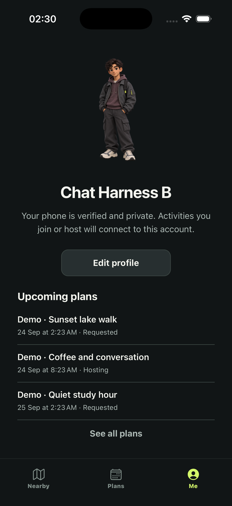

# Night Arcade: planner-versus-implementation audit

Audit date: 24 September 2026. Baseline: `07999f0` (`v1 almost complete`),
branch `leda/initial-product-foundation`, initially clean worktree.
The fixes below are local changes on top of that commit, not a published release.

## Verdict

The lighter model implemented a substantial, functioning visual foundation. It
did **not** complete every step or acceptance gate in the planner's guide. Some
omissions are actual missing code, some are incomplete tests, and some old prose
incorrectly described already-completed work as missing. Do not calculate a
completion percentage by counting rows marked “implemented.”

## Zero to current: every ticket and remaining work

Step references below refer to `night-arcade-execution.md`. “Code” is not the same
as hosted verification, Simulator acceptance, physical acceptance or release.

| Ticket / steps | Verified implementation | Missing or unaccepted |
| --- | --- | --- |
| Planning/research | Concept options, chosen charcoal/lime direction, source-backed design review and execution guide exist | Real UI is not pixel-equivalent to the generated concept; concepts are not test evidence |
| 0.1–4, 0.6 baseline/fixtures | Clean baseline inspected; unit/type/lint gates rerun; local/hosted migrations match through 230004; anonymous discovery returns 12 marked demo activities | No seeder was run in this audit; original non-demo activity is no longer returned, which does not establish deletion |
| 0.5 fixture idempotency | Seeder preserves existing rows and hard-locks the development project | Still detects duplicates through caller-visible discovery limited to 100; blocks/crowding can hide a slot. Not safe for unattended/concurrent seeding |
| 0.7–9 location | Services/permission/fix failures separated, current fix bounded, cached location labelled, manual writes serialized | Found and fixed stale startup-read race; physical denial/recovery, cache-age and full native lifecycle acceptance still open |
| 0.10 Settings return | Focused AppState recovery already exists for denied/error and avoids overriding manual selection | Old guide incorrectly said it was missing. Live Settings recovery not rerun here |
| 1.1–5 design system | Semantic tokens, Button/Field, explicit dark app/StatusBar exist; picker dark appearance made explicit in this audit | Screen/Sheet/SectionLabel abstractions absent; Field reuse incomplete; all native keyboard/alert/header states not accepted |
| 1.6 contrast/accessibility | Main surfaces use shared colors; operator actions now minimum 44pt and wrap | Full measured contrast, large text, screen reader and reduced-motion matrix not completed |
| 2.1–8 avatars | Six bundled original full-body assets, stable catalog, seed/choice helpers and parser tests; character visible in Simulator | No new six-asset offline/relaunch/size matrix in this audit; not a custom wardrobe or live 3D engine |
| 3.1–6 discovery identity | Additive deployed `nearby_activities_with_avatars`, allowlisted projection, parser and caller wired; fresh anonymous shape smoke passes | Signed-in actor/block/malformed-config projection matrix still incomplete |
| 3.7–8 detail identity | Discovery/Browse/Me can show the account character | **Missing:** detail contract has no host avatar projection; Activity Detail still uses category art. Plans also uses fallback art. Do not claim identity parity everywhere |
| 4.1 profile layout | **Fixed:** Me now scrolls instead of a fixed-height centered column | Small-screen/large-text scrolling and sign-out reachability need gesture acceptance |
| 4.2–6, 4.8 profile editing | Draft picker, validation, seed preservation, own-row repository, provider request guard, DB seed default | **Fixed:** failed-save retry no longer loses editor mode/Cancel; repeated submit guarded. Save/relaunch, forced failure retry, account switch and cross-user denial still need end-to-end evidence |
| 4.7 actual plans | **Added:** three real current/upcoming plans using existing `useMyPlans` / `getMyPlans`, empty/loading/retry states, See all; Simulator showed Hosting/Requested correctly | First-50 endpoint is not lifetime totals; no made-up stats; loading/error/empty cases need UI acceptance |
| 5.1–7 custom map | MapLibre native integration and authored local 13-layer style; prior native build proof; real tiles and credits | Production tile SLA not selected; fresh offline/tile-error behavior not exercised; old stock-style/build-pending prose corrected |
| 6.1–2 map boundaries | GeoJSON mapping currently lives inside Nearby | **Missing:** renderer adapter extraction and dedicated coordinate-order regression test |
| 6.3–7 interactions | Avatar layers, stable IDs, clustering/halo, Browse fallback, compact preview and selection cleanup exist | Current-style direct marker/cluster input not accepted; no 50/200 synthetic-marker performance measurements |
| 6.8 responsive map | Safe areas used; resting screen substantially less crowded than old version | No measured-sheet layout strategy; large-text expansion/overlap acceptance missing |
| 7 Host/date picker | Form, time presets, custom native picker, meeting search/pin and publish path exist | **Fixed:** nested accessible Pressables hid native wheels. Date/Time/Done now usable through accessibility; changing wheel value still unverified; no new publish test |
| 7 other consumer screens | Theme applied to auth/onboarding, Plans/detail and both pickers; previous partial screenshots exist | Complete status/role/keyboard/permission/search-error matrix not rerun; picker basemaps intentionally still platform-native |
| 7 Operator | Review console and backend authorization existed | **Fixed:** old cream/orange theme replaced with tokens; role/action acceptance not rerun and no operator role granted |
| 8 acceptance | Fresh 67 unit tests, TypeScript, lint, iOS export, migration parity and anonymous hosted smoke pass; limited live UI evidence below | Authenticated privacy regression, device matrix, performance, physical iPhone, production SMS/signing/provider gates remain |

## What was actually broken, and why

### 1. A stale startup read could trigger fresh GPS

Original sequence:

```text
startup reads stored area ─── waits ─── returns false because stale
             user requests a newer location ─── succeeds
startup treats false as “no saved area” ─── starts GPS again
```

The same boolean represented both “nothing saved” and “this response no longer
owns the screen.” These are different states. `lib/location-selection.ts` now
returns `applied | empty | superseded`; only `empty` allows startup GPS.
The hook checks both request generation and storage revision. A newer manual
write also prevents an older GPS result from repainting the screen after clearing
storage. A storage exception is not reported as a GPS-permission failure.

Five deterministic tests use delayed promises to simulate old reads resolving
after newer intent, including null, a saved value and a rejected storage read.
This tests the async decision helper; it is not a mounted native-hook or physical
GPS test. Remaining storage-clear/native lifecycle cases need integration tests.

### 2. Network state was incorrectly used as editor identity

`ready → saving → error` is a request lifecycle, not proof that onboarding became
incomplete. The editor formerly hid Cancel and treated a retry as first-time
onboarding. `app/onboarding/profile.tsx` now derives edit mode from persisted
`profile.onboardingStatus`. A ref guards duplicate submissions before React can
paint the disabled button. A forced network-error UI test remains outstanding.

### 3. Accessibility grouping concealed the date controls

The modal put its entire sheet inside a labelled Pressable and another Pressable.
The parent became one accessibility target. Replacing the container with a View,
making the dismiss backdrop its sibling, and marking the sheet as modal exposed
Date, Time, Done and native wheel sliders. `themeVariant="dark"` also prevents
the native picker from relying on an unrelated system theme.

Fresh Simulator evidence: Date → Time changed the exposed slider set; Done
closed the sheet and returned to the host form. Setting a wheel through AX did
not change its value; coordinate dragging failed with `noWindowsAvailable`.
Thus the grouping bug is fixed, but arbitrary date/time selection is **not**
accepted yet. Official SDK reference consulted before coding:
[Expo SDK 54 Location](https://docs.expo.dev/versions/v54.0.0/sdk/location/).

## Fresh verification (not inherited claims)

| Check | Result |
| --- | --- |
| Mobile unit tests | 67 passed, 0 failed (62 existing + 5 location-selection tests) |
| TypeScript / Expo lint | Both exit 0 after source edits |
| iOS JavaScript export | Exit 0; Hermes bundle 5,115,533 bytes; `/tmp/nearhere-audit-ios-20260924` |
| Migration parity | All 26 local/remote entries match through `202609230004`; no migration applied |
| Anonymous discovery | HTTP 200; 12 rows, all 12 marked demos, all 12 avatar configs; no unexpected columns or avatar keys |
| Dependency audit | 24 findings: 13 moderate, 11 high, 0 critical. No forced auto-fix; reported fixes include incompatible major SDK changes. Exploitability/production impact still requires triage |
| Simulator profile | Real Hosting/Requested plans rendered; Edit profile opens; draft Character 1 selected then cancelled; no hosted profile mutation |
| Simulator custom-time sheet | Date/Time tabs, wheel accessibility exposure and Done verified; wheel-value mutation not verified |
| Source whitespace | `git diff --check` passes |



The screenshot is a development actor, not a physical device. It proves rendered
data and layout at this device size, not every scroll or large-font behavior.
The label Upcoming includes still-running published plans, matching Plans' shared
partition function. No exact meeting point is rendered in this preview.

## Bottlenecks and concrete solutions

1. **Documentation drift:** completed migration/map work described as proposed;
   some missing code grouped under “implemented.” This audit and checkpoint
   correction separate source, deployment and acceptance. Maintain one live ledger.
2. **Date picker test blockage:** partly a real accessibility bug, now fixed.
   Remaining wheel/MapLibre coordinate input fails in the automation layer despite
   screenshots and indexed button actions working. Do not label the map broken
   from this error alone. Need real gesture acceptance or a working coordinate
   input path; retain accessible Browse as the alternate user route.
3. **Seeder duplicate risk:** replace visibility-based lookup with an owner-scoped,
   RLS-verified fixture identity query or ignored receipt manifest with revalidation.
   Run one seeder at a time meanwhile. Never delete demos to create a clean screen.
4. **Missing detail identity:** additive authorized detail wrapper, bounded public
   avatar config, parser tests, actor/block/exact-point matrix, then UI wiring.
   Do not look up arbitrary private profiles or reuse exact coordinates publicly.
5. **Acceptance is wider than compiling:** add read-only synthetic 12/50/200 point
   datasets; test map responsiveness, Dynamic Type, screen reader, keyboard and
   signed physical build separately. One real iPhone is enough for device-specific
   checks; multiple fictional accounts can run in separate Simulators.
6. **Security dependency debt:** inspect each advisory's actual package path and
   runtime exposure; use compatible fixes first, then an isolated Expo upgrade
   with native regression if necessary. `npm audit fix --force` is not a solution.

## Deliberate deferrals versus accidental omissions

Intentional: full avatar wardrobe/live 3D, direct messages, payments, recurring
event administration, complex recommendations, custom Redis/WebSocket services,
production tile SLA/SMS/signing decisions, and fabricated profile statistics.
Real-time activity chat already exists; it is not the deferred direct-message feature.

Not intentional completion: detail avatar projection, robust seeder identity,
map adapter/tests, measured sheet behavior, full shared-control adoption, and
acceptance gaps listed above. Profile scrolling/upcoming plans and operator theme
were missing code until this audit, not merely missing screenshots.

## Next implementation order

1. Harden seeder duplicate detection without deleting or rewriting current demos.
2. Add authorized detail-avatar projection and its hosted privacy tests.
3. Extract map rendering/coordinate conversion; run synthetic scale tests and
   implement measured/scrollable selection layout.
4. Finish shared controls/contrast and remaining UI state matrix. Add retry/account
   switch tests for the editor; verify profile save/relaunch with fictional actors.
5. Close real-gesture date/map tests, authenticated participation/privacy regression,
   dependency triage and physical-iPhone gates. Only then claim beta readiness.

No database records were created, deleted, cancelled or renamed in this audit.
No provider account, permissions, migration, publication or production setting
was changed. The user asked for an audit and a brief hand-back; these remaining
steps are explicit follow-up work, not a claim that everything is complete.
