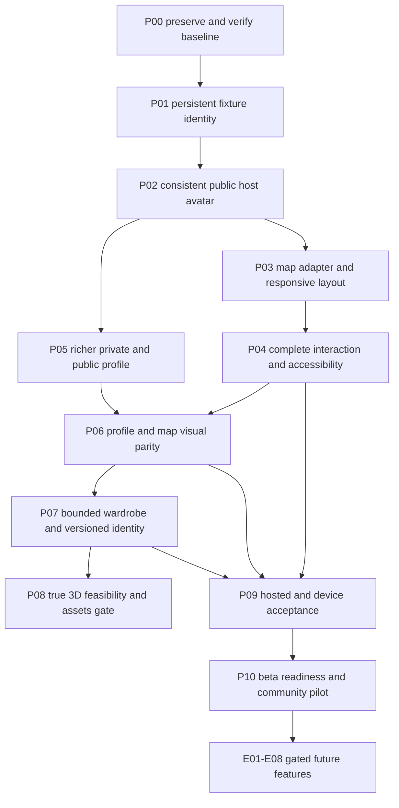

# Premium NearHere: execution contract for the next model

**2 October scope update:** for the latest requested design/identity work, follow
[Day/night maps, Avatar Studio and account identity](daylight-avatar-identity-20261002.md)
from D00. It adds modular 2D customization, usernames and multiple sign-in methods,
and supersedes conflicting visual/wardrobe scope here. This older plan remains
background and retains its privacy, fixture and release evidence requirements.

Prepared 24 September 2026 after the planner audit. **Plan, not implementation.**
User request: make the app resemble the approved map/profile concept, plan all
remaining and previously deferred work, then hand off to a lighter model.
This turn changes documentation only. On the next **continue**, execute below.

## Read order and precedence

1. Root `AGENTS.md`, current Git diff/status, and `night-arcade-status.md`.
2. This complete guide and `night-arcade-plan-audit-20260924.md`.
3. `../design-concepts/design-review.md`; inspect `night-arcade.png` there.
4. Read the complete specialist guide before its phase:
   [Profile and wardrobe](premium-profile-avatar-spec.md),
   [Deferred features](premium-community-roadmap.md).
5. `night-arcade-execution.md` remains the detailed baseline technical guide;
   its unchanged privacy/verification requirements still apply. This new roadmap
   supersedes its blanket “wardrobe deferred” scope, not its safety boundaries.
6. Read `apps/mobile/AGENTS.md` and exact installed-version native documentation
   before coding. Source/migrations outrank historical prose about implementation.

No document can prevent every model error. Reduce uncertainty through small
changes, explicit proposed contracts, negative tests, and real evidence.
Do not claim to be a different model or change the user's selected model.

## Product target and authority

Build an expressive **activity map**, not a live people tracker. Characters mark
public approximate activity areas. An account gets a persistent character once;
editing identity must update its appearances consistently. Private meeting
points remain server-authorized. Browsing remains possible without signing in.

On continue, routine local implementation, tests, additive development migrations
after review, and fictional-actor tests are in scope. Preserve existing edits,
demo activities and private data. New paid services, asset purchases, production
publication, actual charges, real-user communications, destructive cleanup,
new access grants, or legal/business decisions require explicit user input.
Respect any tool-specific action-time approval requirements as well.

Previously deferred features are now **planned**, not blanket authorization to
activate payments, create public DMs, collect new telemetry or track attendance.
Local disabled prototypes may proceed where specified; gates prevent silent
product changes. Keep a feature hidden until its server and safety gates pass.

## Current starting state

- Baseline Git commit `07999f0`; audit corrections are uncommitted. Inspect and
  preserve them, especially `location-selection.ts`, profile, host and operator.
- Last executed gates: 67 tests, typecheck/lint/export pass; 26 migrations match
  through 230004; anonymous discovery has 12 marked demos. These are historical
  results to reproduce, not results from this planning turn.
- Existing: Expo SDK54, RN0.81.5, React19.1, MapLibre11.4, Supabase/PostGIS,
  bounded discovery, memberships/waitlist, participant chat, blocks/reports,
  operator audit/recovery, database write-rate limits and observability foundations.
- Missing: robust fixture identity; detail host avatar; isolated map renderer and
  coordinate tests; full responsive/gesture/role acceptance; richer profile;
  wardrobe art pipeline; production push/SMS/provider/release decisions.
- `expo-gl`, Three/Fiber and `expo-notifications` are **not installed** in the
  inspected package manifest. No 3D assets or notification delivery are implied.

## Execution graph



Execute in ticket order; independent local tasks may continue while an external
gate is blocked. Do not bypass a failed prerequisite or keep retrying an
unchanged external blocker. User can request a different priority explicitly.

## Ticket protocol (mandatory for every ticket)

Record ID, source files inspected, intended behavior, old behavior preserved,
implementation steps, tests/results, screenshots, migration deployment state,
remaining gates, and next action in the live status file.

Use these states: `not_started`, `in_progress`, `code_verified`,
`hosted_verified`, `simulator_verified`, `device_verified`, `accepted`, `blocked`.
Not every ticket needs every state; declare required gates before work. Tests
that were not run are `not_run`, not passed. A skipped feature needs a reason.

1. Inspect actual function/type/schema names before writing a caller.
2. Write a failing meaningful regression or contract test for behavioral changes.
3. Change the smallest coherent layer: contract -> database -> repository -> hook
   -> UI, with additive deployment preceding a client switch.
4. Test new behavior and previous privacy/error states. No `as any` to quiet a
   shape mismatch, no generic success fallback on auth/network errors.
5. Run applicable local gates, then real runtime checks; capture safe evidence.
6. Update teaching notes and ledger before context compaction. Preserve uncommitted
   work; use scoped commits only within existing publishing authorization. Never
   force push or stage secrets/generated native output blindly.
7. Continue next eligible ticket after its prerequisites pass. Escalate only a
   concrete decision, absent resource or persistent unresolved failure.

## P00: establish a recoverable baseline

Files: current audit/status, mobile package/lock files, root/mobile instructions.

1. Inspect branch/HEAD/status and distinguish inherited audit changes from yours.
2. Rerun unit/type/lint/diff checks. Inspect existing Metro/native processes before
   launching a duplicate; use the installed development build, not Expo Go.
3. Read linked migration list without printing credentials; do not reset or push
   unrelated pending SQL just to make a test pass.
4. Verify 12 demo slots through read-only discovery; count can change as events
   expire. Do not infer deletion from expiry/filtering. Record clock/timezone.
5. Establish iPhone-size baseline screenshots: map, Browse, Me, editor, Host,
   Detail, Plans. Never include private coordinates/OTP/tokens in published docs.
6. Triage the 24 audit findings by dependency path, runtime exposure and compatible
   fixes. Save results; do not force a major Expo upgrade in a styling ticket.

Accept: reproducible baseline and explicit defects, no hidden reset. Learn:
“reproducible” means another person can repeat the check, not trust a screenshot.

## P01: preserve a populated map without duplicate fixtures

Existing: `supabase/tests/hosted/demo-activities.mjs`. It authenticates fictional
actors, searches discovery limited to 100 and creates missing markers. That
search can miss a slot; “not visible” does not mean “does not exist.”

Implementation update (24 September): the existing caller-scoped `my_plans`
read model and an exclusive local lock are implemented. The helper only indexes
the current actor's host-role records and fails closed at the 100-row cap or for
duplicate marker ownership across actors. This avoids depending on map radius,
blocks or discovery limits and adds no public table grant/RPC. A created activity
appears in the host's plans before the optional join; retry reconciles its stable
slot marker. The lock prevents overlap only on this Mac; cross-machine seeding
still needs a database uniqueness design. Actor-backed second-run and contention
acceptance has not been executed because fictional credentials were unavailable.
All fixture rows remain preserved.

Tests: local pure tests cover non-geographic indexing, invalid markers, a
potentially truncated inventory and ambiguous ownership. Remaining hosted checks:
second run creates zero duplicates, blocked actor, expired slot, local lock
contention, failed secondary join, and missing auth configuration. Accept only
with before/after ID evidence. No existing records are deleted or altered.

## P02: one safe avatar projection on every host surface

Inspect these real files before designing new SQL:

- `supabase/migrations/202609090005_block_existing_membership_privacy.sql`
  for current detail authorization; search later migrations for overrides.
- `202609230004_selected_avatar_projection.sql` for discovery allowlisting.
- `packages/contracts/activity.ts`, mobile `lib/activity-validation.ts`,
  `lib/activity-repository.ts`, `components/host-avatar.tsx` and
  `app/activity/[id].tsx`; inspect Plans host-avatar fallback separately.

Implementation:

1. Inventory exact `activity_detail`/`my_plans` result columns and caller rules.
2. Add optional bounded `hostAvatarConfig` to relevant read-model contracts, not
   all mutation receipts. Add parser tests before switching RPC names.
3. Propose additive wrappers `activity_detail_with_avatar` and
   `my_plans_with_avatars` (NEW names, not existing APIs). Each must call the
   existing caller-aware function, join only its authorized activity IDs, and
   append strictly allowlisted version/seed/catalog ID. Keep row order and limit.
4. Verify `search_path`, fully qualified objects, execution grants, anon/auth
   access and function ownership. Security-definer wrappers must not accidentally
   replace the caller identity or bypass the base function's block checks.
5. Deploy and verify to the linked development project only after reviewing SQL;
   then switch repository callers. Keep old RPCs for older clients. Roll back by
   reverting the new client caller, not dropping live functions or data.
6. Replace category hero as host identity with HostAvatar + real host name; retain
   category as secondary text/icon. Add the same bounded identity to Plans.
7. Refresh focused discovery/detail after successful avatar edits. Cache by
   validated configuration/version, not name. Rename must not change character.

Implementation update (24 September): migration `202609240001` adds the two
new wrapper RPCs and was deployed to the linked development project. The mobile
repository now calls those wrappers; parsers share one strict projection
validator and ignore unapproved JSON fields. Anonymous hosted smoke covered
three current rows and verified membership and exact coordinates remain null.
Local parser tests cover bad version/catalog values and extra fields. Detail and
Plans render the same configured host avatar; Simulator and authenticated actor
matrix remain open. Do not mark the ticket accepted until those checks pass.

Required matrix: anon, host, other accepted member, outsider, pending, waitlisted,
left/removed, either-direction block, cancelled/ended, invalid legacy JSON,
unknown catalog ID, extra private keys. Compare original allowed detail fields
before/after; exact point must remain null for unauthorized actors. Do not cache
private detail across sign-out. Accept: same character in Me/map/Browse/detail/
Plans plus negative authorization evidence, not merely one successful query.

## P03: isolate map rendering and make overlays responsive

Existing: `app/(tabs)/index.tsx`, local map JSON, `hooks/use-nearby-activities.ts`
(verify filename), avatar identity/catalog and location hook. Proposed files:
`components/map/activity-map.tsx`, `lib/activity-map-features.ts` and its tests.

1. Extract the pure conversion from public activities to GeoJSON. Require finite
   bounded coordinates, `[longitude, latitude]`, stable activity ID and catalog
   sprite key. Do not accept ActivityDetail/exact points as renderer input.
2. Test Bengaluru sentinel `[77.6739,12.9283]`, invalid points, empty data,
   duplicates, unknown avatar config and selection removed by filtering.
3. Move native Map/Camera/Images/Source/Layer into the adapter. It receives data,
   selection, viewport intent and callbacks; no auth/repository/network writes.
4. Preserve constant layer IDs, feet anchors, nullable selection, cluster tap
   expansion and camera/ref behavior. Never conditionally shift layer identity.
5. Measure available height and bottom content (`onLayout` + safe insets).
   Resting map remains dominant; expanded content scrolls. Update camera padding
   from measurements so selected pins are not behind the preview/keyboard.
6. Retain attribution, Retry and Browse when tiles fail; do not replace errors
   with a static screenshot. Geometry and names must remain real map data.
7. Locally generate deterministic 12/50/200 public synthetic points (not hosted
   events); dense same-point and scattered scenarios. Measure frame time/memory,
   camera response and tap reliability. Save hardware/build/profile method.

Proposed performance gate, not measured fact: responsive gestures targeting
60fps; no sustained <30fps on the reference physical phone; no unbounded memory
growth after 20 mount/unmount cycles. Record actuals before adjusting the gate.
Never attach a 3D canvas to every map marker. Accept: conversion tests, real
marker/cluster/Browse behavior, loading/error/large-text evidence, measured scale.

## P04: finish the interaction system before adding more surfaces

1. Consolidate only repeated patterns: existing Button/Field, new small Screen,
   SectionLabel and keyboard-safe Sheet when justified. Do not build a framework.
2. Migrate Phone/OTP, profile, Host, pickers, Detail/Plans and operator incrementally.
   Keep fields labelled, touch targets >=44pt, no colour-only states, one primary
   action per surface. Measure actual text/background contrast.
3. Host: preserve 30min/1h/tomorrow, custom local date+time -> UTC timestamp,
   minimum future time, duration consistency, invalid/past rejection, joining
   mode and capacity. Test timezone/DST transitions with pure functions as well
   as native picker interactions. Fix Android picker sequencing separately.
4. Meeting picker: search result draft -> explicit confirmation; cancel does not
   overwrite saved point. Activity creation must use chosen point, not silently
   substitute device location. Public offset remains server-created once.
5. Location: test services off, denied, Allow Once/relaunch, no fix/cached fix,
   permission Settings return, manual persistence, competing requests, sign-out.
   Extend delayed-promise tests for serialized clears and newer manual writes.
6. Auth: phone keyboard/OTP keyboard dismissal, return key, scroll, resend timing,
   expired code, offline, background/resume, session restore and pending intent
   exactly once. Never print codes or record real phone numbers in evidence.
7. Map/Date gestures: indexed native control success does not prove dragging.
   If CUA fails with `noWindowsAvailable`, log the tooling failure, try supported
   fresh binding/window evidence once, then work on independent code tests. Do
   not invent pass results or install an unauthorized input workaround.

Accept: per-screen loading/empty/error/success/keyboard/large-text checklist;
operator denial remains enforced by backend. Preserve the audit's accessibility
fix: modal backdrop is a sibling, not an accessible parent swallowing children.

## P05-P08: richer identity and wardrobe

Follow [premium-profile-avatar-spec.md](premium-profile-avatar-spec.md) in order:

- P05 identity data/onboarding/editing/public projection.
- P06 concept-faithful profile composition and map/detail parity.
- P07 bounded pre-rendered outfit catalog, not mislabelled arbitrary clothing.
- P08 real 3D proof, licensed modular assets, compatibility/render/cache pipeline.

Free customization is the default. User choice, not inferred gender/appearance.
If modular art is unavailable, complete the bounded outfit product and document
the blocked true-3D gate. Do not quietly call pre-rendered outfits “3D wardrobe.”

## P09: cumulative acceptance

Run local checks from `apps/mobile`:

```sh
set -o pipefail
npm run test:unit 2>&1 | distill 'Report exact test/pass/fail counts and failure names.'
npx tsc --noEmit
npm run lint
```

Use a unique temporary directory for an Expo iOS export; Distill verbose output.
Rebuild native only when plugins/dependencies/config require it; successful JS
export does not prove plugin installation. `git diff --check` from repository.
Read hosted harness README completely before each harness: some write/cancel
their own fixtures. Never run cleanup against persistent demo IDs.

Acceptance groups:

| Group | Minimum evidence |
| --- | --- |
| Public discovery | Anonymous browse, filters, correct approximate points, blocked hosts excluded |
| Accounts | Fresh fictional onboarding, persisted avatar, edit/save/cancel/failure/relaunch, account switching |
| Participation | Host, open join, approval accept/reject, waitlist promotion, leave/remove/cancel/end, capacity race |
| Privacy | Exact points only authorized; lost access clears open screens/chat/notifications and stale responses |
| Realtime | Dedupe, reconnect/catch-up, revoked membership, account switch; existing fallback still works |
| UI | Small/large phone, largest supported text, keyboard, screen reader, reduced motion, safe areas |
| Wardrobe | Version migration, saved identity parity, invalid combo, missing asset, offline fallback, render failure |
| Operations | Rate limit UX, immutable audit, operator denied/allowed/recovery, secret-free diagnostics |
| Device | Real location/lifecycle, keyboard/gesture/performance, later real push, signed build |

One physical iPhone is enough for device-specific acceptance. Run multiple
fictional actors in separate Simulator sessions for account interaction; never
claim this substitutes for real-device hardware evidence. Screenshot safe states
only. Document actual failures and reproduction, not only screenshots of success.

## P10: release and pilot gate

1. Close critical bugs/privacy findings and triage dependency vulnerabilities.
2. Decide production SMS, tiles, signing/distribution, support contact and privacy
   policy with the user; never claim free development services give an SLA.
3. Review current store requirements for UGC, account deletion, privacy disclosures
   and payment categorization. Implement missing account-deletion workflow with
   reauthentication, server-only authority, retry receipt, data/retention design;
   test only disposable actors after explicit destructive-test approval.
4. Verify crash/latency reporting redaction and operational incident runbook.
5. Prepare TestFlight submission materials but do not publish automatically.
6. Pilot one neighborhood with real willing hosts, not synthetic “community
   traction.” User approves invitations and moderation ownership. Track verified
   activation/first accepted join/repeat activity; attendance needs a separate
   explicit confirmation design. No invented success metrics on resume.

## Stop rules and hand-back packet

Stop a dependent ticket if credentials/assets/paid decisions are missing, source
contradicts the spec, authorization is unclear, or two different diagnostic
attempts fail without a new hypothesis. Continue independent tickets safely.
If none remain, ask for the smallest specific unblock, not “what next?”

Write: intended behavior; reproduction; exact sanitized error; attempted fixes;
files/diff; tests that passed/failed/not run; privacy implications; proposed options;
next command/action. Do not restart the project or read every historic transcript.

## Teaching/documentation contract

For every ticket add a lesson: user problem -> data/control-flow diagram -> exact
files/functions -> new concept -> implementation -> failure reproduced -> fix ->
tests -> one interview explanation and exercise. Define terms once then use them.
Link lessons from `docs/engineering-learning-guide.md` and `docs/README.md`.
Maintain testing-status, visual-evidence and one current handoff. Do not rewrite
all old dated evidence as though it happened again. Keep diagrams in Mermaid and
assets with captions so a later LaTeX compilation can reuse them.

## Planning-turn completion

The new plan is ready when these guides, resume entry point and source links are
consistent. No application implementation/test/deployment is claimed by this
planning turn. The next model begins **P00 then P01**, preserving audit changes.
