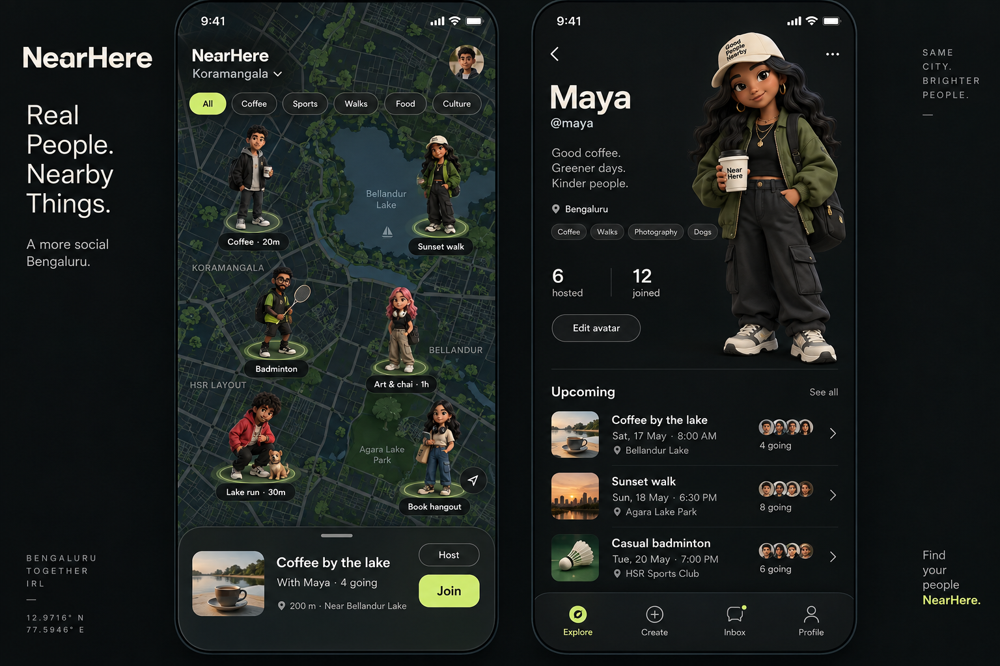

# Profile, character identity and wardrobe implementation specification

24 September 2026. Companion to `premium-product-execution.md`, tickets P05-P08.
All new names below are **proposals**, not deployed APIs or installed packages.

3 October update: the user approved exploring Kenney's Modular Characters pack
under CC0. A documented four-choice portrait-crop proof now lives at
`docs/design-concepts/kenney-avatar-prototype/`. This does not replace the
existing six account identities yet: first establish that the selected art is
on-brand, then implement one shared catalog/render path across profile,
onboarding, discovery, map, Detail and Plans. A profile-only crop would make a
single account appear to have different characters in different places.

## Visual contract



Keep charcoal/lime, matte full-body streetwear figures, restrained controls and
large clear typography. Do not copy Reddit/Pokémon characters. Current PNGs are
original pre-rendered artwork, not editable meshes. The concept's bios, handles,
counts, photographs and people are illustrative, not database records.

Owner profile layout at ordinary font size:

```text
safe-area header: Back / Profile / account menu
┌────────────────────────────────────────────┐
│ Name                  large full-body      │
│ Optional bio          character preview    │
│ Optional broad city   (feet not clipped)   │
│ Interests                                  │
│ [Edit profile]        [Customize character]│
└────────────────────────────────────────────┘
Upcoming / ongoing     See all
  actual plan + time + Hosting/Going/Requested/Waitlisted
optional honest totals only after their backend definition exists
settings / privacy / sign out (reachable by scrolling)
```

At narrow width/large text, stack the character above the text; never shrink
accessibility text or absolutely position copy under the character. The split
layout is hierarchy inspiration, not exact pixel coordinates from a mockup.
Proposed preview height 240-320pt in a normal profile, adapted by measured space;
current 190pt may be enlarged after side-by-side testing. Existing wide whitespace
and centered account text are not final concept parity.

Map: markers remain bounded 2D sprites, not miniature GPU scenes. Short activity
label only at useful zoom/selection; collision handling before decorative glow.
Detail: clear host character/name, activity title, time/places, correct next action,
privacy state, accepted-member chat and discoverable safety controls.

## P05.1: profile schema and boundaries

Read existing `packages/contracts/user.ts`, `apps/mobile/types/profile.ts`,
`lib/profile-validation.ts`, `lib/profile-repository.ts`,
`providers/profile-provider.tsx`, `app/onboarding/profile.tsx`, `app/(tabs)/me.tsx`,
and migrations 150001/230001. Profiles already exist, created by auth trigger;
do not create a second identity table or duplicate phone/OTP into profiles.

Proposed additions in an additive migration:

| Field | Rule | Exposure |
| --- | --- | --- |
| bio | Nullable, trimmed plain text, max 160 Unicode characters | Owner; public only after explicit publishing consent |
| city_label | Nullable broad chosen city label, max 80 characters, no coordinates | Same consent rule; never inferred from device location |
| public_profile_enabled | Boolean default false for existing and new rows | Owner setting; absence means minimal host card only |
| profile_revision | Server-incremented integer | Owner edit concurrency token, not client writable |
| interests (existing) | Controlled activity-interest IDs, initially max 8 selected | Public only when opted in |

These bounds are chosen product defaults, not existing constraints. Reconcile
with the existing 20-interest database limit without invalidating legacy rows:
new editor accepts eight; migrate/normalize only with a reviewed policy, never
silently delete existing interests. Existing free-form values should remain
readable to the owner; only allowlisted values go into public projection.
Use code-point-aware counts consistently in JS/SQL; test emojis, whitespace and
non-Latin names. No forced legal name, date of birth, gender or selfie.

Avoid @handles initially: uniqueness, reserved names and enumeration are separate
features, and the concept does not authorize invented handles. If later added,
use case-normalized unique index, database-enforced conflict response, reserved
names, rename policy and abuse checks. Never derive a public handle from phone.

## P05.2: transactional owner edits

1. Add a new validated update RPC (proposed `update_my_profile_v2`) that obtains
   owner from `auth.uid()`, not a user-provided owner ID. Inspect existing grants.
2. Validate name, optional text, consent flag, interest IDs and avatar config as
   one atomic command. Preserve onboarding complete status unless fulfilling its
   requirements for the first time. Never accept client timestamps/seed changes.
3. For optimistic concurrency, compare `expected_revision`, update all intended
   fields and increment revision in one transaction. Reject stale writes with a
   structured conflict; return the new owner projection.
4. Decide direct column grants deliberately. Adding an RPC alone does not prevent
   existing direct UPDATE bypass. Migrate the client then restrict fields whose
   invariant must be server-only, preserving older client compatibility during
   a documented transition. Every path needs seed/revision protection tests.
5. Editor keeps a local draft separate from saved profile. Save disabled while
   pending, duplicate submit ref guard, errors preserve draft. Conflict offers
   reload or intentional reapply, not silent last-write-wins. Cancel never saves.
6. Reset drafts on account ID change; a response from A must never paint B.
   Account generation guard must include refreshed callbacks/unmount. Fix any
   remaining stale-profile frame in provider before exposing richer owner data.

Tests: self update, other-user denied, anon denied, simultaneous revisions,
name-only edit preserves seed/outfit, invalid version/ID fails, omitted optional
fields distinguished from explicitly clearing them, offline/expired auth/retry.

## P05.3: account creation and onboarding

```mermaid
sequenceDiagram
  participant U as User
  participant A as App
  participant S as Supabase Auth
  participant D as Database
  U->>A: Phone and OTP
  A->>S: Verify code
  S->>D: New auth user triggers one profile
  D->>D: Assign persistent random seed once
  A->>D: Read own profile
  D-->>A: Needs profile or complete
  A->>U: Assigned character + display-name draft
  U->>A: Save name/choice; optional interests
  A->>D: Validated owner command
  D-->>A: Saved profile + revision
  A->>A: Resume pending join/host once
```

Keep required onboarding short: name and already assigned character; choosing a
different character is optional. Optional bio/interests/city may be skipped.
Do not randomize again on rerender, login, network retry or migration. Existing
seed-only users retain v1 mapping exactly. Test repeated login/profile fetch,
interrupted onboarding, account switch and a pending join to an ended activity.
Creation tests use disposable fictional actors, not new real SMS numbers. Obtain
approval/configuration when no disposable actor exists; do not rename shared
demo profiles to pretend they are new accounts.

## P05.4: public host card, not a browsable private-profile table

1. Start with an activity-scoped public card (proposed
   `activity_host_profile(p_activity_id)`), accessible only when caller can read
   that activity through the current block-aware detail rules.
2. Return displayName + bounded avatar for minimal card; optional bio/interests/
   city only if host explicitly enabled the public profile. No phone, seed-derived
   auth facts, account metadata, exact points, private upcoming plans or attendance.
3. Never add `profiles SELECT true` or a default definer view exposing all rows.
   Security-invoker views obey table RLS, but owner-only profiles would then hide
   other hosts; use a reviewed bounded RPC instead of weakening table policies.
4. Host-name tap navigates using activity ID, not a newly public account UUID.
   Recheck on foreground/block changes. Unavailable/blocked uses neutral copy,
   not “this person blocked you.” Owner Me remains a separate owner projection.
5. Extend reporting to profile content before enabling user-authored public bios;
   support moderation, Unicode abuse cases and length limits. Reuse immutable
   operator audit/rate-limit patterns; do not grant yourself operator access.
6. No public future itinerary. A public host's activities listing, if requested
   later, must be derived from visible discovery and explicit public-event policy.

Accept: opt-in/off behavior, anon/owner/other/both-block-directions tests,
field allowlist, content-report path, no private profile enumeration.

## P06: compose the real profile and match the reference

1. Build reusable `ProfileHero`, `CharacterPreview`, `InterestChips` and
   `UpcomingPlanPreview` only where used; proposed components, not existing imports.
2. Render real data with empty/error/loading states. No biography placeholder
   masquerading as saved text. Optional absent sections collapse cleanly.
3. Interests use finite category options, not fabricated inferred preferences.
4. Reuse existing plans hook, show three active plans + See all. Include membership
   state; never label pending as Going. Do not turn its first-50 length into totals.
5. If adding private owner totals, define Hosted as authored published activities
   excluding cancelled and Joined as non-host currently accepted memberships;
   these are not attendance/lifetime totals. Use SQL aggregates over authorized
   rows with defined time window, not sums of truncated client lists. Public
   totals remain omitted until an explicit privacy decision.
6. Use neutral/category artwork for plan thumbnails unless real user media is
   implemented. Generated category illustration must not look like a photograph
   of the actual venue or attendees. Avatars may be shown only via safe projection.
7. Compare real screenshots against the concept: character scale/feet, name
   hierarchy, restrained lime CTA, plan row density, negative space and no old
   cream/orange leakage. Explain deviations due to real content/privacy.

Accept on small/large Simulator + accessibility text; plan navigation, Edit,
Customize, sign-out scroll reachability and public/owner boundary all work.

## P07: bounded wardrobe that can actually ship

### Chosen first wardrobe scope

Six existing identities, **two complete outfit looks per identity** as a proposed
first catalog. This is 12 authored sprites, not arbitrary mix-and-match. Start
with one identity/two looks as a proof; expand only if it preserves the face/body
and passes visual review. No asset purchases automatically; no per-user AI calls.
Changing outfit must not swap the person's identity. Current v1 PNGs cannot be
separated into shirts/trousers with code reliably; do not promise that feature.

### Data contract and compatibility

Proposed v2 saved appearance:

```ts
type AvatarV2 = {
  version: 2;
  seed: string;             // preserved server-issued seed
  baseId: string;           // finite catalog, not arbitrary asset path
  lookId: string;           // finite complete outfit for this base
  catalogVersion: 1;
  fallbackAvatarId: AvatarCatalogId; // safe v1 preview for old clients
};
```

This is a sketch to implement with literal catalog unions/runtime parsers; no
open `[key:string]:unknown` on public configs. Keep v1 readers and seed hash
unchanged. Do not change catalog modulus from six to twelve for existing seeds.

1. Version catalog/type/parsers together. Unknown version or missing asset falls
   back to known v1 art without overwriting stored JSON or crashing the map.
2. Reject invalid base/look combinations server-side. Derive asset choice from
   catalog; never accept URLs, filenames, traversal paths or client-rendered art.
3. Do not emit v2 JSON from old discovery RPCs consumed by v1 parsers. Keep those
   projecting fallback v1 config. Add versioned discovery/detail/plan endpoints
   or documented capability negotiation, deploy first, then switch new clients.
4. Migrate only on explicit wardrobe save; keep v1 intact before that. User's seed
   survives a new selection. Reverting a client release must still display fallback.

### Art pipeline

Read image-generation skill fully when producing raster assets. Reference one
existing identity and approved concept; create same pose/camera/lighting/feet
baseline and changed outfit. Preserve proportions and identity. Real transparent
alpha, generous silhouette margins, no text/logos/checkerboard. Save provenance.
Inspect at map size (~64-96pt) and profile size (~240-320pt). Reject drift rather
than pretending two different people are clothing variants. Never edit assets
with ad-hoc raster code contrary to available image-editing instructions.

Asset manifest: immutable asset ID, base/look IDs, version, bundled literal
require, dimensions, bytes, license/provenance, checksum. Proposed incremental
catalog budget <=4MB; measure before expanding. Pixel dimensions are not rendered
point sizes. A transparent margin affects MapLibre apparent size; test visually.

### Editor and save

1. Separate Character and Looks selectors; one large preview, Cancel, Save.
2. Preview local draft; map updates only after successful save/re-fetch. Selection
   is shown with shape/label as well as lime outline.
3. Explain “Looks” honestly. Do not show nonfunctional hair/shirt/shoe tabs.
4. Cache valid sprite config; 12 bounded images acceptable initially, not an
   unbounded per-user render cache. Reuse the same sprite resolver everywhere.
5. Keep outfit choice free. No locks, currency or fake progression.

Tests: v1 fixtures unchanged, all 12 valid combos resolve, invalid cross-base look
denied, unknown version fallback, same choice after relaunch/offline, save retry,
stale revision, old-client projection, map/detail/profile/Plans parity. Accept
only after real two-look proof and saved/loaded evidence; not generated images alone.

## P08: genuine modular 3D wardrobe

This is a separate art/runtime project, not a dependency installation. Goals:
rotate one character in the editor, choose compatible clothing/hair/accessories,
save bounded configuration, generate lightweight map/profile previews. **Never
run 50/200 independent live 3D character canvases on the map.**

### Gate A: asset feasibility before production integration

Required: commercially permitted GLB/glTF base meshes, shared rig/skeleton when
animation is required, consistent units/origin, skin weights, compatible garment
meshes, textures/materials, clipping/body hide masks, hair/accessory anchors,
source files and redistribution rights. A PNG or AI mockup provides none of this.
Inventory existing assets first. No invented download URLs/provider SDKs/licenses.
If absent, write an art-production brief and ask user to choose commissioned,
licensed or intentionally created original assets with cost/time implications.
Procedural primitive humanoids may test the renderer but fail the approved art
quality gate and must not become a disguised final character.

### Gate B: isolated runtime proof

Candidate, not selected/installed: `@react-three/fiber/native` + Three + SDK-matched
`expo-gl`. Validate exact peer versions/React19/native compatibility and actual
device build first. Do not use DOM Canvas/WebGL examples in React Native.
Expo GL is a rendering surface; it does not supply avatar assets or a wardrobe.
The [Expo SDK54 GLView reference](https://docs.expo.dev/versions/v54.0.0/sdk/gl-view/)
documents its native context and remote-debugging limitations. The
[Fiber installation guide](https://r3f.docs.pmnd.rs/getting-started/installation)
is a candidate reference; planning lookup found native support, but full-page
retrieval failed, so re-read before choosing a version/API.

Proof steps:

1. Use an isolated worktree/branch when needed; preserve current application.
2. Load one licensed small GLB in a development-only proof screen. Handle missing
   texture, load error and fallback PNG. Document installed versions/native build.
3. Rotate by drag, clamp framing, screen-reader alternative controls, reset view.
4. Load one garment, switch two material colors and one accessory. Check clipping
   front/back/seated or animated poses actually supported by assets.
5. Pause render loop on blur/background; dispose resources on unmount. No infinite
   animation under reduced motion; no loading network request on every frame.
6. Measure on the physical reference phone. Proposed budgets: selected preview
   >=30fps, small asset download <=10MB for proof, no monotonically growing GPU/
   process memory across20 opens. Measure cold-load and battery/thermal behavior;
   thresholds are targets, not guarantees. Simulator is insufficient for GPU signoff.
7. If proof fails, retain P07 shipped looks and report the exact failing gate.

### Gate C: modular catalog and persistence

Proposed v3 has immutable body/base ID, compatible slot IDs (hair/top/bottom/shoes/
accessory), finite palette IDs, catalog version and fallback v1 ID. Keep seed
immutable. Store catalog in reviewed manifests; server validates combinations,
availability and catalog version. No arbitrary shader/mesh URLs or uploaded code.
Finite slots prevent infinite invalid combinations; compatibility graph describes
which garments hide/replace which underlying body parts. Test every allowed combo
or pairwise coverage plus documented targeted overlap cases as catalog grows.

UI order: character/body -> hair -> outfit slots -> accessory -> review/save.
No identity assumptions from name, phone, locale or selected body. Cancel restores
saved config. Undo/reset affects draft only. Save uses revision conflict handling.

### Gate D: map sprite generation and distribution

Choose after proof, not by pretending an API exists:

- Small finite wardrobe: offline pre-render all supported looks, immutable bundled
  assets. Simplest reliable first integration.
- Larger combinatorial wardrobe: trusted background renderer receives validated
  config, fixed camera/light, renders image, stores immutable output keyed by
  hash(config + catalog + renderer version). Needs server worker/storage/job setup
  and cost/security review; not the user's phone as the source of trusted public art.

Job lifecycle proposed: queued -> rendering -> ready/failed. Save appearance
atomically with desired revision; keep last successful sprite while pending;
late older job cannot replace newer selection. Persist render jobs/outbox with
DB transaction; retries idempotent, bounded and observable. Coalesce duplicates,
limit attempts/user, forbid arbitrary file/network access in renderer. Public
sprite contains only approved character art; owner/job logs remain private.
For failure show saved fallback plus retry status, not blank/disappearing host.

Accept: actual modular assets, real clothing edits, repeatable sprite generation,
versioned server validation, old-client fallback, security/cost review, device
performance and map parity. Otherwise status remains blocked/prototype, not done.

## Recovery and interview lesson

Explain: appearance configuration is durable data; the renderer is replaceable.
Versioning separates identity stability from new artwork. An asset pipeline is
not just frontend code. Capability rollouts protect old clients; optimistic
concurrency prevents silent lost edits; asynchronous jobs need revision guards.
Exercise: trace one saved look from button -> owner RPC -> database -> public
projection -> sprite resolver -> map without ever exposing a phone or exact point.
