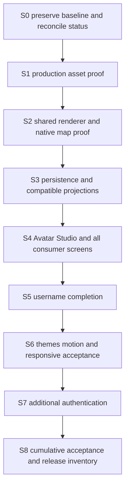

# NearHere: sprite integration and remaining implementation

Planning date: 3 October 2026. Status: **plan ready; implementation not started**.
This is the next execution entry point. Read this before the older D/U/A/I
ticket ledger. It orders that existing scope rather than declaring it complete.

## Objective and decisions already authorized

Use the Kenney CC0 modular character assets in NearHere, including profile
portraits cropped from the same character shown on the map. Build the separate
Avatar Studio, then complete usernames, remaining theme acceptance, and sign-in
methods. Keep teaching notes alongside implementation.

The user already authorized using the sprites. Do not ask for that permission
again or stop at another contact sheet. Routine asset alignment, component
structure, and reversible local implementation are engineering decisions.

A head crop and a full-body view of one appearance are consistent identity.
They do not need identical framing. The earlier documentation's statement that
a profile-only crop necessarily creates a different identity was too broad.
The actual requirement is matching skin, hair, face, clothing where visible,
and the same saved appearance revision across surfaces.

Retain all six legacy assets and their fixed seed mapping. Existing accounts
adopt the new appearance through an explicit save. Keep development activities.
Do not map old `v1-01` IDs to different people or change the six-item hash modulus.

## Verified starting point

The preceding status check passed 107 unit tests, TypeScript, and diff whitespace
checks. It did not rerun hosted or device acceptance. Git HEAD was `f6b585d`;
53 tracked changes and 80 untracked entries existed. These counts will drift;
inspect live state rather than treating this as a clean checkout.

Source inspection confirms:

- `packages/contracts/avatar.ts` exposes six v1 catalog IDs.
- `apps/mobile/lib/avatar-catalog.ts` imports only six original PNGs.
- `components/host-avatar.tsx` resolves those images for React Native surfaces.
- `components/map/activity-map.tsx` registers the same catalog in MapLibre Images.
- `lib/profile-validation.ts` currently accepts only v1 appearance into the owner
  read model. Supporting v3 requires changing that boundary explicitly.
- `lib/profile-repository.ts` sends `avatar_id` on every metadata save through
  `update_my_profile_v2`; this can downgrade new appearances unless redesigned.
- `providers/profile-provider.tsx` exposes legacy completeProfile/refresh/state.
- Username claiming has repository/migration code but no provider/UI integration.
- AuthProvider uses phone OTP. The route inventory has phone/verify, profile
  onboarding and appearance settings; Avatar Studio and other sign-in routes
  have not been implemented.
- Kenney files live under `docs/design-concepts/kenney-avatar-prototype/` only.
  Its Swift contact sheet is an offline prototype, not mobile rendering evidence.

## Execution order

If an external prerequisite blocks a ticket, record it and execute independent
local work. Never claim a dependent integration passed using an invented server
response. Each ticket ends with implementation, appropriate checks, documentation,
and the next eligible action; completing a ticket alone is not a reason to stop.

## S0 — establish the working baseline

1. Read root/mobile AGENTS.md and this guide. For avatar work also read A01–A04
   in `daylight-avatar-identity-20261002.md`. Consult the existing premium plan
   for unchanged authorization/privacy requirements.
2. Inspect Git status/diff and ongoing native/Metro processes. Preserve inherited
   work, including unrelated web deletions and SQL edits. Do not stage everything.
3. Inspect installed package versions and read the required Expo SDK54 docs
   before mobile edits. Reuse existing libraries wherever they meet the proof.
4. Create a bounded ticket record: inspected files, intended behavior, changes,
   tests, evidence, hosted deployment state, remaining gates.
5. Update the top of `night-arcade-status.md` to point here; retain older evidence
   as dated history. Use the ledger below as the current completion sequence.

Exit: the implementer can distinguish inherited work from the new sprite slice.
Do not rerun the whole historical audit before every small edit.

## S1 — prepare actual character assets

1. Inspect the retained Kenney layers and original pack license. Source is
   `https://kenney.nl/assets/modular-characters`; inspect the creator's download
   link if the temporary archive is unavailable. Record source URL, archive
   SHA-256, license, imported filenames, dimensions and checksums.
2. Put selected reusable source assets under a new versioned mobile asset
   directory, proposed `assets/avatars/kenney-v1/`. Keep the license with them.
   Import a deliberately small useful subset; do not bundle every unused sheet.
3. Build one aligned full-body proof using head, face, hair, neck, torso, arms,
   hands, bottoms and shoes. Coordinates from the contact sheet cover heads
   only. Inspect the creator's instructions; do not assume filenames or trimmed
   PNG dimensions supply joint/anchor positions.
4. Define a canonical canvas, feet baseline, crop rectangle and per-part anchor
   metadata. Long/rear hair may need different ordering than short hair; inspect
   each supported choice. Do not apply one guessed order to every hairstyle.
5. Start with two skin choices, two hair choices, two tops, one bottom/shoe set,
   one expression, and no accessory. Keep expansion bounded until the component
   alignment works. The final maker remains in scope; initial proof choices are
   a test subset, not the finished selection count.
6. Produce a full-body render and portrait crop from the SAME composed image.
   Inspect on light/dark backgrounds at 48/64/96 px and 240–320 pt profile size.
   Check hair, eyes, skin-colored nose, neck seams, limbs and feet. The prototype
   uses one facial-feature sprite with a baked nose color: fix mismatched skin
   using the pack's matching nose/face parts, not a misleading universal tint.
7. Record measured bytes, alpha, bounds and the reference render. Use appropriate
   deterministic asset tooling for alignment/crops; avoid generative redrawing
   of already usable source parts.

Exit: at least two complete appearances and their matching portraits render
cleanly. If a specific part is incompatible, omit that option and continue with
working parts. Asset aesthetics do not require another generic approval loop.

## S2 — one renderer, then prove it on the native map

Existing files to inspect: `lib/avatar-identity.ts`, `lib/avatar-catalog.ts`,
`lib/activity-map-features.ts`, `components/host-avatar.tsx`,
`components/map/activity-map.tsx`, `components/profile-hero.tsx`.

1. Add a manifest with finite part IDs, compatibility rules, transforms, crop,
   schema/catalog version and literal asset imports. Proposed location:
   `lib/avatar/`. Keep v1 resolution separate and unchanged.
2. Add a pure resolver returning ordered layers and an appearance key. Reject
   unsupported values. The key contains appearance/catalog/renderer/size only;
   exclude account IDs, phone, username, theme and exact locations.
3. Add a React Native preview component using installed Expo Image primitives.
   Accept full-body/portrait framing as presentation props over one appearance.
4. Verify whether the installed native stack can produce a transparent local
   PNG suitable for MapLibre Images. If a dependency is required, check its
   actual Expo54/RN0.81/new-architecture compatibility before installing ONE
   candidate. Do not assume a web canvas or the macOS Swift script runs on iOS.
5. Prove two composed local sprites in the installed native app: registration,
   switching styles, remount, offline reuse and failure fallback. Capture real
   evidence. Never replace the map with a screenshot to demonstrate success.
6. Add bounded cache/queue management only after proof: canonical key,
   deduplicated jobs, max two workers, initial limits 20 MB disk/64 active images.
   Keep images referenced by visible features registered; clean only this cache.
   Measure decoded memory separately from compressed PNG bytes.
7. If native raster composition fails after two distinct investigated attempts,
   preserve the diagnostic. A small bundled complete-look catalog can provide
   an explicitly labelled interim Looks selector; do not claim it supplies
   arbitrary clothing controls. Continue independent username/theme work.

Meaningful checks: invalid parts/compatibility; deterministic keys; portrait
and body resolve the same appearance; stale jobs ignored after account/draft
change; native Images proof. Do not write tests that only repeat asset constants.

Exit: the actual mobile preview and map display the same two new characters.
This is the first concrete in-app deliverable; persistence follows immediately.

## S3 — save appearances without breaking existing clients

1. Inspect all profile-write migrations/RPCs and current grants before editing.
   Inspect 230004, 240001 and 280001 plus later overrides; do not infer deployed
   SQL from filename order alone. Read hosted harness instructions before runs.
2. Extend `packages/contracts/avatar.ts` with the planned discriminated v1/v3
   contract. Generate finite IDs and server catalog validation from the same
   manifest. V3 stores validated part IDs, catalog version, immutable seed and a
   known v1 fallback. It stores no client path, arbitrary URL, or rendered upload.
3. Add a forward migration with the proposed `save_my_avatar_v3` command:
   authenticated owner, row lock, expected profile revision, strict input and
   compatible-part validation, unchanged seed, one atomic revision increment.
   Inspect existing SQL signatures before implementing this proposed API.
4. Provide a metadata save path that preserves v3 appearance. Prevent legacy
   avatar-write commands from overwriting v3 silently; return a supported
   update-required error. Test both legacy metadata and legacy appearance writes.
5. Preserve old nearby/detail/Plans read signatures with bounded v1 fallback.
   Add explicit new appearance-aware projections for new clients, reusing the
   established caller/block/participant authorization. Never expose whole raw
   profiles or private meeting-point data through a new avatar join.
6. Update owner/public parsers and repository adapters together. The current
   owner parser strips non-v1 configs; leaving it unchanged would lose the new
   appearance immediately after a successful save.
7. Prove database constraints and two concurrent edits with disposable actors.
   First use a disposable DB if available; otherwise record the prerequisite and
   prepare the tests. Do not silently migrate unrelated pending SQL to unblock it.
8. Review/apply the relevant additive development migration within existing
   authorization, verify hosted parity, then enable new client callers. Retain a
   feature switch that returns to readable legacy fallbacks without deleting v3.

Exit: save/reload works; stale revision and invalid config fail correctly;
legacy readers remain usable; unauthorized callers see no additional data.

## S4 — finish Avatar Studio and account flows

Proposed new route: `app/avatar-studio.tsx`. Extend the existing profile provider,
repository, onboarding, Me/ProfileHero, HostAvatar and activity read models.

1. Keep one account-scoped local draft with original revision and saved config.
   Show a large full-body preview with optional portrait preview; on iPad use
   available width for controls beside it. Support larger text and scroll access.
2. Show only working controls backed by real compatible assets. Add Skin, Hair,
   Face and Outfit first; expose shoes/accessories when supported parts exist.
   Keep labels/selection checks and usable touch targets. No disabled fake shops.
3. Randomize picks a valid draft; Reset restores saved state; Cancel discards;
   Save sends one guarded command and keeps the draft after network failure.
   Conflict offers reload without automatically overwriting somebody's changes.
4. Add provider methods with the existing request-scope protection. A delayed
   request from a signed-out or switched account cannot change the current view.
5. Refresh all relevant consumers after save: Me, editor, map/Browse, Detail and
   Plans. Crop framing differs by surface, appearance/config/revision does not.
6. Preserve the existing six choices and seed mapping. Migrate existing accounts
   only on save. Introduce new-account random assignment only once all readers
   and projections support fallback; assign once server-side, without network
   calls or rendering in the auth trigger.
7. Expand only aligned catalog choices. The earlier 3-body/8-skin/8-hair/etc.
   list remains a target; mark actual shipped options and missing parts honestly.

Acceptance: save/cancel/reset/randomize/relaunch/offline; switching accounts
during save/render; metadata edit preserves appearance; same identity on all
surfaces; clean fallback for unknown config; phone and iPad screenshots.

## S5 — complete usernames

1. Validate `202610030001_username_claim.sql` on a real database, including
   simultaneous duplicate claims, normalization, reserved names, owner scope,
   immutable first claim, invalid length/characters and expected revisions.
2. Finish `claimMyUsername` integration in ProfileProvider and onboarding/edit
   screens. Show field errors and distinguish unavailable service from conflict.
   Claim using the current revision after any preceding profile/avatar save.
3. Add username only to approved activity-scoped projections. Keep display-name
   fallback for existing accounts. Do not infer availability from a client cache.
4. Verify older databases still load profiles through the existing missing-column
   fallback. Keep the username feature unavailable until its server is ready.

Exit: claim/reload and duplicate rejection work end to end without resetting art.

## S6 — finish appearance, motion and layout acceptance

1. Inspect migrated screens for remaining static palette values. Test System,
   Daylight and Night Arcade, persistence/relaunch and OS appearance changes.
2. Inspect real map/Studio/Profile/Host/Detail/Plans/Auth screens on small phone
   and iPad. Correct spacing, cropped controls, keyboard coverage and safe areas.
3. Test Reduce Motion in a real OS preference flow, including selection,
   recenter and cluster expansion. Earlier source/unit checks are insufficient.
4. Profile 12/50/200 public synthetic points locally: sprite registration count,
   panning response, memory over repeated mounts and composition queue behavior.
   Record hardware/build/method; proposed thresholds are not measured results.

Exit: documented visual, gesture, accessibility and performance evidence with
any remaining physical-only checks listed separately.

## S7 — additional authentication

Follow I01–I03 of the existing guide and verify current provider documentation
when implementing. Retain one AuthProvider and existing host/join resume flow.

1. Implement a method chooser and email-code flow with resend/expiry/error cases.
   Verify actual email delivery/template and sender configuration before showing
   the method as available. Reuse existing accounts; avoid duplicate profiles.
2. Add Google and Apple with verified native callback/session handling and
   provider configuration. Show only configured, tested methods. Provider keys,
   signing access and account console choices are real external prerequisites.
3. Implement explicit account linking/recovery; test cancellation, collision,
   relaunch and sign-out. Never merge accounts solely by matching untrusted text.
4. Research current consumer Instagram-login suitability before promising it.
   If unsupported for this app, document that decision; no decorative login button.

Exit: each visible method completes actual authentication; blocked providers
remain listed in engineering docs with the exact missing setting.

## S8 — cumulative testing and release inventory

1. Run unit/type/lint checks appropriate to the changed code, then native build.
   Follow root Distill instructions for verbose output; inspect exact failures.
2. Execute authorized fictional-actor hosted harnesses for changed profile,
   avatar, username and activity projections. Retain persistent demo activities.
3. Recheck join/host permissions, self-join rejection, waitlist, cancellation,
   chat and both block directions after identity-projection changes.
4. Capture populated/empty/error/offline/keyboard/large-text states on Simulator.
   Prepare a short one-iPhone checklist for hardware location/lifecycle and real
   authentication/push delivery where those services have been configured.
5. Reconcile with `app-store-t-pass-20260930.md` and `docs/release/`: account
   deletion, support/privacy destinations, provider costs/configuration,
   audience policy, signing and distribution. Implement missing local work;
   record business/account decisions for the owner. Do not call this App Store
   ready merely because tests pass or a Simulator launches.
6. Review intended files and create scoped commits under existing publishing
   authorization; exclude secrets/native build output and unrelated edits.
   Never claim a push/deployment without checking the result.

## Documentation and execution discipline

For each slice: explain the user problem, exact code path, data flow, tradeoff,
failure encountered, fix and evidence. Link a focused lesson from the learning
guide and docs index; update the ledger without rewriting dated historical tests.
One useful diagram per flow is better than repeating the same architecture.

Stop only for a concrete missing credential/account decision, destructive action
outside authorization, incompatible required asset, or unresolved failure after
two distinct investigations. Record error, attempts, affected files and the
smallest unblock, then continue any independent ticket. Missing user aesthetic
feedback does not cancel the already authorized Kenney implementation.

## Current ledger

| Step | Status | Next action |
| --- | --- | --- |
| S0 | code verified | Expo SDK54 docs read; inherited work preserved; fresh source baseline inspected |
| S1 | code verified | Eight compiled CC0 Kenney full-body PNGs, license and deterministic build script under mobile assets; visual source inspection completed |
| S2 | bundle verified | One literal native renderer/catalog serves profile and MapLibre image registration; direct iOS Expo export bundled all eight assets and a 5.15 MB Hermes bundle. Simulator visual proof remains open |
| S3 | deployed, partially hosted verified | V3 contract, strict parsers, owner RPC migration and safe public JSON projection deployed. Anonymous smoke had zero rows; v3 save/concurrency proof remains open |
| S4 | implemented, not hosted accepted | Avatar Studio route, draft/randomize/save/error flow and all existing consumers use the shared renderer; Simulator/device evidence remains open |
| S5 | deployed, not hosted accepted | Provider/UI username claim route and its migration are deployed; collision/first-claim acceptance remains open |
| S6 | partial inherited code | Theme/native/motion/scale acceptance |
| S7 | email magic-link code/native route implemented; request acceptance partial; OTP blocked by free-tier template restriction; Google/Apple not configured | Complete real same-device PKCE/session reload when mail limit permits; obtain SMTP or upgrade for OTP; configure OAuth providers before exposing them |
| S8 | pending | Cumulative tests and explicit release gaps |

Resume instruction: **Read this file, start S0 then S1, and continue through
eligible steps. Do not stop after another asset contact sheet.**
