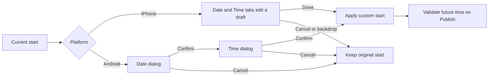
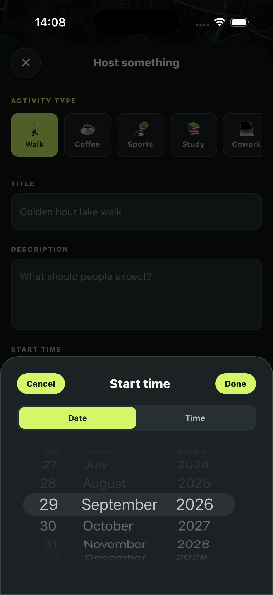

# Hosting: date/time drafts and safe submission

29 September 2026. Follow-up to P04, not a claim of complete device acceptance.

## The bug and the rule

Android previously hid the whole selector when either native picker changed,
making date followed by time awkward. On iOS, wheel changes immediately updated
the hosting form before Done. The new rule is **preview locally, apply explicitly**.

## Trace the implementation

1. `apps/mobile/app/host/create.tsx`, `openCustomStart`: iOS initializes a separate
   `draftStart`. Done copies it into `startsAt`; Cancel discards it. Android uses
   `DateTimePickerAndroid.open`, first date and then time. Neither selection is
   committed if either dialog is cancelled.
2. A generation ref invalidates callbacks on unmount. Cleanup dismisses Android
   dialogs. Picker errors release the opening guard and show retry guidance.
3. `apps/mobile/lib/activity-time.ts`, `combineLocalDateAndTime`: combine the
   chosen local calendar day with the chosen hour/minute into a new Date. Neither
   input is mutated. Seconds and milliseconds are cleared.
4. Conversion to ISO happens at the existing API boundary. Do not splice an ISO
   date substring with a local clock: ISO uses UTC and can shift the calendar day.
   DST follows native/local Date behavior; gap/overlap UI remains a device check.
5. Quick-start choices expose checked radio state to accessibility services.

The installed 8.4.4 README recommends the imperative Android API because its
native picker is a dialog. The version matches
[Expo SDK54 picker documentation](https://docs.expo.dev/versions/v54.0.0/sdk/date-time-picker/).
No dependency or native binary change was needed.

## Why disabling Publish is insufficient

React state updates affect the next render. Two rapid presses can arrive before
`isSaving` disables the button. A synchronous `publishInFlight` ref blocks the
second invocation immediately. `finally` releases it and clears the spinner;
unmounted screens cannot show a late error or navigate after a delayed response.

This is **not server idempotency**. If the database commits but the response is
lost, a later retry can still duplicate an activity. Unexpected exceptions now
ask the user to inspect Plans first. Durable request-key support on
`create_activity` remains future work. Never equate local double-press protection
with safe network retries.

## Evidence and remaining checks

### Refreshed Simulator follow-up

The Simulator initially ran an older bundle with no Cancel control. Reloading
through the React Native development menu exposed the new UI. Verify the running
bundle, not just source files or a successful export.

Verified on iPhone 17 Pro: Cancel preserved the checked one-hour shortcut; Time
exposed hour/minute wheels; Done closed the sheet, retained the displayed
`29 Sep at 3:08 PM` and cleared shortcut selections. This committed an unchanged
value, **not** a changed wheel value. The draft was closed without publishing.

Direct wheel dragging still returned `noWindowsAvailable`. Do not mark wheel
gestures accepted. The earlier concurrent-user warning below refers to the first
attempt, not this refreshed session.

`applyCustomStart` now checks the time again at confirmation: if a draft became
past while open, iOS keeps the sheet open with an alert and Android shows an error
on the form. That elapsed-time branch is implemented but not runtime-verified.
The custom-time button exposes its selected timestamp via `accessibilityValue`.

- 86 unit tests pass, including combining a December 31 day with a clock from
  January without changing either input. TypeScript and Expo lint pass.
- iOS Hermes export succeeds at 5.14 MB: bundling evidence, not native gestures.
- Simulator control reported concurrent user changes during navigation. No new
  date-wheel acceptance is claimed; user interaction was not interrupted.
- No Android `adb` was found on PATH. Android runtime acceptance remains open.
- No activity was published, deleted or changed by this slice.

### Device checklist

1. Note the original start/shortcut. Open custom time, edit date, cancel: unchanged.
2. Repeat with time; cancel again: unchanged.
3. Confirm both: form shows the chosen local date/time, no quick shortcut selected.
4. Select a past time today: Publish rejects it before the create request.
5. Android: date confirmation opens time exactly once; cancelling time preserves
   the original value. Reopen and confirm both; selected day must survive.
6. On a valid fictional draft with an explicit meeting point, double-tap Publish.
   Check one in-flight request. Separately inspect ambiguous outcomes in Plans;
   this does not prove backend idempotency.

Interview lesson: draft/commit preserves intent; refs prevent local reentrancy;
generations reject late UI effects; backend idempotency prevents repeated durable
operations. Each solves a different problem.
