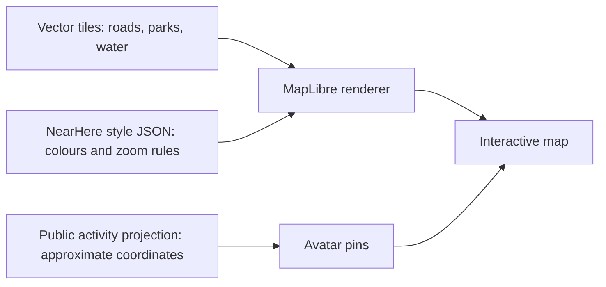

# NearHere: a neighbourhood playground

> Superseded visual target, 23 September 2026: the user rejected this iteration's
> palette and simple faces. Follow [Night Arcade](design-concepts/design-review.md)
> and its [execution playbook](handoffs/night-arcade-execution.md). This document
> remains an implementation/history record, not the current visual specification.

Design revision: 23 September 2026. This records the new direction, the first
implemented slice, and the remaining work. It supersedes the cream/orange
discovery layout described in older design notes.

## Product decision

The map is the home screen. Opening NearHere should answer “what could I do
nearby?” without asking someone to interpret a dashboard. The first screen
keeps the neighbourhood visible and waits for the user to choose a pin.

Five actions remain on the map: change area, open profile, recenter, browse, and
host. The bottom Browse surface also provides Your plans. Filters appear inside
Browse. The full tab bar is hidden on Nearby, but remains available on Plans
and Me so those screens have a clear route back to the map.

```text
┌─────────────────────────────────┐
│ nearhere / selected area     ◉  │  Area search and your profile
│                                 │
│       map, with room to pan      │
│           character + activity  │  Hosts mark activities
│                                 │
│                                 │
│ Activity areas             ◎    │  Recenter
│ ┌─────────────────────────────┐ │
│ │ Things to do          + Host│ │  Browse opens filters and list
│ └─────────────────────────────┘ │
└─────────────────────────────────┘
```

Tap a marker to reveal a compact host/title/time/capacity card. Tap the map or
the close control to dismiss it. Previously the first activity was automatically
selected, so a large card covered the map before a user had expressed interest.
Removing the automatic selection is an interaction change, not just a smaller
font. Browse preserves a list alternative for people who find a map difficult.

## Research and interpretation

- [Snapchat's Actionmoji documentation](https://help.snapchat.com/hc/en-gb/articles/7012324804628-How-do-I-use-Bitmoji-on-the-Snap-Map-and-what-is-Actionmoji)
  explains how characters and poses communicate context. Our interpretation is
  to use a recognisable character plus an activity badge. NearHere represents
  planned activities at deliberately approximate coordinates. It does not
  infer or publish the host's movements or current presence.
- [Mapbox Studio](https://docs.mapbox.com/console-tools/studio/)
  demonstrates that map visual design can be authored independently of app
  controls. This supports separating our future map style from screen code.
- [React Native Maps map properties](https://github.com/react-native-maps/react-native-maps/blob/master/docs/mapview.md)
  document platform-dependent styling. The current Apple renderer can use a
  muted light map and suppress points of interest; arbitrary vector-layer
  restyling requires a different renderer.
- [MapLibre setup](https://maplibre.org/maplibre-react-native/docs/setup/getting-started/)
  and [Expo integration](https://maplibre.org/maplibre-react-native/docs/setup/expo/)
  provide a path to a custom native vector map. MapLibre needs a native rebuild
  and a map style/tiles source. Its demo tiles are for development, not our
  production neighbourhood map.

These are primary technical/product sources, not evidence that our design will
improve retention. That hypothesis needs observation of real users.

## Visual direction

The accent is violet `#6B4FA6`; text is plum `#302842`; surfaces are white or
`#FAF9FD`; mint `#A7DCC7` adds warmth. The map should be quiet enough that hosts
and activities carry the strongest colour. Avoid decorative compass buttons,
permanent filter chips, redundant live badges, and several large bottom panels.
No animation is added in this slice, preserving reduced-motion behaviour.

This palette is applied to discovery, its Browse sheet, navigation tint, and
the profile surface. Host, authentication, Plans, and activity detail still
need a coordinated palette/spacing migration. Do not describe the entire app
as restyled yet.

## Avatar foundation and its limits

`apps/mobile/components/host-avatar.tsx` draws an original mascot with native
Views. There is no image service request, photo upload, or third-party avatar
asset. A public display-name seed selects one of five colour variations. The
same component renders on discovery markers, the Browse list, selection cards,
and the profile surface. The small emoji badge represents activity type.

This is a visual fallback, not a unique identity or an avatar builder. Two
names may produce the same colour; two people may share a name. Renaming a
profile may change its fallback. Never use this seed to authorize anything.

Next, give users a versioned configuration with character, colour, expression,
and accessory selections. The existing `profiles.avatar_config` column is an
available persistence foundation. Public activity RPCs must explicitly return
a bounded host avatar projection; fetching whole profiles from discovery would
introduce unnecessary access and extra requests. Use stable host IDs for
fallbacks once the public projection provides them. Validate unknown versions
and values and retain the fallback for older clients.

## How we make the map our own

A map has three independent layers of responsibility:



The tiles supply geometry. The style decides its appearance. The renderer
draws that combination while the user pans and zooms. Our activity overlays
remain application data and keep the existing privacy contract. Changing
renderers does not require changing who can read exact meeting points.

Implementation sequence for the custom world:

1. Select a vector tile source with Bengaluru street detail, appropriate usage
   rights, attribution, quotas, and a clear budget. A renderer alone does not
   provide production tiles. No paid account was created in this slice.
2. Add MapLibre behind a small discovery-map component with the same coordinate,
   marker-selection, and recenter callbacks. Keep the current renderer available
   while testing the transition.
3. Author a checked-in style: pale lavender water, mint parks, warm white roads,
   muted building footprints, and fewer labels at low zoom. A visual style
   editor such as Maputnik can edit compatible style JSON; verify the selected
   tile schema before binding layer names.
4. Add clustering: at a distance show a count; close up show host characters.
   Do not randomly displace real geographic pins just to stop overlap.
5. Add playful character poses by activity and gentle selection feedback.
   Keep motion optional and labels readable. Avoid rewards for revealing more
   precise location or for meaningless repeated tapping.
6. Verify source failure, attribution placement, accessibility through Browse,
   marker taps, battery use, frame rate, and physical iPhone/Android behaviour.

The current slice uses Apple Maps muted-standard on iOS. It does **not** yet
ship an illustrated MapLibre basemap, a public avatar editor, clusters,
gamification rewards, or live friend locations.

## Verification and teaching exercise

Read Nearby's `selectedId` state first. It starts as null; tapping a marker sets
it; an unavailable selected activity is cleared; dismissing sets it back to
null. `selected` is derived from the current server rows rather than stored as
a second stale copy. This is a small example of keeping one source of truth.

Read the Browse modal next. `filter` affects the same nearby-data hook as the
map, so switching presentation does not invent a separate authorization path.
The modal has explicit loading, empty, and retry states. Its rows return to the
map and select an activity; the selected card then opens existing detail/join
flows. Try this sequence yourself: Browse → Coffee → select an activity →
dismiss → Browse → All. Explain which state values change at each step.
