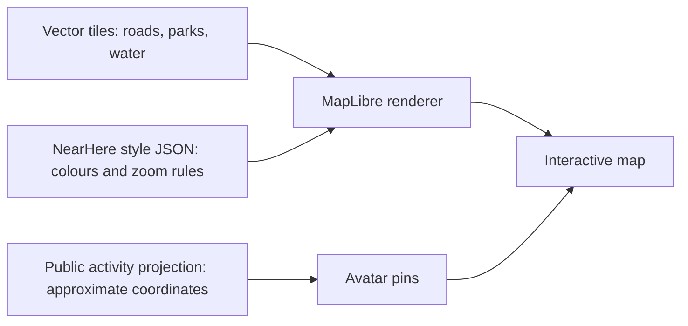

# NearHere: a neighbourhood playground

> Visual target: Night Arcade (charcoal, warm grey, acid-lime and human character
> art). This map-specific implementation guide follows the reviewed concept and
> acceptance tickets in [design review](design-concepts/design-review.md) and the
> [execution playbook](handoffs/night-arcade-execution.md).

Design revision: 23 September 2026. This living note distinguishes code written
from behavior actually observed. See the current handoff checkpoint before
treating any development-build result as current.

## Product decision

The map is the home screen. Opening NearHere should answer “what could I do
nearby?” without asking someone to interpret a dashboard. The first screen
keeps the neighbourhood visible and waits for the user to choose a pin.

Five actions remain on the map: change area, open profile, recenter, browse, and
host. The bottom Browse surface also provides Your plans. Filters appear inside
Browse. The full tab bar is hidden on Nearby, but remains available on Plans
and Me so those screens have a clear route back to the map.

The Night Arcade semantic palette now continues into Activity Detail, Plans,
Host creation and the location-search/private-meeting-point overlays. Those
two picker screens still use the native map provider beneath our controls; a
NearHere-authored vector basemap is a separate design-and-provider project.

```text
┌─────────────────────────────────┐
│ nearhere / selected area     ◉  │  Area search and your profile
│                                 │
│       map, with room to pan      │
│           character + activity  │  Hosts mark activities
│                                 │
│                                 │
│ Activity areas             ◎    │  Recenter
│ ┌─────────────────────────────┐ │
│ │ Things to do          + Host│ │  Browse opens filters and list
│ └─────────────────────────────┘ │
└─────────────────────────────────┘
```

Tap a marker to reveal a compact host/title/time/capacity card. Tap the map or
the close control to dismiss it. Previously the first activity was automatically
selected, so a large card covered the map before a user had expressed interest.
Removing the automatic selection is an interaction change, not just a smaller
font. Browse preserves a list alternative for people who find a map difficult.

## Research and interpretation

- [Snapchat's Actionmoji documentation](https://help.snapchat.com/hc/en-gb/articles/7012324804628-How-do-I-use-Bitmoji-on-the-Snap-Map-and-what-is-Actionmoji)
  explains how characters and poses communicate context. Our interpretation is
  to use a recognisable character plus an activity badge. NearHere represents
  planned activities at deliberately approximate coordinates. It does not
  infer or publish the host's movements or current presence.
- [Mapbox Studio](https://docs.mapbox.com/console-tools/studio/)
  demonstrates that map visual design can be authored independently of app
  controls. This supports separating our future map style from screen code.
- [React Native Maps map properties](https://github.com/react-native-maps/react-native-maps/blob/master/docs/mapview.md)
  document platform-dependent styling. The current Apple renderer can use a
  muted light map and suppress points of interest; arbitrary vector-layer
  restyling requires a different renderer.
- [MapLibre setup](https://maplibre.org/maplibre-react-native/docs/setup/getting-started/)
  and [Expo integration](https://maplibre.org/maplibre-react-native/docs/setup/expo/)
  provide a path to a custom native vector map. MapLibre needs a native rebuild
  and a map style/tiles source. Its demo tiles are for development, not our
  production neighbourhood map.

These are primary technical/product sources, not evidence that our design will
improve retention. That hypothesis needs observation of real users.

## Visual direction

The live semantic tokens are `canvas #111516`, `surface #1C2223`, `raised #272F30`,
warm text `#F4F5EF`, muted text `#AEBAB6`, and acid-lime `#D4F76A` with dark text.
The dark map recedes; people and their activities carry the colour. Avoid
decorative compass buttons, permanent filter chips, redundant live badges, and
several large bottom panels. A cluster count is useful map information, not
decoration. Do not reward precision location or create fake online presence.

The palette is applied to Nearby, Browse, navigation, Me/phone auth, profile
editing, Plans, Host creation, Activity Detail, location search, and private
meeting-point picking. This is a source implementation milestone, not an
app-wide visual acceptance; Simulator layout/contrast review remains open.

## Avatar foundation and its limits

`apps/mobile/assets/avatars/v1/` contains six original full-body transparent
characters. `lib/avatar-catalog.ts` imports each file statically; IDs and order
are frozen because `lib/avatar-identity.ts` maps a persistent random UUID seed
to the initial catalog choice. Me includes a six-choice editor and persists the
selected `avatarId` separately, so changing art never changes account seed.
New profiles receive a seed from PostgreSQL; existing `{}` profiles can still
use the account ID as a render-only fallback.

The images are bundled, so rendering needs no image-server request or profile
photo upload. They are presets, not a custom avatar builder. Migration
`202609230004_selected_avatar_projection.sql` is deployed and emits only the
version, UUID seed (when valid), and a six-value allowlisted catalog choice.
Anonymous hosted smoke returned 13 rows and 13 safe configs. No choice had yet
been saved in that data, so selected-ID projection has not been observed from an
actual account save. Authenticated UI save and public map consistency remain
Simulator acceptance work. The projection must not expose profile IDs, phone,
arbitrary JSON, or exact coordinates.

## How we make the map our own

A map has three independent layers of responsibility:



The tiles supply geometry. The style decides its appearance. The renderer
draws that combination while the user pans and zooms. Our activity overlays
remain application data and keep the existing privacy contract. Changing
renderers does not require changing who can read exact meeting points.

Implementation sequence for the custom world:

1. The prototype uses `@maplibre/maplibre-react-native@11.4.0`, compatible with
   this project's Expo 54, React 19.1, RN 0.81.5, and New Architecture. It draws
   maps, but does not supply geography or place search.
2. The current authored style requests OpenFreeMap's vector TileJSON and font
   glyph endpoints, not its premade `dark` style. OpenFreeMap describes its
   service as free, but its current terms make the public service an
   as-is/no-availability-promise prototype; revisit provider capacity, privacy,
   caching and SLA before a broader launch. The OpenFreeMap/OpenMapTiles/OSM
   attribution remains visible. [OpenFreeMap Terms](https://openfreemap.org/tos/)
   and [style/data license and credit](https://github.com/hyperknot/openfreemap-styles/blob/main/styles/dark/LICENSE.md).
3. Nearby constructs GeoJSON from privacy-safe activity summaries. GeoJSON uses
   `[longitude, latitude]`, unlike the named latitude/longitude fields in the
   app's region type. `GeoJSONSource` clusters; `SymbolLayer` shows bundled
   characters at close zoom; `Camera` owns pan/zoom. The selection card is still
   ordinary React Native UI.
4. A selected avatar gets a quiet lime halo. A cluster shows a count and zooms
   to reveal choices. Never jitter or persistently move points for neatness.
5. `apps/mobile/assets/maps/nearhere-night-arcade-v1.json` is our first authored
   MapLibre style. It uses the OpenMapTiles vector-layer schema and OpenFreeMap
   TileJSON/font resources while NearHere controls colors, layer order and
   labels. Renderer, style, and tile API are distinct parts: this is our own
   cartographic configuration, not self-hosted geography. The style passes the
   MapLibre Style Specification validator; it still needs a fresh Simulator
   visual review before we call its color hierarchy accepted.
6. Add poses only if legible at marker size, reduced-motion safe, and clearly
   represent planned activity—not inferred movement or online status.
   Keep motion optional and labels readable. Avoid rewards for revealing more
   precise location or for meaningless repeated tapping.
7. Verify source failure, attribution placement, accessibility through Browse,
   marker taps, battery use, frame rate, and physical iPhone/Android behaviour.

The current source uses MapLibre, the locally authored `nearhere-night-arcade-v1`
vector style, native clusters and avatar sprites. The iPhone 17 Pro Simulator
native build and core marker/cluster smoke passed on 23 September against the
previous public dark style; see the [V14 evidence](screenshots/night-arcade-maplibre-simulator-20260923.png).
The newly authored style passes MapLibre style validation and iOS bundle export,
and a fresh Simulator capture [V15](screenshots/night-arcade-maplibre-authored-style-simulator-20260924.png)
proves it renders. V16 shows the visible credit affordance; V17 captures the
native attribution panel opened by tapping that control, verifying the map
provider/data credits. Marker/cluster interaction still needs verification
against this authored style because current Simulator automation cannot tap
the native map overlay. This does not imply physical-device, Android,
accessibility, tile-failure, load, or launch acceptance. The user-facing
basemap design is ours; map geography and uptime still depend on the prototype
tile provider. No live friend-location or reward system exists. The current
avatar editor has six fixed presets only.

## Verification and teaching exercise

Read Nearby's `selectedId` state first. It starts as null; tapping a marker sets
it; an unavailable selected activity is cleared; dismissing sets it back to
null. `selected` is derived from the current server rows rather than stored as
a second stale copy. This is a small example of keeping one source of truth.

Read the Browse modal next. `filter` affects the same nearby-data hook as the
map, so switching presentation does not invent a separate authorization path.
The modal has explicit loading, empty, and retry states. Its rows return to the
map and select an activity; the selected card then opens existing detail/join
flows. Try this sequence yourself: Browse → Coffee → select an activity →
dismiss → Browse → All. Explain which state values change at each step.
