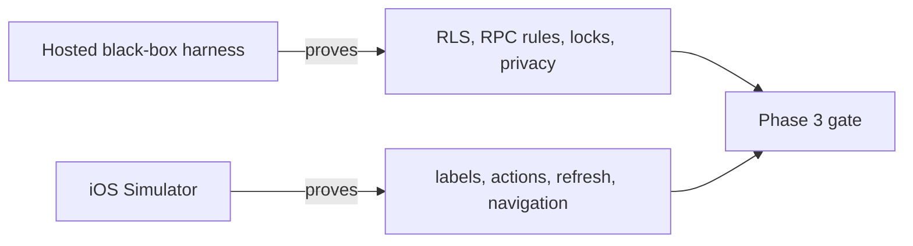

# Phase 3 acceptance runbook

This runbook closes the remaining participation evidence without confusing
database correctness with mobile-interface acceptance. Use only the hosted
development project and fictional fixed-OTP actors. Do not print or commit
phones, OTPs, access tokens, or exact coordinates.

## Evidence layers

A passing RPC test cannot prove that a button is understandable or refreshes
the screen. A convincing screen cannot prove that another caller is denied or
that concurrent joins preserve capacity. Phase 3 needs both forms of evidence.

## Gate A: full profile RLS matrix — verified 2026-09-04

Prerequisites: two distinct fictional fixed-OTP identities are active in the
hosted development Auth configuration. The dependency-free runner is already
implemented at `supabase/tests/hosted/profiles-rls.mjs`.

Run the command documented in `supabase/tests/hosted/README.md`. Accept only a
run that ends in `PASS hosted profile RLS verification complete`. It must prove:

- anonymous reads are denied;
- each owner reads exactly one own row;
- cross-user reads return no rows and cross-user updates affect no rows;
- allowed owner fields can be updated;
- protected columns, inserts, and deletes are denied; and
- invalid profile values fail constraints and cleanup restores writable fields.

This run changes only client-writable fields temporarily. `updated_at` advances
because it is server-owned. It intentionally does not test Auth-user deletion.

Recorded result: the complete matrix passed. The first OTP request encountered
a transient HTTP 502; an Auth health request returned HTTP 200, then one
deliberate retry passed every assertion and cleanup. This is useful operational
evidence: classify a transient gateway response, check service health, and retry
a safe authentication challenge without weakening or skipping assertions.

## Gate B: public/private displacement

Run `supabase/tests/hosted/participation.mjs` with Actors A and B at minimum.
The runner now compares the public point returned by `create_activity` with the
exact point released to the accepted host by `my_plans`. The check passes only
when their distance falls in the outer 40% of the configured privacy radius,
with a small numerical tolerance for sphere-versus-spheroid calculations.

The output names only the passing assertion. It must never print either point
or the measured distance. This is a protected black-box measurement through the
same publishable-key boundary used by the app.

## Gate C: host Reject in Simulator

1. As Actor A, create a future approval-mode activity.
2. As Actor B, open it and request to join. Confirm the result is `pending`.
3. Return to Actor A, open Plans, and find Actor B under **Join requests**.
4. Tap **Decline** once.
5. Confirm a rejection notice appears, the request disappears, and the
   activity attendance count does not increase.
6. Refresh Plans and confirm the request does not return.
7. Sign in as Actor B and confirm the rejected membership is absent from active
   Plans.

Record the Simulator/device model, OS version, build freshness, date, and each
observed result. Do not claim this gate from the hosted rejection test alone.

## Gate D: pending and waitlisted cards in Simulator

For a pending card, stop after Actor B requests an approval-mode activity. In
Actor B's Plans verify **Requested**, a locked meeting point, the explanation
that access follows host acceptance, and **Withdraw request** with its distinct
confirmation copy.

For a waitlisted card, use an open activity of capacity two: Actor A hosts,
Actor B fills the remaining accepted place, and Actor C joins. In Actor C's
Plans verify **Waitlisted**, a locked meeting point, the explanation that access
follows promotion, and **Leave waitlist** with its distinct confirmation copy.

In both cases, exact coordinates must be absent from the hosted response and
the screen. A visual lock without a server-side `null` is not privacy proof.

## Gate E: inactive cards

An old accepted development fixture whose `ends_at` is in the past can prove
the **Ended** branch: the card must say **Meeting point no longer available**,
show no exact coordinate, and hide Leave. Verify the response also contains
`null` exact fields.

The **Cancelled** branch cannot currently be produced through the public client
boundary because activity cancellation is not implemented. Do not mutate the
hosted database with an administrative shortcut merely to produce a screenshot.
Accept this branch later through the real cancellation command, or in a
disposable local database fixture once that command is designed.

## Remaining non-blocking proof

The hosted FIFO test proves chronological ordering. Equal `created_at` values
are deliberately not manufactured through the public API, so the UUID
tie-break branch still needs a controlled local fixture. This does not block
the normal chronological queue behavior already verified, but it must remain
labelled unverified.
