# NearHere Practical Software Engineering Curriculum

This curriculum is for a computer science graduate who understands theoretical subjects but wants to learn how real applications are designed, built, tested, deployed, operated, and scaled.

It does not avoid technical terminology. Each important term will be handled in four stages:

1. Define it precisely.
2. Connect it to the underlying computer science concept.
3. Implement it in NearHere.
4. Examine failure modes, tradeoffs, and scaling limits.

## How each build lesson will work

Before implementation:

- State the user problem and acceptance criteria.
- Identify the relevant client, server, database, and infrastructure responsibilities.
- Draw the request, state, and data flow.
- Explain the selected design and meaningful alternatives.

During implementation:

- Introduce new syntax and framework APIs in context.
- Explain important functions, types, components, and files.
- Identify invariants: conditions that must always remain true.
- Call out security, privacy, concurrency, and error-handling decisions.
- Record problems as they occur: observed symptoms, evidence, hypotheses, rejected fixes, root causes, and verified resolutions.

Use [`code-tour.md`](code-tour.md) for a compact end-to-end walkthrough of one
feature. For every lesson, also answer: what user problem is solved, what data
enters the system, which states are possible, which layer owns the invariant,
and what evidence proves success and denial.

After implementation:

- Run proportionate checks and explain what each check can and cannot prove.
- Review edge cases and operational failure modes.
- Explain how the design changes at larger scale.
- Produce interview questions and honest resume language.

## Learning path

### Module 1: From source code to a running mobile application

Progress: **foundation complete, learning continues** — a NearHere native development build has been compiled, installed, connected to Metro, and debugged in iOS Simulator.

NearHere work: understand and run the current Expo application.

Must-know concepts:

- Source code, compiler, transpiler, bundler, runtime, and process.
- JavaScript execution and the React Native runtime.
- TypeScript static analysis versus runtime validation.
- Package managers, dependencies, semantic versions, and lockfiles.
- `npm` versus `npx`, package scripts, command arguments, flags, and executable resolution.
- Persistent client storage: AsyncStorage versus secure storage versus a server database.
- Native code, JavaScript code, and the React Native bridge/runtime model.
- Expo Go versus a custom native development build versus a production build.
- The difference between an installed native binary, the Metro development server, and the JavaScript bundle.
- Native rebuild boundaries: which changes support Fast Refresh and which require recompilation.
- iOS and Android compilation, signing, application identifiers, permissions, and entitlements.
- Development builds, production builds, and environment configuration.

Practical outcome: explain what happens between `npm start` and seeing NearHere on a phone, why MapLibre cannot run inside Expo Go, and when NearHere must be rebuilt.

### Module 2: TypeScript for product engineering

Progress: **in progress** — activity/location contracts are provider-independent; persisted location, hosted profiles, and live activity RPC responses have runtime validators.

NearHere work: evolve the activity domain model from removed fixtures into validated live request/response contracts.

Must-know concepts:

- Primitive types, arrays, objects, functions, and modules.
- Type aliases, interfaces, unions, generics, and narrowing.
- Optional fields versus nullable values.
- Compile-time types versus runtime data.
- Domain modeling and making invalid states harder to represent.
- Runtime schema validation for API responses.

Practical outcome: model an activity, membership, join request, and API response without relying on `any`.

### Module 3: React and client-side state

Progress: **in progress** — location and live nearby discovery are isolated in custom hooks, while authentication and profile onboarding use app-wide providers with explicit state transitions and stale-request protection.

NearHere work: decompose the Nearby screen into focused components and hooks.

Must-know concepts:

- Components, props, state, hooks, render cycles, and effects.
- Controlled state and derived state.
- Referential equality, memoization, and unnecessary renders.
- Local state versus application state versus server state.
- State machines for flows with explicit transitions.
- Accessibility and platform interaction semantics.

Practical outcome: trace how a marker tap changes application state and causes the activity card to update.

### Module 4: Mobile application architecture

Progress: **in progress** — foreground permission handling, modal routing, navigation-focus synchronization, and persistent manual location are implemented.

NearHere work: formalize navigation, permission handling, and screen boundaries.

Must-know concepts:

- File-based routing and navigation stacks.
- Platform permissions and least privilege.
- Foreground versus background execution.
- Deep links and resuming interrupted flows.
- Persistent device storage and secure storage.
- Offline, slow-network, app-backgrounding, and app-restart behavior.

Practical outcome: explain what happens if NearHere is killed during login and reopened.

### Module 5: Networking, HTTP, and API design

Progress: **in progress** — manual place search crosses a public HTTP/JSON boundary; hosted phone Auth uses provider APIs; owner-profile reads/updates use the Supabase Data API; and activity creation/discovery use deployed RPC operations with runtime-validated responses. A standalone `/v1` NearHere application server remains planned.

NearHere work: connect the mobile client to the first real backend endpoint.

Must-know concepts:

- DNS, TCP, TLS, HTTP, request/response, headers, and JSON.
- REST resources, methods, status codes, and error envelopes.
- Authentication versus authorization.
- Timeouts, retries, exponential backoff, and idempotency.
- Pagination, filtering, versioning, and API contracts.
- Why mobile networks are unreliable and how clients should behave.

Practical outcome: trace today's `nearby_activities` RPC from mobile state through HTTP, database execution, JSON parsing, and loading/empty/success/error UI; then explain how a future `GET /v1/activities/nearby` adapter can preserve the same domain contract.

### Module 6: Authentication and sessions

Progress: **implemented with development OTP** — hosted phone OTP, Supabase client boundary, session restoration/retry, lifecycle refresh, minimal profile onboarding, and resumable protected-intent state are implemented. Real SMS delivery and final intent execution remain later work.

NearHere work: implement phone OTP and protected Join/Host actions.

Must-know concepts:

- Identity, credentials, authentication, authorization, and sessions.
- Passwords, magic links, OTPs, passkeys, and social login.
- Access tokens, refresh tokens, expiration, and revocation.
- Secure device storage and transport security.
- Abuse prevention, rate limiting, CAPTCHA, and account enumeration.
- Trust boundaries: what the client may request versus what the server must enforce.

Practical outcome: request an OTP, verify it, persist a session, restore it after restart, and resume the original Join action.

### Module 7: Relational databases and geospatial data

Progress: **in progress** — profile and PostGIS activity migrations are deployed. Public/private geometry, GiST radius discovery, atomic activity/host-membership creation, and anonymous-safe RPC projection are implemented. Authenticated creation and realistic query-plan verification are next.

NearHere work: create the PostgreSQL/PostGIS schema and nearby-activity query.

Must-know concepts:

- Tables, rows, columns, keys, constraints, indexes, and joins.
- Normalization and intentional denormalization.
- Transactions, atomicity, isolation, and concurrency.
- Query planning and index selection.
- Database migrations and backward-compatible schema evolution.
- Coordinates, distance queries, spatial indexes, and privacy-rounded geometry.

Practical outcome: query activities within a radius without exposing the host's private coordinate.

### Module 8: Correct joins under concurrency

Progress: **participation database deployed and hosted-verified; participant Leave and host approval accepted in Simulator** — `join_activity` authenticates the actor, requires profile completion, serializes same-activity decisions with `FOR UPDATE`, and returns accepted/pending/waitlisted outcomes. Deployed migration `007` makes Leave and host decisions share that lock, adds retry-safe terminal transitions, and promotes a FIFO waiter atomically. On 2026-08-15, the A/B/C/D hosted matrix passed the server matrix. The rebuilt iPhone 17 Pro also verified signed-out Plans through OTP/onboarding/resume, accepted exact-point rendering, Leave confirmation, immediate private-point removal, and host approval with request removal plus count refresh. Host Reject and pending/waitlisted cards remain pending Simulator acceptance.

NearHere work: accept the Leave/approval flows in Simulator without confusing UI evidence with the completed database/RPC proof; then implement removal as a distinct moderation transition.

Must-know concepts:

- Race conditions and critical sections.
- Optimistic versus pessimistic concurrency control.
- Database locks, isolation levels, and unique constraints.
- Idempotency keys and retry safety.
- Invariants such as `accepted_participants <= capacity`.

Practical outcome: prove that two simultaneous requests cannot both take the final available spot.

### Module 9: Real-time systems

NearHere work: add activity chat and participant-count updates.

Must-know concepts:

- Polling, long polling, server-sent events, and WebSockets.
- Connections, subscriptions, rooms, heartbeats, and reconnection.
- Event ordering, duplicate delivery, and eventual consistency.
- Durable messages versus ephemeral presence.
- Optimistic UI and reconciliation with server truth.

Practical outcome: reconnect after losing network access without duplicating a chat message.

### Module 10: Caching and Redis

NearHere work: add Redis only after a measured need appears.

Must-know concepts:

- Cache-aside, write-through, write-behind, and TTLs.
- Cache hits, misses, invalidation, and stale data.
- In-memory versus durable storage.
- Distributed rate limiting.
- Pub/sub and its delivery limitations.
- Cache stampedes and hot keys.

Practical outcome: explain which NearHere data can be temporarily stale and which must always be transactionally correct.

### Module 11: Testing strategy

NearHere work: build a layered automated test suite.

Must-know concepts:

- Static analysis, unit, component, integration, contract, and end-to-end tests.
- Test doubles, mocks, fakes, and dependency boundaries.
- Deterministic tests and avoiding implementation-detail assertions.
- Database and API test isolation.
- Testing permission denial, network failure, retries, and concurrency.

Practical outcome: choose the cheapest test that provides sufficient confidence for each behavior.

### Module 12: Security and privacy engineering

NearHere work: threat-model location, authentication, chat, and moderation.

Must-know concepts:

- Assets, actors, trust boundaries, threats, and mitigations.
- Injection, broken authorization, insecure storage, and data leakage.
- Secrets versus publishable client configuration.
- Encryption in transit and at rest.
- Abuse cases, audit logs, blocking, reporting, and data retention.
- Privacy by design rather than privacy copy alone.

Practical outcome: demonstrate that modifying the mobile client cannot reveal another user's private meeting point.

### Module 13: Delivery and operations

NearHere work: create repeatable development, preview, and production environments.

Must-know concepts:

- CI/CD, artifacts, environments, configuration, and release promotion.
- Native signing, development builds, TestFlight, and Play internal testing.
- Logs, metrics, traces, dashboards, and alerting.
- Crash reporting, feature flags, rollbacks, and incident response.
- Database backup, restore, and migration safety.

Practical outcome: ship a reproducible build and diagnose a production failure without accessing a user's device.

### Module 14: System design and scaling

NearHere work: evolve the modular monolith using measured bottlenecks.

Must-know concepts:

- Functional and non-functional requirements.
- Latency, throughput, availability, durability, and consistency.
- Vertical versus horizontal scaling.
- Load balancing, stateless services, queues, caches, replicas, and partitions.
- Backpressure, graceful degradation, and capacity planning.
- Monoliths, modular monoliths, services, and the operational cost of distribution.

Practical outcome: design NearHere for one neighborhood, one city, and many cities while stating which components actually need to change at each stage.

## Three authentication and infrastructure concepts in context

### Magic link

A magic link is a short-lived, single-use credential delivered to an email address. Clicking it proves temporary access to that inbox and allows the authentication server to create a session.

It is not simply a convenient hyperlink. A secure implementation needs an unpredictable token, expiration, one-time use, protection against token leakage, and deep-link handling that returns the user to the correct mobile screen.

NearHere is not using magic links because phone OTP is the selected identity flow.

### Phone OTP

A phone OTP is a short-lived code delivered through SMS or another supported phone channel. The authentication server generates and verifies the code; the mobile application should never decide that an arbitrary code is valid.

The practical flow crosses several systems:

```text
NearHere mobile app
  -> authentication API
  -> SMS provider
  -> mobile network
  -> user's phone
  -> verification API
  -> authenticated session
```

Engineering concerns include phone-number normalization, delivery failure, expiration, retry limits, brute-force resistance, SMS cost, SIM-swap risk, session storage, and country-specific messaging rules.

### Redis

Redis is a networked in-memory data store. Reading from memory is normally faster than querying durable disk-backed storage, but Redis introduces a separate distributed system with its own failure modes.

Possible NearHere uses include:

- Rate-limit counters for OTP and chat requests.
- Short-lived activity presence.
- Cached map-cell results.
- Pub/sub fan-out between realtime server instances.

Redis should not be the authoritative store for memberships, capacity, or chat history. Those facts must survive restarts and require durable database guarantees.

The engineering question is never merely “Can Redis make this faster?” It is “Which correctness guarantees can this data safely relax, how will invalidation work, and what happens when Redis is unavailable?”

## Progress standard

The goal is not to finish modules quickly. A module is understood when you can:

- Explain the design without framework-specific vocabulary.
- Trace a request or state transition end to end.
- Identify at least two failure modes.
- Defend the chosen tradeoff against a reasonable alternative.
- Change the implementation without copying instructions blindly.
- Describe what must change at ten times the load.

## Feature worksheet

Copy this for each future slice:

```text
Feature:
Product rule:
User states:
Domain types:
Screen route:
Repository function:
Runtime parser:
Database table/RPC:
Authorization rule:
Concurrency invariant:
Unit test:
Hosted test:
Simulator screenshot IDs:
Challenge and resolution:
Resume/interview explanation:
```

## Current lesson sequence

```mermaid
flowchart LR
    L1["1. Native map and location"] --> L2["2. Persistent manual-location slice"]
    L2 --> L3["3. Phone auth client boundary"]
    L3 --> L31["3.1 Place search"]
    L31 --> L4["4. Identity database foundation"]
    L4 --> L5["5. Runtime-safe profile onboarding"]
    L5 --> L6["6. PostGIS activity creation and discovery"]
    L6 --> L7["7. Transactional participation"]
    L7 --> L8["8. Caller-scoped Plans and private detail"]
    L8 --> L9["9. Chat, safety, and operations"]
```



Lessons 1–9 have executable code. Hosted development now includes fixed-OTP Auth, profile migration/trigger, PostGIS activity/discovery, capacity-safe Join, a caller-scoped Plans projection with active accepted-only exact-location release, and migration `007` participation transitions. Authenticated Host, existing-host Join, signed-out Plans/OTP/onboarding resume, accepted participant exact-point rendering, Leave/private-point removal, and host approval were accepted in Simulator. The 2026-08-15 A/B/C/D hosted matrix verified the full server participation matrix, and the 2026-09-04 two-actor profile harness verified the complete profile RLS boundary after one transient OTP HTTP 502 and a successful retry following an HTTP 200 Auth health check. Remaining evidence includes Simulator acceptance for host Reject and pending/waitlisted/inactive cards, re-running the participation harness with its public/private displacement assertion, a representative geospatial query plan, and the equal-time UUID queue tie-break.
