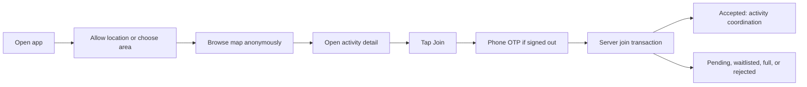

# NearHere Product Requirements Document

Status: **living beta specification**. “Required” describes the intended closed beta; implementation status is tracked separately in the backlog.

## 1. Release goal

Ship a trustworthy beta in one deliberately seeded launch neighborhood where a person can browse useful nearby activities without an account, authenticate by phone when committing, create or join an activity, and coordinate with accepted participants.

## 2. Personas and jobs

| Persona | Job to be done | Primary risk |
| --- | --- | --- |
| Explorer | “Help me find a nearby plan worth joining soon.” | Empty or misleading map |
| Host | “Help me publish and manage a simple plan without admin burden.” | Low attendance or unsafe participant |
| Participant | “Keep logistics and status clear after I commit.” | Cancellation, unclear meeting point, or over-capacity |
| Operator | “Help me investigate reports and maintain trust.” | Insufficient evidence or excessive private-data access |

## 3. Scope decisions

- Native iOS/Android app; the legacy web app is not the product client.
- Browse without an account; phone OTP is required for Join or Host.
- Ask for foreground location. If unavailable/denied, provide search and map-pin selection.
- No email magic link in the selected flow.
- No direct messages, payments, recurring-event administration, or complex recommendations in beta.
- The custom avatar builder is deferred. Use a safe placeholder/generated representation until the core loop works.

## 4. Functional requirements

### 4.1 App entry and location

- Open directly to a useful map shell without mandatory registration.
- Explain and request foreground location permission only.
- When allowed, center discovery around the device coordinate.
- When denied, unavailable, or intentionally changed, allow explicit place search and draggable pin selection.
- Persist the user's manual discovery selection locally and allow returning to device location.
- Clearly distinguish prototype fixture activities from live server data during development.

### 4.2 Authentication and minimal profile

- Trigger authentication only at Join, Host, or account-management boundaries.
- Normalize phone input to E.164, request SMS OTP through Supabase Auth, verify the code server-side, and restore the session after restart.
- Resume the protected Join or Host intent after successful authentication.
- Create an application profile row automatically for every authenticated identity; expose only deliberate host/participant projections through product APIs.
- Store phone identity inside the protected Supabase Auth schema, not in a public application table.
- Allow a display name and optional interests; defer the custom avatar builder.

### 4.3 Map and discovery

- Query by discovery center, radius, activity type, start window, and availability.
- Return active/published activities with approximate public coordinates only.
- Show type, starting time, walking-distance estimate, participant count/capacity, and join mode.
- Use a map-first interface; a future map/list toggle means two presentations of the same result set, not separate data or a beta requirement.
- Provide loading, empty, stale, error, and retry states.

### 4.4 Activity detail

- Show title/type, date/time, description, approximate public area, walking distance, participant count, capacity state, join mode, and lightweight host identity.
- A “verified host” indicator is not a first-version requirement until verification criteria and operations exist. Do not imply formal verification from a phone-authenticated account alone.
- Show participant-only meeting details only after server authorization.
- Present Join, Request to join, Leave, Cancel, and Waitlist actions only when valid for the current state.

### 4.5 Activity creation

- Require type, start/end time, private meeting location, title/description, and join mode.
- Support search or map-pin location.
- Allow optional maximum participants within a server-defined cap.
- Preview the approximate public location separately from the private meeting point.
- Validate on the client for feedback and on the server for correctness.

### 4.6 Participation

- Open join accepts immediately when capacity and safety rules allow.
- Approval mode creates a pending request.
- Full activities may create a waitlisted membership when enabled; otherwise return a truthful full result.
- Joining, leaving, approving, rejecting, removing, and cancelling are idempotent server operations.
- Concurrent requests cannot cause accepted membership to exceed capacity.

### 4.7 Activity coordination

- Accepted participants and the host can read and send activity-scoped messages.
- Chat supports text, system events, pagination, retry state, mute, report, and leave.
- Direct messages are out of scope.
- Realtime delivery improves freshness; durable message history remains in PostgreSQL.

### 4.8 Safety and privacy

- Approximate public geometry is derived server-side.
- Private meeting coordinates are never included in anonymous discovery responses.
- Support report, block, participant removal, activity cancellation, and operator audit trails.
- Apply rate limits and abuse controls to OTP, activity creation, joins, and messages.
- Avoid logging OTPs, tokens, raw phone numbers, private coordinates, or message bodies.

## 5. Primary journey

## 6. Beta acceptance criteria

- A new user can browse a useful map without creating an account.
- Permission denial still leads to a persisted searchable/manual discovery area.
- Join and Host correctly require phone authentication and resume the original intent.
- An authenticated user has exactly one corresponding public profile.
- Public activity responses contain no private meeting coordinate.
- A user can create and view a real database-backed activity.
- Two concurrent clients cannot both claim the final place.
- A retry cannot duplicate a membership or message.
- An accepted participant can access coordination; an anonymous/non-member user cannot.
- Failures are observable and represented honestly in the UI.

## 7. Product questions requiring evidence

- Which first neighborhood and activity categories create adequate density?
- Should waitlisting be automatic or host-enabled?
- At what membership state should the exact meeting point become visible?
- Which host trust signals are understandable without creating false safety guarantees?
- How much public location approximation balances discoverability and privacy?
- When does the avatar builder improve activation enough to justify onboarding friction?
