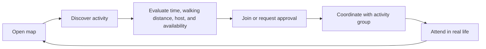
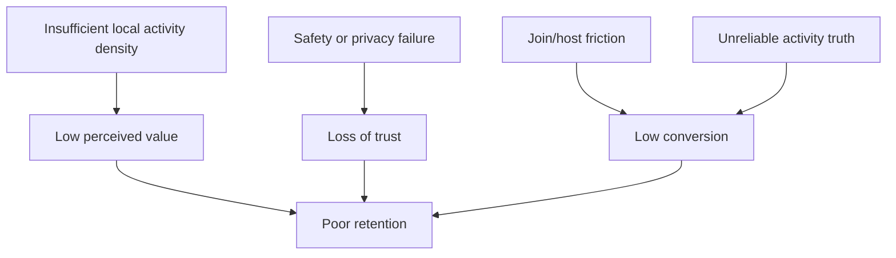

# NearHere Product Bible

The Product Bible contains durable product intent. Release-specific details belong in the PRD; technical implementation belongs in system design.

## Product promise

**NearHere helps people see what is happening nearby and join in.** It is a map-first activity network for low-friction participation in real life.

## North star

Make the next good local plan visible within seconds.

## Audience

- People new to a city or neighborhood
- People seeking spontaneous, low-commitment plans
- Hosts organizing one-off or eventually recurring local activities
- Communities wanting discovery without constructing a social graph

## Core loop

Browsing is available without an account. Phone OTP is introduced at the moment of commitment: Join or Host.

## Experience pillars

- **Map first:** discovery starts spatially, not in an infinite feed.
- **Activities over profiles:** identity supports safety and coordination; it is not the destination.
- **Real life over screen time:** optimize for fast decisions and attendance.
- **Delight with purpose:** avatars, motion, and microcopy create character without obscuring state.
- **Privacy by architecture:** approximate public areas and authorized meeting details—not continuous person tracking.
- **Honest states:** fixtures, errors, waitlists, approvals, and capacity are represented truthfully.

## First beta capabilities

- Browse nearby activity markers without an account
- Foreground location permission with searchable city/neighborhood and draggable-pin fallback
- Phone OTP authentication required for Join and Host
- Activity detail with time, walking distance, approximate location, description, capacity, join mode, and lightweight host trust information
- Activity creation with type, date/time, location, description, optional capped capacity, and open/approval mode
- Join, leave, approval, waitlist, and cancellation state
- Participant-only activity coordination/chat
- Approximate public activity location and protected operational meeting point
- Report, block, leave, and moderation foundations

The custom avatar system is a major differentiator, but the full builder is
deliberately deferred. The first native version assigns every profile a stable
random character from six bundled presets and lets the owner change that preset.
This does not imply verification, a real likeness, or continuous location.

## Explicit non-goals for the first release

- Public follower counts or influencer profiles
- Continuous friend or stranger tracking
- Direct messages between strangers
- Payments, marketplace, or ticketing
- Recurring-event administration
- Complex recommendation algorithms or infinite feed
- Custom WebSocket infrastructure before chat/realtime requirements exist
- Redis before a concrete rate-limit, cache, presence, or fan-out need exists

## Product risks

The startup cannot solve density purely with software. The launch strategy must seed a narrow geographic area with reliable hosts while the product minimizes friction and protects trust.

## Launch discipline

NearHere launches one neighborhood at a time. The first success is not a large
signup number; it is repeatable, trustworthy participation in a small area.
The founder recruits and supports anchor hosts, measures whether activities are
actually held, and expands geography only after supply, trust, and retention
are visible in the data. The detailed operating plan lives in
[`startup-launch-and-resume-plan.md`](startup-launch-and-resume-plan.md).

## Success measures

- Time from open to first meaningful activity view
- Map-to-detail and detail-to-join conversion
- Join-to-attendance signal
- Activity fill rate without harmful over-capacity
- Host activation and repeat hosting
- Week-4 retained participants
- Report/block rate, moderation response time, and privacy incidents
