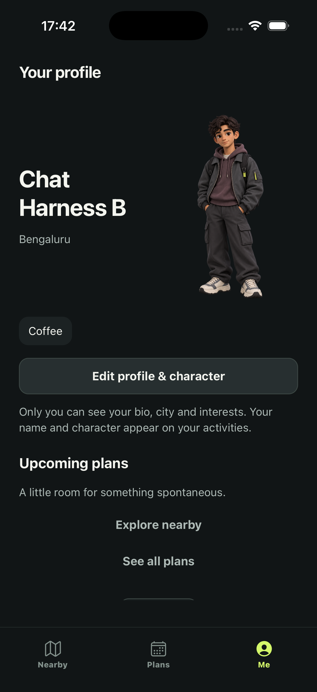

# Owner profiles: from a draft to a safe database update

Implemented 28 September 2026. This chapter describes working code, not the
entire future public-profile or wardrobe roadmap.

## 1. What changed

The profile editor now saves an optional bio, broad city and activity interests.
Name and character are still public through existing activity projections. The
new fields are **owner-only**. There is no public-profile switch yet: exposing
user-written biographies first requires content reporting and moderation.



The screenshot uses an existing fictional account and deliberately entered demo
city/interest. It is not inferred from GPS. Plans are real query results, not
invented attendance or popularity figures. The full-body character is bundled
2D artwork, not a live 3D model.

## 2. Follow the implementation

| Responsibility | File / entry point |
| --- | --- |
| Shared data shape | `packages/contracts/user.ts`, `UserProfile` |
| Text limits and row parsing | `apps/mobile/lib/profile-validation.ts` |
| Local draft and explicit Save | `apps/mobile/app/onboarding/profile.tsx`, `ProfileEditor` |
| Current account and async results | `apps/mobile/providers/profile-provider.tsx` |
| Request generation boundary | `apps/mobile/lib/profile-request-scope.ts` |
| Network adapter | `apps/mobile/lib/profile-repository.ts`, `completeMyProfile` |
| Atomic owner update | `supabase/migrations/202609280001_owner_profile_details.sql` |
| Profile presentation | `apps/mobile/components/profile-hero.tsx` and `app/(tabs)/me.tsx` |
| Real hosted verification | `supabase/tests/hosted/profile-details.mjs` |

```mermaid
sequenceDiagram
  participant E as Local editor draft
  participant P as Account-scoped provider
  participant R as Supabase RPC
  participant D as Profile row
  E->>P: Save fields + current saved revision
  P->>P: Check current account and request generation
  P->>R: update_my_profile_v2(expected_revision, changes)
  R->>R: Derive owner from authenticated session
  R->>D: Lock owner's row
  alt revision matches
    R->>R: Validate the complete command
    R->>D: Update fields; trigger increments revision
    D-->>P: New saved owner projection
    P-->>E: Success, if request still belongs to this account
  else another edit already won
    R-->>E: Conflict; keep the draft visible
    E->>E: User explicitly chooses discard and reload
  end
```

## 3. Why a revision matters

A revision is an integer version of a saved row, not a timestamp and not a user
ID. Two editors can both read revision 12. The first save locks the row, checks
12, writes and advances it to 13. The second waits for that lock, then sees 13
instead of 12 and receives `P0001`. It cannot silently overwrite the first edit.

`FOR UPDATE` holds the row lock for the transaction. Validation and writing are
one database operation: if a field is invalid, none of the fields are saved.
The app disables duplicate submissions while saving. A conflict disables Save
until the user explicitly reloads. Draft text remains copyable before reload;
the button explicitly says it discards the draft. No automatic merge is claimed.

The RPC has no owner-ID argument. `auth.uid()` is the source of authority.
`SECURITY DEFINER` is therefore carefully bounded: empty search path, qualified
tables, explicit owner predicate, authenticated-only execution and field allowlist.
We did not weaken profile SELECT policies or add private fields to discovery.

## 4. Omitted is different from cleared

```ts
// Preserve the current city by not mentioning it:
{ bio: 'Coffee and weekend walks' }

// Explicitly clear the saved city:
{ city_label: null }
```

The server checks whether each JSON key exists. Empty optional text normalizes
to null. Bio is bounded at 160 Unicode code points; city at 80; name at 2–40.
JavaScript's ordinary `.length` counts UTF-16 units, so a supplementary emoji
counts twice there but once in PostgreSQL `char_length`. `Array.from(text).length`
keeps our code-point counts consistent. This does not count perceived grapheme
clusters: a family emoji can still contain several code points. SQL trims the
same whitespace set as JavaScript. Text is plain native Text, never interpreted
as HTML.

New interest selections use the seven activity category IDs. Historical free-form
interests remain owner-readable and unchanged when omitted; the editor displays
them rather than silently deleting or mapping them. Editing a legacy interest
set remains a follow-up requiring an explicit normalization UX.

## 5. Compatibility is a deliberate compromise

Existing v1 clients/harnesses may still update the original four granted columns:
name, onboarding status, avatar config and interests. New columns and revision
have no direct UPDATE grants. A trigger protects the existing seed on **every**
update and advances revision, including legacy writes. The mobile app now uses
the v2 RPC. An older client still has last-write-wins behavior for its old fields;
full removal of that compatibility path is a later coordinated client rollout,
not a claim that all historical clients gained optimistic concurrency.

No profile seed was regenerated. Public publishing remains false and cannot be
enabled by this command. Selecting another bundled character changes its catalog
ID, not the server-issued identity seed.

## 6. Account switching is a separate race

Database authorization does not solve stale screens. A network request can finish
after logout. An account ID alone is also insufficient for A → B → A: a very old
A request might otherwise appear current again. We use account plus generation.
Every account switch/request invalidates older generations, including callbacks
retained by old renders. A synchronous render mask hides another account's cached
profile before effects run. The editor is keyed by account ID, so local drafts
are discarded on account change. An unmounted editor cannot navigate after an
old Save returns. Repository exceptions become retryable errors instead of an
unhandled promise and a permanently spinning form.

## 7. Challenges, evidence and limits

- Hosted rollback rehearsal passed before the additive migration was deployed.
  Migration history and schema change were committed in one transaction through
  the Management API. CLI inventory subsequently matched through `202609280001`.
- Hosted black-box tests passed anonymous denial, owner isolation, injected owner
  field rejection, Unicode boundaries, invalid-command atomicity, concurrent
  revision conflict, seed protection, legacy revision advancement and explicit
  clearing. Original actor fields were restored; revisions/timestamps advance.
- The existing two-actor profile RLS suite also passed. Its allowed-avatar test
  now preserves the original seed, consistent with the new invariant.
- Simulator saved city and interest through the real app, then displayed both
  on Me. A harness update while the editor was open produced a real conflict;
  explicit reload reset the draft and a fresh save succeeded.
- Simulator native scrolling still returns `noWindowsAvailable` from the control
  bridge. Accessibility actions and field editing worked. This is **not** proof
  of physical keyboard/scroll ergonomics, large-text reachability or device QA.
- Local gate: 85 unit tests, TypeScript and lint passed. See testing status for
  the final export result; old bundle results do not validate new source.

## 8. Explain it in an interview

“I separated editor draft state from durable profile state. The server derives
ownership from authentication, validates a bounded patch and checks a revision
under a row lock. Account-scoped request generations stop stale UI responses.
I verified the real hosted boundary with two fictional users and a concurrent
write race, then exercised conflict recovery in Simulator.”

Exercise: trace why a rejected avatar ID cannot still save a valid bio from the
same request. Then explain why a successful hosted race test does not prove
that an iPhone's keyboard leaves the Save button reachable.
