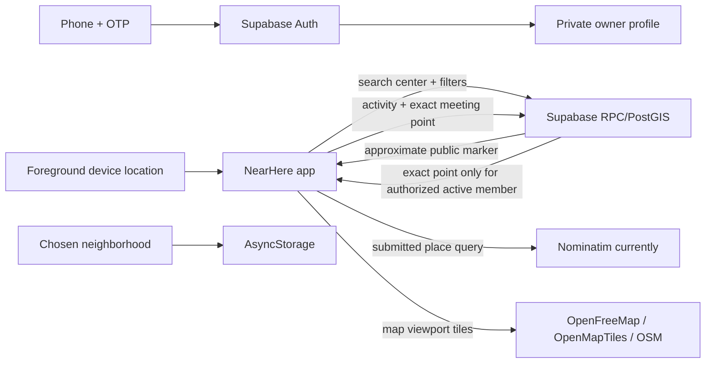

# NearHere privacy data inventory (engineering draft)

Updated 30 September 2026 from repository source. This is an implementation
inventory, **not a privacy policy or legal determination**. Recheck the actual
production configuration, vendor contracts and current law before publishing.
No user tokens, OTPs, phone numbers, exact coordinates or personal test data are
included here.

## Data flow

## Repository-backed inventory

| Data | Why/how the current app uses it | Current storage/access evidence | Still unknown before policy |
| --- | --- | --- | --- |
| Phone number and OTP | Supabase phone sign-in and verification; profile schema deliberately does not duplicate phone. | Auth provider calls Supabase Auth; app holds pending phone in provider state while verifying. | Auth/SMS provider logs, retention, region, delivery vendor, production configuration. |
| Display name, interests, avatar config, bio, city label | Owner profile, host name and stable character; bio/city are owner fields and public bio is disabled by default. | `public.profiles`, self-scoped RLS/RPC; public activity projections use allowlisted host data. | Production retention, public profile consent UX/status, account-erasure treatment. |
| Foreground location/search center | Nearby discovery uses center coordinates, radius and filters in `nearby_activities`. | `useNearbyActivities` sends selected center to the Supabase RPC; location permission is foreground-only in Expo config. The app does not request background location in the inspected config. | Request/access logs, exact retention, whether IP/location metadata appears in vendor logs. |
| Manual discovery area | Lets users browse when GPS is denied and restores selected map area. | Label and coordinates are saved locally in AsyncStorage (`nearhere.manual-location.v1`). | Device backup behavior, OS data protection, how long retained, deletion on account deletion. |
| Place-search query/results | User submits a neighborhood/landmark search. | `lib/place-search.ts` sends query text to public Nominatim and caches results in process memory (max 20 keys). This is not server-side caching. | Provider retention, service terms at release, proxy/selected production provider. Avoid personal text in queries. |
| Map viewport tiles | Draws streets/labels while user pans/zooms. | Authored MapLibre style references OpenFreeMap TileJSON/fonts and OpenMapTiles/OSM attribution. | Tile provider request logs, quotas, permitted commercial scale/SLA, production provider contract. |
| Activity title, description, kind, time, capacity, join mode, public approximate point | Publish and anonymous discovery. | `public.activities`; public discovery returns displaced approximate geometry, not exact point. | Product retention and deletion/anonymization; third-party backups/logs. |
| Exact meeting point | Navigation for host and accepted participants while the event is active. | `private.activity_locations`; RPCs conditionally release point to authorized caller. Before publication, selected pin is held in local AsyncStorage draft and cleared when restored into Host or after successful publish. | At-rest behavior of local drafts, abandoned-draft expiry, backup, retention and erasure policy. Verify sign-out/cancel/force-quit handling. |
| Membership and chat | Open/approval/waitlist state, coordination among accepted members. | Membership rows and private activity-message rows; caller-checked RPCs. Current message body max 1000 chars; history limit is bounded. | Retention, legal holds, export/deletion, provider backups, exact deletion behavior. |
| Reports, blocks, operator decisions | User protection and moderation. | Private safety tables and append-only audit events; operator-scoped RPCs. FK inventory shows some report/block references cascade on profile deletion while audit subject/actor fields use `SET NULL`. | Retention period, moderation SLA, who handles reports, lawful evidence retention and erasure exceptions. |
| Rate-limit and operational events | Prevent abusive sensitive writes and diagnose selected failures. | Private rate-limit and observability tables; event metadata is schema-bounded but must be reviewed field-by-field. | Retention/purge schedule, backups, administrator access, Supabase operational logs. |
| Session/access tokens | Keep an authenticated session on-device. | Supabase JS persists session via AsyncStorage in `lib/supabase.ts`. | Native at-rest protection and token invalidation after account deletion; review installed SDK/platform behavior. |

## Confirmed implementation facts and cautions

- `nearby_activities` receives a search center from the client. The public
  response has approximate activity points, but the backend still processes the
  caller's center to answer the query. “We do not show live location to other
  people” does **not** mean the location never reaches a service.
- The current place lookup is a direct request to Nominatim; a 1.1-second
  process-level throttle and small memory cache do not control total traffic
  across devices.
- Host meeting-point drafts and manual-area selection use AsyncStorage. Treat
  them as persistent local state until cleared; the privacy pass must test app
  kill, sign-out, cancel, shared-device account switching and deletion.
- Public approximate event data and private exact location are different data
  classes and must stay separate in API projections, caching, analytics, logs,
  support tooling and public screenshots.
- Supabase currently has a linked development project. No production project or
  production retention configuration was verified on this pass.

## Required owner/vendor answers before a public policy can be truthful

1. Confirm real production SMS, database, map-tile and place-search vendors,
   regions, contracts and published privacy links.
2. Set purpose/retention for profiles, events, chat, reports/audit, abandoned
   private-pin drafts, support tickets, backups and provider logs.
3. Decide the minimum age and, if under-18 accounts are allowed, complete an
   appropriate child-safety and parental-consent design with qualified review.
4. Provide a real support/privacy contact and the developer identity to publish.
5. Decide account deletion versus required retained safety/event records and
   explain the process and timeframe accurately.

Until these answers are known, keep this document internal. Do not publish a
generic template as the app's actual privacy policy.
