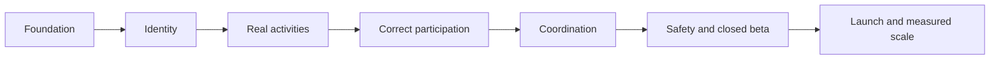

# NearHere Roadmap

The roadmap is dependency-ordered rather than date-promised. Dates become meaningful after effort, external setup, and validation are understood.

## Phase 0 — Native discovery foundation: completed

- Repository and living product/engineering documentation
- Expo/React Native TypeScript application
- Native map with clearly labeled fixtures
- Foreground location permission and failure states
- Persistent searchable manual location selection
- Nearby, Plans, and Me navigation
- Native iOS development build and Simulator workflow
- Provider-gated phone/OTP UI, session boundary, and protected intents

## Phase 1 — Identity foundation: implemented, final security acceptance pending

- Create a user-owned Supabase development project — completed
- Configure phone authentication and a fixed server-side development OTP — completed through a narrow hosted Management API update
- Keep the hosted mapping out of public Git; real SMS-provider delivery remains deferred
- Apply versioned `profiles` migration with Row Level Security — completed in development
- Verify anonymous profile access is denied — completed
- Connect real OTP flow and verify session restoration — completed
- Add minimal display-name onboarding and generated placeholder avatar — implemented; Actor C flow accepted in Simulator
- Add auth/profile integration tests and abuse-control checklist — unit tests and hosted harness added; two-user run pending

Exit condition: an OTP-authenticated user receives exactly one secure public profile, completes a display name, and can restart the app with the session restored. The remaining proof is the two-actor hosted RLS matrix and onboarding interaction acceptance.

## Phase 2 — First real activity vertical slice: implemented, privacy acceptance pending

- Core PostGIS activity schema and privacy-safe geometry — deployed
- Create activity RPC/transaction and native Host form — authenticated Simulator acceptance completed
- Nearby discovery RPC replacing fixtures — deployed and anonymous empty-state verified
- Activity detail screen with public/private field boundaries
- Host ownership and cancellation rules

Exit condition: two devices can create and discover a real activity without exposing private geometry.

## Phase 3 — Participation correctness: current

- Join with open acceptance, approval-mode pending, and full-capacity waitlist outcomes — deployed
- Per-activity row locking and natural-key retry idempotency — deployed
- Mobile auth/profile gates, protected-intent resume, runtime parsing, and Join feedback — implemented
- Anonymous denial and same-host idempotent acceptance — verified
- Caller-scoped My Plans read model with accepted, published, not-ended exact-location release — deployed and forward-hardened
- Native Plans loading/error/empty/list states and signed-out Auth intent — Actor C OTP/onboarding/resume accepted in Simulator
- Account-keyed plan cache, inactive location suppression, and explicit Auth cancellation — implemented
- Accepted host plan and unlocked exact point — accepted in Simulator
- Pending and waitlisted Plans cards — pending Simulator acceptance
- A/B/C/D hosted matrix for second-user, concurrent last-place, exact gating, and FIFO promotion — verified 2026-08-15
- Approve/reject, Leave, host request queue, and FIFO promotion — deployed/hosted-verified; participant Leave and host approval accepted in Simulator, Reject pending
- Participant removal — pending
- General idempotency-key records for later commands — pending
- Plans pagination/detail actions and useful meeting-point navigation — pending

Exit condition: concurrent attempts cannot violate membership invariants.

## Phase 4 — Coordination and safety

- Durable activity-scoped chat
- Realtime delivery using managed capability first
- Push notifications where needed
- Report, block, moderation, audit events, rate limits, and operational tools

Exit condition: accepted participants can coordinate and safety events are actionable and auditable.

## Phase 5 — Closed neighborhood beta

- Accessibility and physical-device test matrix
- Crash/error monitoring, structured logs, metrics, and product analytics
- TestFlight and Android internal distribution
- Anchor-host operating process and seeded launch data
- Privacy, retention, SMS compliance, and incident-response review

## Phase 6 — Differentiation and measured growth

- Custom MapLibre visual system
- Custom avatar builder informed by onboarding evidence
- Map/list view only if usability evidence supports it
- Recurring host tools, recommendations, caching, Redis, or extracted services only when real usage produces the requirement
- Monetization experiments after trust and density
