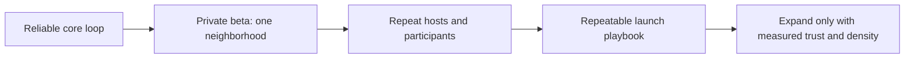
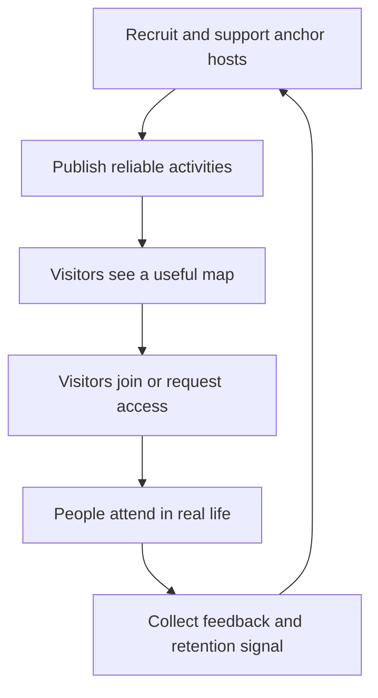
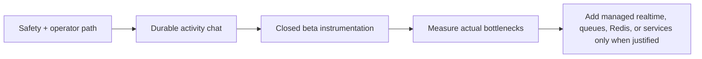

# NearHere Startup Launch and Resume Plan

Status: **decision framework and execution plan**. This document separates
implemented facts from launch hypotheses. It is the bridge between the product,
engineering work, community operations, and honest resume storytelling.

## 1. What success means

NearHere is successful in stages. A polished app is not proof of a startup;
repeat local participation is.

| Stage | Evidence required | What it proves |
| --- | --- | --- |
| Engineering MVP | Hosted security tests and native flows work | We can safely run a controlled experiment. |
| Closed beta | 10–20 invited people complete real activities | The loop works outside the developer's test accounts. |
| Local liquidity | Multiple useful activities exist in target time windows | The map has enough supply to create user value. |
| Retention | Hosts and participants return without repeated personal prompting | The product is becoming a habit, not an event. |
| Repeatable launch | The same playbook succeeds in a second comparable area | Growth is operationally repeatable. |

**Decision:** do not use a total-download target as the first success metric.
For a place-based network, trustworthy supply in one small area matters more
than a large sparse signup count.

## 2. Current baseline — 2026-09-08

Implemented and hosted-verified:

- Native Expo/React Native application with TypeScript.
- Phone OTP development authentication, profile onboarding, and session restore.
- Location permission plus searchable manual area fallback.
- PostGIS discovery with approximate public geometry and protected exact points.
- Host, join, approval, rejection, waitlist, Leave, cancellation, and participant removal.
- Caller-scoped database read models, row locks for capacity, natural-key retry safety, and hosted multi-actor checks.
- Private report/block foundation and a signed-in report-activity action.

Not yet launch-ready:

- Activity-scoped chat and block-aware chat authorization.
- Simulator acceptance for several important states and physical-device testing.
- Real SMS delivery, production rate limits, monitoring, incident response, and TestFlight.
- Operator workflow for reports, appeals, and emergency escalation.
- Any evidence of real community demand, attendance, retention, or willingness to host.

## 3. Product strategy: start narrow

### Beachhead decision

Choose one compact launch area—not a whole city—with predictable foot traffic,
walkable public venues, a compatible time zone, and communities where the
founder can personally recruit early hosts. A campus district, dense apartment
cluster, coworking corridor, or recurring public-park community can qualify.

The first launch cohort should use only 2–3 activity categories. Recommended
starting candidates are walks, coffee, study, and low-equipment sport. Their
purpose is not breadth; it is reliable repeated supply.

### The operating loop

The app creates the coordination surface. The founder/community operation
creates early density. Neither replaces the other.

## 4. Execution plan

### Milestone A — finish the closed-beta product boundary

Goal: make the existing core loop safe and understandable for a small,
invited group.

1. Finish Activity Detail, cancellation, participant removal, pending,
   waitlisted, and rejection acceptance in Simulator.
2. Build durable activity-scoped chat. PostgreSQL is the source of truth;
   managed realtime may fan out new messages after the durable write.
3. Apply the block predicate to discovery, participant projection, and chat
   reads/writes before claiming block support is meaningful.
4. Build an operator-only report review path with minimal metadata, status,
   decision, and audit trail. Do not expose operational reports to clients.
5. Add rate limits for OTP challenges, hosting, joining, reporting, and chat.
6. Add privacy-safe error monitoring, analytics, and a physical-device test
   matrix.

Exit condition: an invited host can create, manage, cancel, remove, report,
and coordinate; an invited participant can join safely and understand every
state; a blocked relationship cannot coordinate through the product.

### Milestone B — closed beta in one neighborhood

Goal: run 10–20 invited people through real activities, not synthetic tests.

1. Recruit 5–8 anchor hosts before inviting general participants.
2. Schedule a two-week calendar with at least three dependable activity slots
   per week in the same area and categories.
3. Invite a small participant cohort through host/community relationships.
4. Personally observe the first 10 hosted activities: no-shows, cancellations,
   meeting-point confusion, safety concerns, and why people did or did not
   return.
5. Conduct short interviews after every completed or failed activity. Ask about
   the moment the app created confidence or friction, not whether users “like
   the app.”

Exit condition: enough people find useful activities without being manually
walked through every action, and hosts voluntarily schedule a second activity.

### Milestone C — validate density and retention

Goal: decide whether NearHere has a local network effect worth investing in.

Track these definitions before collecting data:

| Metric | Definition | Why it matters |
| --- | --- | --- |
| Host activation | A new host publishes one future activity | Supply creation. |
| Held-activity rate | Activities not cancelled and confirmed by host/participants | Activity truth. |
| Detail-to-join conversion | Distinct viewers who initiate a join divided by distinct detail viewers | Relevance and trust. |
| Fill rate | Accepted places divided by offered places for activities that start | Local matching efficiency. |
| Attendance proxy | Participants/hosts confirm attendance after scheduled end | Better than treating join as attendance. |
| Repeat host rate | Hosts with another published activity within 28 days | Core supply retention. |
| Participant repeat rate | Participants who join again within 28 days | Demand retention. |
| Trust signals | Reports, blocks, removals, no-shows, response time | Safety cost and health. |

Initial thresholds are **hypotheses**, not claims: seek a held-activity rate
above 70%, clear evidence of repeat hosts, and no unresolved serious safety
incident. Set numeric expansion thresholds only after collecting a small,
honest baseline.

### Milestone D — repeat the playbook

Do not expand to a second area until the first area's host recruiting,
moderation, and feedback loop are documented. Then repeat the same process in
one comparable area and compare activation, held-activity rate, and retention.

## 5. Engineering sequencing and scale decisions

### Why this order

- Chat without member authorization and blocking creates a safety hole.
- Realtime is a delivery optimization; durable message storage and correct
  authorization come first.
- Redis is not a database feature. Add it only for measured rate limiting,
  caching, presence, or fan-out pressure.
- Microservices are not a startup milestone. The modular monolith is easier to
  change while the product is still learning.

## 6. Resume and interview evidence plan

Never claim user scale, production SMS, App Store launch, realtime chat, or
business traction until they exist. The current project is already strong when
described precisely.

### Current resume bullet

> Built NearHere, a native Expo/React Native local-activity platform backed by
> Supabase PostgreSQL/PostGIS; implemented phone-authenticated hosting and
> participation, caller-scoped RPCs, row-locked capacity control, FIFO
> waitlists, privacy-gated exact locations, host moderation, and multi-actor
> hosted security tests.

### After closed beta

Add only measured facts, for example:

> Ran an invite-only neighborhood beta with **[N]** participants and **[N]**
> hosted activities; instrumented activation, fill, attendance proxy, repeat
> hosting, and trust metrics to iterate on the supply-density loop.

### Interview narrative structure

1. State the user problem: empty/sparse local discovery and trust around
   meeting strangers.
2. Explain the core invariant: exact meeting locations are server-authorized,
   never merely hidden in the UI.
3. Explain the concurrency invariant: one activity row serializes capacity
   decisions across Join, Leave, approval, removal, and promotion.
4. Explain the startup constraint: a map network needs local density, so the
   launch starts with anchor hosts in one small area.
5. State a real tradeoff: defer custom infrastructure until measurements show
   it is needed.

## 7. Founder operating cadence

During closed beta, run a short weekly review:

1. What activities were scheduled, held, cancelled, full, or empty?
2. What broke in the app or operations?
3. Which hosts returned without being chased?
4. Which user segment got value fastest?
5. What safety/report/block event needs a product or policy change?
6. What one hypothesis will be tested next week?

Record decisions in the challenge log and revise this document only when a
measurement or user evidence changes a prior assumption.

## 8. Immediate next work

1. Finish the remaining Simulator acceptance gates, including the new chat UI.
2. Provision the first operator account deliberately and build the minimal report-review console on top of the deployed RPC boundary.
3. Add product analytics with strict privacy rules.
4. Prepare TestFlight and recruit anchor hosts for one selected neighborhood.
