# NearHere End-to-End System Design

Status: **living design**. Implemented pieces are called out explicitly; the rest is an evolution plan, not a production claim.

## 1. Start with requirements, not technology

System design is the process of translating product behavior and quality expectations into components, data, interfaces, and operational choices. The correct order is:

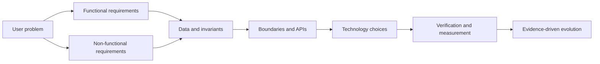

### Functional requirements

- Browse nearby activities without an account.
- Ask for foreground location; fall back to searchable manual selection when unavailable or denied.
- Authenticate with phone OTP before Join or Host.
- Create, view, join, request approval, leave, and cancel activities.
- Enforce capacity and waitlist/approval transitions correctly.
- Reveal only approximate public location publicly; reveal the operational meeting point only to an accepted member while the activity remains published and not ended.
- Coordinate in activity-scoped chat after joining.
- Report, block, leave, and moderate unsafe behavior.

### Non-functional requirements

- **Privacy:** never publish precise live user location or return private coordinates to unauthorized clients.
- **Correctness:** concurrent joins must not exceed capacity; retries must not duplicate actions.
- **Reliability:** failures must produce retryable, understandable states rather than fabricated success.
- **Performance:** a nearby result should feel interactive on a normal mobile network; establish a measured target after the first real endpoint.
- **Security:** all client input is untrusted; authorization is server/database enforced.
- **Maintainability:** a small team can modify one domain without understanding the entire codebase.
- **Cost awareness:** introduce paid infrastructure only for a demonstrated requirement.
- **Accessibility:** controls, status, motion, color, and text remain understandable across supported devices.

## 2. Context and actors

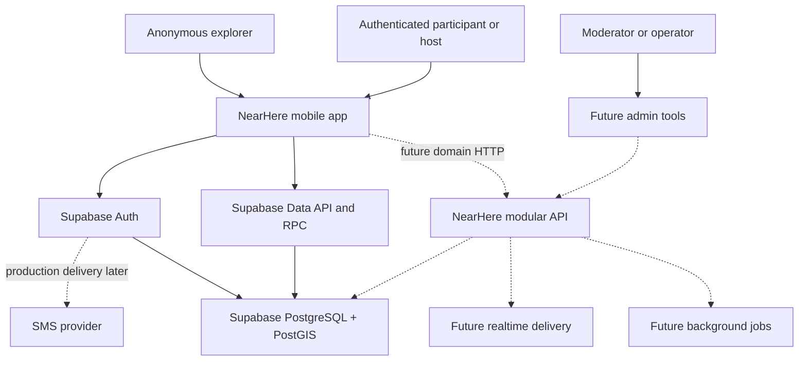

An actor is a person or external system interacting with NearHere. Solid arrows are the current deployed path; dotted arrows are planned. The mobile app uses hosted Supabase Auth, performs its narrowly authorized owner-profile operations through the Data API, and calls PostgreSQL functions through RPC for public nearby discovery and transactional activity creation. The standalone NearHere HTTP server, realtime delivery, jobs, SMS-provider delivery, and admin tools remain planned.

## 3. Initial architecture: a modular monolith

The current backend is already **modular in responsibility** even though there is no standalone application-server process. Authentication is owned by Supabase Auth; PostgreSQL tables own durable facts; grants and RLS protect simple owner-profile access; and narrow database functions own multi-table activity commands and public projections.

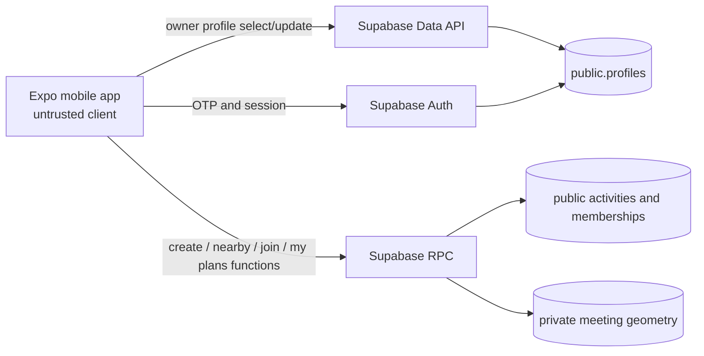

This is a pragmatic first deployment, not an argument that every future rule belongs in SQL. The next diagram is the intended evolution once Join, moderation, idempotency, stable error envelopes, or observability need a dedicated application runtime:

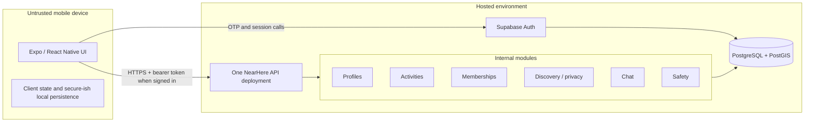

The migration path preserves the mobile domain contracts while replacing the transport adapter: screens should not care whether a future request is served by Supabase RPC or `/v1/activities`. That separation reduces rewrite cost without paying for a server before it carries a concrete responsibility.

A monolith is one deployable server. A modular monolith preserves one deployment while enforcing internal module boundaries. This is suitable because:

- One small team needs fast changes and simple local debugging.
- Activities, memberships, geospatial discovery, and chat share transactional data.
- The current scale does not justify network boundaries between business modules.
- Extraction remains possible when measurements reveal an independently scaling or operationally isolated component.

Microservices would immediately add service discovery, network failures, distributed tracing, deployment coordination, contract versioning, and cross-service consistency. Those costs do not create user value at the current stage.

## 4. Identity and protected-intent flow

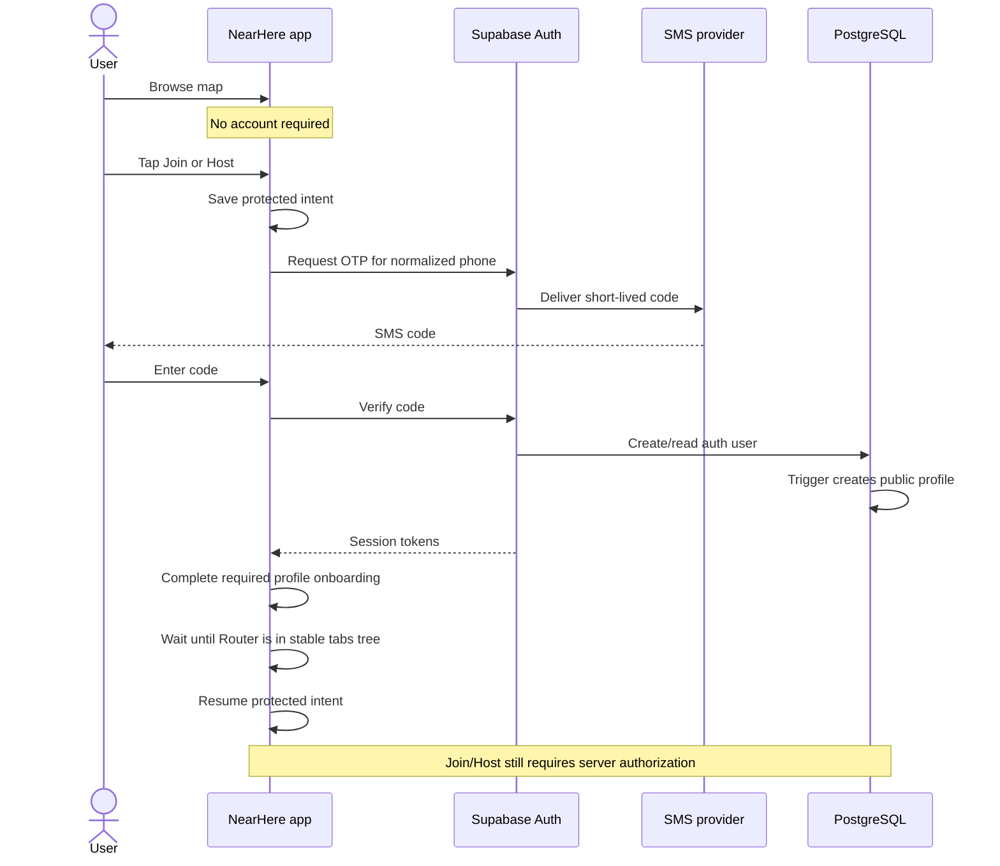

Authentication proves identity. Authorization decides whether that identity may perform an action. The app can display a signed-in state, but it cannot be trusted to approve its own join request.

Protected-intent readiness is conjunctive: the session must be valid, the
profile must be ready, and Expo Router must have settled into the tabs tree.
The implementation gates intent execution on `segments[0] === '(tabs)'` plus
profile readiness. This prevents an asynchronous intent effect from racing and
replacing a still-required onboarding screen.

## 5. Discovery and location privacy

Three coordinates serve different purposes:

1. **Discovery center:** the user's device or manually selected area used to ask “what is near here?” It stays local or is sent only as query input.
2. **Private activity point:** the host-entered operational coordinate. It must not appear in public API responses.
3. **Public activity point:** a server-derived approximate coordinate used for map discovery.

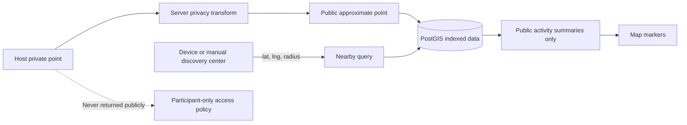

Moving a marker on the client is not privacy. If private data was sent to the phone, a modified client can inspect it. Privacy must be enforced at query and response boundaries.

The deployed `my_plans` read model is the first participant-specific release boundary. The database derives the actor from the authenticated session, finds only that actor's durable membership rows, and joins the private point only when the membership is accepted and the activity is published and not ended. Pending, waitlisted, cancelled, completed, and ended branches receive `null`, not an exact point that the UI merely hides.

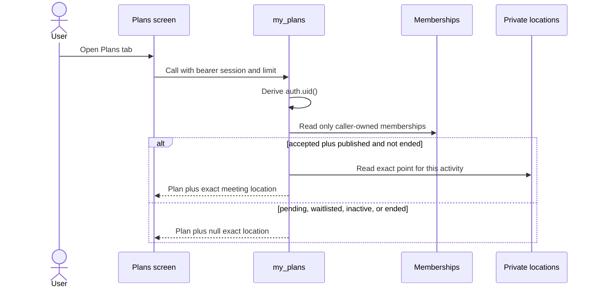

## 6. Activity lifecycle and state machines

Explicit state machines prevent impossible or contradictory states.

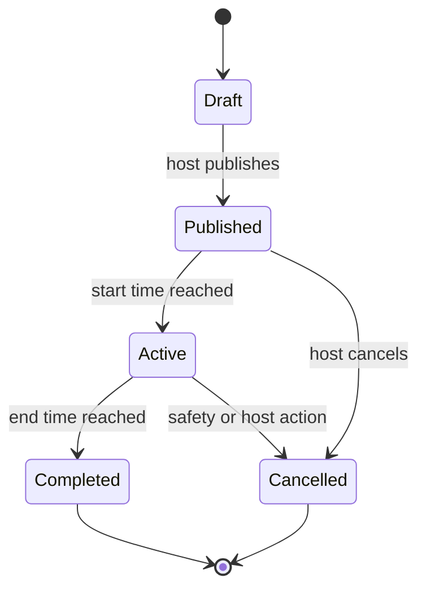

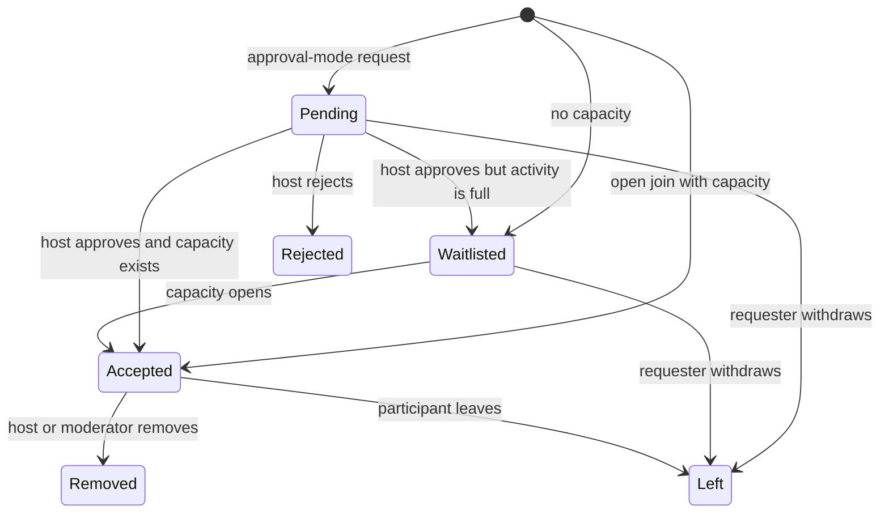

State transitions belong on the server inside database transactions. The client requests a transition; it does not write arbitrary status values.

## 7. Correct concurrent joining

Suppose one place remains and two phones join simultaneously. A read-then-write implementation can let both requests observe one open place and both accept. This is a race condition.

The deployed `join_activity` RPC implements the first capacity-safe transition. It derives the actor from the authenticated session, requires a completed profile, and locks the matching activity row with `FOR UPDATE`. Every join for that activity makes its capacity decision in lock order; joins for different activity rows can proceed concurrently.

```mermaid
sequenceDiagram
    participant A as Phone A
    participant RPC as join_activity
    participant Row as Activity row
    participant M as Memberships
    participant B as Phone B

    A->>RPC: Join activity X
    B->>RPC: Join activity X
    RPC->>Row: A acquires FOR UPDATE
    RPC->>Row: B waits
    RPC->>M: A checks existing state and accepted count
    RPC->>M: A writes accepted/pending/waitlisted
    RPC-->>A: Canonical status and accepted count
    RPC->>Row: A commits; B acquires lock
    RPC->>M: B recounts after A and chooses outcome
    RPC-->>B: Canonical status and accepted count
```

Open activities accept while capacity remains and otherwise waitlist. Approval-mode activities return `pending` without consuming accepted capacity. If the actor already has an `accepted`, `pending`, or `waitlisted` membership, the operation returns it unchanged. The composite membership primary key prevents duplicates, so current Join is retry-safe without a separate client-generated idempotency key.

This is a narrower guarantee than the planned general idempotency system. It does not store request fingerprints/responses for arbitrary commands. Migration `007` extends the same activity-row serialization point to Leave and host decisions so capacity is not protected by Join alone.

### Shared lock for every capacity-changing command

Capacity is a **cross-row invariant**: the activity stores the limit, while many membership rows store who consumes it. A transaction that changes either side of the count must lock the same parent activity row before it reads the count or changes membership. Otherwise Join and approval could each observe the final place and both accept, or Leave could promote a waiter while another request consumes the opening.

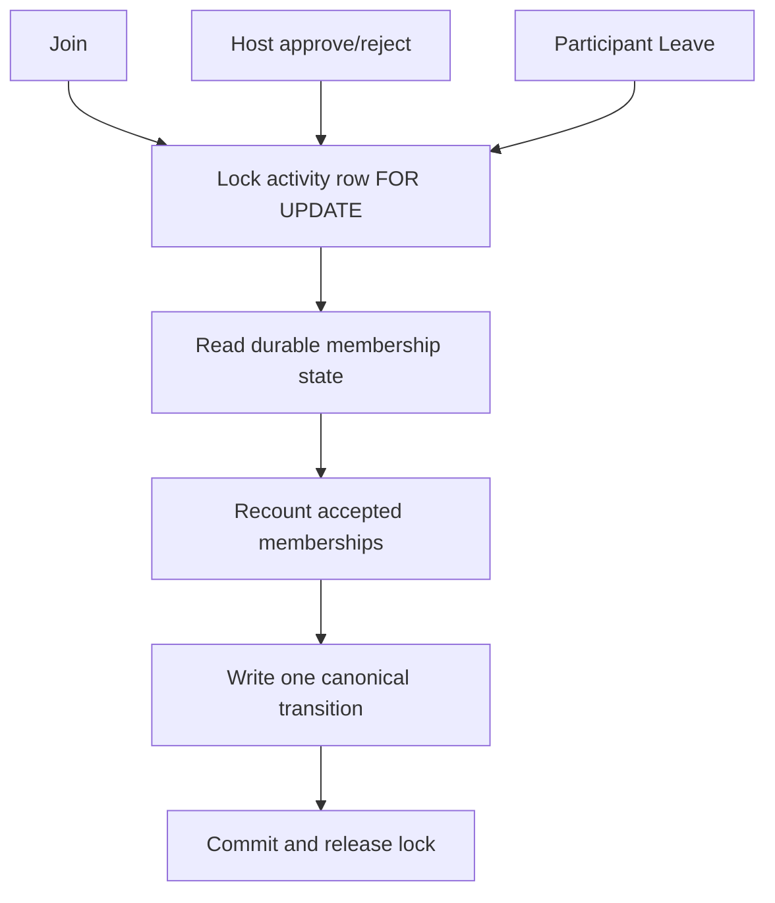

The source implementation serializes only commands for the same activity; unrelated activities remain concurrent. An accepted Leave from a published, non-ended activity selects the oldest waiter by `(created_at, user_id)`, marks that waiter accepted in the same transaction, and returns whether promotion occurred. This is deterministic FIFO: creation time defines queue order and user ID provides a stable tie-breaker.

Every command is retry-safe for the same logical state:

- Join returns an existing `accepted`, `pending`, or `waitlisted` membership.
- Leave returns durable `left` without promoting twice.
- Repeating `approve` returns `accepted` or `waitlisted`; repeating `reject` returns `rejected`.
- An opposite decision or an invalid terminal transition is rejected rather than silently rewritten.

These properties are deployed in development migration `007`. Local/remote
migration history is in parity, scoped schema lint passes, and the hosted
A/B/C/D runtime matrix verified the transitions under real calls on 2026-08-15.

Required invariants:

- A user has at most one active membership per activity.
- Accepted participants never exceed the configured capacity.
- Retrying Join for the same actor/activity returns the existing logical result.
- A cancelled, completed, or blocked activity cannot be joined.
- The host's membership and role cannot accidentally disappear through a normal leave operation.

## 8. API request lifecycle

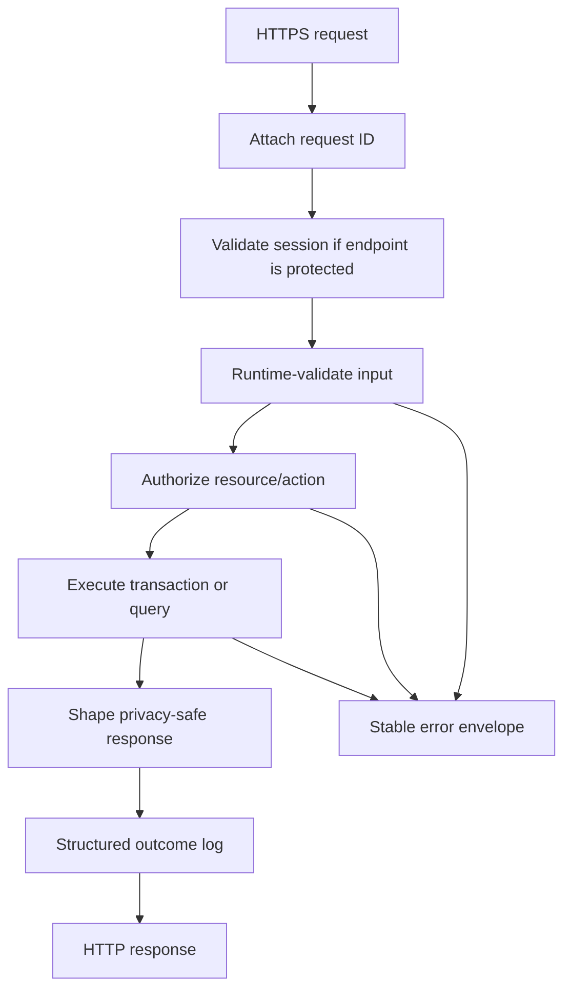

Every network input is runtime data, even when the client and server share TypeScript types. A malicious or outdated client can send anything.

## 9. Data ownership and trust boundaries

| Fact | System of record | May client decide it? | Cacheable? |
| --- | --- | --- | --- |
| Current map camera | Mobile memory | Yes | Local only |
| Manual discovery location | Device storage | Yes | Local only |
| Authentication identity | Supabase Auth | No | Session tokens only |
| Public profile | PostgreSQL | Request changes only | Carefully |
| Activity status and capacity | PostgreSQL | No | Reads may be briefly stale |
| Membership | PostgreSQL | No | UI may optimistically display pending state |
| Exact meeting point | Private PostgreSQL schema | No | Returned only in an accepted caller projection; never public-cacheable |
| Chat history | PostgreSQL | No | Paginated client cache |
| Online presence | Future ephemeral store | Heartbeat only | Yes, short TTL |

## 10. Failure design

| Failure | Required behavior |
| --- | --- |
| Location permission denied | Offer searchable manual selection and draggable pin. |
| Place provider unavailable | Keep map-pin selection usable and explain search failure. |
| SMS delayed or rejected | Preserve phone input, show retry timing, never claim verification. |
| Session expired | Refresh once; if invalid, return to phone auth while preserving safe protected intent. |
| Nearby API timeout | Keep the last labeled result if appropriate, show retry, do not invent live activities. |
| Duplicate Join retry | Idempotency returns the existing result. |
| Concurrent last-place joins | All capacity writers use one activity-row lock; the 2026-08-15 hosted B/C race returned exactly one accepted plus one waitlisted result at capacity. |
| Realtime disconnected | Persisted API remains authoritative; reconnect and refetch from a cursor. |
| Redis unavailable in the future | Lose ephemeral presence/rate-limit optimization gracefully; never lose memberships. |

## 11. Observability

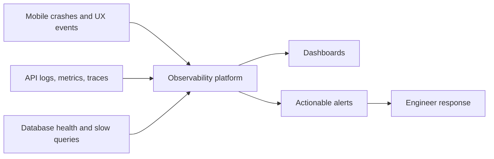

Logs describe discrete events, metrics aggregate numeric behavior over time, and traces connect work across components. Never put OTPs, tokens, raw phone numbers, private coordinates, or message bodies into routine logs.

## 12. Evolution by measured scale

### One neighborhood

- One mobile application.
- Supabase Auth and one PostgreSQL/PostGIS database.
- One API deployment.
- No Redis or custom WebSocket infrastructure.
- Seeded activities and hands-on operator support.

### One city

- Horizontally scale the stateless API if measured traffic requires it.
- Add database connection pooling and query/index monitoring.
- Add activity chat delivery and push notifications.
- Add shared provider cache/rate limiting where cost or abuse data requires it.
- Add moderation tooling and operational dashboards.

### Many cities

- Route discovery by geographic cells and monitor hot areas.
- Consider read replicas or cell caches for read-heavy discovery.
- Partition large time-bound tables only after query evidence.
- Run asynchronous notification/moderation work through a durable queue.
- Extract realtime or media processing only if its scaling/reliability profile differs materially.

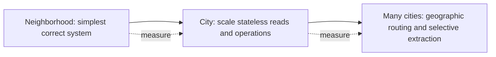

Scaling is a response to evidence. Adding Redis, queues, replicas, or microservices before a measured bottleneck increases failure modes without proving value.

## 13. What exists today

**Implemented in source:** Expo/React Native native app, TypeScript/runtime boundaries, native live-discovery map states, foreground permission flow, persisted manual location, searchable development geocoder, native development build, hosted phone/OTP, retryable session restoration, protected-intent modeling, profile onboarding, native Host form, Join feedback, My Plans states, participant Leave, and host request approval/rejection. Leave optimistically removes the plan so an exact point disappears immediately, invalidates older reads, restores the row on failure, and then refreshes server truth. Host decisions invalidate in-flight request reads, remove the decided request locally after success, and refetch both requests and Plans.

**Deployed to development:** versioned identity/profile, PostGIS activity, capacity-safe Join, Join hardening, caller-scoped My Plans, forward-only Plans privacy hardening, and migration `007` participation transitions; owner-only profile RLS; separate private meeting geometry; server-derived public geometry; atomic activity/host-membership creation; anonymous-safe nearby discovery; authenticated `join_activity` with per-activity row locking/natural-key idempotency; authenticated `my_plans` with accepted-plus-active exact-location release; and authenticated Leave/host-decision/request-queue RPCs. Anonymous discovery/direct-table/Join/Plans denial and authenticated Host/host-idempotency/accepted-host Plans Simulator paths are proven. The hosted A/B/C/D matrix additionally proves distinct-actor caller scoping, new-command denials, idempotent Join/Leave/approve/reject, exact-location gating, the concurrent final-place lock, atomic promotion, and oldest-created-at FIFO behavior.

**Hosted-verified:** on 2026-08-15, migration `007` Leave, host decision, FIFO promotion, host-scoped request projection, and the A/B/C/D black-box harness passed. On 2026-09-04, the full two-actor profile RLS matrix passed after one transient OTP HTTP 502; Auth health returned HTTP 200 and a deliberate retry verified trigger rows, anonymous denial, owner operations, cross-user isolation, protected operations, constraints, and cleanup.

**Simulator-verified on 2026-08-15:** the rebuilt iPhone 17 Pro app preserved a signed-out Plans intent through Actor C OTP and required profile onboarding, resumed Plans only after the profile became ready, rendered the accepted exact point, presented Leave confirmation, and optimistically removed the card/private point to an empty state after successful Leave. Host A approval was also accepted: the request disappeared and the attendance count refreshed from 1/2 to 2/2. Host Reject remains unaccepted in Simulator.

**Not yet verified or implemented:** Simulator acceptance for host Reject and pending/waitlisted/inactive locked-location cards; equal-timestamp FIFO tie-break runtime proof; participant removal; useful plan detail/directions; activity cancellation; real SMS delivery; realtime chat; moderation; MapLibre styling; custom avatar builder; payments; recommendations; direct messages; or recurring-event administration.
