# NearHere End-to-End System Design

Status: **living design**. Implemented pieces are called out explicitly; the rest is an evolution plan, not a production claim.

## 1. Start with requirements, not technology

System design is the process of translating product behavior and quality expectations into components, data, interfaces, and operational choices. The correct order is:

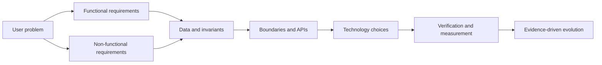

### Functional requirements

- Browse nearby activities without an account.
- Ask for foreground location; fall back to searchable manual selection when unavailable or denied.
- Authenticate with phone OTP before Join or Host.
- Create, view, join, request approval, leave, and cancel activities.
- Enforce capacity and waitlist/approval transitions correctly.
- Reveal only approximate public location; later reveal an operational meeting point only to authorized participants.
- Coordinate in activity-scoped chat after joining.
- Report, block, leave, and moderate unsafe behavior.

### Non-functional requirements

- **Privacy:** never publish precise live user location or return private coordinates to unauthorized clients.
- **Correctness:** concurrent joins must not exceed capacity; retries must not duplicate actions.
- **Reliability:** failures must produce retryable, understandable states rather than fabricated success.
- **Performance:** a nearby result should feel interactive on a normal mobile network; establish a measured target after the first real endpoint.
- **Security:** all client input is untrusted; authorization is server/database enforced.
- **Maintainability:** a small team can modify one domain without understanding the entire codebase.
- **Cost awareness:** introduce paid infrastructure only for a demonstrated requirement.
- **Accessibility:** controls, status, motion, color, and text remain understandable across supported devices.

## 2. Context and actors

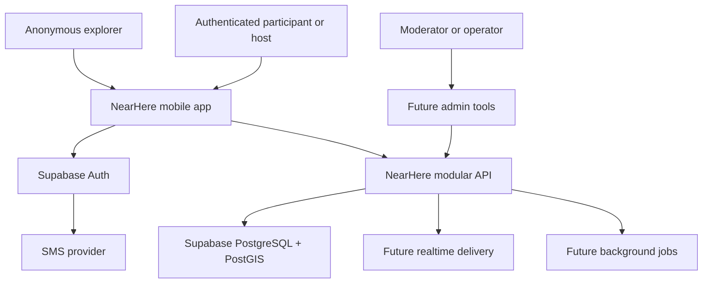

An actor is a person or external system interacting with NearHere. The diagram does not imply that every box exists today. The mobile app, location flow, typed auth client boundary, and local fixtures are implemented. A hosted Supabase project, database schema deployment, activity API, realtime service, jobs, and admin tools remain planned.

## 3. Initial architecture: a modular monolith

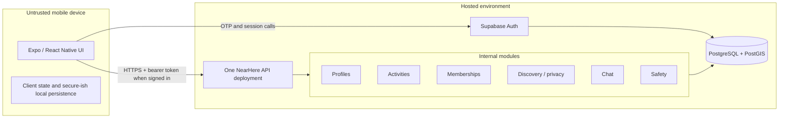

A monolith is one deployable server. A modular monolith preserves one deployment while enforcing internal module boundaries. This is suitable because:

- One small team needs fast changes and simple local debugging.
- Activities, memberships, geospatial discovery, and chat share transactional data.
- The current scale does not justify network boundaries between business modules.
- Extraction remains possible when measurements reveal an independently scaling or operationally isolated component.

Microservices would immediately add service discovery, network failures, distributed tracing, deployment coordination, contract versioning, and cross-service consistency. Those costs do not create user value at the current stage.

## 4. Identity and protected-intent flow

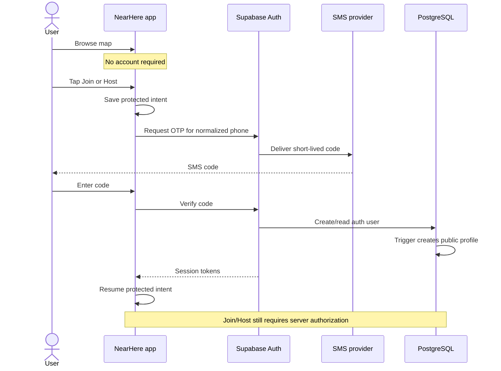

Authentication proves identity. Authorization decides whether that identity may perform an action. The app can display a signed-in state, but it cannot be trusted to approve its own join request.

## 5. Discovery and location privacy

Three coordinates serve different purposes:

1. **Discovery center:** the user's device or manually selected area used to ask “what is near here?” It stays local or is sent only as query input.
2. **Private activity point:** the host-entered operational coordinate. It must not appear in public API responses.
3. **Public activity point:** a server-derived approximate coordinate used for map discovery.

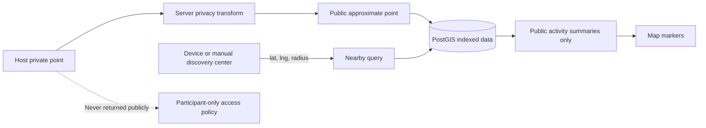

Moving a marker on the client is not privacy. If private data was sent to the phone, a modified client can inspect it. Privacy must be enforced at query and response boundaries.

## 6. Activity lifecycle and state machines

Explicit state machines prevent impossible or contradictory states.

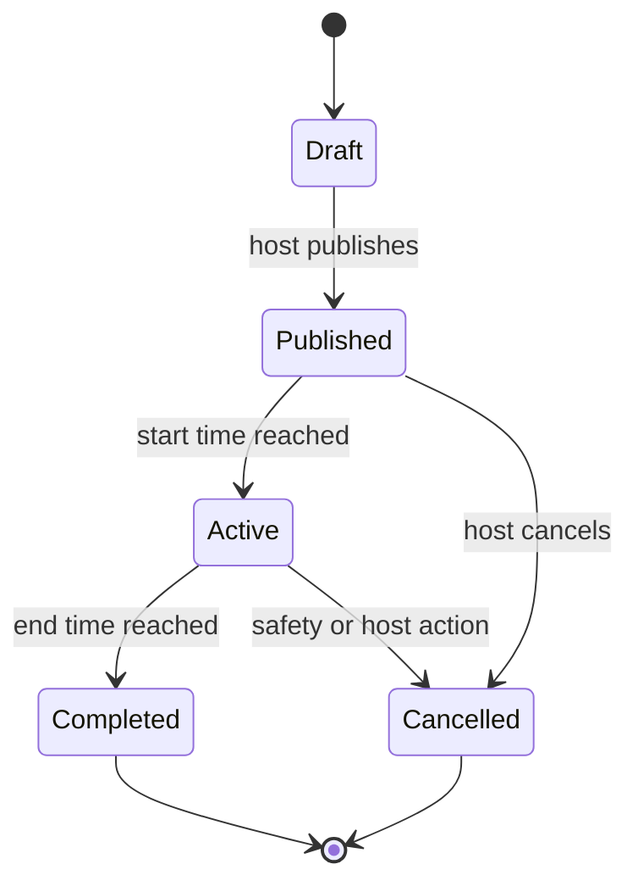

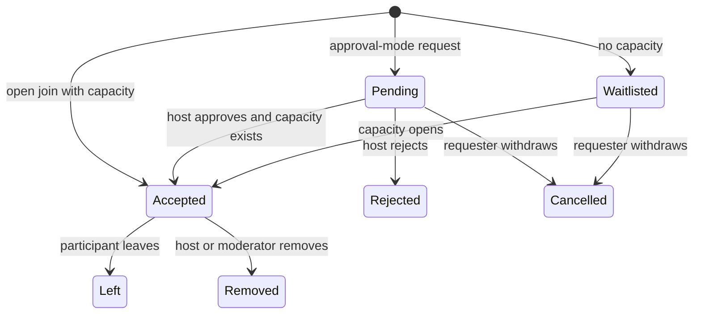

State transitions belong on the server inside database transactions. The client requests a transition; it does not write arbitrary status values.

## 7. Correct concurrent joining

Suppose one place remains and two phones join simultaneously. A read-then-write implementation can let both requests observe one open place and both accept. This is a race condition.

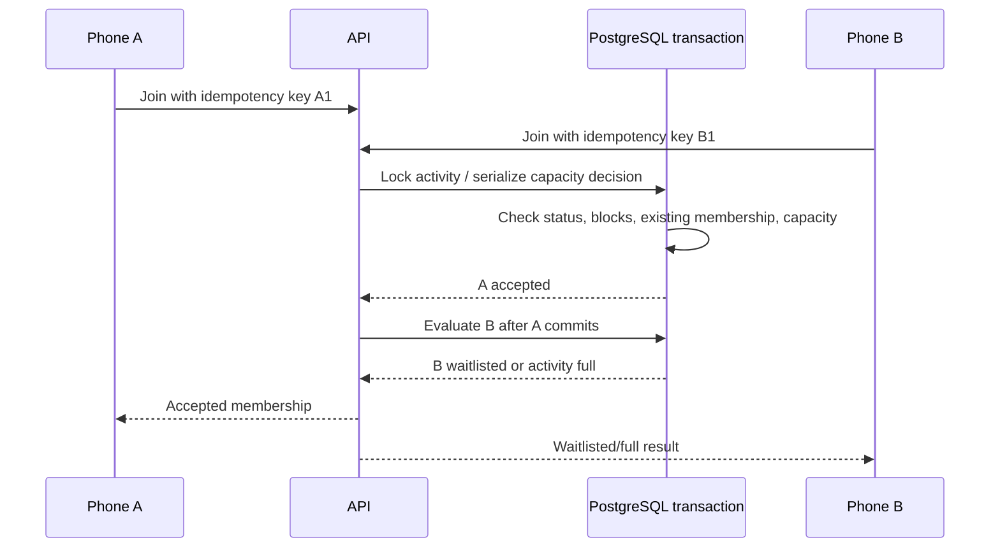

Required invariants:

- A user has at most one active membership per activity.
- Accepted participants never exceed the configured capacity.
- Reusing an idempotency key returns the same logical result.
- A cancelled, completed, or blocked activity cannot be joined.
- The host's membership and role cannot accidentally disappear through a normal leave operation.

## 8. API request lifecycle

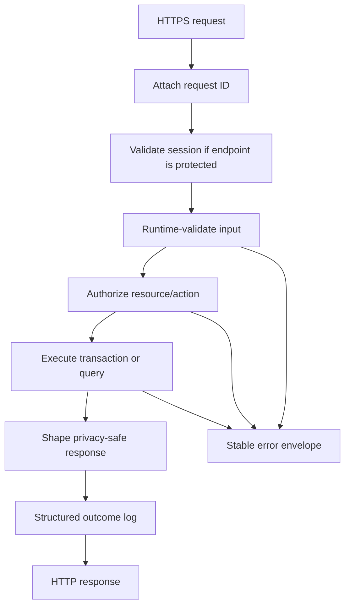

Every network input is runtime data, even when the client and server share TypeScript types. A malicious or outdated client can send anything.

## 9. Data ownership and trust boundaries

| Fact | System of record | May client decide it? | Cacheable? |
| --- | --- | --- | --- |
| Current map camera | Mobile memory | Yes | Local only |
| Manual discovery location | Device storage | Yes | Local only |
| Authentication identity | Supabase Auth | No | Session tokens only |
| Public profile | PostgreSQL | Request changes only | Carefully |
| Activity status and capacity | PostgreSQL | No | Reads may be briefly stale |
| Membership | PostgreSQL | No | UI may optimistically display pending state |
| Chat history | PostgreSQL | No | Paginated client cache |
| Online presence | Future ephemeral store | Heartbeat only | Yes, short TTL |

## 10. Failure design

| Failure | Required behavior |
| --- | --- |
| Location permission denied | Offer searchable manual selection and draggable pin. |
| Place provider unavailable | Keep map-pin selection usable and explain search failure. |
| SMS delayed or rejected | Preserve phone input, show retry timing, never claim verification. |
| Session expired | Refresh once; if invalid, return to phone auth while preserving safe protected intent. |
| Nearby API timeout | Keep the last labeled result if appropriate, show retry, do not invent live activities. |
| Duplicate Join retry | Idempotency returns the existing result. |
| Concurrent last-place joins | Transaction accepts at most one; the other is waitlisted/full. |
| Realtime disconnected | Persisted API remains authoritative; reconnect and refetch from a cursor. |
| Redis unavailable in the future | Lose ephemeral presence/rate-limit optimization gracefully; never lose memberships. |

## 11. Observability

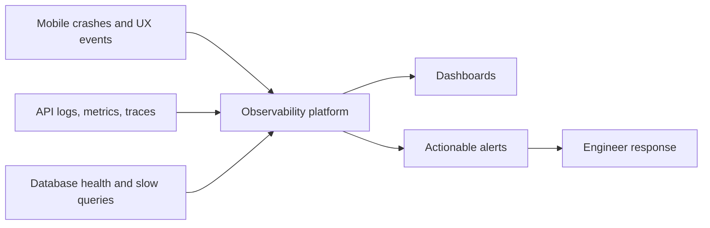

Logs describe discrete events, metrics aggregate numeric behavior over time, and traces connect work across components. Never put OTPs, tokens, raw phone numbers, private coordinates, or message bodies into routine logs.

## 12. Evolution by measured scale

### One neighborhood

- One mobile application.
- Supabase Auth and one PostgreSQL/PostGIS database.
- One API deployment.
- No Redis or custom WebSocket infrastructure.
- Seeded activities and hands-on operator support.

### One city

- Horizontally scale the stateless API if measured traffic requires it.
- Add database connection pooling and query/index monitoring.
- Add activity chat delivery and push notifications.
- Add shared provider cache/rate limiting where cost or abuse data requires it.
- Add moderation tooling and operational dashboards.

### Many cities

- Route discovery by geographic cells and monitor hot areas.
- Consider read replicas or cell caches for read-heavy discovery.
- Partition large time-bound tables only after query evidence.
- Run asynchronous notification/moderation work through a durable queue.
- Extract realtime or media processing only if its scaling/reliability profile differs materially.

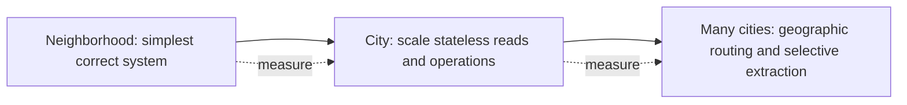

Scaling is a response to evidence. Adding Redis, queues, replicas, or microservices before a measured bottleneck increases failure modes without proving value.

## 13. What exists today

**Implemented:** Expo/React Native native app, TypeScript/runtime boundaries, native live-discovery map states, foreground permission flow, persisted manual location, searchable development geocoder, native development build, hosted phone/OTP, retryable session restoration, protected-intent modeling, profile onboarding, and a first native Host form.

**Deployed to development:** versioned identity/profile plus PostGIS activity migrations; owner-only profile RLS; separate private meeting geometry; server-derived public geometry; atomic activity/host-membership creation; and anonymous-safe nearby discovery. Remote migration history matches local history. Anonymous discovery, input rejection, and direct-table denial are proven; authenticated creation and two-actor profile tests remain pending.

**Not yet production functionality:** seeded live activity data, authenticated creation acceptance, activity detail/cancellation, transactional participant joins, real SMS delivery, realtime chat, moderation operations, MapLibre styling, custom avatar builder, payments, recommendations, direct messages, or recurring-event administration.
