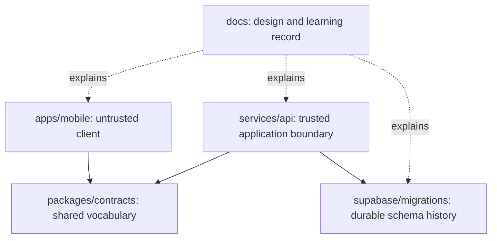
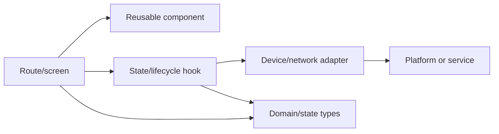
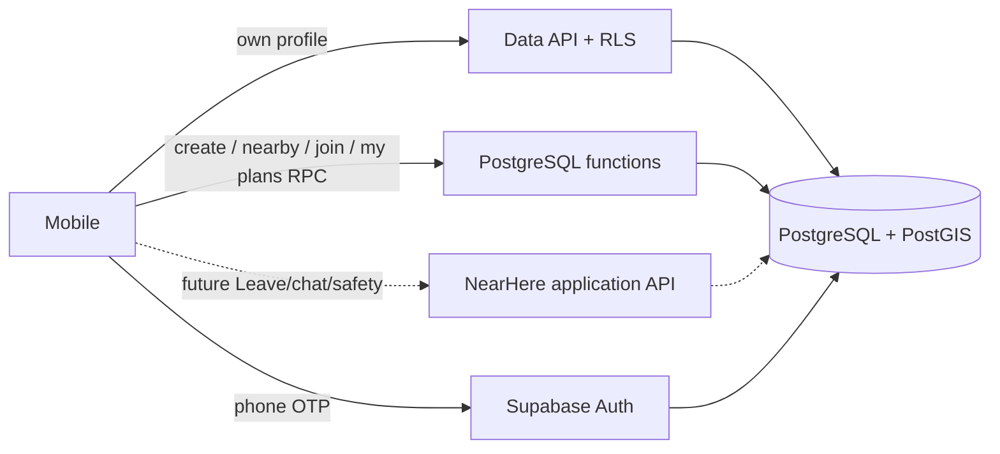
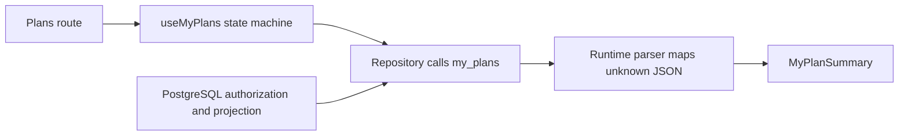
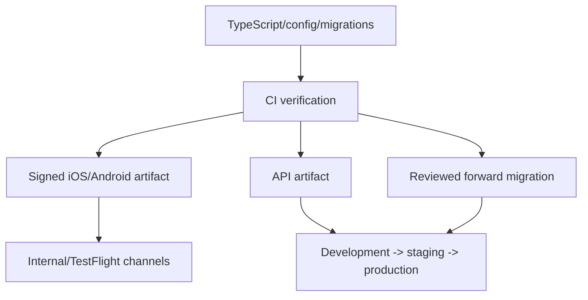

# NearHere Technical Architecture

This document records concrete technologies and responsibility boundaries. See [`system-design.md`](system-design.md) for the requirement-first explanation.

## 1. Technology stack

| Layer | Choice | Responsibility | Why now |
| --- | --- | --- | --- |
| Mobile | Expo SDK 54 + React Native | iOS/Android UI and native capabilities | Shared TypeScript with native rendering and managed tooling |
| Language | TypeScript | Compile-time application contracts | Makes domain/state mistakes visible during development |
| Navigation | Expo Router | File-based stacks, tabs, and modal routes | Typed routes and React Navigation lifecycle |
| Map | `react-native-maps` | Current native map rendering | Already integrated; supports product behavior before custom styling |
| Location | Expo Location | Foreground permission/device coordinate | Version-compatible platform abstraction |
| Local storage | AsyncStorage | Non-secret manual location and current Supabase session adapter | Simple persistent key/value boundary; security review remains for production tokens |
| Authentication | Supabase Auth | Phone OTP identity and sessions | Hosted auth boundary with React Native SDK |
| Database | Supabase PostgreSQL | Durable system of record | Transactions, constraints, relational queries, managed operations |
| Geospatial | PostGIS | Geographic types, indexes, and distance queries | Correct spatial operations inside PostgreSQL |
| Current backend transport | Supabase Data API + PostgreSQL RPC | Owner profile operations and trusted activity create/discover/join/plans boundaries | Uses deployed security/transaction boundaries without another runtime |
| Future application API | TypeScript modular monolith, framework TBD | Complex participation, safety, stable errors, observability | Add when an application process owns a concrete requirement |
| Realtime | Managed capability first, later | Chat/activity event freshness | No custom WebSocket infrastructure until required |
| Cache/ephemeral | None initially; Redis later if measured | Rate limits, presence, or hot read cache | Avoid an unnecessary second data system |

## 2. Repository boundaries

Shared TypeScript contracts improve developer alignment, but the API must still runtime-validate JSON. Database constraints and authorization remain authoritative.

## 3. Client architecture

- Routes compose behavior and navigation; they should not contain every implementation detail.
- Components render reusable UI from props.
- Hooks own React state transitions and lifecycle synchronization.
- Adapters isolate AsyncStorage, Supabase, geocoding, and future API calls.
- Types describe domain vocabulary; runtime guards validate storage and network data.

## 4. Backend responsibility split

The mobile app calls Supabase Auth directly, reads/updates only its own simple profile row, and calls narrowly shaped database functions for activity creation, discovery, Join, and Plans. Direct profile access is safe because grants, owner-only RLS, and constraints express the whole rule. Multi-table creation is atomic, Join serializes the capacity decision by locking one activity row, and `my_plans` creates a caller-scoped read model whose exact-location release also requires a published, not-ended activity. Future Leave/approval commands must preserve equally explicit state-transition, authorization, and idempotency rules.

Direct client-to-table access is acceptable only when Row Level Security expresses the complete rule clearly. Complex transitions such as capacity-limited joining should use one transactional server/database operation rather than several client writes.

The Plans client keeps UI, transport, validation, and authorization separate:

`useMyPlans` distinguishes signed-out, loading, ready, and error states, refreshes on tab focus, retains previous rows during a refresh/error, and uses a monotonically increasing request ID so a stale response cannot overwrite a newer one. Cached rows are stored with the user ID that authorized them, and the hook synchronously gates rendering on that ID; this prevents account B from painting account A's exact coordinate for one frame while React's session-change effect is still pending. These are client reliability/privacy behaviors; the RPC remains authoritative for which rows and coordinates the caller may receive.

The Auth modal disables swipe-to-dismiss because an OS gesture cannot reliably run NearHere's protected-intent cleanup. Its explicit close control clears the intent and then navigates back; the verification screen navigates back to that phone screen. This prevents a cancelled Plans/Join/Host sign-in from unexpectedly resuming later.

## 5. Security model

- The app contains only the Supabase URL and publishable key; both are public configuration.
- A service-role key exists only in protected server/operations environments.
- `auth.users` owns phone identity. `public.profiles` contains public-safe application identity only.
- Every exposed table enables Row Level Security and grants only required operations.
- API endpoints validate the session, input shape, resource authorization, and business invariants independently.
- Public responses omit private geometry instead of relying on UI hiding.
- Logs redact credentials, phone numbers, private coordinates, and user content.

## 6. Location and map providers

The current iOS renderer uses Apple MapKit through `react-native-maps`. Manual search uses an explicit-submit Nominatim adapter for low-volume development, with runtime validation, attribution, a 1.1-second limiter, and a 20-query in-memory cache.

The public Nominatim service is not the production SLA. Production search should run behind a NearHere provider adapter with contracted quota, privacy terms, rate controls, shared cache, and observability.

MapLibre remains the preferred path for a distinctive custom vector style. The native development-build foundation already exists, so migration is no longer blocked by Expo Go; it is deferred to avoid mixing renderer migration with core product correctness.

## 7. Build and deployment boundaries

Native binaries, API deployments, and database migrations have independent rollback properties. Database migrations should be backward compatible whenever an older mobile binary may still be active.

## 8. Current dependency choices deliberately deferred

- **Redis:** useful later for distributed rate limiting, short-lived presence, or hot-cell caching; not authoritative data.
- **Custom WebSockets:** useful only when managed realtime cannot meet ordering, fan-out, connection, or cost requirements.
- **Continuous presence:** an ephemeral “currently active in this activity” signal, not continuous GPS tracking; not needed now.
- **Object storage/avatar pipeline:** introduced when the avatar design chooses generated configuration versus uploaded assets.
- **Queues/workers:** introduced for push notifications, moderation, cleanup, and analytics tasks that should not delay requests.

## 9. Architecture decision rule

Add infrastructure only when a named requirement, measured bottleneck, security boundary, or operational need justifies its cost. Record the decision, alternative, expected measurement, failure mode, and reversal plan.
