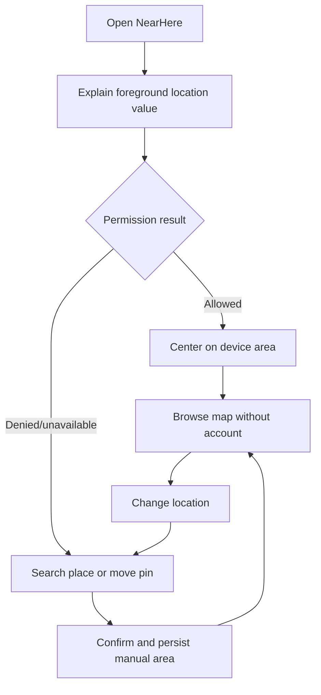
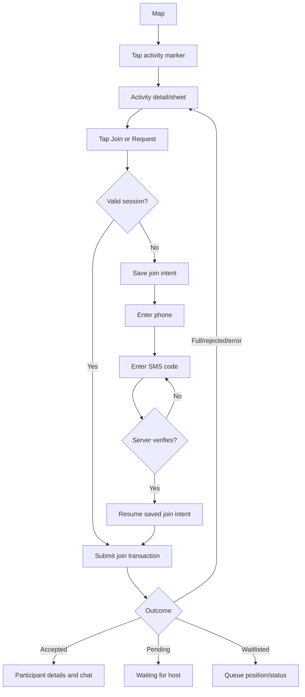
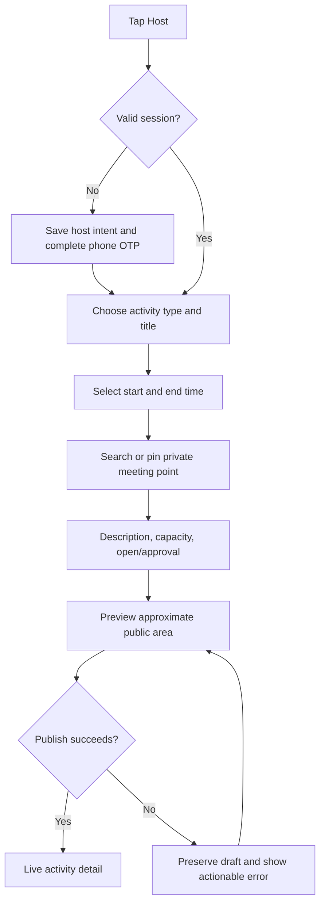
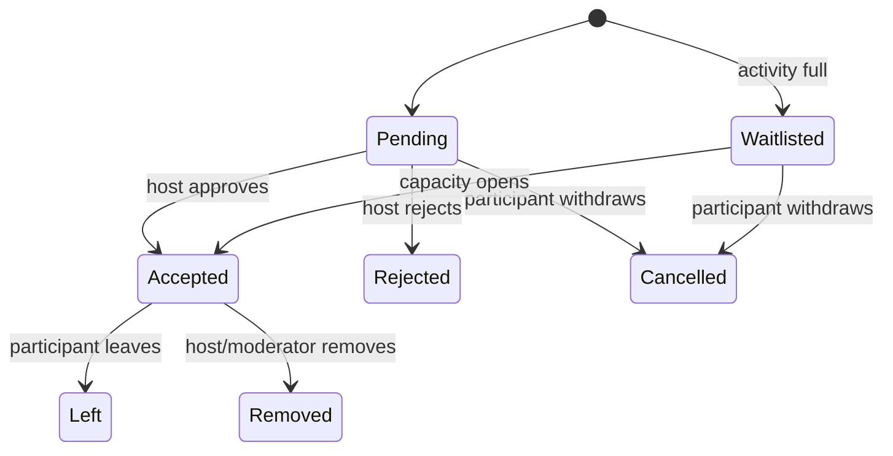
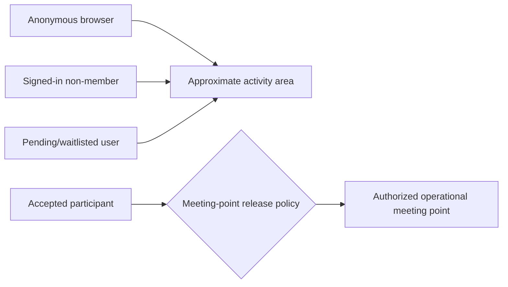

# NearHere UX Flows

These flows describe user-visible states and transitions. They are not screen lists: one screen may represent several states, and a transition may call multiple systems.

## 1. Browse-first entry

Location denial is not an onboarding dead end. The user retains product access, and the app asks only for foreground—not continuous background—permission.

## 2. Discovery to protected Join

Authentication success is not Join success. The server still evaluates activity status, capacity, duplicate membership, blocks, and join mode.

## 3. Host creation

## 4. Approval and waitlist

## 5. Location visibility

The release policy remains a product/safety decision. The implementation must enforce it on the server; hiding a field in the UI is insufficient.

## 6. Required interface states

| Surface | States |
| --- | --- |
| Location | explaining, requesting, ready, denied, unavailable, manual-searching, search-empty, search-error, saving |
| Authentication | restoring, signed-out, sending-code, awaiting-code, verifying, signed-in, recoverable-error |
| Discovery | initial-loading, results, empty, refreshing, stale-with-error, unavailable |
| Activity | published, active, completed, cancelled; open, pending, accepted, waitlisted, full, rejected |
| Write action | idle, submitting, succeeded, retryable-failure, non-retryable-failure |
| Chat | loading-history, ready, sending, send-failed, reconnecting, unauthorized |

Every asynchronous control must prevent accidental duplicate submission while still permitting an intentional retry.

## 7. Accessibility and recovery rules

- Do not communicate status only through color or motion.
- Use explicit control labels and minimum touch targets.
- Preserve entered data after recoverable network failures.
- Announce important status changes to assistive technology.
- Respect reduced-motion preferences.
- Never show a success state until the authoritative system confirms success.
- Provide a safe route back from permission, authentication, and network failures.
