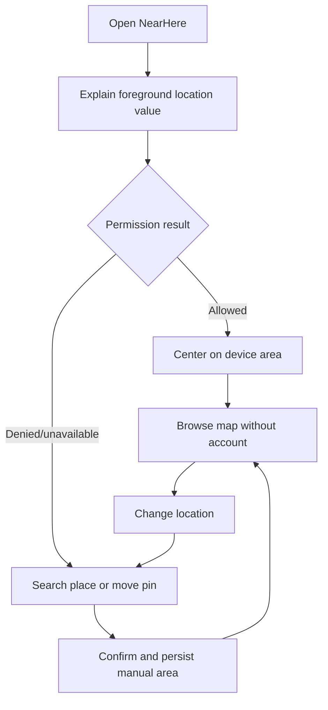
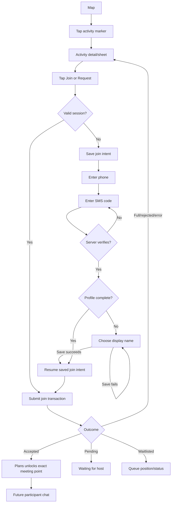
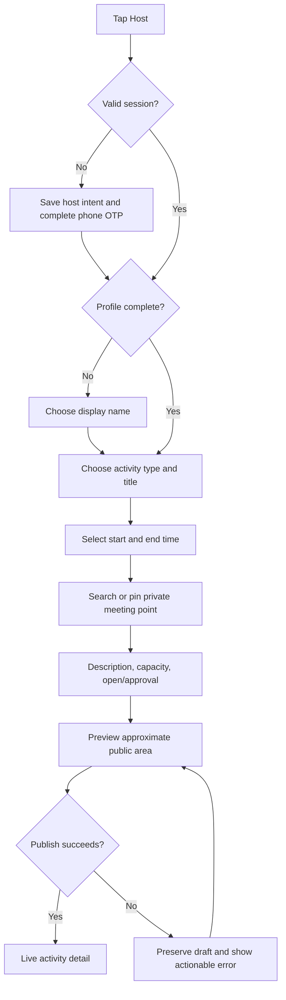
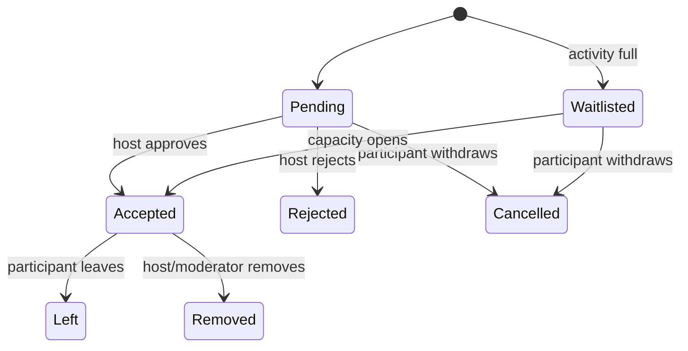
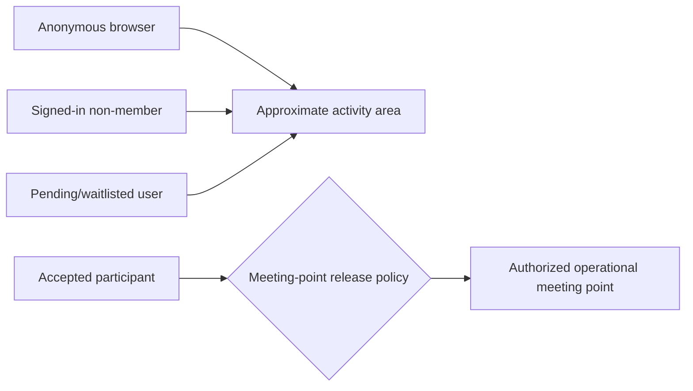
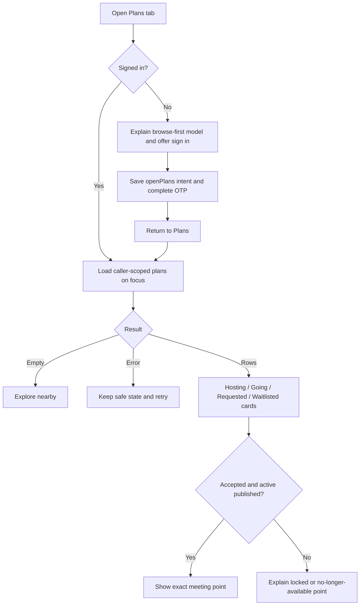

# NearHere UX Flows

These flows describe user-visible states and transitions. They are not screen lists: one screen may represent several states, and a transition may call multiple systems.

## 1. Browse-first entry

Location denial is not an onboarding dead end. The user retains product access, and the app asks only for foreground—not continuous background—permission.

## 2. Discovery to protected Join

Authentication success is not onboarding success, and onboarding success is not Join success. Authentication proves identity; profile completion supplies the minimum application identity; the deployed Join transaction then evaluates availability, existing membership, capacity, and join mode. Activity chat now applies the deployed block predicate; discovery and participant projections still need the same block-aware integration.

Current result semantics are explicit: an open activity returns `accepted` while capacity remains and `waitlisted` when full; an approval activity returns `pending`; an existing active membership is returned unchanged on retry. The 2026-08-15 hosted A/B/C/D run verified all participation outcomes through the RPC boundary. The rebuilt iPhone 17 Pro Simulator accepted the Actor C Auth/onboarding/Leave flow and Host A approval flow. Pending/waitlisted participant cards and host Reject still need Simulator acceptance.

## 3. Host creation

The first Host form and transactional creation operation now exist. The current form uses the selected discovery coordinate as the private meeting point and offers bounded start presets; richer place/time editing and the public-area preview remain planned. The diagram describes the intended complete UX, while the backlog records which steps are accepted end to end.

## 4. Approval and waitlist

## 5. Location visibility

The deployed release policy requires `membership.status = accepted`, `activity.status = published`, and `ends_at > now()`. `my_plans` enforces it inside PostgreSQL: only accepted members of active published activities receive exact coordinates; pending, waitlisted, cancelled, completed, and ended cases receive `null`. Hiding a field in the UI would be insufficient because a modified client can inspect any data already received.

## 6. My Plans

The signed-out state preserves an `openPlans` protected intent before routing to phone Auth. The Auth modal cannot be dismissed by a swipe that bypasses cleanup; the explicit close action clears the pending intent. The signed-in hook refreshes whenever the tab gains focus. During refresh or recoverable failure it can retain previously loaded rows rather than blanking the whole screen, but cached rows are keyed/gated by user ID so one account's private point cannot flash for another account. The current card displays type, membership/host status, time, accepted count/capacity, host, and either the exact coordinate or explicit locked/no-longer-available copy. Cancelled and ended cards suppress the exact point and use `Cancelled`/`Ended` status labels.

Verified in Simulator: the signed-in host saw the real hosted activity and unlocked exact meeting point. Actor C completed phone OTP/onboarding/resume, saw the accepted exact point, and confirmed Leave to remove the card/private point. Host A then opened Plans for `TEST UI HOST REQUEST`, saw a Join requests count of one for `Test Participant C`, and tapped Accept. The request section disappeared, the activity count changed from `1/2` to `2/2`, and the host's private meeting point remained displayed. This accepts the approval UI and coordinated request/Plans refresh; it does not accept Reject or pending/waitlisted participant cards.

## 7. Required interface states

| Surface | States |
| --- | --- |
| Location | explaining, requesting, ready, denied, unavailable, manual-searching, search-empty, search-error, saving |
| Authentication | restoring, signed-out, sending-code, awaiting-code, verifying, signed-in, recoverable-error |
| Discovery | initial-loading, results, empty, refreshing, stale-with-error, unavailable |
| Activity | published, active, completed, cancelled; open, pending, accepted, waitlisted, full, rejected |
| Plans | signed-out, initial-loading, empty, refreshing-with-rows, error-with/without-rows, populated; exact-location locked/unlocked |
| Write action | idle, submitting, succeeded, retryable-failure, non-retryable-failure |
| Chat | loading-history, ready, sending, send-failed, reconnecting, unauthorized |

Every asynchronous control must prevent accidental duplicate submission while still permitting an intentional retry.

## 8. Accessibility and recovery rules

- Do not communicate status only through color or motion.
- Use explicit control labels and minimum touch targets.
- Preserve entered data after recoverable network failures.
- Announce important status changes to assistive technology.
- Respect reduced-motion preferences.
- Never show a success state until the authoritative system confirms success.
- Provide a safe route back from permission, authentication, and network failures.
