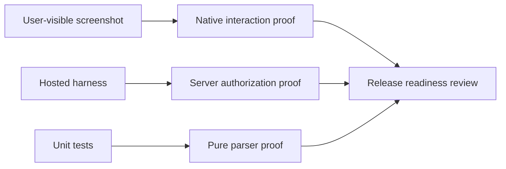

# NearHere Visual Evidence and Screenshot Log

Screenshots are part of the engineering record. They prove what a user sees;
hosted tests prove what the backend permits. Neither replaces the other.

## Evidence matrix

| ID | State to capture | Why it matters | Status |
| --- | --- | --- | --- |
| V01 | Browse with location permission prompt | Native permission boundary | Capture in Simulator |
| V02 | Manual neighborhood search | Fallback when permission is denied | Capture in Simulator |
| V03 | Nearby activity map/list | Discovery and approximate geometry | Capture in Simulator |
| V04 | Activity Detail while anonymous | Public projection without private point | Capture in Simulator |
| V05 | Pending request | Exact point remains locked | Capture in Simulator |
| V06 | Accepted participant | Exact point and chat unlock | Capture in Simulator |
| V07 | Host participant moderation | Host-only controls are visible | Capture in Simulator |
| V08 | Chat with message and composer | Durable coordination UI | Capture in Simulator |
| V09 | Cancelled/ended activity | Exact point remains redacted | Capture in Simulator |
| V10 | Plans after leaving | Stale private data disappears | Capture in Simulator |
| V11 | Block host confirmation and refreshed detail | Private access changes without silent membership deletion | Capture in Simulator |
| V12 | Operator route as ordinary user | Database-backed access denial is visible and safe | Capture in Simulator |
| V13 | Activity Detail with Reduce Motion enabled | Same actions and information without decorative motion | Capture in Simulator |

## Screenshot procedure

1. Start the iOS Simulator using [`ios-simulator-workflow.md`](ios-simulator-workflow.md).
2. Use the fixed development OTP only in the local development environment.
3. Set a simulated location near the development neighborhood.
4. Navigate to the exact state in the evidence matrix.
5. Capture with Xcode Simulator: **Device → Screenshot**.
6. Store screenshots outside source code until we choose a reviewed asset
   directory. Do not commit screenshots containing phone numbers, OTPs, access
   tokens, exact private coordinates, or personal data.
7. Record the date, app commit, simulator model, and state in the table below.

## Evidence record template

```text
Evidence ID: V08
Commit: <git commit>
Simulator: <model and iOS version>
Actor state: <anonymous/pending/accepted/host>
Expected: <what should be visible>
Observed: <what was visible>
Result: PASS / FAIL
Notes: <privacy, accessibility, or layout observation>
```

## Captured evidence


`V00-launch.png` shows the native map shell, selected-area control, discovery
filters, empty state, and tab navigation on an iPhone 17 Pro Simulator. It is
safe for documentation because it contains no account, OTP, token, or private
meeting-point data.


`V12-operator-denied.png` shows the rebuilt operator route for an ordinary
authenticated development user. The visible “Operator access is required”
state is an intentional security acceptance: the route exists, the client
handles the denial, and PostgreSQL remains the authority.

## Diagram: evidence boundaries



Until the Simulator captures are recorded, documentation must say “hosted
verified” rather than “fully accepted.” That distinction is intentional and
important for an honest resume.

Physical-device evidence is still open. Simulator screenshots prove layout and
navigation, but not GPS behavior, SMS delivery, camera/audio hardware,
accessibility on a real screen, thermal performance, or TestFlight signing.
