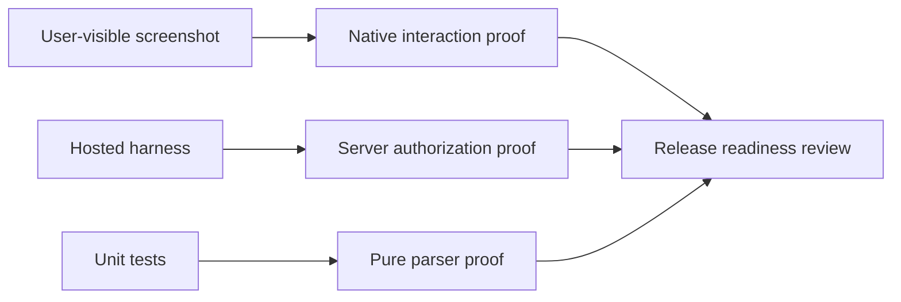

# NearHere Visual Evidence and Screenshot Log

## 24 September 2026 — denied location and manual search

V27: [Permission denied with manual area retained](screenshots/location-denied-manual-area-simulator-20260924.png),
iPhone 17 Pro Simulator, iOS 26.5. Permission was revoked only for the
Simulator app; “Center on my location” showed Settings/Choose area. Searching a
public neighborhood landmark returned a result; selecting it and pressing Use
this area persisted that area locally. A retry while denied preserved the
manual region and removed the blue device-location marker. The prior permission
and Near you state were restored. No exact meeting point, user phone or OTP is
shown. This does not stand in for the user's physical iPhone or services-off,
fresh-prompt and no-fix testing.

## 24 September 2026 — keyboard-safe auth actions

V26: [Phone entry with keyboard open](screenshots/auth-phone-keyboard-simulator-20260924.png)
and [OTP entry with keyboard open](screenshots/auth-otp-keyboard-simulator-20260924.png),
iPhone 17 Pro Simulator, iOS 26.5. The verification action and explicit Done
remain visible above the number pad. This direct-route test intentionally had no
pending phone, so Verify was disabled; it proves layout only, not a complete OTP
authentication. The Phone screenshot shows the submit action and Done above the
number pad while the default country prefix is still present. Phone-field
interaction was additionally tested: Send was
tappable while the keypad was open, invalid `+91` produced local validation,
and Done returned to the normal footer without sending an SMS.

P04 implementation detail: both auth forms track native keyboard frame events;
the iOS action row is pinned above the measured keyboard, while the scroll
content gains temporary bottom space and scrolls to keep the focused field
visible. Android still uses its platform resize behavior and needs separate
Simulator/device acceptance. No real phone or OTP is in this screenshot.

## 24 September 2026 — map gestures

V25: [Direct avatar selection](screenshots/map-avatar-marker-selected-simulator-20260924.png)
and [selection cleared by tapping the map](screenshots/map-avatar-marker-cleared-simulator-20260924.png),
iPhone 17 Pro Simulator, iOS 26.5, development fixtures. Direct avatar tap opened
the selected activity card; tapping empty map dismissed it. A cluster tap zoomed
to its members and retained enough bottom camera padding for the selection UI.
The captured map/card shows public activity context only, not an exact meeting
point. This verifies Simulator gestures, not large-data performance, VoiceOver
target quality or physical-device behavior.

An earlier local Plans capture showed the exact point of a fictional test
activity; it has been deleted and is excluded from public evidence. Profile,
Detail's top section and map captures are the privacy-safe avatar references.

## 24 September 2026 — audit correction evidence

V24: [Profile with actual upcoming plans](screenshots/night-arcade-profile-plans-audit-20260924.png),
iPhone 17 Pro Simulator, iOS 26.5, fictional Chat Harness B, Metro-updated source
on baseline `07999f0` plus local audit changes. Real Requested/Hosting summaries
rendered; no exact point exposed. This is not a screenshot of the generated
concept, a signed release or physical-device evidence. Scroll/large-text
acceptance remains open even though the screen now uses ScrollView.

The same session verified the corrected date sheet's Date/Time/Done accessibility
targets and native wheel exposure. Switching tabs and dismissing worked; changing
the native wheel value did not succeed through automation. Do not promote that
partial result to complete date-selection acceptance.

V25: [Direct avatar selection](screenshots/map-avatar-marker-selected-simulator-20260924.png)
and [selection cleared by tapping the map](screenshots/map-avatar-marker-cleared-simulator-20260924.png),
iPhone 17 Pro Simulator, iOS 26.5, development fixtures. Direct avatar tap opened
the selected activity card; tapping empty map dismissed it. A cluster tap zoomed
to its members and retained enough bottom camera padding for the selection UI.
The captured map/card shows public activity context only, not an exact meeting
point. This verifies Simulator gestures, not 60 fps, large-data performance,
VoiceOver target quality or physical-device behavior.

An earlier local Plans capture displayed a private test meeting point. It is
deliberately excluded from this evidence log and must not be copied into a
recruiter/public evidence set. Profile, Detail (top section), and map captures
are the privacy-safe current avatar parity references.

## 23 September 2026 - Simulator design iteration evidence

Three generated map/profile proposals are in `design-concepts/`. They establish
art direction only; invented dates, totals, names and geographic detail are not
runtime evidence. See [the concept review](design-concepts/design-review.md).
The first populated Night Arcade map implementation capture is now recorded as
V14 below. It documents a development Simulator state, not a physical-device or
release acceptance.

Screenshots are part of the engineering record. They prove what a user sees;
hosted tests prove what the backend permits. Neither replaces the other.

## Evidence matrix

| ID | State to capture | Why it matters | Status |
| --- | --- | --- | --- |
| V01 | Browse with location permission prompt | Native permission boundary | Capture in Simulator |
| V02 | Manual neighborhood search | Fallback when permission is denied | Capture in Simulator |
| V03 | Nearby activity map/list | Discovery and approximate geometry | Partial: V14 map smoke; full matrix open |
| V04 | Activity Detail while anonymous | Public projection without private point | Capture in Simulator |
| V05 | Pending request | Exact point remains locked | Capture in Simulator |
| V06 | Accepted participant | Exact point and chat unlock | Capture in Simulator |
| V07 | Host participant moderation | Host-only controls are visible | Capture in Simulator |
| V08 | Chat with message and composer | Durable coordination UI | Capture in Simulator |
| V09 | Cancelled/ended activity | Exact point remains redacted | Capture in Simulator |
| V10 | Plans after leaving | Stale private data disappears | Capture in Simulator |
| V11 | Block host confirmation and refreshed detail | Private access changes without silent membership deletion | Capture in Simulator |
| V12 | Operator route as ordinary user | Database-backed access denial is visible and safe | Capture in Simulator |
| V13 | Activity Detail with Reduce Motion enabled | Same actions and information without decorative motion | Capture in Simulator |
| V14 | Populated Night Arcade MapLibre map | Real map tiles, fixture clusters, host sprites, recenter, Browse dock | Captured; map-marker tap and cluster expansion separately tapped |
| V15 | NearHere-authored map style | The custom vector style renders over Bellandur fixtures | Captured; render only |
| V16 | Attribution affordance and populated custom map | Visible credit line; native MapLibre attribution panel opened | Captured; credit button tap verified; map marker/cluster taps remain open |
| V17 | Native attribution panel | MapLibre Native, OpenFreeMap, OpenMapTiles and OpenStreetMap labels | Captured after tapping V16's accessible credit control |
| V18 | Browse Coffee filter | Two matching activity rows from preserved development fixtures | Captured; filter, row-to-map selection and Activity Detail navigation observed |
| V19 | Profile editor | Six character presets, selected character, display name, Save/Cancel | Captured; inspected without saving changes |
| V20 | Host creation form | Activity types, quick/custom time, private point, capacity, joining mode | Captured; no activity published |
| V21 | Custom start date/time modal | Date and Time tabs with native date wheel | Captured; modal opened; native wheel/tab interaction not separately verified |
| V22 | Center on current location | Simulator map recenters and shows the blue device-location dot | Tap verified in Simulator only; physical “location unavailable” report remains open |
| V23 | Selected activity avatar | Larger selected full-body marker and selection halo over the map | Render verified after live reload; selection entered through Browse, not by tapping the marker |
| V24 | Host private point empty state | Discovery center no longer counts as a chosen exact meeting point | Captured; missing-point validation also shown before any create call; no fixture changed |
| V25 | Map gestures | Direct avatar tap, cluster expansion and empty-map deselection | Verified in Simulator; 12/50/200 performance and device parity remain open |
| V28 | Host searched meeting point | Selected public landmark returns to Host; address preview is limited to two lines | Captured; Host closed without publishing; no fixture changed |
| V29 | Host quick start — Tomorrow | Tomorrow selected; visible local start date advances to the next day | Captured in Simulator; all three presets visually selected; no activity published |

## Screenshot procedure

1. Start the iOS Simulator using [`ios-simulator-workflow.md`](ios-simulator-workflow.md).
2. Use the fixed development OTP only in the local development environment.
3. Set a simulated location near the development neighborhood.
4. Navigate to the exact state in the evidence matrix.
5. Capture with Xcode Simulator: **Device → Screenshot**.
6. Store approved, fictional-data evidence in `docs/screenshots/`. Never store
   phone numbers, OTPs, access tokens, exact private coordinates, or personal
   data in the repository.
7. Record the date, source revision plus uncommitted status, simulator model,
   actor, state, expected result, and observed result below.

## Evidence record template

```text
Evidence ID: V08
Commit: <git commit>
Simulator: <model and iOS version>
Actor state: <anonymous/pending/accepted/host>
Expected: <what should be visible>
Observed: <what was visible>
Result: PASS / FAIL
Notes: <privacy, accessibility, or layout observation>
```

## Captured evidence


`V00-launch.png` shows the native map shell, selected-area control, discovery
filters, empty state, and tab navigation on an iPhone 17 Pro Simulator. It is
safe for documentation because it contains no account, OTP, token, or private
meeting-point data.


`V12-operator-denied.png` shows the rebuilt operator route for an ordinary
authenticated development user. The visible “Operator access is required”
state is an intentional security acceptance: the route exists, the client
handles the denial, and PostgreSQL remains the authority.


`night-arcade-maplibre-simulator-20260923.png` was captured 23 September 2026
on iPhone 17 Pro Simulator, iOS 26.5. The screen shows the dark MapLibre street
map, four activity clusters, two individually rendered host characters, the
device's blue location point, the privacy explanation, and the 13-activity
Browse entry. The data is the fictional Bellandur development fixture set.
Selecting a character showed its activity preview; selecting a cluster zoomed
into its members. This was captured with working-tree changes on branch
`leda/initial-product-foundation`, so it is evidence for the current Simulator
iteration, not a signed release build or physical iPhone test.

**Style version boundary:** V14 was captured before
`nearhere-night-arcade-v1.json` replaced the hosted `dark` style URL. It proves
marker art, clusters, selection and the earlier MapLibre map only; do not use it
as a visual screenshot of the new NearHere-authored land/road/water palette.
The JSON passes the MapLibre Style Specification validator. V15 below is the
first fresh Simulator rendering for that style; interaction checks still need
to be repeated on this map version.


V15 was captured from the booted iPhone 17 Pro Simulator on 24 September 2026
after a fresh app launch. It shows the new local 13-layer style rendering over
Bellandur's fictional development activity data: subdued neighborhood blocks,
roads/building footprints, dark blue-green lake, parks, place labels, character
markers and count clusters. The screenshot was captured with `simctl` because
macOS was locked and computer-use interaction was unavailable. It proves a
rendered map, not marker tap, cluster expansion, the private pickers, or the
other Night Arcade screens. The 13 fixture activities were left intact.

After V15, a small app-owned visible attribution line was added beneath the
privacy note, with an accessible button that opens MapLibre's full attribution
panel. V15 predates that overlay. V16 below is the fresh post-change Simulator
capture. During the same live session, tapping the accessible credit control
opened MapLibre Native's attribution panel, which visibly listed OpenFreeMap,
OpenMapTiles, and OpenStreetMap. This verifies the new control and credits, not
marker selection or cluster expansion.


V16 was captured from the iPhone 17 Pro Simulator on 24 September 2026 after
dismissing the attribution panel. It shows the authored map, activity markers
and clusters, location dot, privacy note, always-visible provider credit, and
the existing 12-activity Browse sheet. The attribution panel was separately
opened and checked in the Simulator accessibility tree. The displayed cluster
counts (2, 4 and 3) and the existing activities were left untouched. Simulator
accessibility did not expose MapLibre's marker/cluster overlays; direct
coordinate taps returned a Simulator automation `noWindowsAvailable` error, so
interaction on the authored style remains unverified. Do not infer a tap from
the visible screenshot.


V17 captures the panel opened from the app-owned credit control. Together, V16
and V17 show both the discoverable entry point and the provider/data credits
that it reveals.


V18 records the Coffee filter in Browse. Live Simulator accessibility evidence
showed the All view loading 12 demo activities, then the Coffee filter
returning two. Selecting “Demo · Chai after work” closed the sheet, centered
the map and showed its preview; “View activity” opened the detail screen. The
fixtures were not edited. This list is also the reliable accessible route to
an activity when a rendered MapLibre feature is not exposed to screen-reader
automation.


V19 shows the profile editor's six full-body character presets, selected state,
display-name field and Save/Cancel actions. We inspected it but cancelled
without saving, so this is visual UI evidence only—not proof that a new choice
persists after app relaunch.


V20/V21 record the host draft and custom start picker. The Simulator tree
exposed the six activity categories, 30 min / 1 hour / Tomorrow presets, custom
date/time entry, private meeting-point picker, capacity and join-mode controls.
The custom modal visibly offered Date and Time tabs and a native date wheel.
The native wheel itself was not exposed as an accessibility control, so this is
evidence that the selector opens and is styled—not acceptance of selecting and
saving an arbitrary time. We closed both screens without publishing; the demo
activity collection remained unchanged.


V22 follows a tap on “Center map on my location.” The Simulator showed the blue
device-location dot and recentered the map without an unavailable-location
notice. This establishes that the current Simulator's granted-location path
worked at this moment. It does not settle the user's earlier physical-iPhone
report, test permission denial, or prove GPS accuracy on a real device.


V23 records the selected “Demo · Chai after work” character after the map-symbol
size hierarchy change. Ordinary markers use size 0.11; the selected activity
uses 0.15 and the existing lime selection halo. The map opened this state from
Browse's accessible activity row, not from a direct marker tap. It verifies
runtime rendering and selected-state feedback, but marker hit-testing remains
open. The underlying Coffee fixtures remain unchanged.

At the end of the 23 September code iteration, the profile-editor, Plans,
Host-create, Activity Detail and location-picker dark-theme changes had no
visual evidence because the Mac was locked. The later 24 September Simulator
session partially reviewed profile editor (V19), Host form/date-time (V20/V21),
Plans privacy and Activity Detail in memory. Plans/Detail screenshots were
intentionally not saved because they displayed a precise private test point;
location-picker review is limited to search results and cancellation. This
does not claim every state fits or is usable, and does not replace physical
iPhone checks. V14 remains preserved as the previous-style screenshot.

## Diagram: evidence boundaries



Until the Simulator captures are recorded, documentation must say “hosted
verified” rather than “fully accepted.” That distinction is intentional and
important for an honest resume.

Physical-device evidence is still open. Simulator screenshots prove layout and
navigation, but not GPS behavior, SMS delivery, camera/audio hardware,
accessibility on a real screen, thermal performance, or TestFlight signing.


V24 supersedes the private-point row in V20: after fixing the implicit-location
default, opening Host with a valid discovery/GPS center now shows “No meeting
point selected.” V20 remains useful for layout, but its former “Current
discovery area” text documents the defect and is not current behavior. A
validation-only Publish tap with a local title showed the missing-exact-point
error before the repository create call; no activity was written. All fixture
rows remain unchanged.


V28 records “Cubbon Park, Bengaluru” being searched, a public result selected,
and “Use this meeting point” returning its label to the Host form. The full
provider label remains in local draft state; the form previews at most two lines
with a trailing ellipsis so the map-related data does not dominate the form.
This is draft-flow evidence only. The activity was not published.


V29 follows Simulator selection of 30 min, 1 hour and Tomorrow. The first two
updated the displayed start time and selected-state styling; Tomorrow advanced
the displayed date by one day and preserved its clock time. The host draft was
closed, not published. This does not prove custom native wheel input or daylight
saving/time-zone behavior on a physical device.


V30 confirms the manual-area flow now renders the same authored MapLibre style
as discovery instead of switching to the bright iOS system map. The search box,
fixed center pin, map attribution, and local-use confirmation remain present.
This is visual Simulator evidence only: it does not verify physical-device map
networking or the separate host meeting-point route.


V31 records the native iPhone 17 Pro Simulator after map-character legibility
and chrome reduction. The visible discovery row retains a full-body host
character on a dark pedestal; the location privacy statement, compact map-data
control, location recentering control, and one-action Host dock remain usable.
The capture has one unexpired development activity, so it proves layout and
rendering—not dense character clustering. The fixture seeder was not rerun
successfully because the previous fixed test OTP returned HTTP 403; it wrote no
rows and preserved the existing development data.
