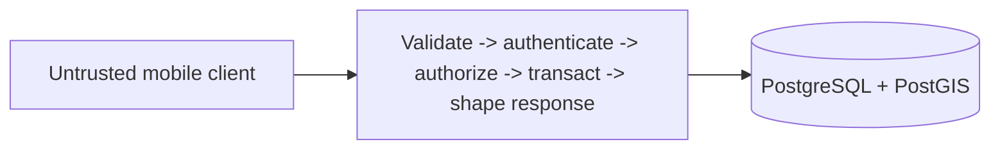

# NearHere Application API

This directory is the trusted modular-monolith boundary for product operations that should not be implemented as arbitrary client table writes.

## Responsibility

The API will own activity creation, privacy transformation, capacity-limited participation, participant-only detail, chat authorization, safety operations, idempotency, stable errors, request IDs, and observability. Supabase Auth continues to own OTP/session issuance.

Internal modules begin as `profiles`, `activities`, `memberships`, `geo`, `chat`, and `safety`. A module owns its rules and exposes intentional operations; another module should not update its tables casually.

## Why no framework yet

No endpoint is implemented, so selecting a server framework and deployment platform would create lock-in without testing a requirement. Before the first activity endpoint, choose a TypeScript runtime/framework and deployment target by evaluating:

- Supabase JWT verification and PostgreSQL connectivity
- Transaction ergonomics and runtime validation
- cold start/connection behavior
- structured logging and testing
- local development and deployment cost

The first implementation should remain one deployable service. Do not split it into microservices merely to mirror the module names.

See [`../../docs/api-spec.md`](../../docs/api-spec.md), [`../../docs/system-design.md`](../../docs/system-design.md), and [`../../docs/data-model.md`](../../docs/data-model.md).
