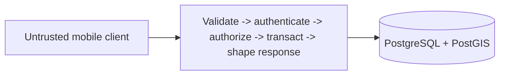

# NearHere Application API

This directory is the trusted modular-monolith boundary for product operations that should not be implemented as arbitrary client table writes.

## Responsibility

Target boundary once this directory contains a deployable application process:

Today the deployed `create_activity`, `nearby_activities`, and `join_activity` PostgreSQL functions own the first activity transaction, privacy transform, public projection, and capacity-safe Join decision. This future application process should take responsibility when product operations need orchestration that is clearer outside SQL: multi-command participation administration, participant-only detail, chat authorization, safety operations, general idempotency records, stable errors, request IDs, and observability. Supabase Auth continues to own OTP/session issuance.

Internal modules begin as `profiles`, `activities`, `memberships`, `geo`, `chat`, and `safety`. A module owns its rules and exposes intentional operations; another module should not update its tables casually.

## Why no framework yet

No standalone HTTP endpoint is implemented. Selecting a server framework and deployment platform now would add a process, deployment, connection pool, failure boundary, and bill before the current RPC acceptance work is complete. Before the first Join/application endpoint, choose a TypeScript runtime/framework and deployment target by evaluating:

- Supabase JWT verification and PostgreSQL connectivity
- Transaction ergonomics and runtime validation
- cold start/connection behavior
- structured logging and testing
- local development and deployment cost

The first implementation should remain one deployable service. Do not split it into microservices merely to mirror the module names.

See [`../../docs/api-spec.md`](../../docs/api-spec.md), [`../../docs/system-design.md`](../../docs/system-design.md), and [`../../docs/data-model.md`](../../docs/data-model.md).
