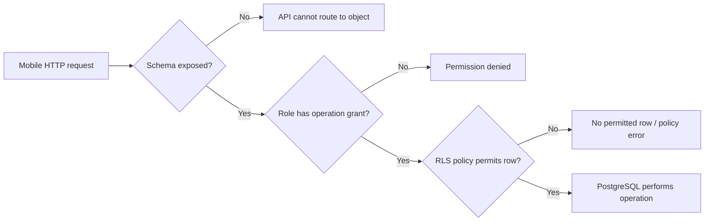
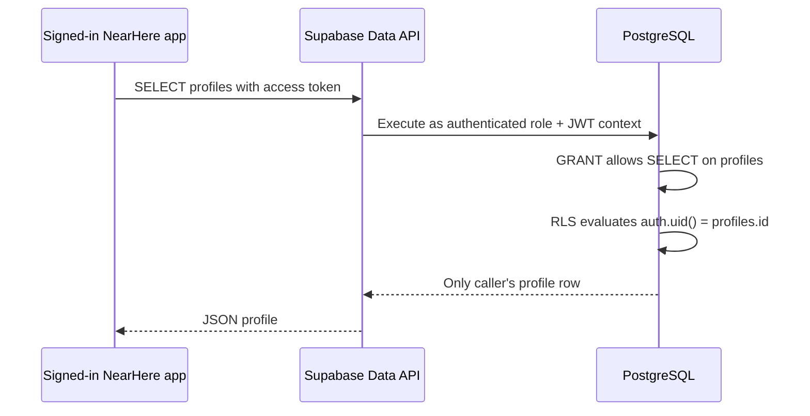

# NearHere Supabase Foundation

This directory stores reviewable database migrations. The dashboard is a deployment surface, not the source of truth: any persistent schema change should be represented here.

## What the first migration does

`migrations/202608150001_create_profiles.sql`:

1. Defines explicit onboarding states.
2. Creates one application `profiles` row per private `auth.users` identity.
3. Uses a foreign key with cascade deletion for referential integrity.
4. Adds value-shape/length constraints, including requiring a display name before profile onboarding is complete.
5. Automatically creates a profile through a minimal signup trigger.
6. Automatically maintains `updated_at`.
7. Enables Row Level Security.
8. Allows an authenticated user to read only their own profile; `public` is a schema name, not anonymous visibility.
9. Allows authenticated users to update only selected columns of their own row.
10. Stores no phone number, OTP, access token, refresh token, or private location.

## User-owned setup sequence

Creating projects and configuring SMS can create external state and cost, so these steps remain under the developer's account and approval.

1. Create a development project in the Supabase dashboard using the project-wizard settings below and record its exact region.
2. Open the project Connect/settings surface and copy only the project URL and publishable key.
3. Put them in `apps/mobile/.env` using the names in `.env.example`; never paste the service-role key into the app.
4. Enable phone login and configure a supported SMS provider or documented test-phone path.
5. Review provider pricing, country delivery, rate limits, bot protection, and India TRAI DLT obligations before sending real user SMS.
6. Install/use the Supabase CLI for repeatable migration deployment, link only the development project, and apply the migration.
7. Verify the policy matrix below before connecting production-like data.
8. Restart Metro so changed Expo public environment variables enter the JavaScript bundle.

Follow current official guidance: [local CLI workflow](https://supabase.com/docs/guides/local-development/cli/getting-started), [user/profile management](https://supabase.com/docs/guides/auth/managing-user-data), [Row Level Security](https://supabase.com/docs/guides/database/postgres/row-level-security), and [phone login](https://supabase.com/docs/guides/auth/phone-login).

## Development project wizard settings

| Setting | Selection | Reason |
| --- | --- | --- |
| Project name | `NearHere Development` | Makes the environment explicit; this is not production. |
| Database password | Generated strong password stored in a password manager | It is a database credential, not mobile configuration. Never commit or share it. |
| Region | Closest available Asia-Pacific region to the first target users | Reduces database/API network latency; changing regions later requires migration work. |
| Enable Data API | Enabled | NearHere uses Supabase client capabilities and may use owner-scoped profile access. |
| Automatically expose new tables | Disabled | Prevents newly created tables from receiving API-role privileges merely because they exist. Migrations grant access deliberately. |
| Enable automatic RLS | Enabled | Gives new `public` tables a secure default. Each migration still explicitly enables RLS and defines reviewed policies. |

The two RLS layers are intentional rather than redundant configuration drift:

```text
Project automatic-RLS trigger
  -> protects an accidentally created public table by default
Version-controlled migration
  -> declares the intended RLS state and exact policies reproducibly
```

Enabling RLS without policies means Data API roles cannot access rows. This fail-closed behavior is safer than accidentally publishing a new table. A later migration must add only the grants and policies required by the product operation.

## Data API, exposure, grants, and RLS from first principles

These controls form a pipeline. Passing one layer does not bypass the others:



### What is the Data API?

PostgreSQL normally speaks its own database wire protocol over a database connection. A mobile app should not receive the database password or open a privileged direct connection.

Supabase's Data API is a server layer—implemented around PostgREST—that translates HTTPS requests into permitted PostgreSQL operations. The JavaScript SDK call:

```ts
supabase.from('profiles').select('*')
```

conceptually becomes:

```text
HTTPS request to the project Data API
  -> identify request role/session
  -> check schema exposure
  -> check PostgreSQL grants
  -> apply Row Level Security policies
  -> run SQL
  -> serialize allowed result as JSON
```

The Data API is not the same as NearHere's future application API. The Data API exposes permitted database objects generically. The NearHere API will express business commands such as Join, enforce multi-table transactions, shape private/public fields, and return domain-specific errors.

### What is a schema?

A PostgreSQL schema is a namespace inside one database, similar to a top-level folder for tables, views, and functions. `public.profiles` means the `profiles` table inside the `public` schema. The word `public` is a conventional schema name; it does not mean public internet access.

Supabase can configure which schemas the Data API is allowed to route to. A non-exposed schema is outside that generic HTTP surface even if objects exist inside it. Sensitive helper functions and internal tables can later live in a non-exposed schema such as `private`.

### What does “expose a table” mean?

In this project-creation setting, automatic exposure primarily means automatically giving Data API database roles privileges on every newly created table/function in an exposed schema. It does **not** automatically mean every row becomes readable: RLS is a separate layer.

When automatic exposure is disabled, creating `public.example` does not automatically grant `SELECT`, `INSERT`, `UPDATE`, or `DELETE` to client-facing roles. A reviewed migration must opt in explicitly:

```sql
grant select on table public.example to anon, authenticated;
```

NearHere disables automatic exposure so an accidental table creation fails closed instead of silently expanding the API surface.

### What is a PostgreSQL role and grant?

A role is a database identity with privileges. Supabase maps Data API requests primarily to:

- `anon` — request has no valid signed-in user session.
- `authenticated` — request contains a valid Supabase user session.
- `service_role` — privileged server/operations role that can bypass RLS; never embed its key in a mobile app.

A grant answers: **may this role attempt this operation on this database object?** Examples include `SELECT` rows, `INSERT` rows, `UPDATE` rows, or `EXECUTE` a function. No grant means PostgreSQL rejects the operation before a row policy can authorize it.

### What is Row Level Security?

Row Level Security is a PostgreSQL authorization mechanism that attaches policies to a table. A grant can permit the `authenticated` role to attempt an update, while RLS restricts that update to rows owned by the current user.

```sql
create policy "Users can update their own profile"
  on public.profiles
  for update
  to authenticated
  using ((select auth.uid()) = id)
  with check ((select auth.uid()) = id);
```

For a user whose UUID is `user-a`, the policy behaves conceptually like an automatic condition:

```sql
update public.profiles
set display_name = 'Asha'
where id = 'user-a';
```

An attempt by `user-a` to update `user-b` matches no authorized row. The mobile UI is not the security boundary; the database evaluates the policy even if someone modifies the app or calls the HTTP API manually.

`using` determines which existing rows may be targeted. `with check` determines whether the new row values remain authorized after an insert/update.

### What does “Enable automatic RLS” do?

This project option installs a PostgreSQL event trigger that automatically runs `ALTER TABLE ... ENABLE ROW LEVEL SECURITY` when a new table is created in the configured exposed schema. It protects future tables, not tables that existed before the trigger.

Enabling RLS does not invent policies. With RLS enabled and no matching policy, client-facing access is denied. This is the intended secure default.

NearHere also writes `alter table public.profiles enable row level security` inside its migration. The dashboard setting protects accidental table creation; migration SQL makes the intended state reproducible across development, staging, and production.

### How the NearHere profile request is authorized



For `public.profiles`, the migration deliberately grants authenticated `SELECT` and selected-column `UPDATE`, then RLS limits both to the caller's UUID. Anonymous users and other authenticated users receive no direct profile row.

### Common misconceptions

| Misconception | Correct model |
| --- | --- |
| “The publishable key is secret.” | It is shipped in the app; grants and RLS provide authorization. |
| “The `public` schema means anyone can read it.” | It is a schema/API namespace; roles, grants, and policies still control access. |
| “RLS enabled means users can access their own rows.” | RLS enabled with no policy denies access; policies must explicitly allow rows. |
| “A grant makes all rows visible.” | A grant opens the object/operation gate; RLS still filters/checks rows. |
| “Hiding a button secures an operation.” | Modified clients can call APIs directly; trusted server/database rules secure it. |
| “The service-role key is okay in a native app.” | It is privileged and extractable from the binary; it belongs only in protected server environments. |

## Required policy tests

| Test actor | Operation | Expected |
| --- | --- | --- |
| Anonymous | Select profile | Denied |
| Anonymous | Update profile | Denied |
| Authenticated owner | Select/update allowed fields | Allowed |
| Authenticated owner | Update `id`, timestamps, or another user's row | Denied |
| Authenticated other user | Read profile | Denied; discovery later uses an API-shaped host projection |
| Authenticated other user | Update profile | Denied |
| New Auth signup | Corresponding profile creation | Exactly one row |
| Auth user deletion | Corresponding profile deletion | Cascades |
| Invalid avatar/interests/name | Insert/update | Constraint failure |

## Why no local database verification yet

At the time this migration was authored, neither `supabase` CLI nor `psql` was installed in the workspace environment. Static review can verify intent and syntax shape, but only running the migration against Supabase-compatible PostgreSQL can verify triggers, grants, and RLS behavior. The backlog keeps that work open until the development project and toolchain exist.

## Rollback thinking

This is the first schema and contains no production data. During local development, a reset can recreate it. Once shared/production data exists, do not casually drop the table or enum; create a reviewed forward migration that preserves or deliberately migrates data.
