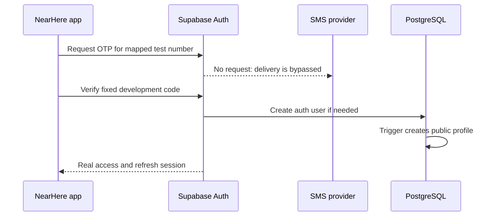
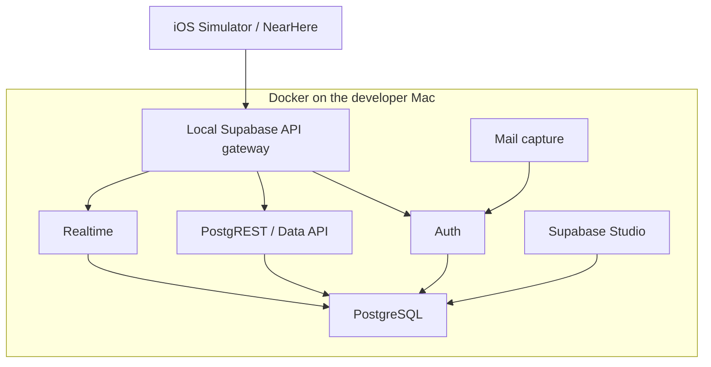
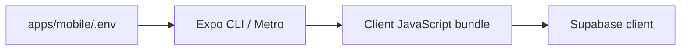
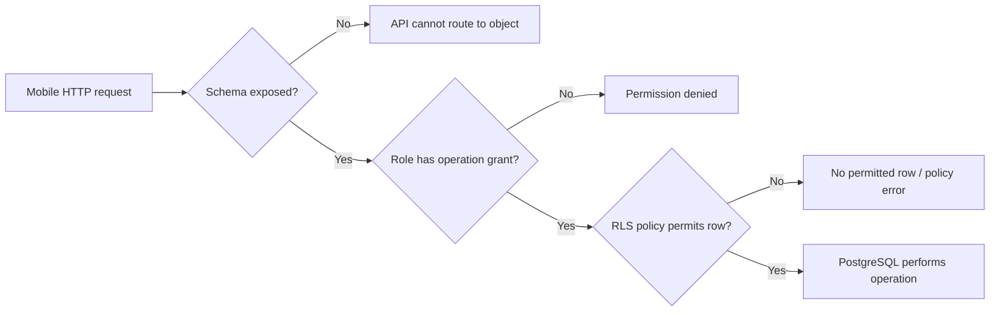
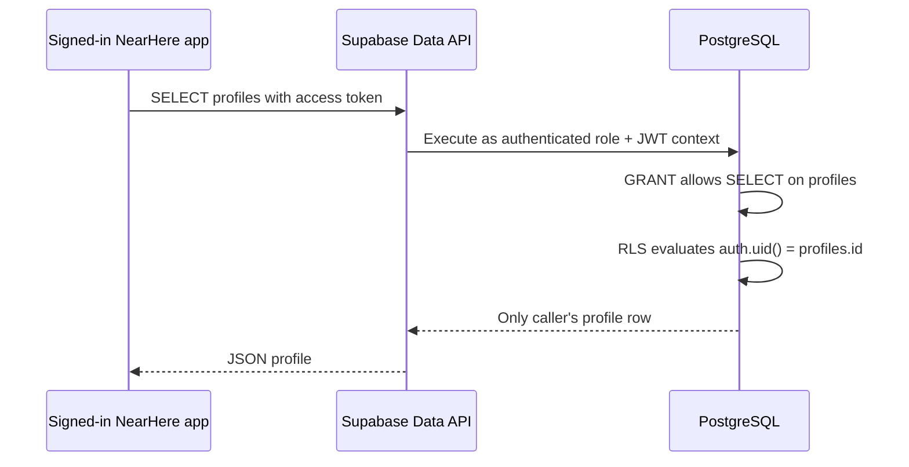
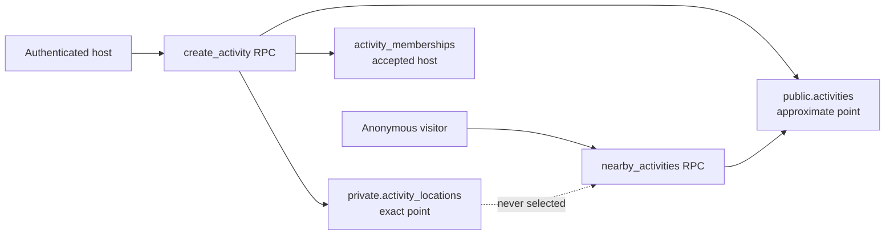
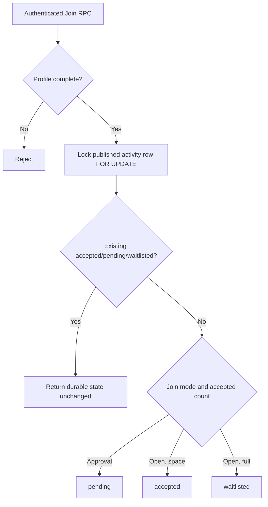
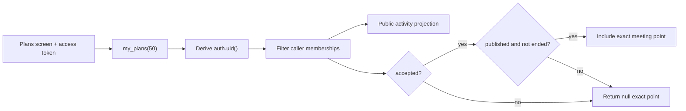

# NearHere Supabase Foundation

This directory stores reviewable database migrations. The dashboard is a deployment surface, not the source of truth: any persistent schema change should be represented here.

## What the first migration does

`migrations/202608150001_create_profiles.sql`:

1. Defines explicit onboarding states.
2. Creates one application `profiles` row per private `auth.users` identity.
3. Uses a foreign key with cascade deletion for referential integrity.
4. Adds value-shape/length constraints, including requiring a display name before profile onboarding is complete.
5. Automatically creates a profile through a minimal signup trigger.
6. Automatically maintains `updated_at`.
7. Enables Row Level Security.
8. Allows an authenticated user to read only their own profile; `public` is a schema name, not anonymous visibility.
9. Allows authenticated users to update only selected columns of their own row.
10. Stores no phone number, OTP, access token, refresh token, or private location.

## User-owned setup sequence

Creating projects and configuring SMS can create external state and cost, so these steps remain under the developer's account and approval.

1. Create a development project in the Supabase dashboard using the project-wizard settings below and record its exact region.
2. Open the project Connect/settings surface and copy only the project URL and publishable key.
3. Put them in `apps/mobile/.env` using the names in `.env.example`; never paste the service-role key into the app.
4. Enable phone login and configure a supported SMS provider or documented test-phone path.
5. Review provider pricing, country delivery, rate limits, bot protection, and India TRAI DLT obligations before sending real user SMS.
6. Install/use the Supabase CLI for repeatable migration deployment, link only the development project, and apply the migration.
7. Verify the policy matrix below before connecting production-like data.
8. Restart Metro so changed Expo public environment variables enter the JavaScript bundle.

Follow current official guidance: [local CLI workflow](https://supabase.com/docs/guides/local-development/cli/getting-started), [user/profile management](https://supabase.com/docs/guides/auth/managing-user-data), [Row Level Security](https://supabase.com/docs/guides/database/postgres/row-level-security), and [phone login](https://supabase.com/docs/guides/auth/phone-login).

## CLI initialization and first deployment recorded on 2026-08-15

The official CLI was run through `npx` rather than added to the mobile application's runtime dependencies:

```text
Supabase browser authorization
  -> supabase init
  -> generated version-controlled config.toml
  -> linked project gmgtugbvnvhdmfuoifcc
  -> migration list showed one local-only migration
  -> db push --dry-run named exactly that migration
  -> db push applied 202608150001_create_profiles.sql
  -> migration list showed matching local/remote history
  -> anonymous REST request confirmed profile-table denial
```

`supabase/config.toml` is configuration as code for the local Supabase stack and deployable project settings. `supabase/.gitignore` excludes `.temp`, where the CLI records the linked project reference. The linked reference is operational metadata, not a mobile credential, but keeping temporary CLI state out of Git avoids machine-specific churn.

### Verification evidence

| Check | Result | What it proves |
| --- | --- | --- |
| `projects list` | `NearHere Dev`, healthy, `ap-southeast-1`, PostgreSQL 17.6 | CLI account can see the intended project. |
| `db push --dry-run` | Only `202608150001_create_profiles.sql` pending | No unexpected migration was scheduled. |
| `db push` | Migration applied and command finished | Hosted database accepted the reviewed migration. |
| `migration list` | Local and remote both `202608150001` | Migration-history records agree. |
| Anonymous `GET /rest/v1/profiles` | HTTP 401, PostgreSQL `42501` | Table exists but the anonymous role lacks access, as designed. |

These original deployment checks did not prove authenticated behavior. The later hosted fixed-OTP check proved that one newly verified Auth user receives exactly one owner-readable profile. On 2026-09-04, the complete two-actor harness additionally verified distinct trigger rows, anonymous denial, owner reads and updates, cross-user isolation, protected-column/insert/delete denial, constraints, and cleanup. Its first OTP request received a transient HTTP 502; Auth health returned HTTP 200 and a deliberate retry completed the matrix, so no failed-attempt assertion was misreported as proof.

### Test OTP decision

NearHere will use a fixed **development-only** phone OTP before connecting a paid SMS provider. A test mapping tells Supabase Auth that one fictional phone number always accepts one predefined code. For that mapped number, Auth skips the SMS network but still executes the real server-side flow: it creates or finds an Auth user, verifies the code, issues a session, and fires the database trigger that creates the user's profile.



This is not a client-side fake login. The mobile app still calls `signInWithOtp` and `verifyOtp`, and Supabase still issues the session. It tests substantially more of the real system than a hard-coded “signed in” UI flag.

The fixed hosted identity/code must not be committed to a public repository or enabled in production. The generated `config.toml` contains many Auth defaults, so `supabase config push` is a broad operation rather than a narrow OTP update. On 2026-08-15, that broad push was deliberately not performed. A narrow Management API `PATCH` changed only phone enablement, the test mapping, and its expiration. The hosted API requires a comma-separated `phone=code` string with E.164 digits and no leading `+`; that wire format is different from both a JSON object and the `phone:code` syntax shown for some self-hosted environment configuration.

### Hosted test-OTP verification recorded on 2026-08-15

| Check | Result | What it proves |
| --- | --- | --- |
| Management API Auth patch | HTTP 200 | Hosted phone Auth and the expiring test mapping were accepted. |
| `POST /auth/v1/otp` | HTTP 200 | The fictional test number can start the real hosted Auth flow without an SMS provider. |
| `POST /auth/v1/verify` | HTTP 200 and session present | Supabase validated the fixed code and issued a real authenticated session. |
| Authenticated profile select | HTTP 200, exactly one row | The signup trigger created one profile and owner-scoped RLS allowed it to be read. |
| Initial onboarding state | `needs_profile` | The database default matches the onboarding contract. |

The verification script parsed only non-secret evidence. Access and refresh tokens were never printed and were deleted with the temporary response files. Mobile restart/session restoration was subsequently confirmed; cross-user RLS remains a separate test.

### Docker warning after deployment

After applying the hosted migration, the CLI warned that it could not cache a `pg-delta` migrations catalog because the local Docker daemon was not running. Docker is required for the complete local Supabase stack and some schema-diff/caching operations. It was not required for the remote database to accept this migration.

The warning was classified as non-fatal because:

1. The CLI printed `Applying migration ...` and `Finished supabase db push`.
2. A subsequent remote migration listing contained the migration version.
3. The Data API recognized `profiles` and rejected it for the expected permission reason rather than reporting a missing relation.

Docker Desktop remains needed before local `supabase start`, database reset, and full isolated migration tests. We do not treat a successful remote push as a substitute for that local test environment.

Docker is a program that runs isolated service processes called **containers** from repeatable package descriptions called **images**. Supabase is not one process: local development starts PostgreSQL plus Auth, the REST gateway, Realtime, Storage, Studio, and supporting services. Docker gives those processes predictable versions, networking, and disposable data volumes without manually installing each server on macOS.



Docker is useful when we want to reset data, replay every migration, test fixed OTP locally, inspect email without sending it, or deliberately break the database without risking the hosted development project. It is **not** required to run the React Native app, call hosted Supabase, or apply an already-reviewed migration to the hosted database. It is a developer-environment tool; NearHere users never install it.

## Framework-specific environment-variable names

An environment variable is a named value supplied outside source code. Build tools choose which names they read and which values they make visible to client code.

The Supabase Connect dialog can show a Next.js example:

```text
NEXT_PUBLIC_SUPABASE_URL
NEXT_PUBLIC_SUPABASE_PUBLISHABLE_KEY
```

NearHere is not a Next.js application. Its Expo code reads:

```ts
process.env.EXPO_PUBLIC_SUPABASE_URL
process.env.EXPO_PUBLIC_SUPABASE_PUBLISHABLE_KEY
```

Therefore the same public values must be stored in `apps/mobile/.env` under the exact `EXPO_PUBLIC_` names. Expo replaces statically referenced public variables while constructing the client bundle. A name with the wrong prefix behaves like missing configuration even when its value is otherwise correct.



The local `.env` is Git-ignored. `.env.example` records names and placeholders only. Since `EXPO_PUBLIC_` values are embedded in the client, they must never contain a database password, service-role key, private API key, OTP, or user token.

### Connectivity verification recorded on 2026-08-15

NearHere's configured URL and publishable key successfully reached the project's `/auth/v1/health` endpoint and received HTTP 200. The values were not printed during the check.

This verifies:

- the project URL resolves over DNS and TLS;
- the publishable key is accepted for the health request;
- the hosted Auth service is reachable from the development environment.

It does **not** verify:

- real SMS-provider delivery;
- mobile session restoration;
- the profile migration, trigger, grants, or RLS policies;
- database connectivity for product data;
- session persistence inside the running mobile application.

## Development project wizard settings

| Setting | Selection | Reason |
| --- | --- | --- |
| Project name | `NearHere Development` | Makes the environment explicit; this is not production. |
| Database password | Generated strong password stored in a password manager | It is a database credential, not mobile configuration. Never commit or share it. |
| Region | Closest available Asia-Pacific region to the first target users | Reduces database/API network latency; changing regions later requires migration work. |
| Enable Data API | Enabled | NearHere uses Supabase client capabilities and may use owner-scoped profile access. |
| Automatically expose new tables | Disabled | Prevents newly created tables from receiving API-role privileges merely because they exist. Migrations grant access deliberately. |
| Enable automatic RLS | Enabled | Gives new `public` tables a secure default. Each migration still explicitly enables RLS and defines reviewed policies. |

The two RLS layers are intentional rather than redundant configuration drift:

```text
Project automatic-RLS trigger
  -> protects an accidentally created public table by default
Version-controlled migration
  -> declares the intended RLS state and exact policies reproducibly
```

Enabling RLS without policies means Data API roles cannot access rows. This fail-closed behavior is safer than accidentally publishing a new table. A later migration must add only the grants and policies required by the product operation.

## Data API, exposure, grants, and RLS from first principles

These controls form a pipeline. Passing one layer does not bypass the others:



### What is the Data API?

PostgreSQL normally speaks its own database wire protocol over a database connection. A mobile app should not receive the database password or open a privileged direct connection.

Supabase's Data API is a server layer—implemented around PostgREST—that translates HTTPS requests into permitted PostgreSQL operations. The JavaScript SDK call:

```ts
supabase.from('profiles').select('*')
```

conceptually becomes:

```text
HTTPS request to the project Data API
  -> identify request role/session
  -> check schema exposure
  -> check PostgreSQL grants
  -> apply Row Level Security policies
  -> run SQL
  -> serialize allowed result as JSON
```

The Data API is not the same as NearHere's future application API. The Data API exposes permitted database objects generically. The NearHere API will express business commands such as Join, enforce multi-table transactions, shape private/public fields, and return domain-specific errors.

### What is a schema?

A PostgreSQL schema is a namespace inside one database, similar to a top-level folder for tables, views, and functions. `public.profiles` means the `profiles` table inside the `public` schema. The word `public` is a conventional schema name; it does not mean public internet access.

Supabase can configure which schemas the Data API is allowed to route to. A non-exposed schema is outside that generic HTTP surface even if objects exist inside it. Sensitive helper functions and internal tables can later live in a non-exposed schema such as `private`.

### What does “expose a table” mean?

In this project-creation setting, automatic exposure primarily means automatically giving Data API database roles privileges on every newly created table/function in an exposed schema. It does **not** automatically mean every row becomes readable: RLS is a separate layer.

When automatic exposure is disabled, creating `public.example` does not automatically grant `SELECT`, `INSERT`, `UPDATE`, or `DELETE` to client-facing roles. A reviewed migration must opt in explicitly:

```sql
grant select on table public.example to anon, authenticated;
```

NearHere disables automatic exposure so an accidental table creation fails closed instead of silently expanding the API surface.

### What is a PostgreSQL role and grant?

A role is a database identity with privileges. Supabase maps Data API requests primarily to:

- `anon` — request has no valid signed-in user session.
- `authenticated` — request contains a valid Supabase user session.
- `service_role` — privileged server/operations role that can bypass RLS; never embed its key in a mobile app.

A grant answers: **may this role attempt this operation on this database object?** Examples include `SELECT` rows, `INSERT` rows, `UPDATE` rows, or `EXECUTE` a function. No grant means PostgreSQL rejects the operation before a row policy can authorize it.

### What is Row Level Security?

Row Level Security is a PostgreSQL authorization mechanism that attaches policies to a table. A grant can permit the `authenticated` role to attempt an update, while RLS restricts that update to rows owned by the current user.

```sql
create policy "Users can update their own profile"
  on public.profiles
  for update
  to authenticated
  using ((select auth.uid()) = id)
  with check ((select auth.uid()) = id);
```

For a user whose UUID is `user-a`, the policy behaves conceptually like an automatic condition:

```sql
update public.profiles
set display_name = 'Asha'
where id = 'user-a';
```

An attempt by `user-a` to update `user-b` matches no authorized row. The mobile UI is not the security boundary; the database evaluates the policy even if someone modifies the app or calls the HTTP API manually.

`using` determines which existing rows may be targeted. `with check` determines whether the new row values remain authorized after an insert/update.

### What does “Enable automatic RLS” do?

This project option installs a PostgreSQL event trigger that automatically runs `ALTER TABLE ... ENABLE ROW LEVEL SECURITY` when a new table is created in the configured exposed schema. It protects future tables, not tables that existed before the trigger.

Enabling RLS does not invent policies. With RLS enabled and no matching policy, client-facing access is denied. This is the intended secure default.

NearHere also writes `alter table public.profiles enable row level security` inside its migration. The dashboard setting protects accidental table creation; migration SQL makes the intended state reproducible across development, staging, and production.

### How the NearHere profile request is authorized



For `public.profiles`, the migration deliberately grants authenticated `SELECT` and selected-column `UPDATE`, then RLS limits both to the caller's UUID. Anonymous users and other authenticated users receive no direct profile row.

### Common misconceptions

| Misconception | Correct model |
| --- | --- |
| “The publishable key is secret.” | It is shipped in the app; grants and RLS provide authorization. |
| “The `public` schema means anyone can read it.” | It is a schema/API namespace; roles, grants, and policies still control access. |
| “RLS enabled means users can access their own rows.” | RLS enabled with no policy denies access; policies must explicitly allow rows. |
| “A grant makes all rows visible.” | A grant opens the object/operation gate; RLS still filters/checks rows. |
| “Hiding a button secures an operation.” | Modified clients can call APIs directly; trusted server/database rules secure it. |
| “The service-role key is okay in a native app.” | It is privileged and extractable from the binary; it belongs only in protected server environments. |

## Required policy tests

| Test actor | Operation | Expected |
| --- | --- | --- |
| Anonymous | Select profile | Denied |
| Anonymous | Update profile | Denied |
| Authenticated owner | Select/update allowed fields | Allowed |
| Authenticated owner | Update `id`, timestamps, or another user's row | Denied |
| Authenticated other user | Read profile | Denied; discovery later uses an API-shaped host projection |
| Authenticated other user | Update profile | Denied |
| New Auth signup | Corresponding profile creation | Exactly one row |
| Auth user deletion | Corresponding profile deletion | Cascades |
| Invalid avatar/interests/name | Insert/update | Constraint failure |

Current evidence: anonymous denial and the first authenticated owner's single-profile read are complete. Cross-user and restricted-column cases require a second test identity and dedicated policy tests.

## Activity/PostGIS migration

`migrations/202608150002_create_activities.sql` is deployed to the development project. It adds:

- PostGIS geography support and a GiST public-point index;
- `public.activities` containing only public-safe activity facts;
- `private.activity_locations` containing exact meeting geometry in a non-exposed schema;
- the initial membership state machine and exactly one accepted host row per created activity;
- an authenticated `create_activity` function that writes all three records atomically;
- an anonymous-safe `nearby_activities` function that returns only approximate geometry and bounded public fields.



The creation function runs as `security definer` because client roles intentionally have no direct table privileges. It fixes `search_path = ''`, schema-qualifies referenced objects, derives the actor from `auth.uid()`, requires completed onboarding, validates coordinates/start time, and returns no exact coordinate. Execute privileges are revoked broadly and then granted only to the required role.

The discovery function also uses a tightly reviewed definer boundary so anonymous callers can receive a deliberately shaped projection without receiving table access. PostGIS `ST_DWithin` performs the radius predicate and can use the GiST index. Longitude is passed as X and latitude as Y when creating WGS84 points.

Deployment and black-box evidence recorded on 2026-08-15:

| Check | Result | Meaning |
| --- | --- | --- |
| Dry run | Only `202608150002_create_activities.sql` pending | No unrelated migration was included. |
| Hosted migration push | Completed | PostgreSQL accepted the schema, functions, triggers, grants, and PostGIS expressions. |
| Migration history | Local and remote `202608150001`, `202608150002` | Source and hosted history agree. |
| Anonymous nearby RPC | HTTP 200, empty array | The safe discovery surface exists; there are honestly no live rows yet. |
| Invalid discovery latitude | HTTP 400 / `22023` | Server-side input validation executes. |
| Anonymous create RPC | HTTP 401 / `42501` | Anonymous users cannot host. |
| Anonymous direct activity select | HTTP 401 / `42501` | The RPC projection does not imply table access. |
| Hosted lint, schemas `public,private` | No schema errors | NearHere-owned functions pass Supabase's PL/pgSQL checks. |

Authenticated creation and its existing host membership were subsequently accepted in Simulator. The hosted participation harness now contains a protected exact/public displacement assertion, but it needs a recorded re-run. Also pending are private-schema denial through a privileged integration harness and `EXPLAIN (ANALYZE, BUFFERS)` with representative data.

A broad lint including `extensions` reported static-analysis errors inside vendor-owned PostGIS functions that use dynamic SQL and extension-specific name resolution. Restricting the same hosted lint to NearHere-owned `public,private` schemas returned `No schema errors found`. This distinction prevents third-party analyzer noise from being mislabeled as an application defect.

Official references used for this slice: [Supabase PostGIS geo queries](https://supabase.com/docs/guides/database/extensions/postgis), [Supabase database functions](https://supabase.com/docs/guides/database/functions), [Supabase data security](https://supabase.com/docs/guides/database/secure-data), and [PostGIS spatial indexes](https://postgis.net/documentation/faq/spatial-indexes/).

## Lesson 7 deployed capacity-safe Join

`migrations/202608150003_join_activities.sql` adds one authenticated command, `join_activity(activity_id)`. It does not grant clients direct access to the membership table.



The lock is scoped to the activity row. Two simultaneous requests for the same activity cannot both make a capacity decision from the same old count: one waits, then recounts after the other commits. Requests for different activity rows do not block one another through this lock.

Join retry safety currently comes from domain identity rather than a general idempotency table. `(activity_id, user_id)` is the membership primary key, and the function returns an existing active state before writing. This prevents a retry from adding a second membership or consuming capacity twice. General idempotency keys are still required for later commands that cannot be uniquely identified this way.

Deployment and acceptance evidence recorded on 2026-08-15:

| Check | Result | What it proves |
| --- | --- | --- |
| Migration history | Local and remote include `202608150003` | Hosted schema accepted the Join function and privilege changes. |
| Anonymous Join call | HTTP 401 / PostgreSQL `42501` | `anon` cannot execute the protected command. |
| Host activity in Simulator | Created and rediscovered from hosted data | The authenticated create/discovery path works against a real row. |
| Existing host taps Join | Returned `accepted`; participant count remained one | Existing active membership is returned without duplication, preserving the host path. |
| Mobile runtime checks | Join response parser accepts only known status/count shapes | Untrusted RPC JSON does not enter UI state unchecked. |

At the end of Lesson 7, this evidence did **not** yet prove the multi-actor branches. Lesson 9 subsequently supplied that proof on 2026-08-15: the hosted A/B/C/D matrix verified open acceptance, approval-mode `pending`, full-capacity `waitlisted`, and a real concurrent last-place race. It also verified Leave and host approval/rejection. Participant removal is now implemented locally in migration `202609060001`, pending deployment and hosted concurrency verification. General idempotency records remain unimplemented. Accepted-only meeting-point release is implemented through `my_plans`.

## Lesson 8 deployed caller-scoped My Plans

`migrations/202608150005_create_my_plans.sql` adds an authenticated read model called `my_plans(limit)`. A read model is a query result shaped for one screen; it is not another source of truth. Activities, memberships, profiles, and private locations remain authoritative in their existing tables.



The client never submits a user ID. That avoids an insecure direct-object-reference design in which changing a request parameter could request another person's plans. `security definer` is necessary because the client roles have no direct table access, so the function constrains its elevated execution with `search_path = ''`, fully qualified objects, an authentication check, a 1–100 limit, explicit return columns, and an execute grant only to `authenticated`.

Migration `202608150006_harden_my_plans_privacy.sql` forward-hardens the first read model without rewriting deployed history. Exact-location disclosure now requires accepted membership, `published` lifecycle state, and an end time after the current database time. It also rejects a `null` limit so `LIMIT NULL` cannot bypass the 100-row ceiling. The React Native parser independently rejects exact coordinates for pending, waitlisted, cancelled, completed, or ended plans, but this is a bug/leak detector—not a replacement for database authorization.

Deployment and acceptance evidence recorded on 2026-08-15:

| Check | Result | What it proves |
| --- | --- | --- |
| Hosted migrations | `202608150005` and forward-hardening `202608150006` deployed | The development database accepted the read model, privilege boundary, lifecycle privacy rule, and bounded limit. |
| Anonymous `my_plans` call | HTTP 401 / PostgreSQL `42501` | `anon` cannot execute the caller-private read function. |
| Hosted lint for `public,private` | No schema errors | NearHere-owned schema/function lint is clean. |
| Signed-in Simulator card | Real `NearHere development walk` shown as `Hosting`, `1/8 going`, hosted by Anshuman | The mobile repository, runtime parser, state hook, and populated card consumed a hosted caller row. |
| Accepted host location | `Private meeting point unlocked`, `12.9279, 77.6717` | An accepted host membership receives its exact stored meeting point. |
| Runtime parser tests | Active accepted requires valid exact coordinates; pending/waitlisted/inactive plans reject non-null exact coordinates | Malformed or prematurely revealing JSON is stopped before UI state. |

The later 2026-08-15 acceptance pass proved signed-out intent restoration, second-actor caller isolation, and pending/waitlisted `null` coordinates. Still unproven are pagination beyond the first 50 and plan-detail/copy/directions behavior. The coordinate above is deliberate development activity data, not public discovery geometry or a production user's home.

## Historical local-tooling limitation

At the time the first migration was authored, neither `supabase` CLI nor `psql` was installed in the workspace environment. Static review could verify intent and syntax shape, but could not honestly prove triggers, grants, or RLS behavior.

That limitation has now narrowed: the CLI is available through `npx`, migrations through `202608150007` are deployed, and hosted black-box checks cover the evidence listed above. The remaining gap is a disposable local reset/test environment, which still requires Docker; the multi-actor/concurrency acceptance checks now pass against hosted development.

## Lesson 9 deployed to development: participation transitions

Migration `202608150007_manage_activity_participation.sql` was reviewed and
deployed to the linked development project on 2026-08-15. It adds:

- `leave_activity(activity_id)`, which derives the participant from
  `auth.uid()`, makes the durable state `left`, and atomically promotes at most
  one FIFO waiter when an accepted place opens on an active activity;
- `decide_activity_request(activity_id, requester_user_id, decision)`, which
  authorizes the caller as host and idempotently approves or rejects a pending
  request, returning `waitlisted` instead of exceeding capacity; and
- `host_pending_activity_requests(activity_id, limit)`, a bounded host-only
  projection containing only requester ID, display name, and request time.

All capacity-changing operations use the parent activity row as their shared
`FOR UPDATE` serialization point. The waitlist lookup is ordered by
`(created_at, user_id)` and supported by a partial participant-queue index.
Every new function uses `SECURITY DEFINER`, `search_path = ''`, schema-qualified
objects, explicit authentication/authorization, and authenticated-only execute
grants; base-table grants remain closed.

The dependency-light hosted harness is
`tests/hosted/participation.mjs`. A/B are required for open/pending/decision/
Leave/caller-scope/idempotency checks. Optional C races B for the final place
with `Promise.all`, requiring one accepted and one waitlisted result before
testing promotion. Optional D creates a second waiter and proves chronological
FIFO selection. The equal-timestamp UUID tie-break needs a controlled local
fixture and remains explicitly unverified.

Deployment and runtime evidence recorded on 2026-08-15:

| Check | Observed result | What it proves |
| --- | --- | --- |
| Migration/lint | Local and hosted histories match `001`–`007`; scoped `public,private` lint has no errors | Hosted schema contains the reviewed participation boundary. |
| A/B/C/D authentication | Four distinct fixed-OTP actors established without printing identity/session values | The matrix used independent authenticated callers. |
| Anonymous and non-host calls | Protected participation calls were denied | Execute grants and host authorization reject untrusted callers. |
| Caller-scoped Plans | Each actor saw only their durable plans | A submitted client identity cannot widen the caller projection. |
| Retry matrix | Join, Leave, approve, and reject retries returned their durable outcomes without double effects | Command-specific semantic idempotency works through the hosted API. |
| Private-location matrix | Pending/waitlisted callers received `null`; accepted and promoted callers received the exact active point | Private geometry release follows membership state on the trusted boundary. |
| Concurrent final place | B/C `Promise.all` produced exactly one accepted plus one waitlisted result at capacity | The shared activity-row lock serialized real concurrent hosted calls. |
| Accepted Leave | Leave reported promotion and kept accepted count within capacity | Departure and one-waiter promotion committed atomically. |
| Two-waiter FIFO | The earlier-created waiter was promoted; the newer waiter stayed waitlisted with `null` exact coordinates | Chronological FIFO selection works. |

The hosted run does not prove the equal-`created_at` UUID tie-break, which still
needs a controlled fixture. It also does not prove the React Native interaction;
Participant Leave and host approval have since been accepted in the rebuilt
iPhone 17 Pro Simulator; host Reject remains the next decision UI gate.

## Lesson 10 deployed and hosted-verified: activity detail and cancellation

Migration `202609040001_activity_detail_and_cancellation.sql` is additive and
deployed to the hosted development project. The 2026-09-06 hosted harness
passed all Activity Detail and cancellation assertions. `activity_detail(activity_id)` returns public activity facts
to anonymous or authenticated callers, adds only the caller's own membership
state, and joins the private meeting point only for accepted members while the
activity is published and unended. `cancel_activity(activity_id)` derives and
authorizes the host from `auth.uid()`, locks the same parent activity row used
by participation commands, rejects ended/non-published activities, and returns
the original cancellation timestamp on retry. Cancellation immediately makes
the exact-location predicate false.

The mobile screen independently validates the response and invalidates any
in-flight read before redacting exact coordinates during Leave or cancellation.
These client checks prevent stale private data from repainting, but PostgreSQL
remains the authorization boundary. The hosted black-box harness is complete;
Simulator acceptance is still required before calling the mobile portion of
Lesson 10 verified.

## Rollback thinking

This is the first schema and contains no production data. During local development, a reset can recreate it. Once shared/production data exists, do not casually drop the table or enum; create a reviewed forward migration that preserves or deliberately migrates data.
